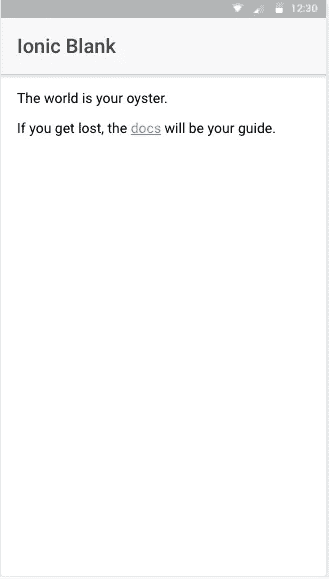
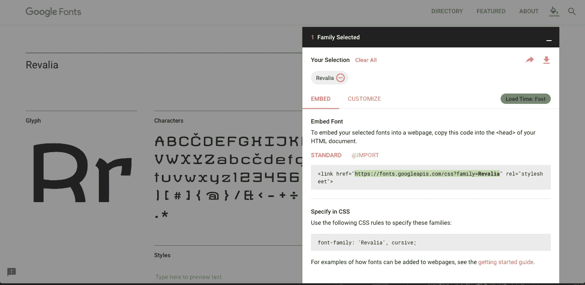
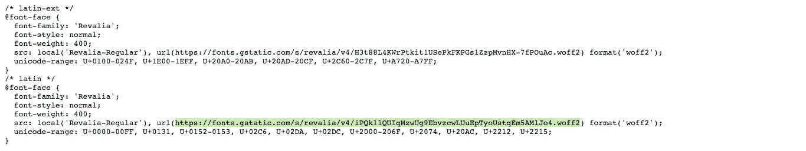
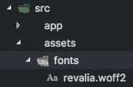
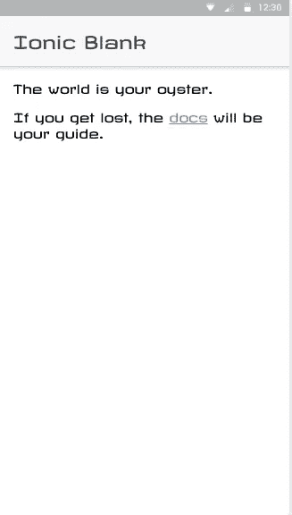

# 在 Ionic 应用程序中使用谷歌字体

> 原文：<https://medium.com/hackernoon/using-google-fonts-in-an-ionic-application-c3419c342f23>

在这篇文章中，我将向你展示如何在任何 Ionic 2/3 应用程序中改变字体。首先，我将建立一个新的 ionic 项目，这样你可以在 Gituhb 上查阅。

`cd`进入由上述 Ionic CLI 命令创建的新项目，运行`ionic serve`查看空白模板，只有一个可用的主页。到目前为止，Ionic 应用程序如下所示:

此处全局级别的应用程序中使用的字体是默认字体。我们将把它改成[revia](https://fonts.google.com/specimen/Revalia)。这只是一个随机的建议，你可以选择你想要的任何东西，但我建议，如果你是第一次做或者是离子开发的新手，选择一种你可以看到应用程序中反映的变化的字体。

选择字体后，在新标签中打开上面截图中高亮显示的链接。

再次打开`latin`部分提供的链接，就像上面的图片一样，直接下载或保存文件到你的 ionic 项目中。

保存文件的位置将是`YOUR-IonicApp > src/assets/fonts`。如果不可用，在`assets`文件夹中创建一个新目录`fonts`。将文件放在那里，并根据您的方便重命名它。

现在，由于我们希望在应用程序的全局级别使用该字体，在`src/app`中打开`app.scss`，首先包含我们想要使用的字体的本地文件，然后通过使用星号`*`作为 css 选择器在全局级别使用该字体:

运行 ionic 应用程序，使用:

输出:

要获得完整的代码，可以访问 [**这个 Github 库**](https://github.com/amandeepmittal/ionic-use-google-fonts) 。

# 如果你喜欢这篇文章，请鼓掌👏。

# 谢谢大家！