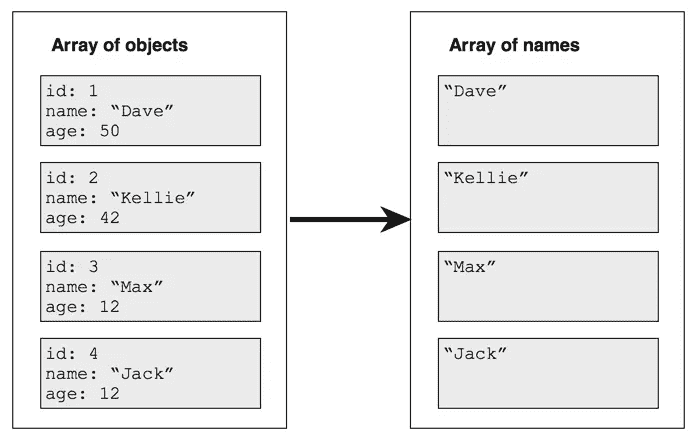

# 使用 JavaScript 的地图功能

> 原文：<https://medium.com/hackernoon/using-javascripts-map-function-e0245b97d5ea>

map 函数只是将一个数组转换成另一个数组。例如，假设您有一个 person 对象数组，但您真正需要的是一个名称(字符串)数组:



map 函数将把 person 对象的数组转换成一个名称(字符串)数组。

假设这是您开始使用的阵列:

```
constfriends = [
    {id:**1**, name: '**Dave**',age:**50**},
    {id:**2**,name: '**Kellie**',age:**42**},
    {id:**3**,name: '**Max**',age:**12**},
    {id:**2**,name: '**Jack**',age:**12**}
];
```

你想把它转换成这样:

```
['Dave', 'Kellie', 'Max','Jack']
```

首先定义一个映射函数。映射函数对单行进行操作，将一个人转换(或映射)为一个姓名(字符串):

```
const mappingFunction = p => p.name;
```

然后将映射函数传递给 array.map，如下所示:

```
constnames = friends.map(mappingFunction);
```

它返回:

```
['Dave', 'Kellie', 'Max','Jack']
```

您也可以用一行代码来实现这一点:

```
constnames = friends.map(p => p.name);
```

# 反应 JSX 中的映射函数

这类事情在 React JSX 很常见。要将 person 对象的数组映射到

*   元素的数组，请使用如下映射函数:

```
const mappingFunction = p => <li>{p.name}</li>;
```

为了确保 React 的 DOM differing 正确工作，您需要为每个

*   提供一个唯一的键:

```
const mappingFunction = p => <li key=**{p.id}**>{p.name}</li>;
```

在上下文中，可能是这样的:

```
render(){
  return <ul>
    {friends.map(p => <li key={p.id}>{p.name}</li>)}
  </ul>;
}
```

[](http://bit.ly/HackernoonFB)[](https://goo.gl/k7XYbx)[](https://goo.gl/4ofytp)

> [黑客中午](http://bit.ly/Hackernoon)是黑客如何开始他们的下午。我们是 [@AMI](http://bit.ly/atAMIatAMI) 家庭的一员。我们现在[接受投稿](http://bit.ly/hackernoonsubmission)并乐意[讨论广告&赞助](mailto:partners@amipublications.com)机会。
> 
> 如果你喜欢这个故事，我们推荐你阅读我们的[最新科技故事](http://bit.ly/hackernoonlatestt)和[趋势科技故事](https://hackernoon.com/trending)。直到下一次，不要把世界的现实想当然！

