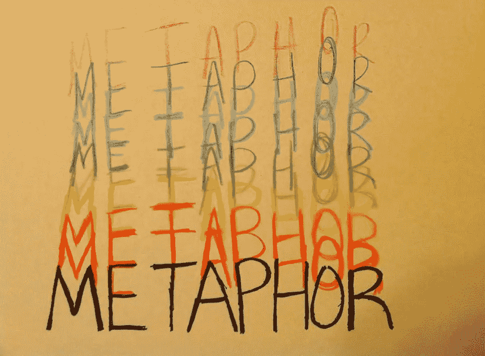

# 用隐喻来解释品牌和产品的复杂性

> 原文：<https://medium.com/hackernoon/using-metaphors-to-explain-brand-and-product-complexity-b954532d6f4e>

即使是最复杂的品牌也需要与客户建立有意义的联系。在 Emotive Brand，我们与许多拥有复杂技术、产品或服务的品牌合作。当我们深入研究这些品牌时，我们经常发现，即使是公司创始人也很难清楚地解释他们的品牌是做什么的，以及为什么它对真正引起客户共鸣很重要。他们经常用一个比喻来描述他们的产品。

隐喻是强大的交流工具。它们帮助我们以相关的方式考虑新的想法或概念。它们帮助我们从谈论特性和优势转向更好地理解品牌的意义。

在 SaaS 不断发展的市场中，广告技术、金融科技、云服务、大数据、平台——名单还在继续——拥有创新和复杂产品的品牌数量似乎是无穷无尽的。我们遇到了技术、银行、专业服务，甚至奢侈品牌，他们需要一种更好的方式来传达他们的价值主张，而不是陷入抽象的术语和术语中。随着不同产品和服务的激增，品牌面临着越来越大的压力，需要脱颖而出，清楚自己提供什么，并建立情感联系。做到所有这些并阐明其重要性的品牌为有意义的联系创造了条件。

# 作为隐喻的品牌名称

隐喻可以用在品牌名称中，也可以作为标语的一部分。通过选择一个文化上熟悉的符号来代表你的品牌，你可以创造一个更深层次的意义，与对你的品牌重要的人产生共鸣。隐喻塑造了我们参与品牌的方式，因为它通常是一个[品牌故事](http://hbswk.hbs.edu/item/connecting-with-consumers-using-deep-metaphors)的基础。想想一些[世界上最有价值的品牌](http://www.forbes.com/powerful-brands/)中使用的比喻:

亚马逊:它是世界上最大的河流。你可以在亚马逊上找到一切。品牌承诺强化了这个隐喻，即“……人们可以在这里找到并发现他们可能想在网上购买的任何东西。”

神谕:被定义为传递权威的、明智的或受到高度重视的和有影响力的声明的事物。甲骨文拥有从软件到云工程的广泛技术产品，所有这些产品都旨在充当技术世界的先知。

科罗纳:西班牙语中的“国王”。主导力量。在同类中出类拔萃的东西。Corona 是“啤酒之王”,它的名字让人感到自信、阳刚和自豪——这些品质我们经常与喝啤酒联系在一起。

# 竞选隐喻

对于一个真正复杂的商业产品，一个品牌可能需要依靠一个基于隐喻概念的营销活动。我们查看了一些有史以来最好的广告活动，看看哪些广告把隐喻变成了一种传达品牌代表什么、它为什么重要以及它创造了什么样的情感联系的方式。

雪佛兰:像石头一样

“像岩石一样”运动唤起了坚韧、粗犷和安全。当人们被称为“石头”时，这表明这个人永远不会让你挂着，他们是可靠的，坚定不移的。Chevy 的活动扩展了拥有 Chevy 的人的潜意识感觉:当他们需要它时，它就在那里，这就是他们所需要的一切。

红牛:给你翅膀

红牛“给你翅膀”的想法表明，红牛可以隐喻性地提升你，以实现甚至最危险的努力。无论是在夜班中保持清醒更长时间，还是从 50 英尺高的建筑物上跳入浅河，红牛承诺给你能量和勇气让它发生。该活动传达了能力、决心和力量的感觉。

# 如何为你的品牌选择一个隐喻

如果你的品牌提供了一个很难解释的复杂产品或服务(可能因为没有什么可以比较)，考虑用一个比喻作为你谈论你的品牌或解释它所提供的复杂性的路线图。当带领客户走上这条道路时，我们经常会问:

*   你的产品对顾客意味着什么？
*   你的品牌如何传递价值？
*   你的品牌在顾客生活中的什么位置？
*   你如何将你的产品和你的品牌承诺联系起来？

考虑头脑风暴这些问题来帮助引导你的隐喻。虽然产品和行业在发展，但品牌隐喻的美妙之处在于它们不会改变。核心含义是一个常数，人们与你的品牌联系的方式变得持久。使用正确的品牌隐喻，你可以创造有意义的联系和相关的客户体验，与你的品牌一起成长。

[情感品牌](http://www.emotivebrand.com)是品牌战略公司。

> [黑客中午](http://bit.ly/Hackernoon)是黑客如何开始他们的下午。我们是 [@AMI](http://bit.ly/atAMIatAMI) 家庭的一员。我们现在[接受投稿](http://bit.ly/hackernoonsubmission)并乐意[讨论广告&赞助](mailto:partners@amipublications.com)机会。
> 
> 如果你喜欢这个故事，我们推荐你阅读我们的[最新科技故事](http://bit.ly/hackernoonlatestt)和[趋势科技故事](https://hackernoon.com/trending)。直到下一次，不要把世界的现实想当然！

