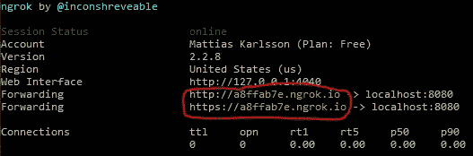
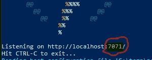
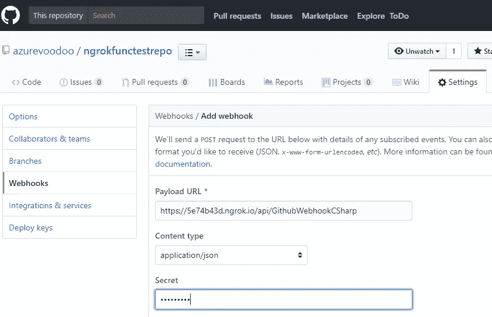
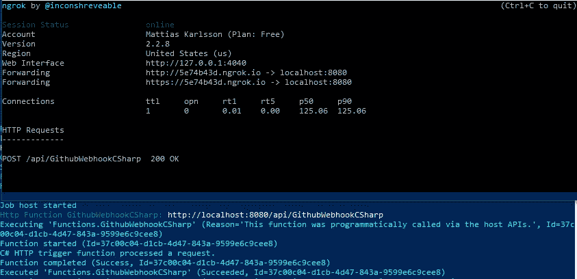
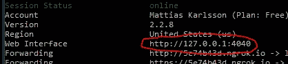
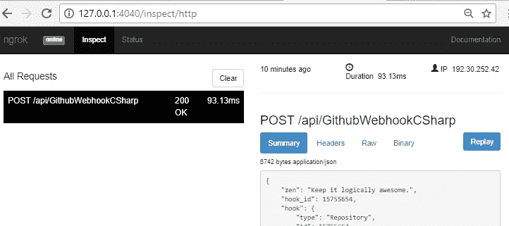

# 将 ngrok 与 Azure Functions⚡一起使用

> 原文：<https://medium.com/hackernoon/using-ngrok-with-azure-functions-7e209e96538c>

## 类固醇的无服务器调试💪

有了像 Azure Functions Cli 和 Azure Functions tools for Visual Studio 这样的东西，你就可以在本地机器上获得完整的开发和调试过程。这很好，因为你可以快速迭代和测试，而不需要先把代码推到云端，缺点是你不能从。3:第三方服务，即 GitHub 无法访问您本地运行的功能。

但是如果我说有一种方法可以让你鱼与熊掌兼得，那不是很好吗？

# ngrok

ngrok 简介，ngrok 是一种工具和服务，可以让您安全地检查流量并将其传输到您的本地计算机。这是一项付费计划的免费服务，将为您提供额外的功能，如自定义和保留域名，IP 地址白名单等。

## 获得工具

ngrok 可以跨平台用于 MacOS、Windows、Linux 和 FreeBSD，它只是一个你可以从[ngrok.com/download](https://ngrok.com/download)下载并解压的二进制文件。如果你像我一样在 Windows 上运行 Chocolatey，那么安装它只需要一个简单的命令方式:
`choco install -y ngrok.portable`

## 使用 ngrok

使用 ngrok 非常简单，一般来说，您可以使用本地服务监听的协议和端口来启动该工具。
`ngrok http 8080`

ngrok 将启动，转发 URL 是您用来从互联网访问您的本地服务。

## 将 ngrok 与 Azure 函数一起使用

你可以通过查看主机启动时的输出来找出你的 Azure 功能的本地端口，你也可以在启动功能主机
`func host -p 8080`时使用端口开关来指定端口

默认情况下，ngrok 会将其临时域作为主机头转发给本地运行的服务，但由于 Azure Functions host 只监听主机名“localhost ”,我们需要使用主机头开关
`ngrok http 8080 --host-header localhost`来覆盖默认行为

## 外部调用本地函数

要在外部使用本地运行的功能，您只需将功能主机提供的基本 url 替换为 ngrok 提供的临时 url，即
`[http://localhost:8080](http://localhost:8080)`变为`[https://tempsubdomain.ngrok.io](https://tempsubdomain.ngrok.io)`。

假设你有一个名为`GithubWebhookCSharp`的 GitHub webhook，它的本地 url 是`[http://localhost:8080/api/GithubWebhookCSharp](http://localhost:8080/GithubWebhookCSharp)`，外部 url 是`[https://tempsubdomain.ngrok.io/api/GithubWebhookCSharp](https://tempsubdomain.ngrok.io/GithubWebhookCSharp)`。

然后你可以把它设置成 GitHub webhook

现在，当 GitHub webhook 触发时，它将通过 ngrok 建立隧道，其有效载荷将被传递到您的本地，否则外部无法访问的函数

## 检查交通

ngrok 真正的杀手锏是它提供了一个本地 web 界面，你可以在工具的输出中找到它的 url

这个接口提供了对通过 ngrok 隧道的所有流量的深入了解，您可以看到响应/请求体和头，它还允许您尽可能多次地重放请求，而无需触发外部服务上的事件，这在调试、迭代实现和修复 bug 时非常有用！

# 结论

使用 ngrok 这样的服务真的很强大，最终可以加快开发过程。