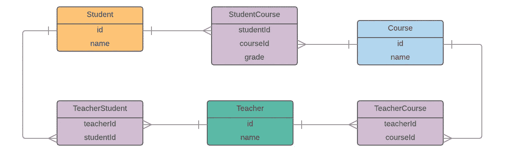

# 使用 Normalizr 组织存储中的数据。第二部分

> 原文：<https://medium.com/hackernoon/using-normalizr-to-organize-data-in-store-part-2-d9646133b7df>


在本文中，我想继续讨论在 React-Redux 应用程序中使用 Normalizr 的话题，并最终回答关于通用 API 的问题，这个问题在 [**上一篇文章**](https://hackernoon.com/using-normalizr-to-organize-data-in-stores-practical-guide-82fa061b60fb) 中有简要提及。

为了提醒您那篇文章是关于什么的， [**Normalizr**](https://github.com/paularmstrong/normalizr) 是一个对由嵌套实体表示的数据进行规范化的实用程序(就像在服务器响应中一样)，这样它就可以被存储并在以后使用，就像在前端有一个数据库的副本一样(例如在 Redux 存储中)。在第 1 部分中，我们有一个用下图描述的实体关系的例子:



**Fig. 1\. Entity-Relationship Diagram**

Normalizr 有一个现成的反规范化 API，但这可能还不够，因为它要求从服务器获取的数据与您希望在应用程序中使用的形状完全一致。例如，如果您想要对上一篇文章中的示例中的数据进行反规格化，以使一个*学生*实体包含*课程*，那么就必须完全按照这种方式获取数据——在*学生*中的课程。但是您可以在*教师*实体内获取课程，或者单独获取*课程*。在这种情况下，基本上有两种方法:你可以像在第一部分中描述的那样去规范化选择器中的实体，或者你可以定义你自己的 API，我们将在这里尝试这样做。

API 的主要困难在于，与后端不同，我们没有在前端描述所有模型及其关系。我们为 Normalizr 定义的模式也没有多大帮助，因为我们没有表示那里的实体之间的关系。事实上，前端对数据库中的实体和关系一无所知。因此，如果我们想在向商店请求的模型中包含一些东西，我们应该明确指出如何找到我们想要包含的东西。

我认为能够以这种方式定义对商店的请求会很好:

```
const schema = {
    modelName: 'student',
    include: [
        {
            modelName: 'studentCourse',
            isRelation: true,
            include: [
                {
                    modelName: 'course',
                    include: [
                        {
                            modelName: 'teacher',
                            through: 'teacherCourse',
                        }
                    ]
                },
            ],
        }
    ]
}
```

这里，我们希望从商店中获取 *student* ,并在其中嵌套 include 属性中指定的模型。它看起来非常类似于我们在第一部分中编写的从服务器获取数据的请求，只是增加了几个属性。在这里，我使用属性 *isRelation* 来表示应该包含一个关系，并使用属性*到*来告诉 API 如何找到所需的实体。我们稍后会谈到这一点。现在我们可以尝试实现 API 了。它应该只有几个功能。第一个被称为*反规格化*，应该在使用 API 时直接调用:

```
function denormalize (entity, models, schema) {
    const {include} = schema;

    const toInclude = include.map(i => {
        const entities = getInclusion(entity, models, schema, i);
        if (i.include) {
            //if an inclusion has its own inclusion, call the function recursively 
            return entities.map(e => denormalize(e, models, i));
        } else {
            return entities;
        }
    });

    const entityWithRelations = {...entity};
    include.map((i, index) => 
        entityWithRelations[i.modelName] = toInclude[index]);

    return entityWithRelations;
}
```

该函数应该将一个要反规范化的实体(*实体*)和来自商店的所有实体(*模型*)作为参数，以找到需要嵌套的实体。参数*模式*这里描述了如上定义的对存储的请求。它应该是这种类型的对象:

```
{
    modelName, //name of a requested model
    through, //name of a relation through which it should be found
    include, //an array of schemas to be included in the requested model
    isRelation, //true, if the requested model is a relation
}
```

第二个函数应该从*模型*对象中获取要嵌套的实体。这里我利用了这样一个事实，即在一个关系中，相关模型的 Id 被存储为 *<模型名称> Id* :

```
function getInclusion(entity, models, modelSchema, inclusionSchema) {
    const {modelName, isRelation: isModelRelation} = modelSchema;
    const {modelName:inclusionName, through, isRelation} = inclusionSchema;

    if (isModelRelation) { //include into a relation
       const foreignKey = `${inclusionName}Id`;

               return values(models[inclusionName])
        .filter(m => m.id === entity[foreignKey]);
    } else { //include into an entity
        if (isInclusionRelation) { //include a relation
            const ownKey = `${modelName}Id`;

            return values(models[inclusionName])
                .filter(m => m[ownKey] === entity.id);
        } else { //include an entity
            const ownKey = `${modelName}Id`;
            const foreignKey = `${inclusionName}Id`;

            const relations = values(models[through])
                .filter(r => r[ownKey] === entity.id);
            return relations.map(r => models[inclusionName][r[foreignKey]]);
        }
    }
}
```

我们必须考虑三种情况:

**案例一:**将一个实体包含到一个关系中。在这种情况下，我们可以从我们想要包含的关系中找到所需的实体。

**案例 2:** 将关系包含到实体中。我们必须走相反的路——我们通过实体 id 找到一个关系。

**案例三:**将一个实体包含到另一个实体中。在这种情况下，我们必须走更长的路。首先，我们通过实体 id 找到一个关系(就像在第二种情况下一样)，然后我们从关系中找到需要的实体并获取它们的 id。

差不多就是这样了。还有一点要提的是:在建议的实现中，API 的顶部应该有一个选择器。如果我们用 [**重新选择**](https://github.com/reactjs/reselect) ，可能看起来是这样的:

```
export const selectModels = (state) => state.models;

export const find = (schema, ids) => createSelector (
    selectModels,
    (models) => {
       const {modelName, include} = schema;
       return !include 
           ? values(pick(models[modelName], ids)) 
           : values(pick(models[modelName], ids))
               .map(v => denormalize(v, models, schema));
    }
);
```

所以， [**传奇**](https://redux-saga.js.org/) 的实际要求归结为这样的形状:

```
const candidates = yield select(find({schema, ids}))
```

方法*值*、*选择*和*克隆体* p 此处来自 [**Lodash**](https://lodash.com/) 。

这个 API 由我测试过，但迄今为止从未在实际项目中使用过。虽然我想我一有机会就会去申请。这似乎很有用，因为我们不需要每次从存储中获取数据时都在选择器中编写相同的反规格化，而且可能更容易使用。无论如何，它现在更多的是一个建议，而不是一个经过验证的现成的解决方案。如果你对这个主题有其他想法，请随时评论这篇文章。

[](https://hackernoon.com/missing-part-of-redux-saga-experience-1d2d169ba765) [## Redux Saga 体验中缺失的部分

### Redux saga 是应用程序和 redux store 之间的中间件，由 redux actions 处理。这意味着，它可以…

hackernoon.com](https://hackernoon.com/missing-part-of-redux-saga-experience-1d2d169ba765) [](https://hackernoon.com/using-normalizr-to-organize-data-in-stores-practical-guide-82fa061b60fb) [## 使用 Normalizr 组织商店中的数据——实用指南

### 在对 Normalizr 的工作结果应用一些简单的操作之后，我们得到了可以存储的数据

hackernoon.com](https://hackernoon.com/using-normalizr-to-organize-data-in-stores-practical-guide-82fa061b60fb) [](https://hackernoon.com/usage-of-reselect-in-a-react-redux-application-fcdca05cc00d) [## 在 React-Redux 应用程序中使用重选

### 为什么重选这么好

hackernoon.com](https://hackernoon.com/usage-of-reselect-in-a-react-redux-application-fcdca05cc00d) [](https://hackernoon.com/how-to-stop-using-callbacks-and-start-living-1e5ed92e68e8) [## 如何停止使用回调，开始生活

### Javascript 有两种处理异步任务的主要方式——回调和承诺。一般来说，承诺是…

hackernoon.com](https://hackernoon.com/how-to-stop-using-callbacks-and-start-living-1e5ed92e68e8) 

作者:[伊利亚·博哈斯洛克](https://github.com/iPhaeton)