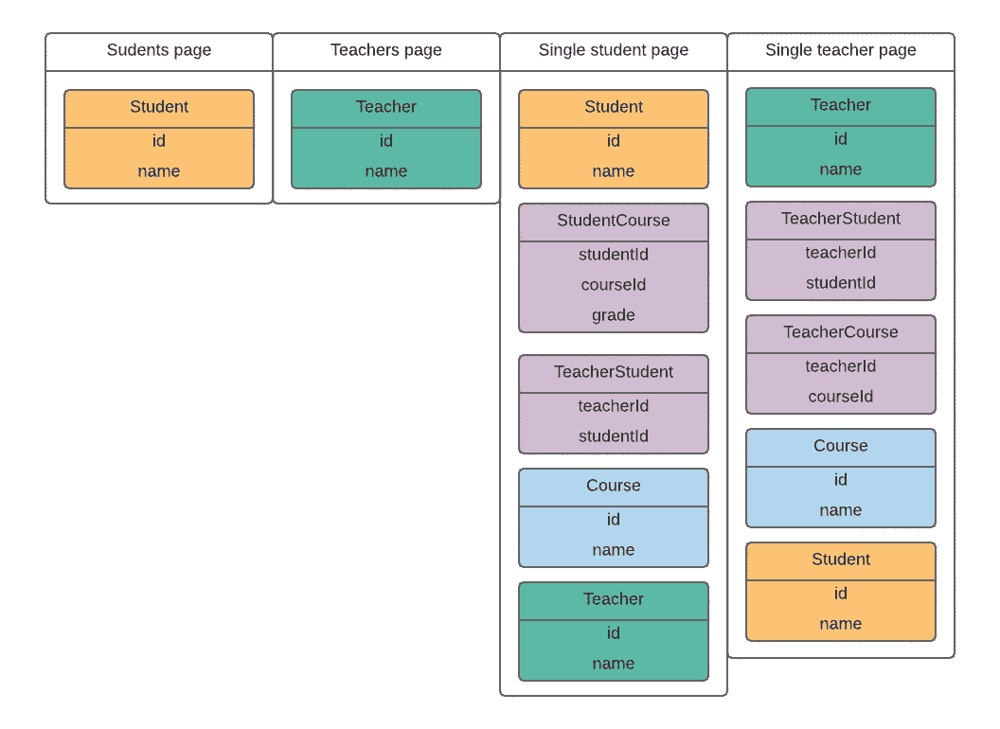

# 使用 Normalizr 组织商店中的数据——实用指南

> 原文：<https://medium.com/hackernoon/using-normalizr-to-organize-data-in-stores-practical-guide-82fa061b60fb>


React 应用程序通常需要来自服务器的一些数据存储在本地以供立即使用，主要是显示在页面上。如果应用程序使用复杂的关系数据库，这可能会有点问题。在这里，我将尝试描述我们在[](https://dashbouquet.com/)****的一个项目中遇到的数据组织问题，以及我们如何设法解决这些问题。****

****先说个例子。比方说，我们有一个包含多个页面的应用程序，每个页面都需要来自服务器的一些数据。如果有足够多的页面，当应用程序加载时，数据量会变得太大而无法立即获取。所以每次我们加载页面时都会请求数据。对于每个页面，我们可能在存储中有一个分区来保存与页面相关的数据，所以我们可能也想把获取的数据放在那里。****

****我们的应用程序将有几个页面。第一份是大学教师名单，第二份是学生名单。通过点击老师的名字，用户可以进入某个老师的页面，上面有他的学生和课程的列表。对学生来说也是一样——通过点击名字，我们可以看到学生的页面，上面有教师和课程列表。****

****ER 图应该是这样的:****

********

******Fig. 1\. Entity-Relationship Diagram******

****我们可以决定在哪个页面上需要什么数据:****

********

******Fig.2\. Division of entities by pages******

****我将借助我们在项目中使用的堆栈来描述这个例子。后端是 Loopback，前端是 React、Redux 和 Redux-saga，与服务器交互是 Axios。****

****正如我们所看到的，我们可能需要不同页面的相同数据。例如，我们需要教师页面上的所有教师和单个学生页面上的一些教师。那么我们把它们存放在哪里呢？也许我们并不总是需要在单个学生页面上获取教师。如果我们决定不去找老师，我们把数据带到哪里去呢？如果我们决定在两个页面上取数据，我们把数据放在哪里以避免重复？当数据分布在整个商店时，尤其是当应用程序超过四个页面并且有大量数据时，所有这些可能会非常混乱。****

****将所有数据保存在一个地方可能更好。还有一个怎么取的问题。我们绝对不希望单独获取实体，因为这样我们将很容易达到每页 30-50 个请求的程度，这将使页面加载速度太慢。我们希望在一个请求中获得尽可能多的数据(例如，在回送的情况下使用包含过滤器)。在对教师的响应中，我们得到类似这样的内容(**服务器响应的形状)**:****

```
 **[
       {
            **students**: [
                   {
                          id,
                          name,
                          **studentCourses**: [
                                 {
                                       studentId,
                                       courseId,
                                       grande,
                                 },
                                 ...
                           ],
                    },
                    ...
            ],
            **courses**: [
                  {
                           id,
                           name,
                  },
                  ...
            ],
       },
       ...
    ]**
```

****[**在这里**](http://loopback.io/doc/en/lb3/Include-filter.html) 你可以了解如何在查询中组合数据，如果你也使用回送的话。****

****在这个特殊的例子中，这将为我们节省两个请求，但是如果我们谈论前端存储，这不是很有用。首先，如果数据库发生变化，例如为一名教师添加了新课程，该怎么办？我们必须重新安排课程和教师，而不是重新安排课程。其次，我们可能需要学生实体实例中的课程，但是当我们向服务器发出查询时，我们不包括这些课程以避免重复。****

****为了解决上述问题，我们可以从 Normalizr 开始——一个用嵌套对象规范化数据的实用程序，就像我们的例子一样。我就不多说了:你可以在这里 找到所有信息 [**。关键是在对 Normalizr 的工作结果进行一些简单的操作后，我们得到了可以保存的数据。**](https://github.com/paularmstrong/normalizr)****

****我们需要定义几个传奇。如果你还没有在你的项目中使用 redux-saga，我认为 [**这个**](https://redux-saga.js.org/) 应该会说服你这样做。****

****第一个传奇将**获取数据**:****

```
****const** urls = {
      teachers: '/teachers,
      students: '/students’,
      courses: '/courses',
};**export function*** fetchModel(*model*, *ids*, *include*) {
       **const** url = urls[*model*];
       **const** where = {id: {inq: *ids*}};
       **const** filter = {where, *include*};
       **const** params = {filter};
       **return yield get**({url, params});
}**
```

****第二个将**存储数据**:****

```
****export function*** queryModels(*modelName*, *ids*, *include*]) {
       **const** singleModelSchema = schema[*modelName*];
       **const** denormalizedData = yield fetchModel(*modelName*, *ids*, *include*);
       **const** normalizedData = normalize(denormalizedData, [singleModelSchema]); **const** {entities} = normalizedData;
       **yield put**(addEntities(entities));
}**
```

****并且**缩减器**将向已经获取的数据添加新的数据:****

```
**case ADD_ENTITIES: {
     const models = *action*.entities;
     const newState = cloneDeep(*state*);
     return mergeWith(newState, models);
}**
```

****这里的和方法 mergeWith 和 cloneDeep [都来自 lodash。](https://lodash.com/)****

****完成所有这些后，我们可以用这种方式从服务器查询数据(**选择器**):****

```
**export function* fetchTeachers() {
  yield queryModels('teachers', ids, [
        {
             relation: 'students',
             scope: {
                 include: ['studentCourses'],
             }
        },
        {
          relation: 'courses',
        }
  ]);
}**
```

****Normalizr 使用一个规范化模式，如 [**这里**](https://github.com/paularmstrong/normalizr) 所述。****

****最终，我们得到的**状态**看起来像这样:****

```
 ****state**: {
         ...
         **models**: {
               teachers: {...},
               sudents: {...},
               courses: {...},
               studentCourses: {...},
         },
         ...
    }**
```

****这基本上是我们商店中数据库的一个很好的小拷贝。不需要分派大量动作来将提取的数据放入存储的不同部分，也不需要记住每段数据应该存储在哪里。这是在 queryModels saga 中完成的，我们总是知道提取的数据将放在哪里。****

****之后，我们可以在应用程序的任何页面中使用它，并根据需要在选择器中进行组合。****

****在我们的例子中，如果需要，我们可以为教师获取一个像这样复杂的对象(**非规范化数据)**:****

```
 **{
       **students**: [
              {
                     id,
                     name,
                     **studentCourses**: [...],
                     **courses**: [...],
              },
              ...
       ],
       **courses**: [
             {
                     id,
                     name,
                     **sudents**: [...],
                     **teachers**: [...],
             },
             ...
       ],
    }**
```

****还有另一种方法。我们可以描述一个通用的 API，在使用它之前对数据进行反规范化。这里的问题是我们需要一个 API 来反规格化数据，因为 Normalizr 包附带的反规格化函数只能将数据反规格化为它来自服务器时的形状，这不是我们想要的。如上所述，我们只在教师实体中获得课程，尽管我们可能在其他地方需要它们。对于较大的项目，我认为，花一些时间来想出一个定制的反规范化函数是值得的。然而，这是另一篇文章的主题。****

****当我们开始在项目中使用这种方法时，对我来说是一种解脱。这里的主要优点是你总是知道在哪里可以找到你需要的东西。如果您决定以另一种方式聚合数据会更好，那么您不需要再修改查询，只需稍微更改一个选择器。一般来说，使用这种方法管理存储中的数据需要的工作量要少得多。****

****[](https://hackernoon.com/missing-part-of-redux-saga-experience-1d2d169ba765) [## Redux Saga 体验中缺失的部分

### Redux saga 是应用程序和 redux store 之间的中间件，由 redux actions 处理。这意味着，它可以…

hackernoon.com](https://hackernoon.com/missing-part-of-redux-saga-experience-1d2d169ba765) [](https://hackernoon.com/usage-of-reselect-in-a-react-redux-application-fcdca05cc00d) [## 在 React-Redux 应用程序中使用重选

### 为什么重选这么好

hackernoon.com](https://hackernoon.com/usage-of-reselect-in-a-react-redux-application-fcdca05cc00d) [](https://hackernoon.com/using-normalizr-to-organize-data-in-store-part-2-d9646133b7df) [## 使用 Normalizr 组织存储中的数据。第二部分

### 文章的第二部分讲述了如何使用 Normalizr 来组织商店中的数据。

hackernoon.com](https://hackernoon.com/using-normalizr-to-organize-data-in-store-part-2-d9646133b7df) [](https://hackernoon.com/how-to-stop-using-callbacks-and-start-living-1e5ed92e68e8) [## 如何停止使用回调，开始生活

### Javascript 有两种处理异步任务的主要方式——回调和承诺。一般来说，承诺是…

hackernoon.com](https://hackernoon.com/how-to-stop-using-callbacks-and-start-living-1e5ed92e68e8) 

作者:[伊利亚·博哈斯洛克](https://github.com/iPhaeton)

[](http://bit.ly/HackernoonFB)[](https://goo.gl/k7XYbx)[](https://goo.gl/4ofytp)

> [黑客中午](http://bit.ly/Hackernoon)是黑客如何开始他们的下午。我们是 [@AMI](http://bit.ly/atAMIatAMI) 家庭的一员。我们现在[接受投稿](http://bit.ly/hackernoonsubmission)并乐意[讨论广告&赞助](mailto:partners@amipublications.com)机会。
> 
> 如果你喜欢这个故事，我们推荐你阅读我们的[最新科技故事](http://bit.ly/hackernoonlatestt)和[趋势科技故事](https://hackernoon.com/trending)。直到下一次，不要把世界的现实想当然！

****