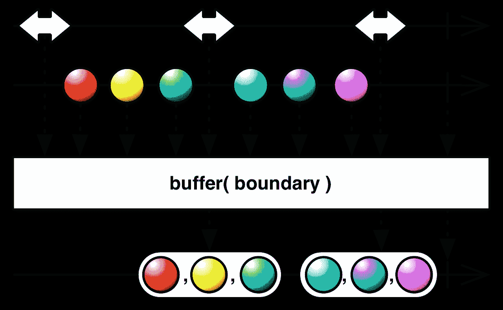
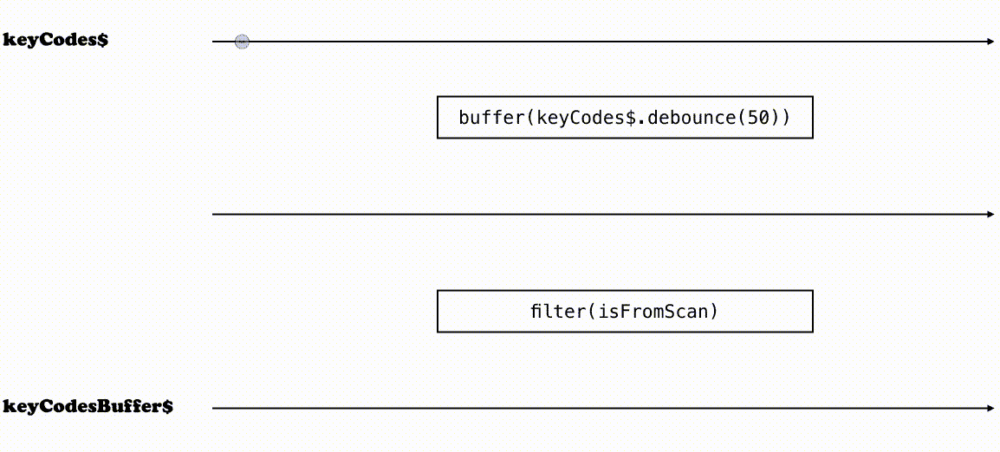

# 在现实生活中使用可观察的事物

> 原文：<https://medium.com/hackernoon/using-observables-to-make-our-app-work-with-barcode-scanners-e8a673fba625>

*这个故事也被贴在了我的个人博客* *上的* [*。*](https://www.nicoespeon.com/en/2017/03/using-observables-in-real-life/)

在这篇文章中，我将讨论一个具体的用例，在这个用例中，可观察性变得非常重要，使我们的代码更加整洁，更易于维护。

## 如何识别条形码扫描仪？！

没错。这是一个特殊的例子。但它完美地说明了一些问题，这些问题会让你乞求使用 Observables。

一个[条形码](https://hackernoon.com/tagged/barcode)扫描仪简单地模仿键盘。它复制扫描的代码，发出按键信号，以“输入”键结束——该键码是 *13* 。

假设我们正在开发一个应用程序，允许用户从他们的 16 个字符的代码参考中搜索产品。用户应该能够使用条形码扫描仪来触发搜索，而不是手动输入。

> "只要让用户集中搜索输入，扫描就大功告成了！"

当然，这是天生的行为。

但是搜索功能包含在一个弹出窗口中，可以用一个按钮打开。我们被告知该应用程序应该是超级符合人体工程学的！每当用户扫描条形码时，我们应该打开弹出窗口，并用扫描的代码填充输入。

现在，问题是:我们如何将扫描的代码与其他按键事件区分开来？假设用户在扫描代码之前按了一个键:我们不希望这个键是被扫描代码的一部分！

## 解决这个问题，当务之急是

我们当然需要监听按键事件…然后我们必须…记住按键代码，可能要使用缓冲区！如果按下的键是“输入”键，则填充输入并清理缓冲区。否则，将密钥添加到缓冲区中！

让我们试试第一个镜头:

很好。

但这还不够:它不能区分扫描代码和常规按键！

我们知道，如果大约 50 毫秒后没有发出新的按键，这肯定不是扫描代码，我们可以清理缓冲区。

嗯……还不错。但是这里有一个微妙的错误:如果代码扫描时间超过 50 毫秒，它将丢失开头…

事实上，如果新的按键在 50 毫秒内发生，我们应该清除超时。

现在我们有工作了。

让我们退一步想一想:如果我们有按键事件的完整历史，我们可以操纵过滤扫描代码序列？代码会更简单吗？让我们来解决这个问题…

## 解决这个问题，用可观的

对于这种用例，我发现 Observables 是一个强大的抽象来表示我们的数据。

> 可观察对象是**不可变的异步事件集合**，您可以通过**操作符**对其进行操作。

如果我们在数组上使用类似于*映射*和*过滤*的东西，那么我们已经熟悉了这种思维方式。

> 如果到目前为止可观测量对你来说仍然是神秘的，我建议你去读读[这篇来自安德烈·斯塔尔茨的关于反应式编程的精彩介绍](https://gist.github.com/staltz/868e7e9bc2a7b8c1f754)。

因此，让我们将所有事件收集到一个可以转换的流中，而不是单独地响应每个事件。

> 变量名末尾的 ***$*** 符号表示“流”。
> 这是一个约定，我用它来知道我操作的变量在非类型化语言中是可观察的，就像我会把 ***元素*** 称为一个由 ***元素*** 组成的数组，或者把 ***$header*** 称为头部的 jQuery 表示。

现在我们有了一串关键代码。每当发生按键事件时，都会发出一个新事件，该事件的值是相应的按键代码。

在这个过程的最后，我们希望有一个可以订阅的流。流中的每个事件应该代表被扫描的代码。因此，我们需要批量生产按键代码，将扫描代码与寄生按键隔离开来。

为此，我们可以使用**去抖**策略**缓冲**我们的流:当一个事件发生时，等待 50 毫秒等待下一个事件。如果在此时间范围内发出另一个事件，再等待 50 毫秒。如果在此时间范围内没有发生其他事件，则创建一批传递的事件。

This is what we want to achieve with [the buffer operator](http://reactivex.io/documentation/operators/buffer.html)

到目前为止，一切顺利！

现在，我们要做的就是过滤掉那些看起来不像扫描码的批次。我们知道，扫描的代码是一个以“回车”键结束的序列。

最后，让我们订阅我们创建的这个流，并在每次发出新事件时执行回调。

> 除非我们认同可观察的事物，否则什么都不会发生，因为它们是懒惰的。

## 我们在这里做了什么

这是我们从 *keyCode$* 到 *keyCodesBuffer$* 的可视化演示，keyCode$ 是通过按键事件创建的，我们订阅了:

Transforming the stream of key codes into a stream of scanned codes

对于我们的最终代码，有一些事情需要注意:

*   我们不必手动管理诸如超时和缓冲之类的事情
*   因此，代码更短，**关注于实际工作**
*   *fillInputWith()* 不依赖于全局缓冲区，这更加**可测试**和**可重用**——实际上，我们离使整个逻辑完全功能化只有几步之遥
*   我们只是操纵*常量* s，没有任何东西被重新分配，这使得**推理**更加简单
*   创建的流可以被**重用**来做其他事情；我们可以**添加功能，而不用担心**破坏这个功能
*   我们可以很容易地修复这个代码中的问题，如果必要的话，在流创建管道中注入操作符——例如，我们可能会从 *keyCode$* 中过滤掉不感兴趣的键码，就像*一样简单。过滤器(isValidKeyCode)*

在我看来，一个困难的事情是用流来推理，并理解如何用给定的操作符来解决我们的用例。

但是，我相信这只是需要练习😉

> [黑客中午](http://bit.ly/Hackernoon)是黑客如何开始他们的下午。我们是 [@AMI](http://bit.ly/atAMIatAMI) 家庭的一员。我们现在[接受投稿](http://bit.ly/hackernoonsubmission)并乐意[讨论广告&赞助](mailto:partners@amipublications.com)机会。
> 
> 如果你喜欢这个故事，我们推荐你阅读我们的[最新科技故事](http://bit.ly/hackernoonlatestt)和[趋势科技故事](https://hackernoon.com/trending)。直到下一次，不要把世界的现实想当然！

