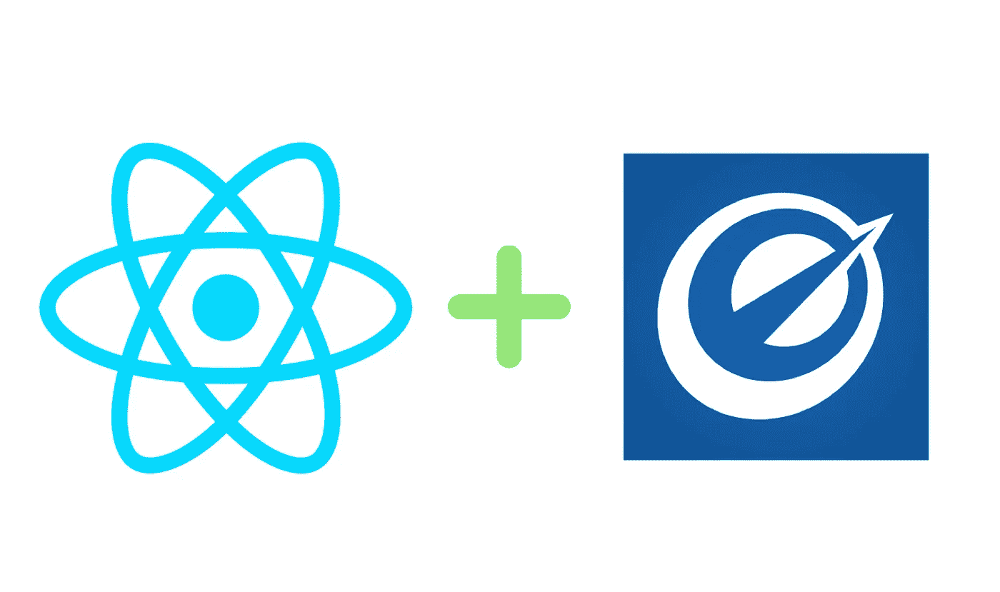
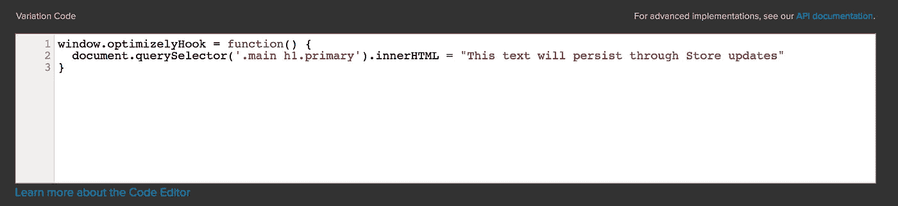

# 与 React/Redux 一起优化使用

> 原文：<https://medium.com/hackernoon/using-optimizely-with-react-redux-99bd510c790f>

Optimizely 是一个让你执行 AB 测试的工具。像所有或大多数其他客户端 AB 测试[工具](https://hackernoon.com/tagged/tools)一样，它使用以下机制:

*   您的页面上包含一个脚本标记，它可以在加载时为不同的用户群改变它
*   将该变化与未改变的对照组进行比较，以了解其表现如何

对我们团队来说，这个模型的主要卖点很简单:运行测试不需要修改代码。这使得产品和营销团队可以在没有工程师参与的情况下更快地启动生产测试。

然而，有一个问题:React 应用程序的优化使用存在固有的问题。每次状态或存储发生变化时，React 都会重新呈现组件。因此，优化更改不会持续，它们会在重新渲染时被 React diffing 机制移除。

## 外面已经有什么了？

最近有许多文章介绍了 React+优化使用的不同解决方案。

**【更新:Tilt 博客似乎已经被撤下】** [服务器端渲染应用，使用 Optimizely REST API 在服务器上获取实验信息](https://medium.com/u/4396b53c7d20#.vsiciejgu)。不仅仅是反应，任何服务器端 AB 测试都需要部署。但是对我来说，这种方法似乎没有充分利用——我宁愿使用它的 GUI 进行客户端 AB 测试，或者根本不使用它。

这里有很多好主意。然而，令我非常困扰的是，上述所有解决方案都要求对每个新的 AB 测试进行部署。

# 无需部署或代码更改即可优化反应/还原

这里有一个轻量级的方法。需要注意的事项:

*   这是为中小型 UX 调整。如果你的 AB 测试是大规模的，那么代码变更可能是一个更好的途径。
*   该方法在您的代码库中的成功取决于您特定的 React 实现。这与我们的 React/Redux 应用程序配合得很好，因为它在主要使用道具和动作(而不是本地状态)的每次更改时都重新呈现顶级组件。

## 第一步

当状态或存储改变时，React 重新渲染组件。如果你使用 React，你肯定熟悉生命周期方法。您可以使用这些方法中的几个来调用一个全局函数，该函数就像一个钩子一样触发 [JavaScript](https://hackernoon.com/tagged/javascript) 进行所需的 DOM 修改。

这看起来像什么:

`window.optimizelyHook`将是一个全局函数，在组件装载到页面上后立即被调用。利用你的顶层组件的`componentDidMount`和`componentDidUpdate`生命周期方法，就像这样:

## 第二步

在 Optimizely 的变体 JavaScript 中，定义`optimizelyHook()`函数。然后，在这个函数中执行所有 DOM 修改。

`componentDidMount`在初始坐骑上被调用一次
`componentDidUpdate`在每次连续更新的道具上被调用

## 结果呢

将在每次道具更新时运行，导致实验通过 Redux 动作触发的重新渲染而持续。

部署一次，在多个 AB 测试中使用多次。🎉

## 资源

[了解服务器端与客户端 AB 测试](https://conversionxl.com/server-side-vs-client-side-ab-testing-tools-whats-the-difference/)

[React 生命周期方法](https://facebook.github.io/react/docs/react-component.html)

> [黑客中午](http://bit.ly/Hackernoon)是黑客如何开始他们的下午。我们是 [@AMI](http://bit.ly/atAMIatAMI) 家庭的一员。我们现在[接受投稿](http://bit.ly/hackernoonsubmission)，并乐意[讨论广告&赞助](mailto:partners@amipublications.com)机会。
> 
> 如果你喜欢这个故事，我们推荐你阅读我们的[最新科技故事](http://bit.ly/hackernoonlatestt)和[趋势科技故事](https://hackernoon.com/trending)。直到下一次，不要把世界的现实想当然！

