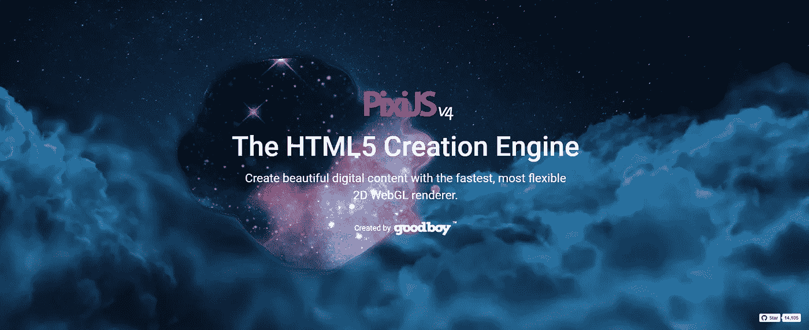
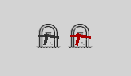

# 使用 PixiJS 生成或动画化一个 Chrome 扩展图标。

> 原文：<https://medium.com/hackernoon/using-pixijs-to-generate-or-animate-a-chrome-extension-icon-cad2d5ff40c9>

PixiJS home page splash

# 简介:

在过去的几个月里，我主要在修补不同的 [chrome](https://hackernoon.com/tagged/chrome) 扩展/插件。从只是让你的网页变暗的扩展，到覆盖新标签并在其中注入大量网站的扩展，以创建某种工作空间。你可以在这里查看我的最新作品[https://chrome.google.com/webstore/search/k.ivanow](https://chrome.google.com/webstore/search/k.ivanow)

# 免责声明:

下面描述的一切都可以用纯 canvas js 编码来完成，而不是用 [PixiJS](http://www.pixijs.com/) 。然而，自从我在工作中和几个兼职项目中使用 PixiJS 后，我变得非常喜欢它。

# 为什么会有人这么做？

起初，图标是任何项目中最无聊的部分(尤其是对于像我这样的开发人员)。然而，这正是为什么图标上的一些小的触摸会对用户产生很大的影响。我见过很多 Chrome 的扩展(all adblockers，Limitless 等)使用图标徽章在其中显示文本(阻止了多少广告，你在当前网页上花了多少时间等)。

然而今天早些时候，我认为我没有看到任何扩展，动画图标。我搜索了一会儿，看到了几个 StackOverflow 帖子，解释了如何通过在清单中定义的一组图像之间切换来使[图标动画化。我认为这是一个更好的方法，并且发现`chrome.browserAction.setIcon()`不仅接收图标的路径，还可以接收图像数据！*万岁！！！现在，让我们进入这篇文章的主要部分。*](https://hackernoon.com/tagged/animate)

# 如何制作图标动画

思考过程简单明了，执行起来也很容易:

1.  创建背景页面(它将负责图标的渲染和更新)
2.  在背景页面中创建 [PixiJS](http://www.pixijs.com/) stage(它实际上会激活图标)
3.  决定动画— [PixiJS](http://www.pixijs.com/) 有一套非常棒的滤镜、色彩、比例、倾斜等等…决定你想要制作什么动画，并弄清楚如何制作动画。对我来说，我决定使用我最新的扩展——[正念](https://chrome.google.com/webstore/detail/mindfulness/blpljgcghbboofdodkmciihhacgjoffo)主要集中在你还剩多少时间可以活(死亡纪念品之类的东西)，所以我决定一个可以改变颜色的动画时钟会是合适的。
4.  执行所述动画并在每一帧上更新 chrome 扩展图标。

## 有几件事要记住:

1.  [PixiJS](http://www.pixijs.com/) ticker 在背景页面中不工作。基于 requestAnimation 的任何东西都不起作用，因为背景页面永远不会被聚焦。使用 setInterval 并在其中设置动画。我用了大约 33 毫秒，但我也可以用 1000 毫秒，这完全取决于你决定制作的动画。
2.  将舞台提取为 imageData 时，不要使用舞台的大小，而是使用渲染器的大小。舞台只是一个容器，因此，它的宽度和高度会被其子对象更改。这可能会导致拉伸，挤压或以任何其他方式扭曲图标。
3.  Chrome 扩展图标在尺寸超过 190px 时会有问题，根据 StackOverflow 上的这个回答[，所以我把它保持在 128x128。](http://stackoverflow.com/a/37602444/4424049)

因此，我创建了一个 clock 类，该类创建了一个时钟并制作了动画(*谁会想到*)。

这个概念很简单

1.  创建阶段
2.  添加扩展的主图标
3.  添加 3 条线(每个时钟指针一条)
4.  基于当前时间旋转它们
5.  通过为某些选项卡重新创建它们来改变它们的颜色(这个逻辑超出了本文的范围)
6.  在每个帧上调度事件
7.  在后台页面中，捕捉这个事件并更新扩展图标

这是最终结果。我根据用户所在的网页使用两种风格的箭头。

## 序言

*我猜*

我刚刚想出了一个我还没见过有人做过的东西(至少到目前为止。有错随时指正)以及怎么做决定分享一下。

类似的事情可以用大量的资源来完成，这些资源可以被切换来模拟一个动画，这是我在为这篇文章做简短的研究时看到的最常见的方法。

用一个简单的画布和 JS 代码就可以得到完全相同的结果。我更喜欢 PixiJS，因为我对它很熟悉，如果我决定的话，它允许我制作更复杂的动画。

我希望你会对这篇文章感兴趣，即使只是因为你可以从动画画布或 WebGL 上下文中提取一部分，并将其用作 chrome 扩展的图标，而不是简单的 png。如果你有时间和愿望，你甚至可以通过简单的形状和滤镜或者混合模式来创建你的整个图标。

查看一下 [*扩展*](https://chrome.google.com/webstore/detail/mindfulness/blpljgcghbboofdodkmciihhacgjoffo) *，这就是这篇文章背后的想法。*

> [黑客中午](http://bit.ly/Hackernoon)是黑客如何开始他们的下午。我们是 [@AMI](http://bit.ly/atAMIatAMI) 家庭的一员。我们现在[接受投稿](http://bit.ly/hackernoonsubmission)并乐意[讨论广告&赞助](mailto:partners@amipublications.com)机会。
> 
> 如果你喜欢这个故事，我们推荐你阅读我们的[最新科技故事](http://bit.ly/hackernoonlatestt)和[趋势科技故事](https://hackernoon.com/trending)。直到下一次，不要把世界的现实想当然！

