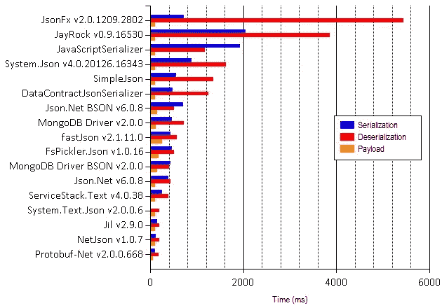
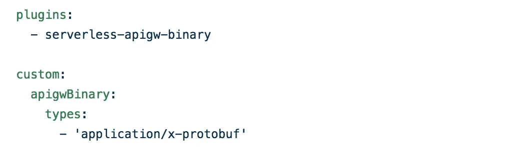
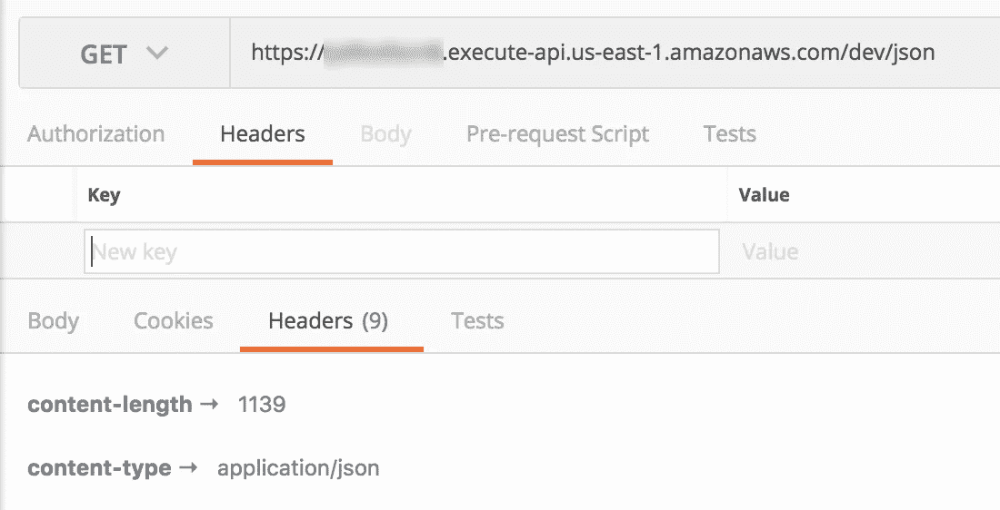
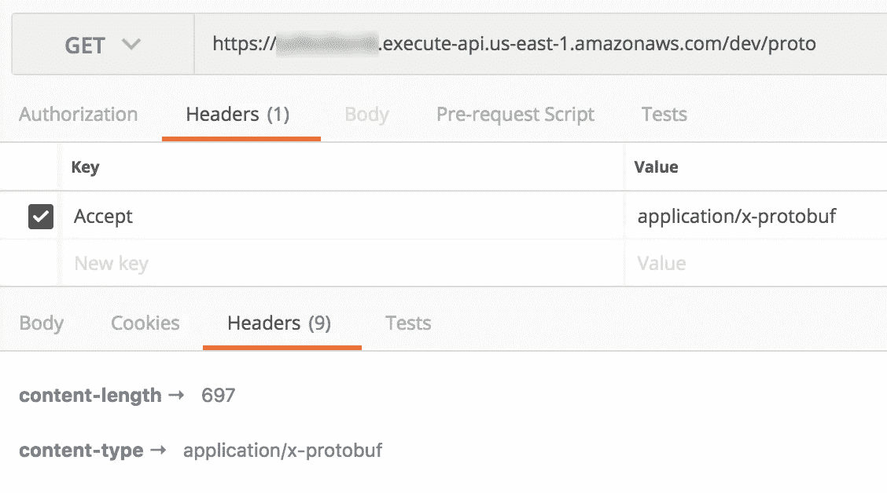

# 通过 API 网关和 AWS Lambda 使用协议缓冲区

> 原文：<https://medium.com/hackernoon/using-protocol-buffers-with-api-gateway-and-aws-lambda-22c3804f3e76>

## 与 JSON 相比，Protocol Buffers 和 Thrift 等二进制格式可以产生明显更小的有效负载，这可以在大规模网络带宽成本方面产生很大的影响，并改善受限环境中的用户体验。


AWS 在 2016 年末宣布了对 API 网关的[二进制支持，这为你使用更高效的二进制格式打开了大门，比如谷歌的](https://aws.amazon.com/about-aws/whats-new/2016/11/binary-data-now-supported-by-api-gateway/)[协议缓冲区](https://developers.google.com/protocol-buffers/)和 [Apache Thrift](https://thrift.apache.org/) 。

# 为什么？

与 JSON——它是用 API Gateway 和 Lambda 构建的 API 的基础——相比，这些二进制格式产生的有效负载要小得多。

在*规模*下，它们会对您的带宽成本产生很大影响。

在*受限的*环境中，如低端设备或移动连接不良的国家，发送较小的有效负载也可以通过改善**端到端网络延迟**以及设备上可能的[处理时间](http://theburningmonk.com/benchmarks/)来改善您的用户体验。



Comparison of serializer performance between Proto Buffers and JSON in .Net

# **如何**

遵循这三个简单的步骤(假设您使用的是无服务器框架):

1.  安装令人敬畏的[无服务器 apigw-binary](https://www.npmjs.com/package/serverless-apigw-binary) 插件
2.  将`application/x-protobuf`添加到二进制媒体类型(见下面的截图)
3.  添加将协议缓冲区作为 base64 编码响应返回的函数



The serverless-apigw-binary plugin has made it really easy to add binary support to API Gateway

要对 Nodejs 中的协议缓冲区有效载荷进行编码和解码，可以使用 NPM 的 [protobufjs](https://www.npmjs.com/package/protobufjs) 包。

[](https://github.com/dcodeIO/protobuf.js) [## dcodeIO/protobuf.js

### js-JavaScript(& TypeScript)的协议缓冲区。

github.com](https://github.com/dcodeIO/protobuf.js) 

它允许您使用现有的`.proto`文件，或者您可以使用 JSON 描述符。阅读一下这些文件，看看你如何开始。

在演示项目中(本文底部的链接)，你会发现一个 Lambda 函数，它总是在协议缓冲区中返回一个响应。

这个函数需要注意几件事:

*   我们将`Content-Type`标题设置为`application/x-protobuf`
*   `body`是协议缓冲区有效负载的 base64 编码表示
*   `isBase64Encoded`被设置为`true`

您需要做**所有这 3 件事**来让 API Gateway 以二进制数据的形式返回响应。

把它们看作是让 API Gateway 返回二进制数据的魔咒，并且，**调用者还必须将** `Accept` **头设置为** `application/x-protobuf`。

在同一个项目中，还有一个 JSON 端点，它返回与 comparison 相同的有效载荷。



来自这个 JSON 端点的响应如下所示:

```
{"players":[{"id":"eb66db14992e06b36282d607cf0134ce4fe45f50","name":"Calvin Ortiz","scores":[57,12,100,56,47,78,20,37,32,48]},{"id":"7b9b38e535453d120e706ff57fef41f6fee991cb","name":"Marcus Cummings","scores":[40,57,24,15,45,54,25,67,59,23]},{"id":"db34a2a5f4d16e77a6d3d6154a8b8bb6760b3b99","name":"Harry James","scores":[61,85,14,70,8,80,14,22,76,87]},{"id":"e21018c4f43eef10771e0fa71bc54156b00a64dd","name":"Gregory Bishop","scores":[51,31,27,47,72,75,61,28,100,41]},{"id":"b3ee29ee49b640ce15be1737d0dca60e48108ee1","name":"Ann Evans","scores":[69,17,48,99,85,8,75,55,78,46]},{"id":"9c1e6d4d46bb0c0d2c92bab11e5dbd5f4ab0c619","name":"Juan Perez","scores":[71,34,60,84,21,98,60,8,91,92]},{"id":"d8de89222633c61393931457c1e72558eba48639","name":"Loretta Harvey","scores":[15,40,73,92,42,65,58,30,26,84]},{"id":"141dad672ec559431f808964391d128d2c3274bf","name":"Ian Powell","scores":[17,21,14,84,64,14,22,22,34,92]},{"id":"8a97e85e2e5385c45fc31f24bfe781c26f78c0b7","name":"Steve Gibson","scores":[33,97,6,1,20,1,78,3,77,19]},{"id":"6b3ca6924e17cd5fd9d91b36d49b36a5d542c9ea","name":"Harold Ferguson","scores":[31,32,4,10,37,85,46,86,39,17]}]}
```

如您所见，它只是一堆随机生成的名称、GUIDs 和整数。**协议缓冲区中的相同响应比** **小近 40%**。



## protobufjs 包的问题

在我们继续之前，有一个关于在 Lambda 函数中使用 [protobufjs](https://www.npmjs.com/package/protobufjs) 包的重要细节— **你需要在 Linux 系统上**使用 `npm install` **包。**

这是因为它有一个作为本机二进制文件分发的依赖项，所以如果您在 OSX 上安装了打包的，那么打包并部署到 Lambda 的二进制文件将不会在 [Lambda 执行环境](http://docs.aws.amazon.com/lambda/latest/dg/current-supported-versions.html)上运行。

我过去在其他谷歌图书馆也遇到过类似的问题。我发现处理这个问题的最好方法是借鉴 [aws-serverless-go-shim](https://github.com/eawsy/aws-lambda-go-shim) 的方法，将代码部署在 Docker 容器中。

通过这种方式，你可以在本地为你的操作系统安装一个兼容版本的本地二进制文件，这样你就可以继续使用`sls invoke local`运行和调试你的函数(详见[这篇文章](https://hackernoon.com/running-and-debugging-aws-lambda-functions-locally-with-the-serverless-framework-and-vs-code-a254e2011010))。

但是，在部署期间，脚本将在运行兼容 Linux 发行版的 Docker 容器中运行`npm install --force`。这将安装一个可以在 Lambda 执行环境中执行的本地二进制版本。然后，该脚本将使用`sls deploy`来部署该功能。

部署脚本可能很简单，如下所示:

在演示项目中，我还有一个`docker-compose.yml`文件:

无服务器框架需要我的 AWS 凭证，因此我将`$HOME/.aws`目录附加到容器中，以便 AWSSDK 在运行时查找。

要进行部署，运行`docker-compose up`。

# 使用 HTTP 内容协商

虽然二进制格式在有效载荷大小方面更有效，但它们确实有一个主要问题:**它们很难调试**。

想象一下这个场景——你观察到了一个 bug，但是你不确定问题出在客户端应用还是服务器。但是，让我们用一个 HTTP 代理(比如 Charles 或 Fiddler)来观察 HTTP 对话。

这种工作流程对于 JSON 来说非常有效，但是对于二进制格式(比如协议缓冲区)来说就不行了，因为*的有效负载不是人类可读的*。

正如我们在本文中所讨论的，JSON 的可读性是以占用大量带宽为代价的。对于大多数网络通信来说，无论是服务对服务，还是服务对客户端，除非有人主动“阅读”有效载荷，否则不值得为此付出代价。但是当一个人*试图阅读它的时候，这种可读性是非常有价值的。*

幸运的是，HTTP 的内容协商机制意味着我们可以两全其美。

在演示项目中，有一个`contentNegotiated`函数，它根据`Accept`头返回 JSON 或 Protocol Buffers 有效载荷。

默认情况下，您应该为所有网络通信使用协议缓冲区，以最大限度地减少带宽使用。

但是，当您需要观察通信时，您应该构建一种机制来切换到 JSON 的通信。这可能意味着:

*   对于你的移动应用程序的调试版本，允许超级用户(开发人员，质量保证等。)开启`debug`模式的能力，这将切换网络层以发送接受报头作为`application/json`
*   对于服务，包括一个打开`debug`模式的配置选项(参见[这篇文章](https://hackernoon.com/you-should-use-ssm-parameter-store-over-lambda-env-variables-5197fc6ea45b)关于配置带有 SSM 参数的函数和用于热插拔的缓存客户端),使服务到服务的调用也使用 JSON，这样您可以更容易地捕获和分析请求和响应

像往常一样，你可以自己尝试演示代码，回购可在[这里](https://github.com/theburningmonk/lambda-protobuf-demo)获得。

[](https://github.com/theburningmonk/lambda-protobuf-demo) [## burning monk/lambda-proto buf-demo

### 使用 API 网关和带有协议缓冲区的 lambda

github.com](https://github.com/theburningmonk/lambda-protobuf-demo) 

嗨，我的名字是**崔琰**。我是一个 [**AWS 无服务器英雄**](https://aws.amazon.com/developer/community/heroes/yan-cui/) 和 [**量产无服务器**](https://bit.ly/production-ready-serverless) 的作者。我已经在 AWS 中运行了近 10 年的大规模生产工作负载，我是一名架构师或首席工程师，涉足从银行、电子商务、体育流媒体到移动游戏等多个行业。我目前是一名专注于 AWS 和无服务器的独立顾问。

你可以通过[邮箱](mailto:theburningmonk.com)、 [Twitter](https://twitter.com/theburningmonk) 和 [LinkedIn](https://www.linkedin.com/in/theburningmonk/) 联系我。

查看我的新课程，[**AWS 步骤功能完整指南**](https://theburningmonk.thinkific.com/courses/complete-guide-to-aws-step-functions) 。

在本课程中，我们将介绍有效使用 AWS Step Functions 服务所需了解的一切。包括基本概念、HTTP 和事件触发器、活动、设计模式和最佳实践。

在这里拿到你的副本。


来了解 AWS Lambda: CI/CD 的操作性**最佳实践**，本地测试&调试功能、日志记录、监控、分布式跟踪、canary 部署、配置管理、认证&授权、VPC、安全性、错误处理等等。

还可以用代码 **ytcui** 获得**票面价格 6 折**。

点击此处获取您的副本。