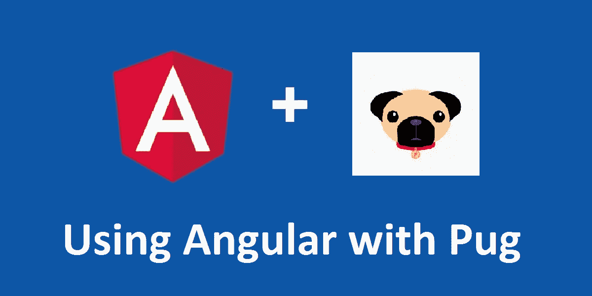

# 使用带棱角的泥料(玉石)(带 CLI)

> 原文：<https://medium.com/hackernoon/using-pug-jade-with-angular-with-cli-5592b7ee24e6>



我爱[哈巴狗](https://pugjs.org/api/getting-started.html)。Pug 允许我编写更简洁的 HTML。

来自这样的 HTML

```
<!DOCTYPE html><html> <head>
    <meta charset="utf-8">
    <title>my portal</title>
  </head> <body> <app-root>
      <div class="root-spinner">
        
      </div>
    </app-root>
  </body></html>
```

给[哈巴狗](https://hackernoon.com/tagged/pug)，这样干净多了。

```
doctype htmlhtml
  head
    meta(charset="utf-8")
    title my portal body
    app-root
      div.root-spinner
      img.loading(src="assets/images/logo.png")
```

但是，如果您使用的是事实上的 Angular-CLI，那么 pug 选项可能还没有过时。这里有一个讨论:[https://github.com/angular/angular-cli/issues/1886](https://github.com/angular/angular-cli/issues/1886)。

# 我们现在如何使用它？

我们现在可以使用命令行了。Pug CLI 允许你用类似于`pug [dir,file]`的命令编译 Pug 并观察变化。

```
npm install pug-cli --save-dev
```

安装后，我们在`package.json`中创建两个脚本:

```
"pug-it": "pug src",
"pug-it:w": "pug src -P -w"
```

第一个命令“pug-it”将编译所有的。pug 把` src `目录下的文件。相同目录中的 html 文件。

第二个命令对额外的文件监视做了完全相同的事情。我们在开发过程中使用这个命令来观察文件的变化并自动重新编译。

这是我们其他的一些剧本。

```
"ng": "ng",
"start": "run-p pug-it:w server",
"server": "ng serve --port 4210",
"prebuild": "yarn run pug-it",
"build": "ng build",
```

请注意:-

1.  当运行`npm start`时，我们将同时启动开发服务器和 pug watch 任务。
2.  在运行 build 之前，我们先运行 pug(在`prebuild``期间)。

## 并发任务的补充说明

如果你想跨平台(mac、windows 等)并发运行多个任务，第三方包如[并发](https://www.npmjs.com/package/concurrently)和 [npm-run-all](https://www.npmjs.com/package/npm-run-all) 会很有帮助。我们用`npm-run-all`。`run-p`命令由软件包提供。您可以安装它:

```
npm install npm-run-all --save-dev
```

然而，如果你所有的开发者都在 Linux 或 Mac 上，那么你不需要任何第三方包，只需要用`npm run pug-it:w & npm run server`替换`start`命令就可以了。

# Git 忽略 HTML 文件

如果您使用 pug，您可能不想签入生成的 HTML 文件。将它们排除在您的 git 之外。将这一行添加到您的`.gitignore`文件中。

```
#pug
/src/**/*.html
```

请注意，在你的组件类型脚本中，你仍然引用`.html`，没有必要改变这一点。

```
@Component({
   selector: 'my-root',
   templateUrl: './app.component.html',
   styleUrls: ['./app.component.scss']
})
export class AppComponent {}
```

沃拉，一切正常。

# 权衡取舍

使用这种方法有一些权衡。

## **1。没有自动观看新文件**

在`npm start`之后添加任何新的 pug 文件时，新文件不会被查看。您需要重启开发服务器(停止并重新运行`npm start`)。

## 2.遇到 pug 语法错误时会无声地失败

因为我们同时启动 pug watch 和 dev-server，所以当开发过程中出现 pug 语法错误时，您将在终端中看到错误，而不是在屏幕或浏览器控制台上。请注意这一点，有时你会在不知道的情况下出现语法错误，并花费数小时调试其他方面(你知道我的意思)。

## 3.如果使用`ng generate`，需要手动创建 pug 文件

默认情况下，angular-cli `ng generate`将为组件生成 HTML 文件。您需要重命名或删除/创建 HTML 到 pug 文件。

# 一些验证码在使用哈巴狗时有棱角

老实说，Angular 模板语法看起来和普通 HTML 不一样。当与 Pug 一起使用时，您需要用单引号将所有属性括起来。

```
my-top-bar(
  '[(ngModel)]'="myModel"
  '[propA]'="myPropA"
  '(actionA)'="handle($event)"
)
```

这将生成下面的 HTML。

```
<my-top-bar 
  [(ngModel)]="myModel"
  [propA]="myPropA"
  (actionA)="handle($event)">
</my-top-bar>
```

如果您忘记在属性上加上单引号，那么恭喜您。终端中不会通知任何错误。生成的 HTML 将是

```
<my-top-bar>
</my-top-bar>
```

所有字段都将被忽略。如果你在一个小时的调试后意识到这一点，请不要哭。呵。

请注意

# 其他选择

还有一些其他的选择。

1.  第一个，最简单的一个，不要用 pug，用 HTML。
2.  运行`ng eject`弹出 angular-cli。您将获得 angular-cli 为您生成的所有 webpack 配置。然后添加您的哈巴狗装载机。
3.  使用其他有角度的样板，你可以使改变更容易。如[角籽](https://mgechev.github.io/angular-seed/)。
4.  创建一个 pug 插件或 angular-cli 或等待一个。
5.  看了 https://github.com/angular/angular-cli/issues/1886 的讨论，或许你能在那里挖出点金子。

# 结论

我们的团队发现我们选择的选项和权衡是可以忍受的。我们已经在升级到 v4 的 v2 项目中使用了它。

如果你有更好的方法，请告诉我。

就是这样。希望这对你有所帮助。编码快乐！

[](http://bit.ly/HackernoonFB)[](https://goo.gl/k7XYbx)[](https://goo.gl/4ofytp)

> [黑客中午](http://bit.ly/Hackernoon)是黑客如何开始他们的下午。我们是 [@AMI](http://bit.ly/atAMIatAMI) 家庭的一员。我们现在[接受投稿](http://bit.ly/hackernoonsubmission)，并乐意[讨论广告&赞助](mailto:partners@amipublications.com)机会。
> 
> 如果你喜欢这个故事，我们推荐你阅读我们的[最新科技故事](http://bit.ly/hackernoonlatestt)和[趋势科技故事](https://hackernoon.com/trending)。直到下一次，不要把世界的现实想当然！

