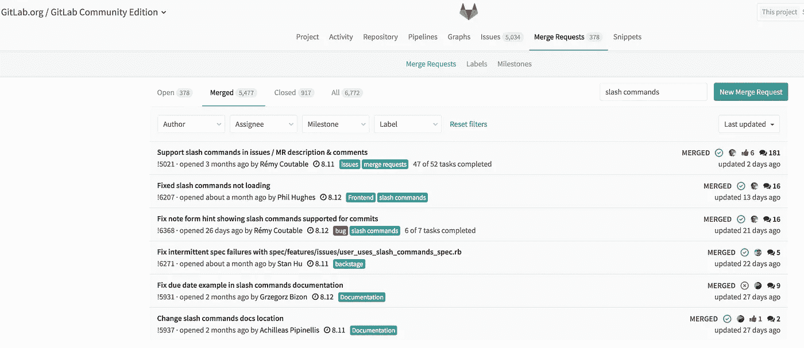
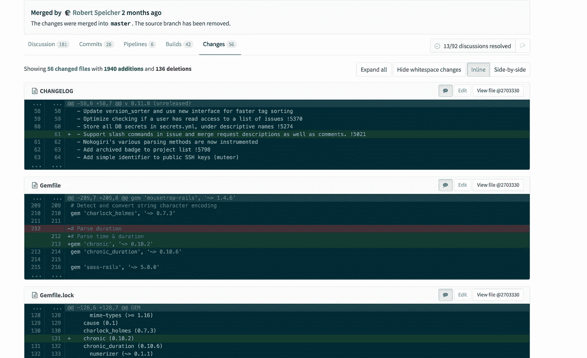
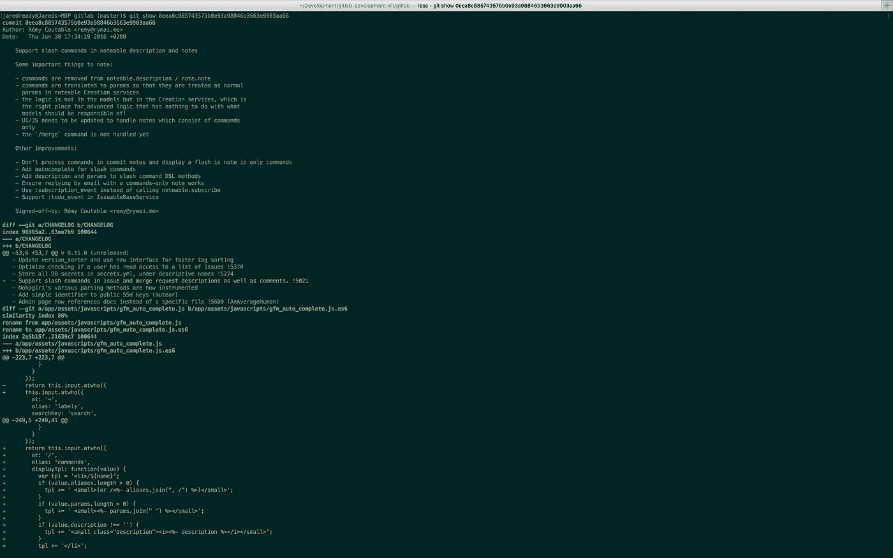

# 使用拉请求和 Git 日志学习项目

> 原文：<https://medium.com/hackernoon/using-pull-merge-requests-and-git-log-to-learn-a-project-5b24a355d39d>

投入一个新项目是很难的。人们可能已经在代码库上工作了很多年了！在你开始变得高效之前，需要收集大量的技术知识。可能有数千个文件，可能不止一个项目驱动着应用程序。你从哪里开始？


Photo Credit: Rajesh Sundaram

出于某种原因，人们认为浏览源代码仍然是了解项目如何工作的正常方式。我在这里说不，那不理想，有更好的方法。

# 拉取请求

如果您使用 GitHub、GitLab、BitBucket 等 Git 托管解决方案，这是最容易开始的地方。项目包含了每个变更是如何产生的历史，以及以拉或合并请求的形式围绕每个变更的讨论。

比如 [GitLab](https://gitlab.com/gitlab-org/gitlab-ce) 最近在他们的发布系统中增加了一些斜杠命令(想想你 Slack 中的斜杠命令)。我很好奇他们是如何实现的。所以我们去浏览他们合并的合并请求。



GitLab Issue Board

正如你所看到的，我所做的只是在他们的合并请求中搜索*斜杠命令*，并将搜索限制在*合并的*。

顶部的合并请求看起来很有希望。这是最古老的，它的标题似乎表明这是该功能出现的地方。让我们检查该请求，并向下滚动以查看更改。



GitLab Merge Request

合并请求将告诉您为了实现这个特性，究竟做了哪些更改，添加了哪些内容。这个请求包含了很多变化，所以我们不会再讨论它，这也不是本文的重点。

在短短的几分钟内，我们就能够发现什么时候添加了一个特性，谁添加了这个特性，以及实现这个特性需要做哪些更改。这比浏览源文件寻找一些看起来可能相关的东西要好一点。如果您想进入并增强该功能，它还会为您提供所需的每一点信息。

# Git 日志

因此，我们已经通过拉或合并请求进行了基本的搜索，以找出一个特性是如何实现的。我们如何使用`git log`进行同样的搜索呢？`git log`有一个`--grep`标志，可以用来搜索提交消息。

```
jaredready@Jareds-MBP gitlab (master)$ git log — grep=”slash command” — reverse
commit 0eea8c885743575b0e93a98846b3663e9903aa66
Author: Rémy Coutable <[remy@rymai.me](mailto:remy@rymai.me)>
Date: Thu Jun 30 17:34:19 2016 +0200Support slash commands in noteable description and notes

 Some important things to note:

 — commands are removed from noteable.description / note.note
 — commands are translated to params so that they are treated as normal
 params in noteable Creation services
 — the logic is not in the models but in the Creation services, which is
 the right place for advanced logic that has nothing to do with what
 models should be responsible of!
 — UI/JS needs to be updated to handle notes which consist of commands
 only
 — the `/merge` command is not handled yet

 Other improvements:

 — Don’t process commands in commit notes and display a flash is note is only commands
 — Add autocomplete for slash commands
 — Add description and params to slash command DSL methods
 — Ensure replying by email with a commands-only note works
 — Use :subscription_event instead of calling noteable.subscribe
 — Support :todo_event in IssuableBaseService

 Signed-off-by: Rémy Coutable <[remy@rymai.me](mailto:remy@rymai.me)>
```

如果您回头看一下拉请求，您会看到这个提交实际上是那个拉请求的第一个提交。来自`git log — grep=”slash command” — reverse`命令的日志的其余部分包含这些提交的大部分。

为了查看这次提交的更改，以便您可以看到斜杠命令是如何实现的，我们可以使用`git show <sha>`命令。



# 结论

我敦促你不要盲目地通过代码库来弄清楚一个项目是如何工作的。使用拉式请求作为一个易于阅读的项目历史和讨论。当您无权访问拉取请求时，请使用`git log`。希望这能让你更容易投入新项目。