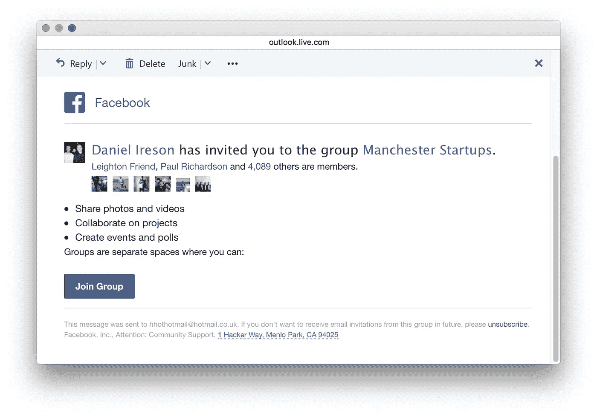

# 使用 Python 自动化脸书群邀请

> 原文：<https://medium.com/hackernoon/using-python-to-automate-facebook-group-invites-664b4c509acf>


Using graphics from [SAP Scenes Pack](https://experience.sap.com/designservices/approach/scenes)

在学年开始的时候，我在大学的一个学生社团工作时遇到了一个问题——你如何批量邀请人们加入一个 T2 脸书的团体？事实证明，使用一点 Python 就很容易了。源代码见 [Github 库](https://github.com/danielireson/facebook-bulk-group-inviter)，继续阅读预演。

[](https://github.com/danielireson/facebook-bulk-group-inviter) [## danielireson/Facebook-批量-群组-邀请人

### Facebook-bulk-group-inviter-Python CLI 通过电子邮件向脸书群组批量导入成员

github.com](https://github.com/danielireson/facebook-bulk-group-inviter) 

# 为什么是 Python？

Python 是这类任务的最佳语言选择，因为它轻量级且易于编写。我个人很喜欢它的阅读效果。考虑下面这段代码，即使您不知道 Python 语法，也能理解其中的逻辑。它读起来像英语。

```
secret **=** ''
**while** secret **!=** 'medium':
    secret **=** input('What's the secret?')
    **if** secret **==** 'medium':
        print('Correct')
    **else**:
        print('Incorrect')
```

但是 Python 实际上只是一个合适的选择——这个脚本可以很容易地用许多其他语言编写。Selenium(我们将使用它来自动化浏览器)也有适用于 C#、Java、JavaScript 和 Ruby 的客户端 API。也可以使用其他不含硒的溶液。

# 任务

查看您所属的脸书群组，在右侧，您会看到一个添加成员部分。您可以在这里输入电子邮件地址，它会邀请该人加入该群。


Manchester Startups Facebook group

无论用户是否拥有脸书帐户，它都会这样做。尝试邀请自己加入该群，看看会发生什么。您应该很快会在收件箱中收到一封电子邮件。



这个过程分为五个步骤。

1.  登录脸书。
2.  导航至脸书组页面。
3.  输入要邀请的用户的电子邮件地址。
4.  提交输入。
5.  对电子邮件地址列表重复步骤 3 和 4。

# 创建 CLI

该脚本必须能够登录为一个用户谁有权访问脸书集团，因此，它需要访问个人登录信息。因此，将它设计成 CLI 是个好主意。Python 的好处之一就是它庞大的标准库。有一个名为 *argparse* 的模块可以用来解析 CLI 参数，还有一个名为 *getpass* 的模块可以用来提示用户输入密码。用下面的代码创建一个新的文件 *main.py* (如果你还没有安装 Python[和](https://www.python.org/)的话，请预先安装它)。

```
# main.pyimport argparse
import getpassdef main():
  parser = argparse.ArgumentParser(description='This tool lets you invite people in bulk to your Facebook group')
  parser.add_argument('-e','--email', help='Your personal Facebook account email', required=True)
  parser.add_argument('-g','--group', help='The Facebook group name', required=True)
  args = vars(parser.parse_args())
  args['password'] = getpass.getpass()if __name__ == '__main__':
  main()
```

打开您的终端，导航到您保存文件的目录并输入`python main.py`。您应该会收到一个错误，要求您传递两个必需的参数—电子邮件和组名。这些是通过标志传递的。然后应该会提示您输入密码。

```
python main.py -e johndoe@example.com -g groupname
```

# 从 CSV 加载电子邮件

CSV 是一种受到广泛支持的文件格式，它存储一系列逗号分隔的值。我将我的电子邮件地址存储在一个 CSV 文件中，结构如下。

```
john@example.com,
jane@example.com
```

使用 Python，我们可以很容易地编写一些代码来解析这个文件。让我们创建一个 *EmailLoader* 类。

```
# email_loader.pyimport csv
import os
import sysclass EmailLoader:
  filename = 'emails.csv'
  emails = [] def __init__(self):
    dir_path = os.path.dirname(os.path.realpath(__file__))
    file_path = dir_path + '/' + self.filename
    if not os.path.isfile(file_path):
      sys.exit('File does not exist: ' + self.filename) with open(file_path, 'rb') as file:
      csv_reader = csv.reader(file)
      for email in csv_reader:
        self.emails.append(email[0]) if len(self.emails) < 1:
      sys.exit('There are no emails in your supplied file')
    else:
      print('Loaded ' + str(len(self.emails)))
```

它假设 CSV 的文件名为 *emails.csv* ，并且位于同一个目录中。它将电子邮件地址加载到 *emails* 数组属性中。

```
from email_loader import EmailLoaderemail_loader = EmailLoader()
print(email_loader.emails)
```

# 设置硒

为了控制网络浏览器，我们将使用 [Selenium](http://www.seleniumhq.org/) ，一个强大的开源浏览器自动化[工具](https://hackernoon.com/tagged/tool)，主要用于测试。您可以使用 Python 的包管理器 pip 通过在终端输入`pip install selenium`来安装它。Selenium 需要供应商驱动程序才能工作。我们将使用 [PhantomJS](http://phantomjs.org/) 驱动程序，它允许我们控制一个 PhantomJS 无头浏览器。无头浏览器是没有可视用户界面的浏览器。从他们的[下载页面](http://phantomjs.org/download.html)下载适用于您的操作系统的正确的 PhantomJS 驱动程序，并将其复制到您的工作目录中(您需要从 zip 下载的 *bin* 文件夹中提取驱动程序)。继续使用面向对象模式，让我们创建一个 *Browser* 类来封装 Selenium 的工作。

```
# browser.pyimport osfrom selenium import webdriverclass Browser:
  def __init__(self):
    dir_path = os.path.dirname(os.path.realpath(__file__))
    driver_path = dir_path + '/phantomjs-driver'
    self.browser = webdriver.PhantomJS(executable_path=driver_path)
```

这个类在实例化时使用 PhantomJS 驱动程序设置 Selenium。它假设驱动程序在工作目录中，文件名为 *phantomjs-driver* 。

# 航行

让我们给*浏览器*类添加一个导航方法。

```
# browser.pyimport osfrom selenium import webdriver
from selenium.common.exceptions import TimeoutException
from selenium.webdriver.common.by import By
from selenium.webdriver.support import expected_conditions
from selenium.webdriver.support.ui import WebDriverWaitclass Browser:
  def __init__(self):
    dir_path = os.path.dirname(os.path.realpath(__file__))
    driver_path = dir_path + '/phantomjs-driver'
    self.browser = webdriver.PhantomJS(executable_path=driver_path) def navigate(self, url, wait_for, error):
    try:
      print('Navigating to: ' + url)
      self.browser.get(url)
      element_present = expected_conditions.presence_of_element_located((By.ID, wait_for))
      WebDriverWait(self.browser, self.delay).until(element_present)
    except TimeoutException:
      sys.exit(error)
```

要导航到的页面应该作为第一个参数提供。第二个参数是可以在导航页面上找到的 div ID，用于确保它已经成功加载。最后一个参数是导航失败时显示的错误消息。只有在 try/catch 块失败时才会显示，在这种情况下，它将退出 CLI 并打印错误消息。使用这种方法，导航到脸书主页变得很简单。

```
from browser import Browserbrowser = Browser()
browser.navigate(
  url='[https://www.facebook.com'](https://www.facebook.com'),
  wait_for='facebook',
  error='Unable to load the Facebook website'
)
```

# 登录到脸书

我们的脚本需要能够自动登录。这是在脸书主页上通过页面右上角的输入字段完成的。很简单，电子邮件字段的 ID 是 *email* ，密码字段的 ID 是 *pass。*我们可以使用这些 id 来查找输入。让我们在我们的*浏览器*类上创建一个方法来自动化登录。

```
def enter_login_details(self, email, password):
  try:
    print('Entering login details')
    email_field = self.browser.find_element_by_id('email')
    pass_field = self.browser.find_element_by_id('pass')
    email_field.send_keys(email)
    pass_field.send_keys(password)
    pass_field.submit()
    element_present = expected_conditions.presence_of_element_located((By.ID, 'userNavigationLabel'))
    WebDriverWait(self.browser, self.delay).until(element_present)
  except TimeoutException:
    sys.exit('Login with your credentials unsuccessful')
```

该方法通过 ID 查找找到每个字段，并输入作为参数传递的适当值。

```
browser.enter_login_details(args['email'], args['password'])
```

# 导航到组页面

登录后，我们需要导航到脸书组页面。这可以通过前面的导航方法来完成。

```
browser.navigate(
  url='[https://www.facebook.com/groups/'](https://www.facebook.com/groups/') + args['group'],
  wait_for='pagelet_group_',
  error='Couldn\'t navigate to the group\'s members page'
)
```

# 自动化导入

现在，在群组页面上，我们需要遍历导入的电子邮件地址，一次一个地将它们输入到侧边栏的*添加成员*输入框中。为此，我们将在*浏览器*上添加一个新的 *import_members* 方法。

```
# browser.pyimport os
import random
import sys
import time
import unicodedatafrom selenium import webdriver
from selenium.common.exceptions import TimeoutException
from selenium.webdriver.common.by import By
from selenium.webdriver.common.keys import Keys
from selenium.webdriver.support import expected_conditions
from selenium.webdriver.support.ui import WebDriverWaitclass Browser:
  delay = 3 def __init__(self):
    dir_path = os.path.dirname(os.path.realpath(__file__))
    driver_path = dir_path + '/phantomjs-driver'
    self.browser = webdriver.PhantomJS(executable_path=driver_path) def navigate(self, url, wait_for, error):
    try:
      print('Navigating to: ' + url)
      self.browser.get(url)
      element_present = expected_conditions.presence_of_element_located((By.ID, wait_for))
      WebDriverWait(self.browser, self.delay).until(element_present)
    except TimeoutException:
      sys.exit(error) def enter_login_details(self, email, password):
    try:
      print('Entering login details')
      email_field = self.browser.find_element_by_id('email')
      pass_field = self.browser.find_element_by_id('pass')
      email_field.send_keys(email)
      pass_field.send_keys(password)
      pass_field.submit()
      element_present = expected_conditions.presence_of_element_located((By.ID, 'userNavigationLabel'))
      WebDriverWait(self.browser, self.delay).until(element_present)
    except TimeoutException:
      sys.exit('Login with your credentials unsuccessful') def import_members(self, emails):
    print('Attempting to import email addresses')
    xpath = "//input[[@placeholder](http://twitter.com/placeholder)='Enter name or email address...']"
    add_members_field = self.browser.find_element_by_xpath(xpath)
    for email in emails:
      for c in email:
        add_members_field.send_keys(self._get_base_character(c))
      add_members_field.send_keys(Keys.RETURN)
      time.sleep(random.randint(1,self.delay)) @staticmethod
  def _get_base_character(c):
    desc = unicodedata.name(unicode(c))
    cutoff = desc.find(' WITH ')
    if cutoff != -1:
        desc = desc[:cutoff]
    return unicodedata.lookup(desc)
```

这使用了 [XPath](https://en.wikipedia.org/wiki/XPath) ，它是一种用于处理 HTML 文档的查询语言。我们通过查找占位符来搜索*添加成员*输入。然后，我们遍历要邀请的电子邮件地址数组，逐个字符地输入每个电子邮件地址。这可以防止浏览器锁定输入。每次提交电子邮件地址后，脚本会等待至少一秒钟，然后继续。将 *import_members()* 的用法添加到 *main.py* 中，我们的自动化脚本就完成了。

```
# main.pyimport argparse
import getpassfrom browser import Browser
from email_loader import EmailLoaderdef main():
  parser = argparse.ArgumentParser(description='This tool lets you invite people in bulk to your Facebook group')
  parser.add_argument('-e','--email', help='Your personal Facebook account email', required=True)
  parser.add_argument('-g','--group', help='The Facebook group name', required=True)
  args = vars(parser.parse_args())
  args['password'] = getpass.getpass() email_loader = EmailLoader()
  browser = Browser()
  browser.navigate(
    url='[https://www.facebook.com'](https://www.facebook.com'),
    wait_for='facebook',
    error='Unable to load the Facebook website'
  )
  browser.enter_login_details(args['email'], args['password'])
  browser.navigate(
    url='[https://www.facebook.com/groups/'](https://www.facebook.com/groups/') + args['group'],
    wait_for='pagelet_group_',
    error='Couldn\'t navigate to the group\'s members page'
  )
  browser.import_members(email_loader.emails)
  print('Import complete')if __name__ == '__main__':
  main()
```

# 总结

Python 和 Selenium 使简单的 web 任务自动化变得轻松。今天，我们只经历了一个用例，但可能性几乎是无限的。自动化快乐！源代码请查看 Github 上的[库。](https://github.com/danielireson/facebook-bulk-group-inviter)

[](https://github.com/danielireson/facebook-bulk-group-inviter) [## danielireson/Facebook-批量-群组-邀请人

### Facebook-bulk-group-inviter-Python CLI 通过电子邮件向脸书群组批量导入成员

github.com](https://github.com/danielireson/facebook-bulk-group-inviter) [](http://bit.ly/HackernoonFB)[](https://goo.gl/k7XYbx)[](https://goo.gl/4ofytp)

> [黑客中午](http://bit.ly/Hackernoon)是黑客如何开始他们的下午。我们是这个家庭的一员。我们现在[接受投稿](http://bit.ly/hackernoonsubmission)并乐意[讨论广告&赞助](mailto:partners@amipublications.com)机会。
> 
> 如果你喜欢这个故事，我们推荐你阅读我们的[最新科技故事](http://bit.ly/hackernoonlatestt)和[趋势科技故事](https://hackernoon.com/trending)。直到下一次，不要把世界的现实想当然！

