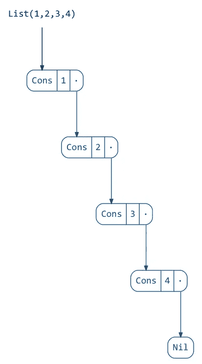
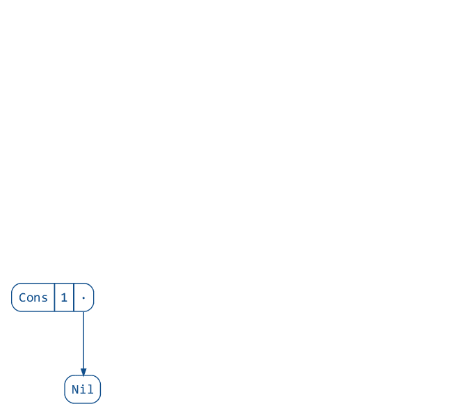
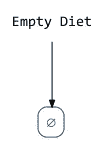
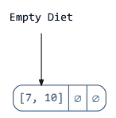

# 使用 RefTree 可视化数据结构

> 原文：<https://medium.com/hackernoon/using-reftree-for-visualizing-data-structures-a1f256c8e497>

我开始为 Scala 社区做贡献已经有一年了，尤其是对 [Typelevel](http://typelevel.org/) / [Dogs](https://github.com/stew/dogs) 的贡献。我参与了项目的不同部分，包括测试和基准测试，但我最自豪的是以纯函数的方式实现了*离散区间编码树*。我们称之为*节食*。

*Diet* 非常有趣，因为它存储了类型 **A** 的范围，并且可以以非常智能的方式对这些范围进行操作。这种特殊数据结构的一个问题是，即使它并不复杂，人们也很难理解它。我们用 [Dogs](https://github.com/stew/dogs) 做了一些记录库的工作，然而 *Diet* (以及其他)有时很难解释。

# 雷夫特里来了

RefTree 是我最近遇到的一个可视化数据结构的项目，它现在帮助我们写一个更清晰的文档。

使用 RefTree，我们可以用一种非常简单的方式来可视化数据结构。让我们稍微探索一下这个项目。

如果你看演示和例子，你会发现像这样的可视化。

首先，让我们在 sbt 文件中添加一些库。

请注意，我们也包括狗。

让我们做一些导入并创建一个**图**的实例，这是创建可视化所需要的。

我们用来创建图**的选项**是自描述的。

让我们建立一个空的*饮食*然后可视化它。

在这里，我们定义了一种将**饮食【A】**转换为**参照树**的方法，并用它来渲染*清空*。这将创建以下图像。

让我们给空空的饮食加值，再渲染一遍。

我们现在可以创建一个单节点的饮食，并删除一个子范围。

这将返回给我们代表*上的变换的动画*

**

*下面是一个更有趣的例子。*

*请注意，我们使用了 *Utils.iterate* ，这是 RefTree 中的一个函数，可以轻松地构建数据结构。结果将是下面的动画。*

**

*个人认为这个库(RefTree)有很多潜力和用例。我们已经在给 [Dogs](https://github.com/stew/dogs) 文档添加动画，使我们构建的数据结构更容易理解和使用。*

*尽管 RefTree API 还很年轻，但它工作得很好，它的维护者在我们构建演示时帮了很大的忙。*

*谢谢你， [@nickstanch](https://twitter.com/nickstanch) 的这个精彩的 lib。*

******

> *[黑客中午](http://bit.ly/Hackernoon)是黑客如何开始他们的下午。我们是 [@AMI](http://bit.ly/atAMIatAMI) 家庭的一员。我们现在[接受投稿](http://bit.ly/hackernoonsubmission)并乐意[讨论广告&赞助](mailto:partners@amipublications.com)机会。*
> 
> *如果你喜欢这个故事，我们推荐你阅读我们的[最新科技故事](http://bit.ly/hackernoonlatestt)和[趋势科技故事](https://hackernoon.com/trending)。直到下一次，不要把世界的现实想当然！*

**