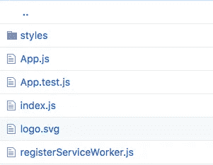

# 使用 Sass 创建 React 应用程序 V1(不弹出)

> 原文：<https://medium.com/hackernoon/using-sass-with-create-react-app-without-ejecting-b5f4f827ed9e>

## 最初发布于 2017 年 9 月 6 日，最后更新于 2018 年 2 月 10 日

## 最终更新:

Create [React](https://hackernoon.com/tagged/react) App 2.0 已经正式发布。它包括开箱即用的 [Sass](https://hackernoon.com/tagged/sass) 和 CSS 模块。查看这里:
[https://react js . org/blog/2018/10/01/create-react-app-v2 . html](https://reactjs.org/blog/2018/10/01/create-react-app-v2.html)

## 介绍

如果你使用 React 已经有一段时间了，你可能很清楚 [Create React App](https://github.com/facebookincubator/create-react-app) 项目。如果您不熟悉，Create React App (CRA)提供了一个方便的 CLI 来创建一个样板 React 应用程序。通过输入`create-react-app my-app`，你可以在几分钟内运行一个引导程序。有一件事你很难做到，那就是改变 CRA 的配置。这是有意的。基本上，团队已经决定了他们喜欢的配置，并将其捆绑在一起。在运行`yarn run eject`弹出配置之前，底层的配置文件是不会暴露的。有些人喜欢这个，有些人不喜欢。自然，在网络上，各有各的看法。就我个人而言，我真的很喜欢能够快速启动一个应用程序，而不是每次都花大量时间以相同的方式设置 Webpack，或者定制文件夹结构等。

包括我自己在内的一些人似乎在努力解决的一个问题是，CRA 没有附带任何 CSS 工具。这也是设计出来的。我的假设是，CRA 背后的团队不想厚此薄彼，也不想为每一个 CSS 工具(Sass、Less 等)构建。).所以是由用户来添加它们。

您可以运行`eject`脚本来访问 Webpack 配置，并添加 Sass 加载程序，但是一旦您`eject`了，就再也回不去了。这意味着您可能会在将来失去无痛升级到 CRA 的机会。

## 其他选择？

Sass 是一个预处理器，它把我们的`.scss`文件编译成`.css`。Sass 还允许你`--watch`修改一个文件夹，并动态编译你的风格到`.css`。这为我们在 CRA 中使用 Sass 提供了一个选项。我们将配置 Sass 来监视我们的`scss`文件夹，并导出我们将`import`在 CRA 中的`css`文件。本质上，CRA 永远不会知道我们在使用 Sass。

## 开始使用:

## **更新:**

我用运行 React 16 的 CRA 1.5.2 创建了一个更新的演示报告。这里可以找到 [**。**](https://github.com/Jeff-Duke/react16-sass-demo)

首先，我们需要安装 Sass，然后对默认文件结构进行一些调整。

Sass 是一块宝石，所以如果你还没有安装 Ruby，你需要安装它。Ruby 默认安装在 Mac 和(我相信)一些 Linux 发行版上。如果你运行的是 Windows，你可以使用 [Ruby 安装程序](https://rubyinstaller.org)。要安装 Sass，您可以从您的终端运行:`gem install sass`。

# 不想装 Ruby？

一些人指出，运行 Sass 并不需要安装 Ruby。你有像 [node-sass](https://github.com/sass/node-sass) 这样的选项， [CRA 自述](https://github.com/facebookincubator/create-react-app/blob/master/packages/react-scripts/template/README.md#adding-a-css-preprocessor-sass-less-etc)建议使用 [node-sass-chokidar](https://www.npmjs.com/package/node-sass-chokidar) 。我下面概述的方法是在 [Sass 文档](http://sass-lang.com/documentation/file.SASS_REFERENCE.html)中建议的。当我开始尝试在 CRA 中加入 Sass 时，自述文件中并没有记录，而且我最近也没有回去查看文档。

## **更新:**

我已经在[演示报告中添加了 **node-sass** 支持。](https://github.com/Jeff-Duke/react16-sass-demo)简单地检查或分叉**节点-sass** 分支。关于 node-sass 的更多信息可以在演示报告的自述文件中找到。

**文件结构变化:**

```
#new-folder: src/styles
#new-folder: src/styles/css
#new-folder: src/styles/scss
#rename/move index.css: src/styles/scss/index.scss
#rename & move App.css: src/styles/scss/App.scss
```

我们的`/src`文件夹现在应该是这样的:



接下来，我们将更新我们的`src/index.js`文件，从正确的位置导入`index.css`。我们需要将行`import './index.css'`改为`import './styles/css/index.css'`我们的`index.js`文件现在应该看起来像这样:

我们也可以从`App.js`文件中删除`import ‘./App.css'`行。我们的`App.js`文件现在应该看起来像这样:

**注意:**我们目前还没有*的*和`index.css`文件，我们稍后会讲到。

让我们更新一下`index.scss`文件。默认情况下，它有一小块`body`风格。我更喜欢把它移到`App.scss`文件中，但是如果你愿意，你可以创建一个`Body.scss`文件并把它移到那里。这些是 CRA 附带的默认样式，不管怎样，以后你可能会覆盖它们。我们的`index.scss`文件只需要导入我们的其他 Sass 部分。将`body`样式块移动到另一个文件后，如果您选择创建该文件，我们的`index.scss`文件应该只有`@import ‘App’`和`@import 'Body'`。

Our index.scss file

我们将使用 Sass `watch`模式来监视我们的 scss 文件夹，并让它为我们将样式表编译到 css 文件夹中。为此，我们将向`package.json`文件添加一个脚本。

```
*"sass"* : "sass --watch src/styles/scss:src/styles/css" 
```

这告诉 Sass 监视 scss 文件夹，并将输出编译到 css 文件夹。现在，我们只需在我们选择的终端中打开第二个标签，然后`yarn run sass`开始观看/编译我们的 scss 到 css。

这就是我们开始行动所需要的一切！要启动你的应用程序，你需要打开几个终端进程。在一个版本中，您将运行`yarn start`来启动 dev 服务器，在另一个版本中，您将运行`yarn run sass`来在观察模式下启动 Sass。

## 免责声明:

**2 终端流程？！**是的，我知道，这并不可怕，这种配置意味着当你开发的时候，你必须在终端上运行两个进程。您将需要开发服务器和`sass --watch`流程。我还没有找到解决这个问题的好方法。我见过自动打开独立进程的方法，但这都取决于您所处的终端环境。我没有发现任何普遍性的东西。

另一个不好的地方是:有时，你会忘记启动 Sass 程序。然后你会揪着头发，可能会说一些脏话，同时试图找出为什么你所做的更改没有在浏览器中得到反映。只要知道它会发生。

## 继续前进。

第一次运行新的 Sass 过程时，我们会在 css 文件夹中获得一堆新文件:

```
 src/styles/css/App.css
      src/styles/css/App.css.map
      src/styles/css/Body.css
      src/styles/css/Body.css.map
      src/styles/css/index.css
      src/styles/css/index.css.map
```

好消息是，我们永远不必查看 css 文件夹内部，因此我们不必关心有这么多文件被创建。另一个好消息是，Sass 足够智能，能够识别更改并根据需要构建新文件，因此即使您在运行`sass`脚本之前创建了一堆新文件和更改，一旦您这样做了，它会为您输出所有新的`css`文件。

我建议的最后一步是:将`.sass-cache`添加到您的`.gitignore`文件中。Sass 使用本地缓存文件来跟踪您的更改，您可能不希望这些文件出现在您的 repo 中。

就是这样！如果你运行`yarn start`，现在你应该有默认的 CRA 屏幕显示，看起来就像它应该的那样。如果您想再次检查您的 Sass 文件是否被正确编译，请确保运行`yarn run sass`，然后可能在主体中添加一个`background-color`。

## 关于为生产/部署而构建的说明:

因为我们使用 Sass 将 scss 文件转换成 css 文件，所以 CRA 完全不知道我们正在编写 scss。使用这些方法不会影响 CRA 应用程序的默认构建和部署过程。我不止一次地做过的一件事是，在运行新的构建之前忘记转换我的样式表。这很烦人。为了解决这个问题，我建议向您的`package.json`添加另一个脚本，它将一次性构建您的样式:
`*“sass:build”*: “sass — update src/styles/scss:src/styles/css”,`

我建议将`build`脚本更新为:
`*”build”*: “yarn sass:build && react-scripts build”,`

这让你少了一件需要考虑的事情。您的样式表将在构建过程开始之前自动转换。

## 最终想法:

只需要一点点额外的配置，我们就可以吃蛋糕了。我们可以使用 CRA 快速构建 React 应用程序，并享受使用 Sass 带来的样式优势。如果你觉得这有用，请告诉我。感谢阅读！

> [黑客中午](http://bit.ly/Hackernoon)是黑客如何开始他们的下午。我们是 AMI 家庭的一员。我们现在[接受投稿](http://bit.ly/hackernoonsubmission)并乐意[讨论广告&赞助](mailto:partners@amipublications.com)机会。
> 
> 要了解更多信息，[请阅读我们的“关于”页面](https://goo.gl/4ofytp) , [喜欢/在脸书给我们发消息](http://bit.ly/HackernoonFB)，或者简单地，[发推文/DM @HackerNoon。](https://goo.gl/k7XYbx)
> 
> 如果你喜欢这个故事，我们推荐你阅读我们的[最新科技故事](http://bit.ly/hackernoonlatestt)和[趋势科技故事](https://hackernoon.com/trending)。直到下一次，不要把世界的现实想当然！