# 利用稀缺性推动移动应用的参与度

> 原文：<https://medium.com/hackernoon/using-scarcity-to-drive-engagement-in-mobile-apps-fe715d33a7e>

在行为经济学中，稀缺性是一种众所周知的方法，它推动了对产品的参与和欲望，但也可能导致用户做出一些“非理性”的决定。它被广泛应用于商业世界，以推动销售，并在游戏中作为货币化的基本方法之一。稀缺性可以以不同的形式应用于时间、获取、资源等方面。随着稀缺性的引入，产品可能变得更有吸引力，其感知价值增加，从而产生某种压力，促使用户在害怕错过机会的情况下采取行动。如果处理得当，稀缺也可以产生痴迷和渴望的感觉，从而导致参与[移动](https://hackernoon.com/tagged/mobile)应用。

# 数量有限——在独一无二和独一无二中茁壮成长！

制造一种错觉，认为某种产品的数量有限，只有少数人能够幸运地买到，这增加了人们的需求和购买欲望。这一原则不仅适用于物质的东西，在游戏世界中它可以用于游戏元素和某些 app 特权或权力，以在游戏中使用。让某样东西看起来很稀有会增加人们对它的感知价值和拥有它的欲望。只要看看收藏家为获得一件产品的特别版所做的努力，一个乐队的粉丝为了得到限量的音乐会门票可以走多远，等等。

## 只有少数存在于那里！

[口袋妖怪 Go](http://www.pokemongo.com/) 广泛使用这种方法，[引入了几个罕见的口袋妖怪](http://www.eurogamer.net/articles/2017-03-10-pokemon-go-rare-pokemon-list-chart)供玩家捕捉。有些口袋妖怪真的很难找到，而且有一定的超能力，让用户急于追捕和抓住它们。这些口袋妖怪中的一些只出现在特定的区域，它们很难被发现和捕捉。甚至有一些口袋妖怪非常罕见，以至于没有任何人在游戏中见过它们的记录，这引发了谣言并围绕它们进行了大肆宣传。不用说，这些是最受欢迎的口袋妖怪，人们努力提高水平，努力找到它们并抓住它们。

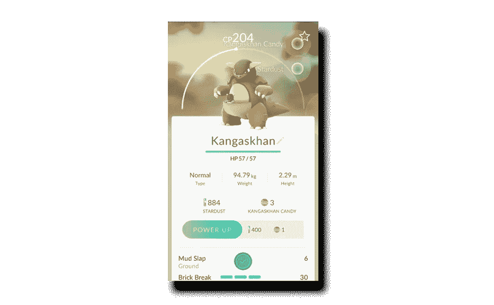

## 限量版

服装和配饰零售商应用程序 Vineyar Vines 实际上是在营造一种稀缺状态，以刺激应用内销售。例如，在社交媒体的[活动中，Vineyard Vines 广告称，任何应用内购买都可以获得由品牌联合创始人签名的限量版金鲸贴纸。随着社交媒体中及时促销的使用，随着应用程序用户兴奋度的增加，应用程序内的销售额也增加了。在最初的活动取得成功后，该品牌经营了几个类似的活动，提供不同的限量版鲸鱼贴纸。](http://www.retaildive.com/ex/mobilecommercedaily/vineyard-vines-splashes-up-in-app-sales-with-limited-edition-giveaway-items)

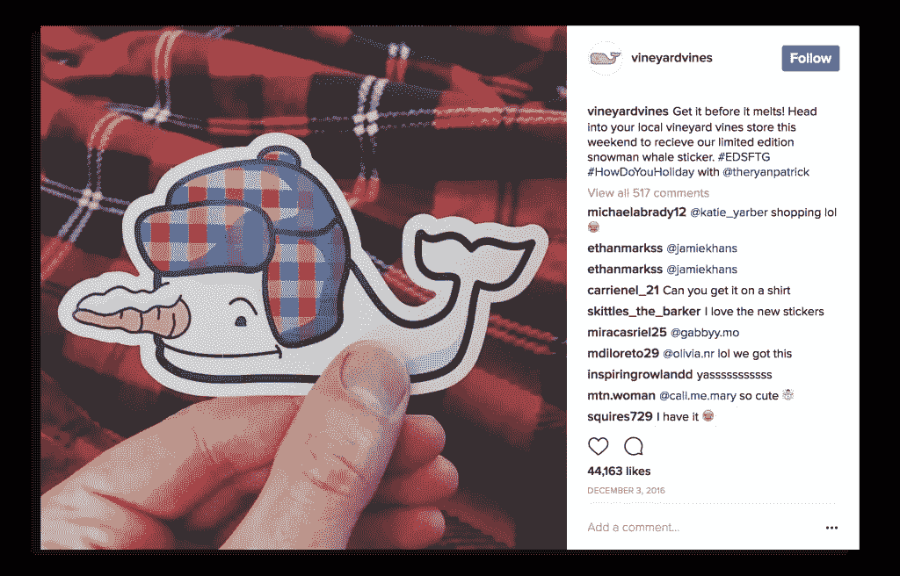

## 你不能拥有它！

特别是口袋妖怪 Go，利用稀缺效应来操纵用户的欲望，并有意无意地促进游戏玩家的预期。它精心策划的对特定国家的发行利用了人们想第一个尝试的需求。随着对游戏的大肆宣传，越来越多的人，尤其是在游戏尚未发行的国家，试图找到访问它的方法，甚至使用黑帽技术来实现他们的目标。当其他人可以下载应用程序时却不能下载，这足以引发一场我们最近在游戏世界中从未见过的炒作。甚至一些服务器问题，游戏开发者在正式发布后，由于出乎意料的高用户量，发挥了他们的优势。这些问题有助于进一步增加对产品的需求，而不是赶走用户。如果这些人都是为了玩这个游戏，那么这个游戏一定值得一玩！

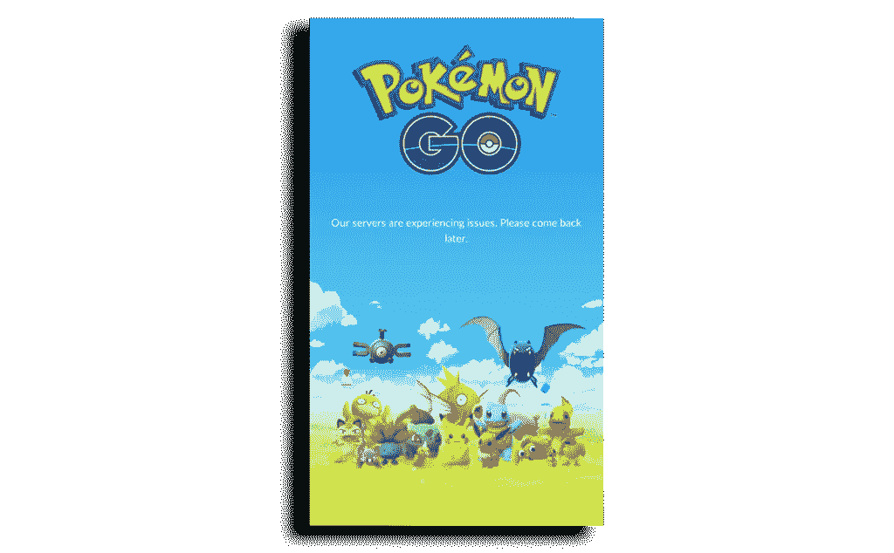

## 这种力量只属于少数想要得到它的人

[StackOverflow](http://stackoverflow.com/help/privileges?tab=all) 提供了一个特权方案，根据用户在平台上的进展，用户可以访问越来越多的特权。由于只有少数人能够达到/获得特定的特权，如适度权力，升级是一个挑战，所有人都期望在平台上获得更多特权，推动日常参与和参与。

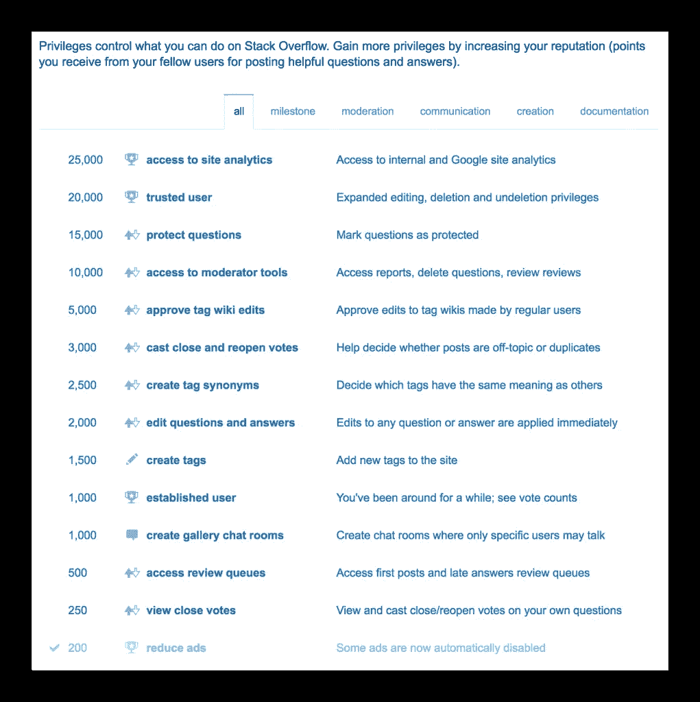

# 时间不多了，现在是你的机会！

将稀缺效应与时间因素结合起来可能是一个非常聪明的方法。它可以驱使人们做出他们通常不会做出的决定，因为他们面临着时间耗尽和失去一笔好交易的威胁。在零售世界的销售期间，对时间敏感的优惠非常普遍。相反的方法可以用来。“沉默的时刻”被广泛用于使玩家的不耐烦达到顶峰。当玩家的不愿意等待战胜了他的控制，他就对游戏提供的任何跳过时间障碍的“机会”成熟了。一个完美的点，在游戏中添加一个货币化功能。

## 先到先得，直到用完为止！

交通网络公司优步积极使用有限报价方法，尤其是在进入新市场和推出 UberEats 之前。在一个具体的例子中，寿司套餐在特定日期和特定时间范围内以先到先得的方式免费提供和配送，直到售完为止。这一提议导致了大量的新安装，通过口头传播在该地区。然而，这还不是全部。所有这些新用户(以及老用户)都在有限的优惠时间内广泛使用该应用程序，试图获得免费餐。

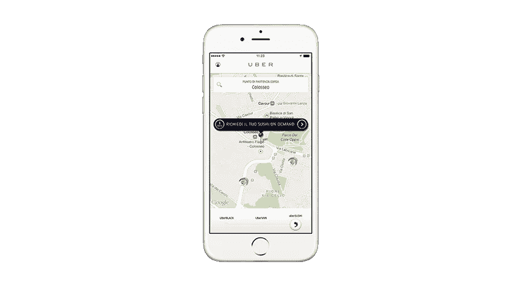

## 限时优惠

我们在[鳕鱼](https://www.pollfish.com/)也经历了类似的事情。在 Pollfish，我们在网站上提供了一个 DIY 调查工具，任何人都可以访问该工具来创建调查，选择目标人群，支付费用，然后开始实时接收结果。每份完成的调查起价 1 美元。然而，当我们最初推出我们的产品时，尽管我们的价格非常有竞争力，但转化率并不完全符合我们的预期。用户注册了，但在很短的时间内从来没有付款。然后，我们决定推出一个时间敏感的折扣，只适用于平台上的新人。结果真的很有趣；越来越多的用户注册来利用这一优惠，甚至更多的用户在规定的时间内完成付款，以便在优惠到期前利用它！

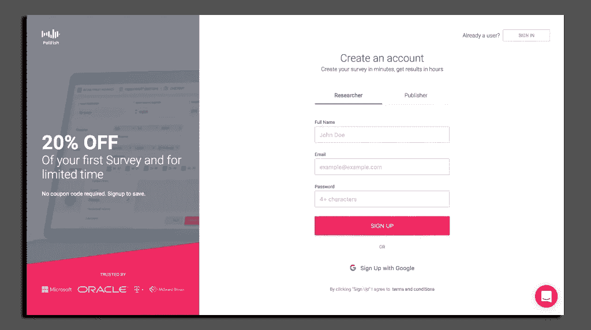

在 Pollfish，我们还与数以千计的移动应用程序和网站合作，在那里我们提供我们的调查。由于 Pollfish 提供了最高薪的解决方案之一，加上最佳的用户体验，它很快就变得流行起来，特别是在奖励解决方案中，用户完成一个动作可以获得某种虚拟奖励。在这一点上，我们决定引入一个稀缺机制，限制用户在成功完成调查后的 6 个小时内访问调查。这导致用户要求应用程序所有者提供更多的 Pollfish 调查，使它们成为游戏或应用程序的必备部分。

## 沉默和支持者的时刻

Lale mou ，一个匿名的希腊约会聊天应用，用户可以和其他人聊天，也使用了稀缺机制。用户必须排队等候才能与其他用户聊天。如果有人想插队，他们可以花一些虚拟硬币。由于对面的用户可能并不总是大量可用，所以为了能够与某人聊天而等待的队伍可能会变得相当长。能够排在队伍的前面是很有价值的。如上所述的“沉默时刻”赋予了应用程序真正的价值。

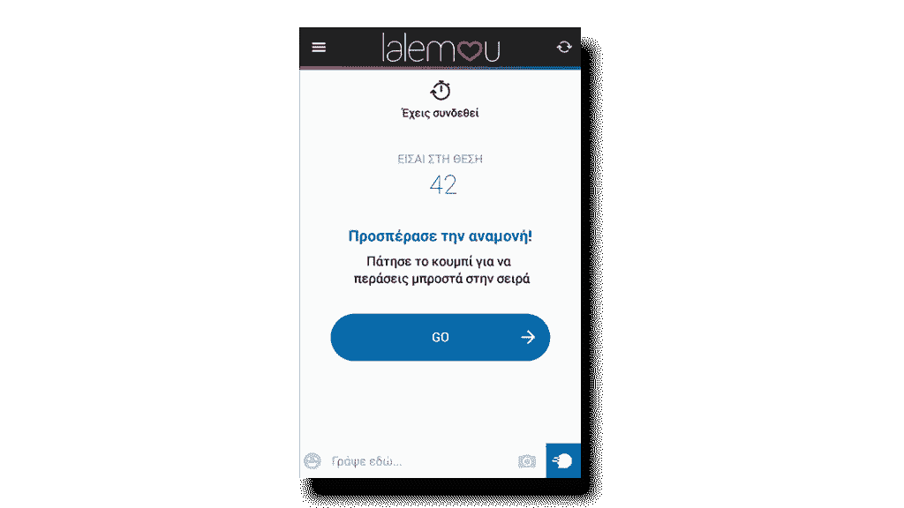

[Tinder](https://www.gotinder.com/) 和其他约会应用也广泛利用稀缺性来赚钱，但也推动了日常参与和使用。如果双方向右滑动，Tinder 允许您进行匹配。然而，用户的右刷次数是有限的，这使得每次右刷更有价值。让事情变得更加困难的是，每个用户要么等待 12 个小时才能恢复刷卡，要么在应用内购买以获得更多喜欢。在这 12 个小时内，用户变得痴迷于该应用程序，认为它一直在检查，一次又一次，当补充时间接近时。这种技术不仅推动了痴迷，并使用户每天都回来使用可用的新刷卡，而且像在 Lale mou 应用程序中一样，Tinder 为用户提供了一个选项，以获得更多的可见性(站在队伍前面),和/或跳过这些“沉默的时刻”,如果他们支付了一些东西，就不必等待，重新填充他们的帐户。另一个巨大的赚钱机会。

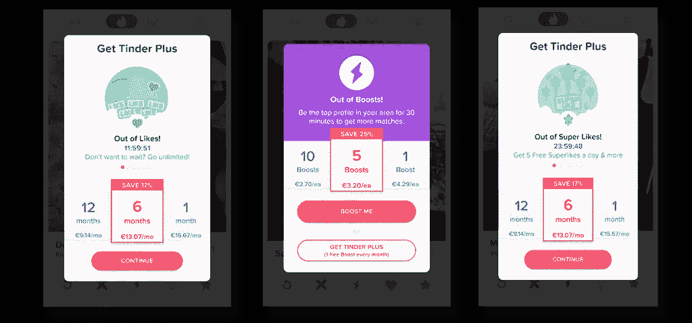

## 今天的交易

[亚马逊应用](https://www.amazon.com/)的今日交易部分遵循同样的概念。用户会发现有独家每日交易可以利用。亚马逊甚至增加了倒计时，以确保提醒所有用户优惠活动的剩余时间。这不仅会触发交易区的用户进行购买，还会每天吸引新的访问者，这些用户希望看到今天的交易是什么。

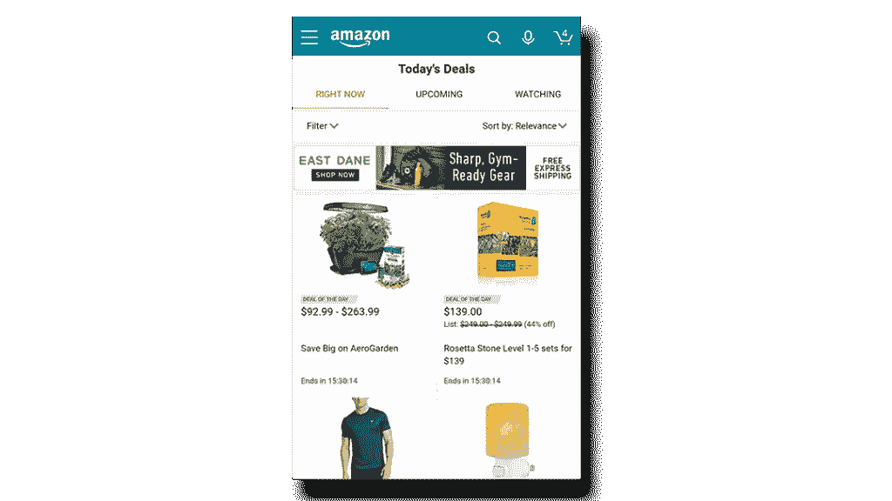

之前亚马逊应用商店推出了亚马逊地下商店，它使用了与今天的免费应用类似的方法。在这一部分，用户可以找到一个免费的付费应用程序，只在特定的一天。这种推广帮助亚马逊吸引了人们的注意力，并使他们每天都来到亚马逊应用商店，通过这种方式获得了应用商店的很大一部分市场份额。

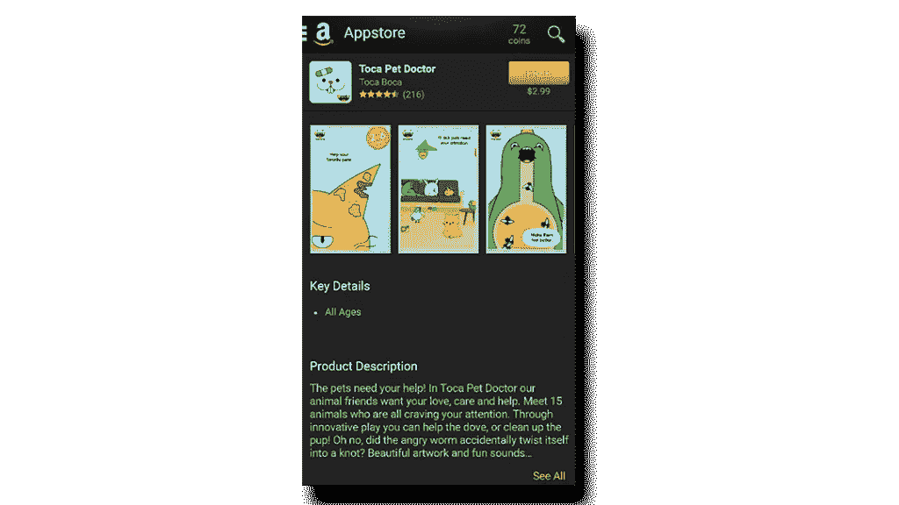

## 限时访问

Snapchat 的自毁式消息应用设计基于并利用了限制内容访问的概念。Snapchat 允许用户发送在几秒钟内“自毁”的图像或视频信息。这是它在千禧一代中成功和受欢迎的主要原因之一，后来也被其他大平台采用。

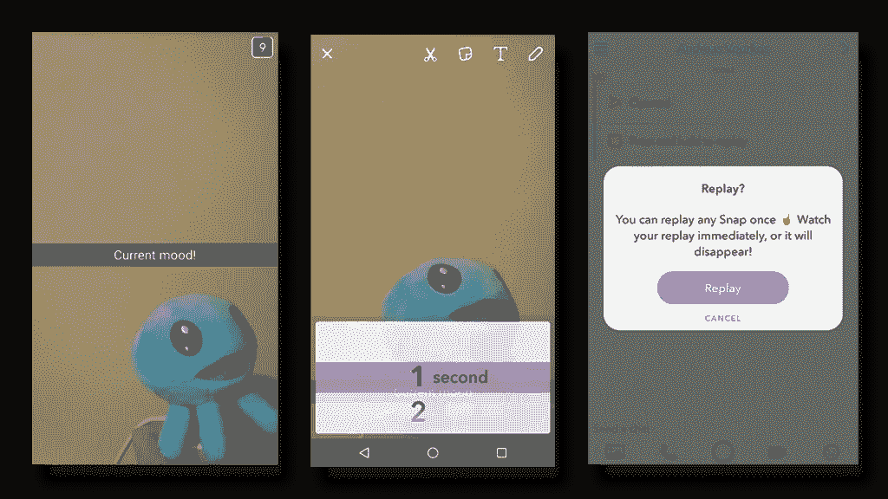

## 驱动决策

[愿望购物应用](https://www.amazon.com/)实际上是利用稀缺效应的一个很好的例子。该应用程序包括几个优惠和折扣，以及限时优惠。当用户在应用程序中导航时，他会看到几个即时可用的商品，他需要利用这些商品，否则它们就会过期(应用程序中到处都有计时器)。Wish app 增强了错过难得机会的感觉，让用户不断回来，并激励他们购买。这一切都归结于几个技巧的巧妙运用，如库存几乎用完，在有限的时间内额外折扣等等。

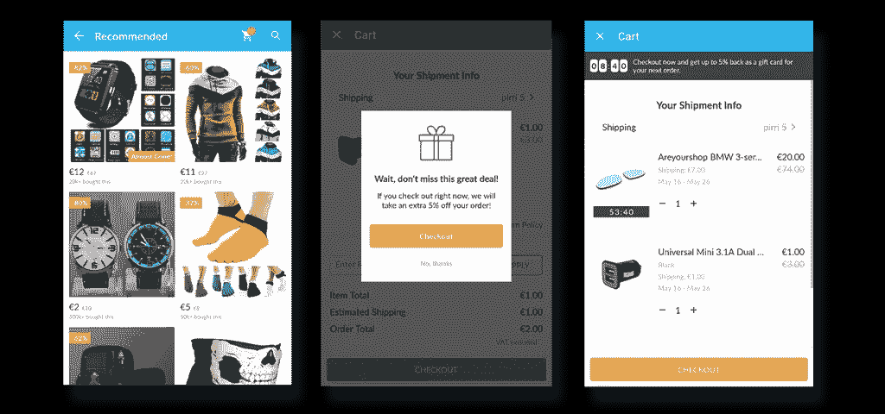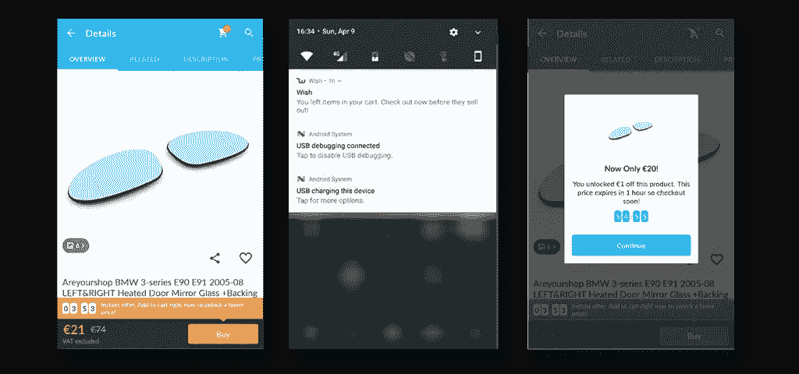

# 你检查的时候只剩下几个了

Booking.com 的[应用](https://www.booking.com/)通过显示空房信息来营造一种稀缺状态。即使在所有房间都被预订之前还有更新的剩余时间信息，显示剩余房间的实际数量也能更好地激励用户进行预订。人们预订房间不仅是因为他们担心房间不够用，还因为他们认为一个如此受欢迎的地方一定很好。不然那家酒店的房间怎么会被订得这么快？现在只剩下几个了，他们需要尽快预订。

# 有限制地使用它—限制对资源的访问

限制一个人的应用程序使用听起来可能是一件疯狂的事情，但它最终可能是一个非常成功的平台的基础。

## 功能限制

Twitter 是最大的社交网络平台之一，它建立在稀缺的概念之上。Twitter 将推文限制在 140 个字符以内。即使在它推出的早期，限制消息组成听起来也很荒谬。然而，事实证明这是该平台成功的主要原因之一。

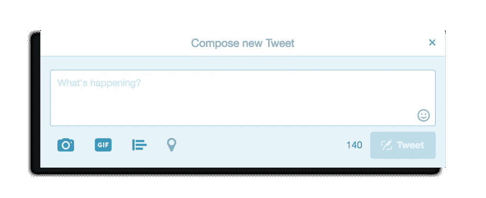

## 访问限制

[Slack](https://slack.com/) ，一个针对团队的实时消息和协作工具，利用稀缺性揭示赚钱机会，这在[工具](https://hackernoon.com/tagged/tools)、平台和游戏中非常常见。免费计划的用户只能在该工具上访问他们对话的最近历史(对于一个消息传递工具来说，这听起来很荒谬)。如果有人希望访问旧对话中交换的数据和信息，他们需要升级到付费方案。

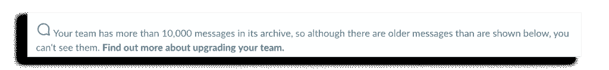

情感驱动着人们每天做出的决定，一个应用的成功可能取决于开发者理解和解释它们的能力。移动应用的稀缺基于经典的经济理论，即人们总是想要比他们现有的更多。再一次，一种基本的人类情感不仅被用来创造赚钱的机会，还驱使用户做出某些决定，并有一个特定的最终目标。稀缺可以采取许多不同的形式，比如可用的有限报价、罕见的集体作品、沉默时刻等等。一些最受欢迎的应用程序将稀缺对用户的影响作为其核心功能的一部分，并以此为基础取得了成功。

注:如果您喜欢本文并希望了解更多信息，请单击侧面的“推荐”图标。

> [黑客中午](http://bit.ly/Hackernoon)是黑客们开始他们下午的方式。我们是 [@AMI](http://bit.ly/atAMIatAMI) 家族的一员。我们现在[接受提交](http://bit.ly/hackernoonsubmission)并很高兴[讨论广告&赞助](mailto:partners@amipublications.com)机会。
> 
> 如果您喜欢这个故事，我们建议您阅读我们的[最新科技故事](http://bit.ly/hackernoonlatestt)和[趋势科技故事](https://hackernoon.com/trending)。直到下一次，不要把世界的现实视为理所当然！

