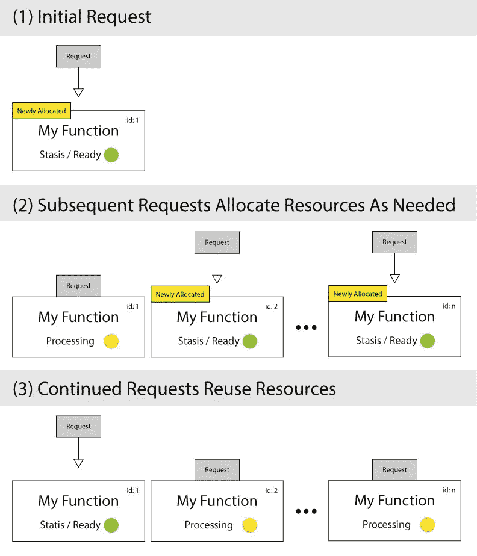
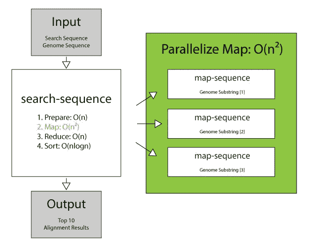
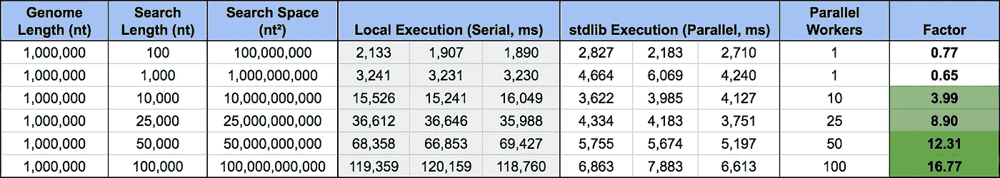
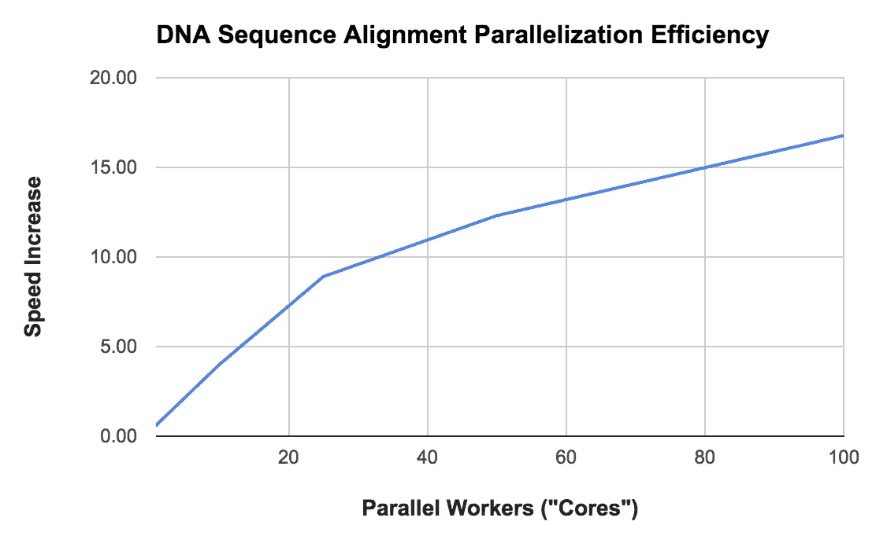

# 使用“无服务器”架构通过 StdLib 和 Node.js 大规模并行化 DNA 序列比对

> 原文：<https://medium.com/hackernoon/using-server-less-architecture-to-massively-parallelize-dna-sequence-alignment-via-stdlib-and-343dd2d5aebf>

软件开发中有一种新的风格，即所谓的“无服务器”或功能即服务(FaaS)架构，这是有充分理由的。它代表了不需要管理服务器就可以无限扩展的美好前景。您可以简单地编写代码，发布它，而不必担心代码执行的环境或它消耗的资源。

如果你是“无服务器”架构的新手，那么“无服务器”这个术语本身就有点用词不当——服务器没有去任何地方。我相信我们很快就会发现这个术语已经过时了(毕竟，我们驾驶的是汽车，而不是不用马拉的马车)，FaaS 是一个更加贴切的描述符:可以在大型计算集群中复制的小功能。这并不是说服务器不存在，而是每次运行时，您的代码并不在同一个物理(或虚拟)机器上执行——如果一个计算节点关闭，一个副本会弹出来取代它。

我们非常兴奋地向您展示一点 FaaS 的力量，我们正在使用这种新的、可扩展的分布式架构来构建 [StdLib:作为服务软件库的功能](https://stdlib.com)。我们的目标是向*的每一位*开发者开放 FaaS 架构的世界——我们真的相信这是基于云的软件开发的未来。我们今天要向您展示的更多是 FaaS *真正*闪耀的地方——大规模并行化。我们借此机会将 Node.js DNA 序列比对工具应用于 StdLib，并很高兴分享我们的结果。

# StdLib:通过 FaaS 实现并行化

“功能即服务”架构简化了大规模并行化——您的代码将作为大型计算集群的一部分在任意虚拟环境中执行，而不是在单个服务器上执行。随着多个请求同时到来，会创建更多的虚拟上下文来处理额外的请求负载。我们可以利用这种行为来创建动态分配的并行计算集群。

We Can Use the Behavior of Function as a Service Architecture for Massive Parallelization

对于任何使用大型数据集和 MapReduce 作业的人来说，创建动态分配的并行计算集群的想法都是梦想成真。我们有许多客户专门询问我们 StdLib 在 MapReduce 和并行化方面的表现如何，因此我们自己创建了一个内部案例研究，以推动我们平台的极限。为此，我们采用了一个基于 Node.js 的 DNA 序列比对工具 [NtSeq](https://github.com/keithwhor/NtSeq) ，以展示 StdLib 处理并行工作流的能力。

# 序列比对:使 NtSeq 适应 StdLib

我们选择改编[NtSeq 库](https://github.com/keithwhor/NtSeq)是因为我在这方面的深厚专业知识(作为原作者)。NtSeq 附带了一个详尽的、无缺口的、退化的 DNA 序列比对工具，该工具在 2015 年初首次推出时就在黑客新闻上流传开来。它所打包的映射算法被称为 [NBEAM(核苷酸逐位穷举比对映射)](/@keithwhor/nbeam-how-i-wrote-an-ultra-fast-dna-sequence-alignment-algorithm-in-javascript-c199e936da#.t5uuoy7hf)，它使用位操作来实现 JavaScript 中的“原始金属”性能——在 2.4GHz 下每个核苷酸比较大约 2 纳秒，这相当于大约 5 个处理器周期([基准](https://github.com/keithwhor/NtSeq#benchmarks-and-tests))。

对算法的工作原理做一些说明；

*   穷举-比较每个核苷酸并对每个潜在的比对位置进行评分，因此比对作图步骤的时间复杂度为 O(n)
*   无缺口—仅比较原始序列数据(无“缺口”变异，即序列之间可能添加或删除了核苷酸)
*   简并—也匹配“通配符”核苷酸(不仅是 A、T、G 和 C —例如，核苷酸 W 匹配{A、T} ),其完整列表可在维基百科的[核酸符号页面上找到](https://en.wikipedia.org/wiki/Nucleic_acid_notation)

**O(n)的映射时间复杂度是一个自然的瓶颈，也是并行化的良好候选**，因为您正在搜索的查询序列和基因组序列都可以被分割成多个块，并独立地并行对齐，最后的缩减步骤可以聚合结果。

# StdLib 服务设置:两个函数，搜索和映射

*如果您想继续阅读本文，请查看 GitHub* *上的*[*Keith whor/stdlib-sequence，在这里您可以克隆存储库并自己部署到 StdLib。*](https://github.com/keithwhor/stdlib-sequence)

我们有四个与序列比对和评分相关的基本步骤:

1.  **准备** —读取序列并为映射做准备(转换为二进制数组)
2.  **映射** —执行对准(平行化)
3.  **减少**——将来自**映射**的结果聚合成一个结果
4.  **排序** —对结果进行排序以给出最佳匹配

我们可以只使用**两个函数**来构建整个 StdLib 服务。一个**搜索功能**，它自己执行步骤(1)、(3)和(4)，并且还负责调用步骤(2)的委托/功能。需要一个专门的**映射函数**来处理步骤(2)中实际的 O(n)映射计算。设置看起来有点像这样(简化为三个并行函数调用):

# 搜索(缩小)功能

这是我们的搜索功能的样子。我概述了每个步骤:准备，映射，减少和排序。

# 地图功能

相比之下，我们的地图功能要简单得多，因为我们只是依靠 [NtSeq](https://github.com/keithwhor/NtSeq) 来完成繁重的工作。**这是并行执行的功能。**在 *map.initialize()* 函数调用背后的后台正在进行繁重的计算。

# 将所有这些放在一起:结果

为了直观显示并行化的效果，以及我们是否能在实践中看到大型 MapReduce 作业的合理加速，我们已经使用 [StdLib 命令行工具](https://github.com/poly/stdlib)测试了在本地运行我们的函数，它们将在同一线程上(串行)执行，也将在 StdLib 上(并行)执行，它们将在不同的上下文中执行。搜索查询是所有不同长度的“A”的序列，与大肠杆菌 K12 基因组的前 100 万个核苷酸相对应。

你可以在[https://stdlib.com/services/keith/sequence](https://stdlib.com/services/keith/sequence,)找到这项服务，或者使用[https://keith.stdlib.com/sequence?q=A&repeat = 10000&count = 0&stats](https://keith.stdlib.com/sequence?q=A&repeat=10000&count=0&stats)在 HTTPS 运行这项服务。GitHub 上也有[的版本。](https://github.com/keithwhor/stdlib-sequence)

Local Execution vs StdLib Parallel (“Server-less”) Execution, Three (3) Trials Each

Local (Serial) vs StdLib (Parallel) execution for different search spaces. Local Execution has a clearly linear relationship with nt² input (O(n²)), whereas StdLib execution time remains relatively stable and can be approximated as O(1) due to massive parallelization.

我们在本地对每组输入运行了三次搜索功能试验，并将其与 StdLib 上的三次执行试验进行了比较。本地机器是 2.7 GHz Core i5 处理器，内存为 16GB。优化后，StdLib 使用 1.5GB 内存执行。前两个测试(搜索空间≤ 1B nt)尚未并行化—请记住，根据上面的代码，只有当核苷酸搜索空间超过 1，000，000，000 nt 时，才会添加额外的工作线程。

当我们使用这些结果与使用的内核(工作线程)数量进行比较时，我们看到一种并行化模式似乎遵循[阿姆达尔定律](https://en.wikipedia.org/wiki/Amdahl%27s_law)，表明对于长度为 1，000，000 的基因组，无论并行工作线程的数量是多少，我们都可以推断出大约 20–30 倍的最大加速。

Speedup due to Parallelization via StdLib. Roughly follows Amdahl’s Law with test data provided, but should be noted that more cores also maps to an increase in search space.

# 限制:网上请求时间

并行化的最大瓶颈是在线请求时间。数据吞吐量导致的延迟增加意味着任何 O(n)时间复杂度的任务都不适合这些工作流。

此外，虽然在理论上，可以无限地创建新的虚拟上下文，从而导致无限的并行化，但这并不是实践中的最终结果。导致客户端和服务器端请求排队的资源管理可能会导致暂停或性能延迟，从而导致大规模并行(> 100 名工作人员)作业的可变性达到 1-3 倍。这可以通过以下事实得到补偿:这些大型工作通常可以节省 3 倍以上的时间，就像这里的情况一样。我们一直在努力提高这一性能。

# 结论:StdLib 是一个强大的 MapReduce 工具

基于过去几周我们对 StdLib 所做的工作和升级，我们有信心声明 StdLib 已经为 MapReduce primetime 做好了准备。单独使用 AWS Lambda 的好处是立竿见影的；

*   更简单的开发人员工作流程——部署就像“lib up”一样简单
*   我们支持高达 128MB 的请求和响应工作负载，缓解了围绕大型作业批处理的问题(与 AWS Lambda 的 5MB 相比)
*   一个由数千名开发者组成的活跃社区(点击 stdlib.com[的标题加入我们的 Slack 频道)](https://stdlib.com)
*   一个热情的开发团队随时准备回答任何问题
*   我们的开发者层是免费使用的，随着我们推出更新，我们将向早期采用者提供平台积分

如果您有大量的工作或工作量渴望并行化，并且想了解更多信息，请直接通过 keith [at] stdlib [dot] com 与我联系。

感谢阅读，我们希望你喜欢！在接下来的几个月里，我们将推出更多的平台更新。如果你想了解最新消息，你可以[在 Twitter @ StdLibHQ](https://twitter.com/stdlibhq)上关注我们。

基思·霍伍德 *是一名业余爱好者兼程序员、生物化学家、系统工程师，以及介于两者之间的所有人。目前，他是* [*StdLib*](https://stdlib.com) *的创始人兼首席执行官，也是* [*Nodal API 框架*](https://github.com/keithwhor/nodal) *的作者，他致力于让全球的开发者、团队和公司尽可能轻松地构建基于网络的软件和 API。*

*你可以在推特上关注他，*[*@ keithwhor*](https://twitter.com/keithwhor)*。*

> [黑客中午](http://bit.ly/Hackernoon)是黑客如何开始他们的下午。我们是这个家庭的一员。我们现在[接受投稿](http://bit.ly/hackernoonsubmission)并乐意[讨论广告&赞助](mailto:partners@amipublications.com)机会。
> 
> 如果你喜欢这个故事，我们推荐你阅读我们的[最新科技故事](http://bit.ly/hackernoonlatestt)和[趋势科技故事](https://hackernoon.com/trending)。直到下一次，不要把世界的现实想当然！

