# 利用社交机制将移动应用用户转化为活跃的部落成员

> 原文：<https://medium.com/hackernoon/using-social-mechanisms-to-turn-mobile-app-users-into-active-tribe-members-72c8284d2607>

人类天生是群居动物。他们倾向于与和他们有共同兴趣的人交往。正是围绕着这些共同的兴趣，人们相互认识，被介绍给新朋友，相互竞争，炫耀自己的成就，交流知识，发展自己。这个基本概念也可以应用到手机 app [设计](https://hackernoon.com/tagged/design)中。当有人选择下载一个应用程序时，他们这样做是因为他们发现了自己感兴趣的上下文及其使用价值。不言而喻，其他下载相同应用的人也识别出了相同的特质，从而形成了一群志同道合的个体，与我们周围的社会没有那么大的不同。这些人构成了该应用的用户群。

在应用程序中嵌入正确的社交机制，可以启动用户之间的互动，不仅让他们参与到应用程序中，还可以吸引新用户。不同的社交活动和机制，如果时机正确，并战略性地放在应用程序中，可以利用人们社交的需求，并在一定程度上提高应用程序的留存率。

# 让他们把其他人——推广者——带进来

游戏中一种常见的方法是让用户与他们的朋友分享他们可能获得的小胜利。游戏世界再次追随现实世界。在现实生活中，人们急于告诉他们的朋友他们新买的东西，或者他们最近的成就。与他们分享他们的骄傲；或许也可以吹嘘一下。这同样适用于应用程序，用户可以很容易地与他人分享他们的成就，激发他们的兴趣，并吸引新用户使用该应用程序。利用人类的基本情感来满足自己的自豪感，对于促使用户分享他们的应用内成就非常重要。除此之外，你还可以向应用程序之外的人寻求帮助，你会发现新用户在排队试用一款应用程序。游戏和应用行业的另一个常见做法是“鼓励”用户分享关于应用的信息，以换取某种应用内的奖励，让他们在不同的社交圈子中传播应用的信息。

## 分享快乐的一刻

在恰当的时间向用户提供易于分享的应用内操作非常重要。例如，当使用 [Imgur 应用](https://play.google.com/store/apps/details?id=com.imgur.mobile)时，你看到了一个让你发笑的有趣 gif，如果它很容易访问，你很可能会点击分享按钮，与朋友分享它并分享这种感觉。

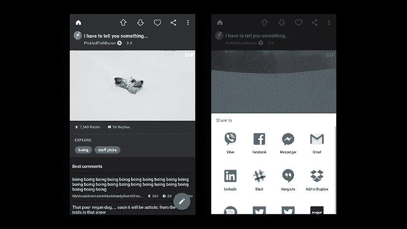

## 吹嘘一下，炫耀一下！

众所周知的健身应用程序 Runtastic 允许用户轻松地与世界其他地方分享他们参加的活动的结果/表现。这会激发他们的动力，获得更多的支持。一旦完成，祝贺和评论开始滚滚而来。谁的自尊不会在同伴的赞美和欣赏中得到极大的提升呢？

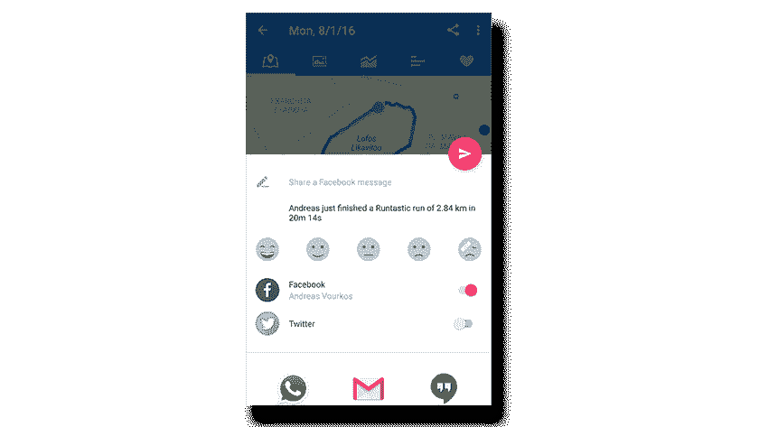

## 请求帮助

“无论好坏”，丈夫和妻子互相承诺。在游戏世界里没什么不同。用户在他们不开心的时候也会和应用内的朋友在一起。用户会发现，通过简单易行的分享行为，让用户选择向同伴伸出援手，不仅会让他们得到同伴的“救助”，还会让更多人使用该应用，提高认知度并帮助获得。Find The Word 应用程序很好地使用了这种方法，允许用户在遇到困难时寻求帮助。

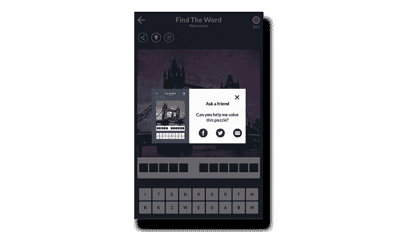

## 邀请他人加入可获得奖励

鼓励用户分享应用程序或向他们的社交[网络](https://hackernoon.com/tagged/networks)发送邀请以换取奖励是应用程序领域的常见做法。但是，和其他事情一样，时机就是一切。如果时机合适，用户选择分享他正在使用的应用程序的可能性要大得多。像兔子面前的胡萝卜一样，晃着用户刚刚用完的虚拟硬币，他们会立刻去拿。例如，约会应用 [happn](https://play.google.com/store/apps/details?id=com.ftw_and_co.happn) 为用户提供免费的 happn 积分，当一个朋友加入该应用时。当用户刚刚用完 happn 积分，但可能不愿意继续进行应用内购买时，这似乎是一个很好的选择。

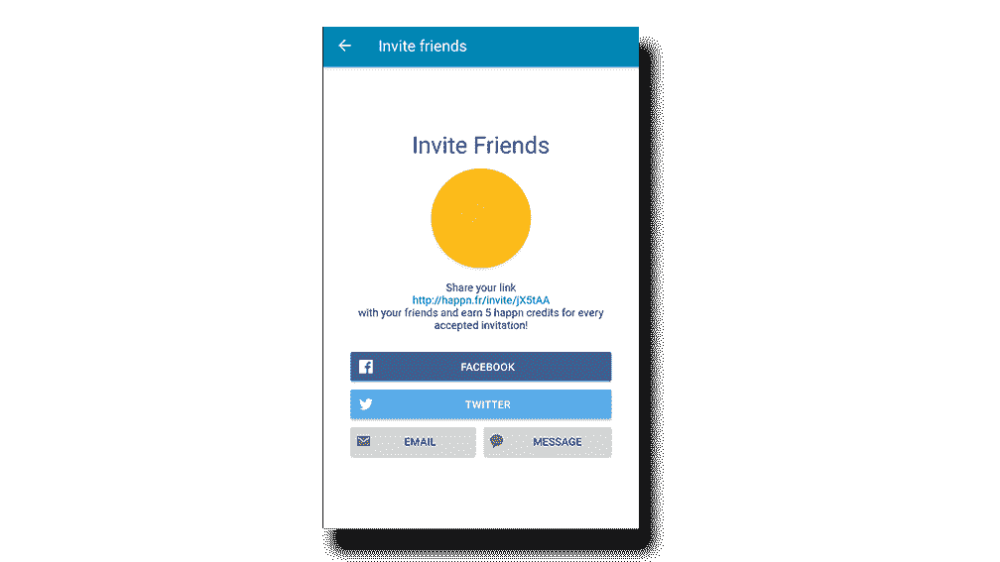

## 作为招聘流程的推荐方案

引入某种推荐方案有助于应用程序的病毒式传播，也能推动用户的获取。我们在 [Pollfish](https://www.pollfish.com/publisher) 以类似的方式工作。Pollfish 是一个移动货币化平台，通过移动应用程序提供调查而不是广告。当我们在 Dashboard 应用上推出推荐方案以换取收入增长时，出版商开始邀请同行出版商，导致新合作伙伴增加了近 15%。与任何成功的企业一样，本地客户始终是获得合格销售线索的最佳途径之一。在我们的案例中，这种招聘方式导致出版商带来了具有良好用户基础的新的优质合作伙伴，因为这将为他们带来更大的利益。

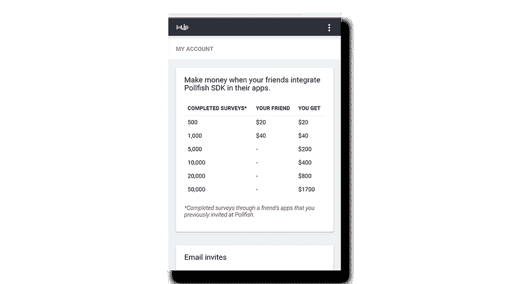

## 推动越来越多的用户实现特定目标

另一个吸引用户的有趣概念是，如果达到某个目标，比如达到某个目标的特定人数，就给用户提供奖励。这导致应用程序邀请呈指数级增长，口碑也越来越好。DropBox 太空竞赛掌握了这个概念。DropBox 太空竞赛是 DropBox 为大学推出的推荐计划。每成功邀请另一名大学生，用户可以为他们的学校赢得积分，并获得高达惊人的 25GB 供个人使用。这场“竞赛”导致大量邀请被发出，因为每个用户都将从实现共同目标中受益。

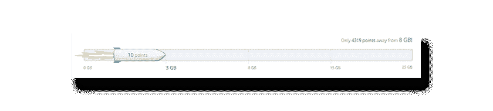

# 让他们互动——社交者

群体成员之间的互动是其生存的主要原因之一。人们需要能够讨论共同感兴趣的事情，提出问题并得到回答，分享情感并建立某种沟通，无论是主动还是被动的。为应用程序的用户提供社交机制，让他们在应用程序中相互交流和互动，有助于留住应用程序的受众，并在此基础上发展。

## 允许对其他用户的内容做出反应

如果你不能与他人分享自己的观点，那有什么好处呢？喜欢或不喜欢他人的帖子或行为是社交平台上最常见的机制之一。用户可以喜欢状态更新、照片、朋友分享的链接、评论和广告等内容。像脸书的“喜欢”或任何其他表情符号这样的反应对接受者和给予者来说都意味着很多。用户可以用它来表达自己对特定更新的感受，同时分享者会感到满意和成就感，因为好消息会在应用社区和他的朋友之间传播开来。

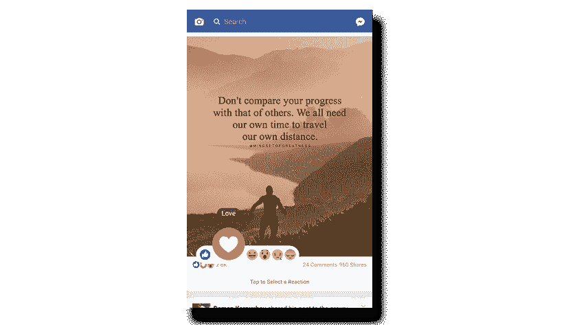

## 从被动沟通到主动沟通

允许应用内聊天或评论其他用户的行为也是在群组中发起交流的一个很好的方式。这使被动交流更进了一步。例如，被动交流是关注朋友的更新或行动。

允许用户评论彼此的行为可以引发讨论，让用户参与到应用的使用中来。一个很好的例子是 [9gag 应用](https://play.google.com/store/apps/details?id=com.ninegag.android.app)，用户可以很容易地开始评论和讨论他们之间的每一次更新。

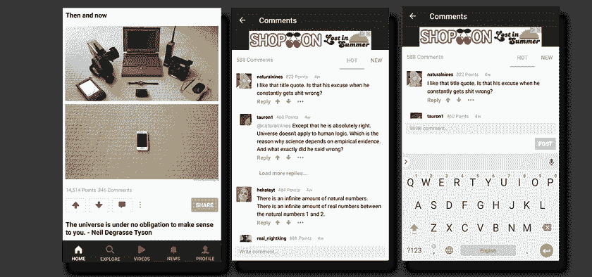

## 允许他们提问

允许用户更进一步，让他们向应用程序的其他成员提问并得到回答，实际上可以使应用程序真正吸引人。分享知识可以很容易地帮助解决问题；最大的程序员在线社区之一 StackOverflow 就是基于这一理念开发的应用之一。它允许人们提出问题，并从更有经验的用户那里获得答案。

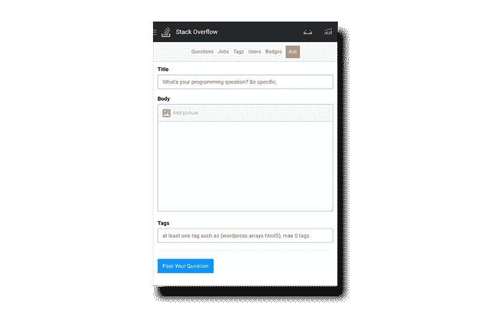

## 建立一个领导者、追随者和观察者的社区

按照前面的例子，像上面提到的平台，允许具有良好专业知识的用户分享他们的知识，讨论并相互了解，而新来者可以很容易地获得建议。允许这种参与，同时也允许其他人观察和学习，真的可以帮助一个应用社区变得活跃。有些人来是因为他们想有所贡献，或者成为导师，而其他人来是为了学习或者找到他们所纠结的事情的解决方案。解决所有问题的方法。

## 超出应用范围的社交互动

在某些情况下，即使用户没有在应用程序内进行交流的选项，交流的需求也是如此强烈，以至于应用程序用户会在应用程序范围之外的不同渠道上找到创建社区的方法。[举例来说，Swagbucks](https://play.google.com/store/apps/details?id=com.prodege.swagbucksmobile) (一个非常受欢迎的礼品卡奖励应用程序)没有一个主动的方式让它的用户互相交流。这促使应用程序用户围绕平台创建活跃的在线社区，在其他渠道，如专门的子编辑、论坛等。

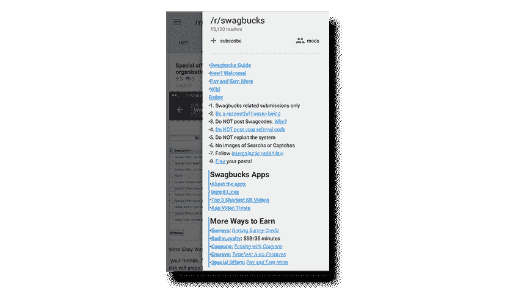

# 竞争还是比较——雄心勃勃又充满好奇心

群组中的用户不可避免地会在某个时候试图相互竞争，或者开始比较他们的进度和成就。如果控制得当，这实际上是一个社区的健康发展。给用户一种健康竞争的方式可以提高应用的效果和参与度。此外，看到其他人或你的朋友在做什么也是活跃社区的一部分。大型社交网络就是基于这一概念建立起来的，并且仍在被大量使用！

## 让他们互相竞争

排行榜的使用是社交机制的一个很好的例子，可以保持用户对应用程序的浓厚兴趣。当正确实施时，排行榜或其他监控用户在社区内应用表现的评分方案实际上可以激发竞争情绪，让用户更积极地使用应用。[stack exchange](http://stackexchange.com/)，以及 StackOverflow 总的来说，已经围绕这个概念实现了它的游戏化系统。

## 向他们展示他们的朋友在做什么

另一个可以使用的伟大机制是向用户展示他们的朋友在应用程序中的表现。能够看到他们的朋友实际表现如何，可以将他们“绑定”到应用程序上，让他们成为忠实用户。这就是为什么用社交档案登录平台(授予访问社交图表和好友列表的权限)最近变得非常流行。这种方法的一个很好的例子是 Spotify 应用程序，用户可以看到他们的朋友在听什么。

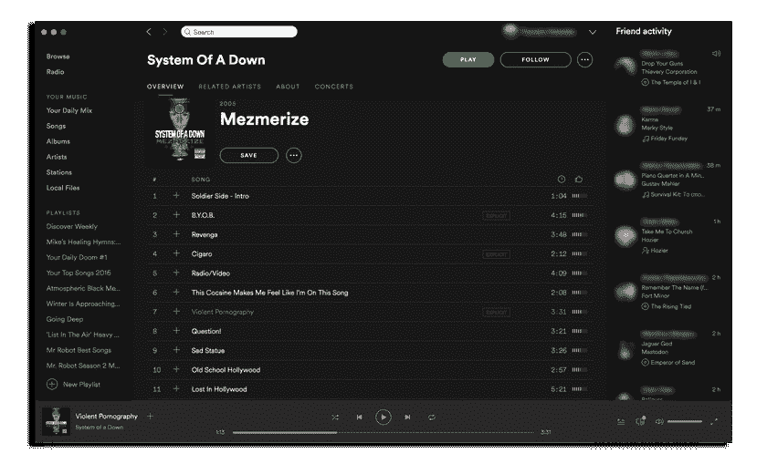

## 向他们展示其他人在谈论什么

我们都理解人们想知道他们的朋友过得怎么样，就像我们都想跟上当前的趋势和新闻一样。大家都在说什么？在一个特定的应用程序世界里，什么是当前的趋势？这实际上是 [Twitter](https://twitter.com/) 的主要成功之一，它使用了标签和“你在哪里有什么趋势”功能。一个应用的用户群是一个缩小的社会模型。我们都有一个爱管闲事的邻居，知道附近所有的动静。标签提供了一种容易找到热门更新的方式，不仅是你的朋友，还有普通人。这让用户走出了他们现有的朋友圈。

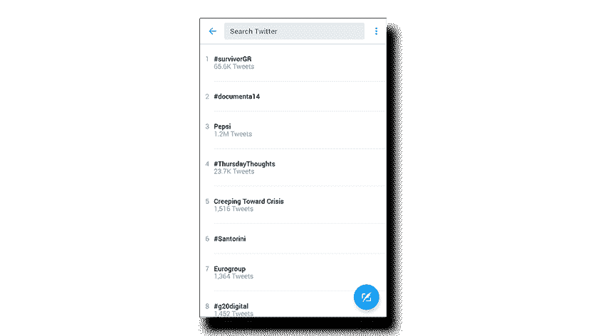

有许多社交组件有助于应用的成功，应用开发者在创建应用时可以从中选择。考虑不同的社交机制，并选择合适的机制嵌入到应用程序中是一个真正的挑战。应用程序发行商需要做出选择，启动应用程序使用和参与的巨大车轮，并为他们的应用程序添加成群的用户。现在，比以往任何时候都更有可能通过所有可用的选项来提高应用程序的参与度:社交档案、成就、目标、推荐、喜欢、向上投票等等。出版商可以利用他们所能获得的一切帮助，让他们的用户进行互动、吹嘘、交流、相互竞争、邀请朋友，并进一步推动他们的应用程序的购买。

附言:如果你喜欢这篇文章，并希望看到更多，请点击旁边的推荐图标

> [黑客中午](http://bit.ly/Hackernoon)是黑客如何开始他们的下午。我们是 [@AMI](http://bit.ly/atAMIatAMI) 家庭的一员。我们现在[接受投稿](http://bit.ly/hackernoonsubmission)并乐意[讨论广告&赞助](mailto:partners@amipublications.com)机会。
> 
> 如果你喜欢这个故事，我们推荐你阅读我们的[最新科技故事](http://bit.ly/hackernoonlatestt)和[趋势科技故事](https://hackernoon.com/trending)。直到下一次，不要把世界的现实想当然！

