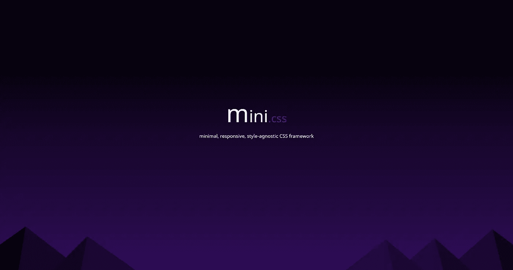

# 使用 mini.css 卡模块和媒体对象

> 原文：<https://medium.com/hackernoon/using-the-mini-css-card-module-and-media-object-3c5b5829d19c>

*在这个系列中，我们将带您了解一些基本的想法和技术，帮助您开始使用*[*mini . CSS*](http://minicss.org)*，并理解其背后的基本概念。*

mini.css — Minimal, responsive, style-agnostic CSS framework

**我们将在本文中讨论的内容:**卡片、网格和媒体模式

**难度:**初学者(建议您先阅读本系列[上一篇](https://hackernoon.com/designing-a-simple-web-page-with-mini-css-f455e9f6403b)

在上一篇文章中，我们介绍了使用 mini.css 的一些基础知识，比如利用[网格](http://minicss.org/grid)和[导航](http://minicss.org/navigation)模块为我们的猫社交媒体创建一个简单、优雅且响应迅速的布局。响应式布局启动并运行后，我们发现了`<header>`栏的布局缺陷，通过让顶部导航也响应起来，我们解决了这个问题。最后，我们添加了一个`<footer>`元素，并对所有内容进行了润色。

 [## 用 mini.css 设计一个简单的网页

### 在这个系列中，我们将介绍一些基本的概念和技术，帮助你开始使用 mini.css…

hackernoon.com](https://hackernoon.com/designing-a-simple-web-page-with-mini-css-f455e9f6403b) 

## 内容展示

这一次，我们将关注网页的内容，以及如何让它看起来更像一个社交媒体。为了实现这一点，我们将使用[卡](http://minicss.org/card)模块，它允许我们轻松地创建包装我们内容的容器。我们可以用纸牌做一些很酷的特技，但是我们一会儿再谈。

首先，我们需要熟悉卡组件的语法。要创建一个卡片，你需要使用`.card`类，为了让一切看起来都像预期的那样，你需要将里面的内容包装到一个或多个`.section`容器中。卡片也需要包装在一个`.row`中，所以我们必须将该类应用于`.card`的父元素。除此之外，我们还想制作自己的卡片`.fluid`。这听起来可能很多，所以让我们总结一下我们将为我们的布局做些什么:

*   添加一个将包装页面内容的`
`元素(即`<h3>`和`
`元素)，我们将对其应用`.card`类。这是我们的内容卡。
*   接下来，我们将把`<h3>`和`
`元素变成`.section`元素，这给了它们更好的外观，并使它们很好地适合我们的卡片。
*   最后，我们将使`.card`的父元素成为`.row`，并将`.fluid`类应用于卡片，使其适合可用区域。

你可以试着自己做或者你可以看看下面的代码！

Catbook’s card-based layout

## 使用媒体

创建基于卡片的布局有很多好处，其中一些可能在上面的例子中并不明显。为了更好地展示卡片的功能，我们将创建两种不同的布局，这两种布局都将使用媒体来增加页面的趣味。

第一个将使用一组非流体卡(6 似乎是一个很好的数字，很适合我们的布局)，以及`.section.media`类来创建以媒体为中心的卡。我们也将把`.small`类应用到`.card`上，使它们的尺寸更小。)。卡片的媒体部分将适合任何图像大小，所以我们不必担心得到正确的猫图像，只要我们能得到任何猫图像。

为了让一切更加整洁，我们将对父元素`.row`应用一些自定义 css。没什么特别要求的，就`justify-content: center;`，不管区域宽度如何都会把内容居中。

 [## 3 分钟学会 CSS Flexbox

### 在这篇文章中，你将学习 CSS 中 flexbox 布局的最重要的概念，这将使你的生活更容易，如果…

medium.com](/learning-new-stuff/learn-css-flexbox-in-3-minutes-c616c7070672) 

*如果你还没有，我强烈建议你查看 Harald Borgen 关于 CSS Flexbox* *的文章* [*，因为它将为你提供对语法的基本理解，如果你打算从事任何与 web 相关的工作，这将是一笔有用的资产。*](/learning-new-stuff/learn-css-flexbox-in-3-minutes-c616c7070672)

那么，在该说的都说了，该做的都做了之后，它看起来像什么呢？

A cat card collection

一如既往，上述设计反应灵敏，将在任何和所有设备上正常显示。顺便说一下，我们选定了六张卡片作为我们的展示编号，因为它们非常适合任何屏幕尺寸(小屏幕上为一列，中等屏幕上为两列，大屏幕上为三列)，不会留下任何 ca(t)rd，并且给我们的 Catbook 布局带来了一种整体的润色感。然而，如果你有一个非常大的显示器，有可能在一行中出现三张以上的卡片，破坏了所有的乐趣，但是让我们乐观一点。

## 媒体对象模式

正如所承诺的，我们将探索另一种布局，一种使用著名的[媒体对象模式](https://www.stubbornella.org/content/2010/06/25/the-media-object-saves-hundreds-of-lines-of-code/)的布局。媒体对象是我们现在几乎随处可见的东西，从脸书和推特到媒体上的故事链接预览。它基本上是某种媒体(95%的时间是图像)，与一些文本内容(通常是标题和一些文本)并排显示。

媒体对象模式如此普遍，以至于 mini.css 有一个关于它的[单独部分](http://minicss.org/grid#media-object)，尽管它实际上不是自己的一个组件。在我们的小演示中，我们将把卡片和网格模块结合起来，有效地创建一个媒体对象。让我们一步一步来:

*   创建一个`.card`，使其成为`.fluid`，并确保父容器是一个`.row`。在你的卡中添加一个`.section`，并在里面添加一个`.row`元素。这将作为媒体对象的 outter 容器。
*   在刚刚创建的`.section.row`中创建两列。第一个应该比另一个小，但你可以尝试不同的布局，看看你最喜欢什么。如果你不记得如何使用网格模块，你可以查看[框架的官方文档](http://minicss.org/grid)或者观看下面由[抽屉](https://medium.com/u/30d952e8c7e6#drawer)和[表单](http://minicss.org/input_control)，这将有助于为我们的社交媒体注入更多活力。敬请期待！

    > [黑客中午](http://bit.ly/Hackernoon)是黑客如何开始他们的下午。我们是 [@AMI](http://bit.ly/atAMIatAMI) 家庭的一员。我们现在[接受投稿](http://bit.ly/hackernoonsubmission)并乐意[讨论广告&赞助](mailto:partners@amipublications.com)机会。
    > 
    > 如果你喜欢这个故事，我们推荐你阅读我们的[最新科技故事](http://bit.ly/hackernoonlatestt)和[趋势科技故事](https://hackernoon.com/trending)。直到下一次，不要把世界的现实想当然！

    