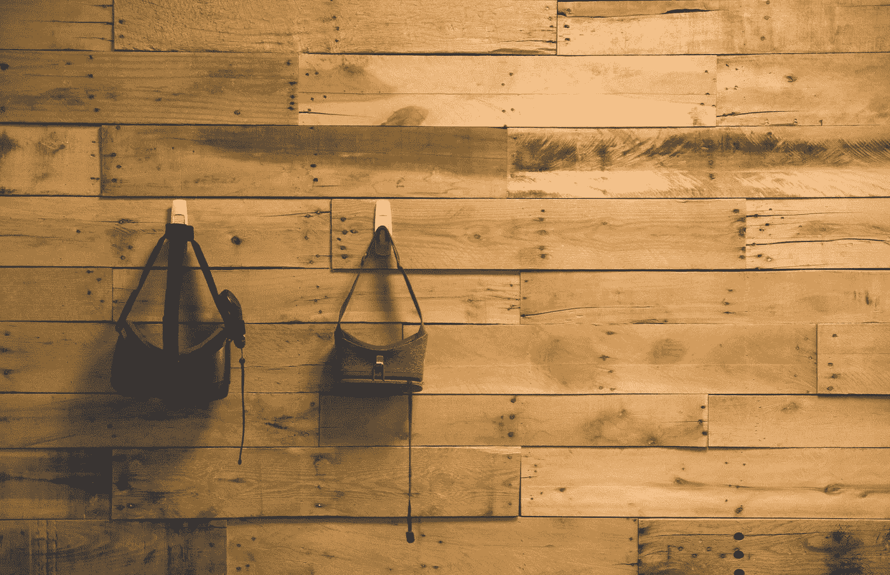
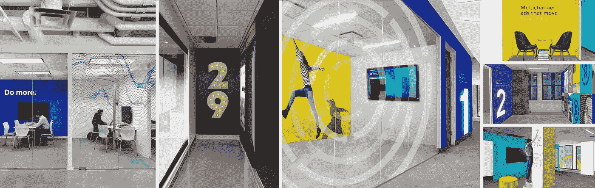
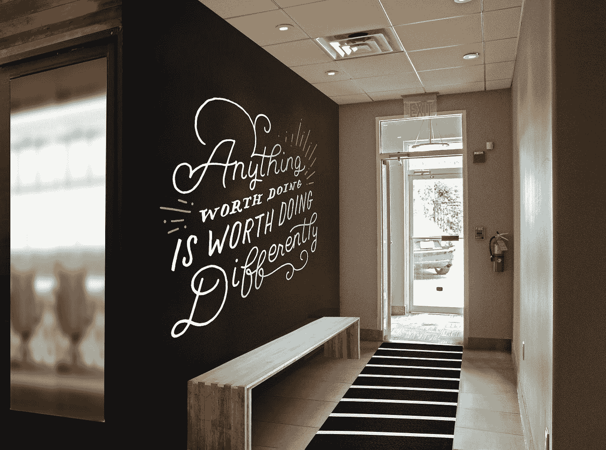

# 利用虚拟现实打造室内品牌

> 原文：<https://medium.com/hackernoon/using-virtual-reality-to-brand-interiors-e38ce091396b>



通常在我们的一次品牌活动后，20nine 的设计团队会被要求将视觉识别注入他们的办公室设计中。它通常包括拍摄空间的照片，将其导入 Photoshop，并在其上进行设计。这有助于客户想象他们的新品牌将如何在他们称之为家的空间中焕发生机。

下面是几个例子来说明一些可交付成果通常是什么样子的。



作为一家创意机构的开发人员，我试图将技术与我们当前的流程相结合，以增强体验。随着 Cardboard 等廉价、可访问的虚拟现实耳机的兴起以及智能手机处理能力的增强，我认为用我们的设计创建虚拟现实环境，让客户真正沉浸在他们潜在的新办公室中，这将是一件非常棒的事情。我最初的想法只是编辑一张普通的全景图像，可以在虚拟现实耳机中观看……但后来我发现了谷歌的 Cardboard 应用程序。

谷歌 Cardboard 相机应用程序真正有趣的是，它可以创建具有深度感知的 360 度全景图像。它通过算法创建一个右眼图像，再现深度。它还可以抓取环境音频片段，进一步增加身临其境的感觉。我被它创造的惊人体验震撼了，我想知道我是否可以像我们处理客户办公室一样编辑虚拟现实照片。

在过去的几个月里，我们一直在更新我们自己的办公室，所以我已经创建了一些内部设计来开始测试。我用这个应用程序抓拍了一张 20 线办公室的全景照片，并将其保存到 Google 相册中，以便下载到我的电脑上。Cardboard 相机软件将它保存为 jpg 格式，所以在做任何研究之前，我将它直接导入 Photoshop。我放大了其中一面空墙，并在墙上覆盖了一个提议的设计。我保存了它，并将其导入到 Cardboard 应用程序中，但我注意到右眼没有更新的图像。



我跳上了谷歌的开发者网站，想看看我是否能发现这些文件是如何构成的。事实证明，虚拟现实元素存储在图像本身中。主图像是左眼和右眼，音频作为 base64 编码的二进制斑点存储在图像的元数据中。元数据使用 Adobe 的 XMP 标准存储。因为 base64 编码的图像很大，所以根据 XMP 规范，它是以块的形式写入元数据的。每个块的末尾都包含一个类似于*[*http://ns . adobe . com/xmp/extension/590 ad 547 fa 26 c 83 e 9 DD f1 BC 8 b 5 e 5b 2 BD*](http://ns.adobe.com/xmp/extension/590ad547fa26c83e9ddf1bc8b5e5b2bd)*的 URL。**

*最初，我计划使用 Javascript 的 FileReader 和一些精心制作的正则表达式来提取数据并下载图像，但是将图像合并到一起将是一个问题。所以我决定使用 [Python](https://hackernoon.com/tagged/python) 和命令行来管理分割和连接。*

*我找到了 Python XMP 工具包*(*[*【https://python-xmp-toolkit.readthedocs.io/en/latest/】*](https://python-xmp-toolkit.readthedocs.io/en/latest/)*)*，它就像设置在谷歌开发者网站上找到的属性并使用 XMP API 获取属性一样简单。在获取相关的 base64 数据后，我将图像和音频保存在同一个文件夹中。下面是获取正确图像数据的示例。*

```
*XMP_NS_GPHOTOS_IMAGE = u’http://ns.google.com/photos/1.0/image/'right_image_base64 = xmp.get_property(XMP_NS_GPHOTOS_IMAGE, u’GImage:Data’)*
```

*一旦图像被下载，我可以将相同的图形叠加到左边和右边的图像上，保存 jpg，并使用相同的 XMP 属性将所有内容合并在一起。将它导入到应用程序中就像把 USB 连接到我的手机上，然后把图片放到应用程序文件夹中一样简单。一旦图像回到 Google Cardboard 应用程序中，你就可以创建一个可共享的链接，作为可交付物发送给客户。*

*这是一个令人敬畏的⏤和令人惊讶的简单的⏤方式，用静态设计以外的东西来让客户惊叹。*

# *如果你下载了应用程序，你可以使用下面的链接来查看之前和之后！*

***之前:**https://goo.gl/vrphoto/yu06arS9hHSRfnnP2*

***之后:**https://goo.gl/vrphoto/rrMrK0y54ojPwXv72*