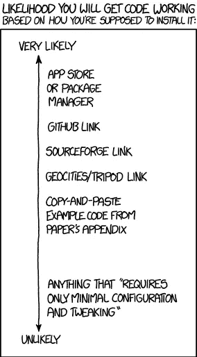

# 使用带 Docker 的纱线

> 原文：<https://medium.com/hackernoon/using-yarn-with-docker-c116ad289d56>

[脸书](https://hackernoon.com/tagged/facebook)最近[发布了](https://code.facebook.com/posts/1840075619545360) [Yarn](https://yarnpkg.com/) ，这是一个新的 [Node.js](https://hackernoon.com/tagged/nodejs) 包管理器，构建在 npm 注册表之上，大大减少了安装时间，并提供了开箱即用的确定性构建。

决定论一直是 npm 的一个问题，像`npm shrinkwrap`这样的解决方案[并不能](http://jonnyreeves.co.uk/2016/npm-shrinkwrap-sucks/) [很好的](https://github.com/npm/npm/issues/11736)。这使得基于`npm`的系统很难用于多个开发人员和持续集成。另外，`npm`在复杂的`package.json`文件中的缓慢会导致长的构建时间，这在使用 Docker 进行本地开发时是一个严重的障碍。

本文讨论如何使用 Yarn 和 Docker 进行 Node.js 开发和部署。



[xkcd](https://xkcd.com/1742/) take on installing code

# TL；速度三角形定位法(dead reckoning)

*   复制样板文件:

```
git clone [https://github.com/mfornasa/DockerYarn.git](https://github.com/mfornasa/DockerYarn.git)
```

*   输入目录:

```
cd DockerYarn
```

*   构建容器:

```
./build.sh
```

*   运行它:

```
docker run yarn-demo node -e "console.log('Hello, World')"
```

在你第一次构建容器时，Yarn 为你获取`npm`依赖项。之后，Yarn 只在你修改你的`package.json`的时候执行，它使用之前执行的缓存。在它的上面，你有**确定性**:每次在每台机器上安装相同的依赖树。而且**它的速度非常快**！

# 我们开始吧

该过程适用于 Mac 和 Linux。我们将进入节点 6 的[rising stack](https://hub.docker.com/r/risingstack/alpine/tags/)Node . js Docker 图像。继续之前，请在机器上安装纱线。

*   在本地文件夹中下载 Yarn 安装包:

```
wget [https://yarnpkg.com/latest.tar.gz](https://yarnpkg.com/latest.tar.gz)
```

*   创建新的`Dockerfile`:

```
FROM risingstack/alpine:3.4-v6.7.0-4.0.0WORKDIR /opt/app# Install yarn from the local .tgz
RUN mkdir -p /opt
ADD latest.tar.gz /opt/
RUN mv /opt/dist /opt/yarn
ENV PATH "$PATH:/opt/yarn/bin"# Install packages using Yarn
ADD package.json /tmp/package.json
RUN cd /tmp && yarn
RUN mkdir -p /opt/app && cd /opt/app && ln -s /tmp/node_modules
```

这是基于一个[众所周知的](http://bitjudo.com/blog/2014/03/13/building-efficient-dockerfiles-node-dot-js/)技巧，利用 Docker 层缓存来避免每次构建容器时重新安装所有模块。这样，Yarn 只有在你改变 `**package.json**`的时候才执行**(当然还有第一次)。**

*   初始化`package.json`

```
yarn init
```

*   添加您的第一个包:

```
yarn add react
```

*   构建并运行您的新容器:

```
docker build . -t yarn-demo
docker run yarn-demo node -e "console.log('Hello, World')"
```

恭喜你！你在 Docker 中使用了`yarn`。

# 等等！“`yarn.lock”`呢？

Yarn 存储每个包和子包的确切版本，以便能够在每次运行时复制完全相同的依赖树。`package.json`和`yarn.lock`都必须签入源代码管理。当我们在容器内运行纱线时，我们需要取回`yarn.lock`。幸运的是，每次运行后提取`yarn.lock`并不难。只需将`Dockerfile`中的`ADD`线更改如下:

```
ADD package.json yarn.lock /tmp/
```

并使用以下命令构建容器:

```
docker build . -t yarn-demo; docker run --rm --entrypoint cat yarn-demo:latest /tmp/yarn.lock > yarn.lock
```

构建完成后，`yarn.lock`被复制到您的工作目录，它将在下一次 Docker 运行时被重用，每次安装相同的依赖项。

恭喜你！现在你有了**决定性的**纱线执行。

# 等等！现在，纱线在每个容器制造中执行

这是正确的，我们现在在每个构建中运行纱线，即使`package.json`没有被修改。这是因为`yarn.lock`每次都从容器中复制到您的工作目录中，即使它没有被更改，从而使 Docker 层缓存无效。要解决这个问题，我们需要复制`yarn.lock`只有当它真的改变了。为此:

*   创建一个`build.sh`文件:

```
#!/bin/bashdocker build . -t yarn-demodocker run --rm --entrypoint cat yarn-demo:latest /tmp/yarn.lock > /tmp/yarn.lock
if ! diff -q yarn.lock /tmp/yarn.lock > /dev/null  2>&1; then
  echo "We have a new yarn.lock"
  cp /tmp/yarn.lock yarn.lock
fi
```

*   使其可执行:

```
chmod +x build.sh
```

*   用它来构建容器:

```
./build.sh
```

*   然后运行容器:

```
docker run yarn-demo node -e "console.log('Hello, World')"
```

恭喜你！你现在有了一个**确定性的**纱线执行，只有当你改变 `**package.json**`时，纱线才被执行**。**

# 纱包缓存怎么办？

Yarn 的另一个强大特性是包缓存，它存储在本地文件系统中，以避免再次下载包。到目前为止，我们的过程没有在容器构建上维护缓存。对于大的`package.json`文件来说，这可能是一个问题。

下面的`build.sh`通过在你的工作目录中保存纱线缓存来解决这个问题。

```
#!/bin/bash# Init empty cache file
if [ ! -f .yarn-cache.tgz ]; then
  echo "Init empty .yarn-cache.tgz"
  tar cvzf .yarn-cache.tgz --files-from /dev/null
fidocker build . -t yarn-demodocker run --rm --entrypoint cat yarn-demo:latest /tmp/yarn.lock > /tmp/yarn.lock
if ! diff -q yarn.lock /tmp/yarn.lock > /dev/null  2>&1; then
  echo "Saving Yarn cache"
  docker run --rm --entrypoint tar yarn-demo:latest czf - /root/.yarn-cache/ > .yarn-cache.tgz
  echo "Saving yarn.lock"
  cp /tmp/yarn.lock yarn.lock
fi
```

您还需要将此添加到您的`Dockerfile`中，在`ADD package.json...`行之后:

```
# Copy cache contents (if any) from local machine
ADD .yarn-cache.tgz /
```

缓存文件并不意味着被推送到 repo，所以它应该被添加到一个`.gitignore`文件中。

再次祝贺你！你现在有了一个**确定性的**纱线执行，只有当你改变 `**package.json**`时才执行**，它使用**纱线缓存**。用真实项目中的一个复杂的`package.json`文件来试试吧，你会惊讶的！**

> *如果你喜欢这个作品，点击下面的“****”♥︎****”按钮。更多关于 DevOps 和 Docker 的文章，请加入我的[邮件列表](http://eepurl.com/clAQDb)。*

[](http://bit.ly/HackernoonFB)[](https://goo.gl/k7XYbx)[](https://goo.gl/4ofytp)

> [黑客中午](http://bit.ly/Hackernoon)是黑客如何开始他们的下午。我们是这个家庭的一员。我们现在[接受投稿](http://bit.ly/hackernoonsubmission)并乐意[讨论广告&赞助](mailto:partners@amipublications.com)机会。
> 
> 如果你喜欢这个故事，我们推荐你阅读我们的[最新科技故事](http://bit.ly/hackernoonlatestt)和[趋势科技故事](https://hackernoon.com/trending)。直到下一次，不要把世界的现实想当然！

[](https://goo.gl/Ahtev1)