# /usr/bin/time:不是您认为自己知道的命令

> 原文：<https://medium.com/hackernoon/usr-bin-time-not-the-command-you-think-you-know-34ac03e55cc3>

[编辑:查看 reddit 上令人敬畏的评论,这些评论补充并纠正了以下内容]

打开一个终端。运行'*类型*[时间](https://hackernoon.com/tagged/time) '。你会被告知“*时间是一个 shell 关键字*”。现在运行' *which time'* ，你会看到' */usr/bin/time* '，看起来像是一个二进制的路径。它们是一回事吗？**没有**。事实上，其中一个可以给你很多有趣的信息，而另一个却不能。

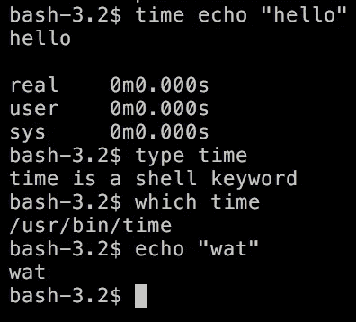

试试“男人时间”。

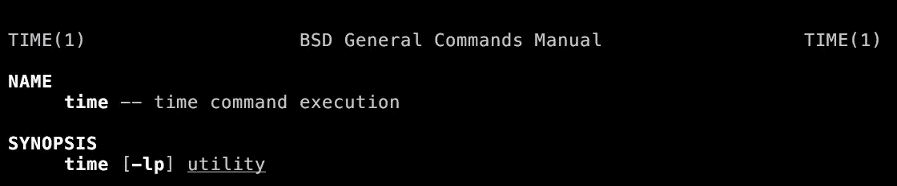

哼，你知道*时间*有选择权吗？

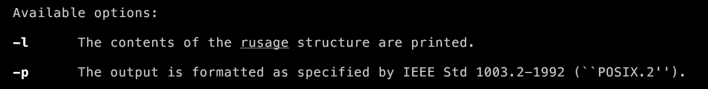

You’ll see different options on Linux, by the way, but it has the same basic functionality

我不知道这些是什么意思，但它们可能不会删除我在 **~/Downloads** 中的盗版 Hamilton shakycam 录音，所以让我们试试其中一个:

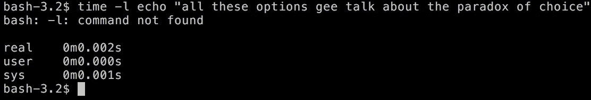

我期待更令人兴奋的东西。让我们更仔细地阅读一下手册页:

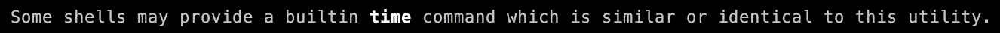

啊哈，也许这只是一个狂欢。让我们试试 zsh，它基于 GitHub 上的明星数量，看起来更像是[网络规模](http://www.mongodb-is-web-scale.com/)。

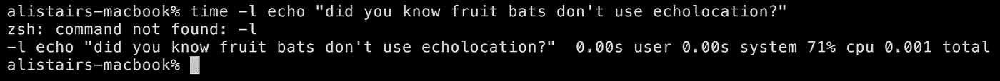

They actually have pretty top-notch night vision

没有骰子！最后一次尝试:鱼，单源固定齿轮壳的选择。

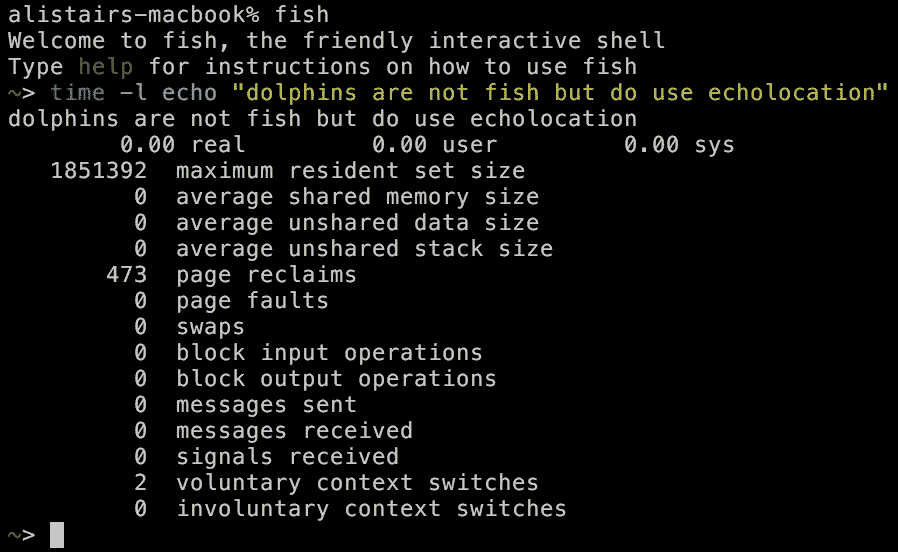

天哪，那确实是许多信息。

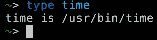

所以，这些年来我一直使用的' *time* ' [command](https://hackernoon.com/tagged/command) 实际上并不是手册页中描述的那个。我想知道为什么 bash 和 zsh 有时间作为内置？但是在我深入研究之前，让我们来看看时间能告诉我们什么。

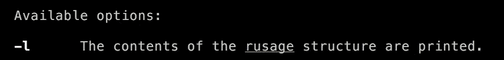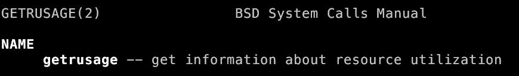

getrusage(一个系统调用)的[手册页](http://www.manpages.info/macosx/getrusage.2.html)详细描述了' *time -l* '输出的每一位。例如

> *ru*_in block:文件系统必须执行输入的次数

当我阅读 410 千磅的 PDF 文件时:

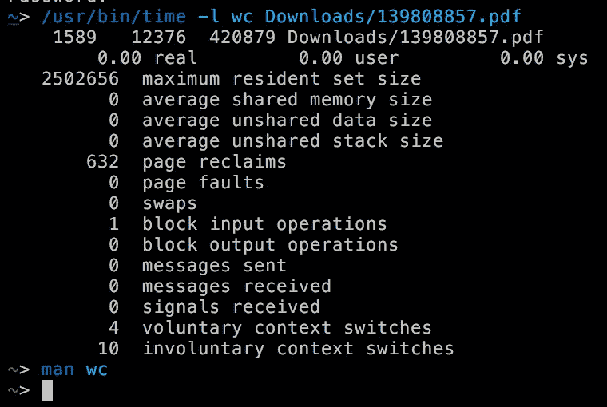

它做了一个“块输入操作”，所以它从我的 SSD 中一次性读取了所有内容。我用一个 120MB 的 JSON 文件试了一下，也是一次操作就搞定了。有意思。

自愿的上下文切换怎么样？

> 由于进程在其时间片完成之前自愿放弃处理器而导致的上下文切换的次数(通常是为了等待资源的可用性)。

好了，这就是当 *wc* 试图从磁盘中读取文件，但被内核告知等待，要么是因为磁盘正被其他人使用，要么是它仍在试图执行其操作(例如，如果进程消耗输入的速度快于磁盘吐出的速度)。

这在小 PDF 中根本不会发生，但在 120MB 的 JSON 文件中会发生三次。

占据我们从*[得到的统计数据头条的“常驻集大小”很复杂](https://utcc.utoronto.ca/~cks/space/blog/unix/UnderstandingRSS)，但是你可以把它看作是进程在峰值时使用了多少内存的度量，以字节为单位。*

*如果你想知道，在大文件或小文件上运行 *wc* 在内存使用上几乎没有任何区别。这是有意义的，因为当它在一个文件中流动时， *wc* 唯一需要保存的东西是一些小的计数器(字符、行等)。)，以及文件在其缓冲区中的任何部分。*

*无论如何，你有它。*时间*不是你想象的*时间*，如果你想知道你的程序是如何处理 IO 的，或者它使用了多少内存，试试 */usr/bin/time -l* 。*

******

> *[黑客中午](http://bit.ly/Hackernoon)是黑客如何开始他们的下午。我们是 AMI 家庭的一员。我们现在[接受投稿](http://bit.ly/hackernoonsubmission)并乐意[讨论广告&赞助](mailto:partners@amipublications.com)机会。*
> 
> *如果你喜欢这个故事，我们推荐你阅读我们的[最新科技故事](http://bit.ly/hackernoonlatestt)和[趋势科技故事](https://hackernoon.com/trending)。直到下一次，不要把世界的现实想当然！*

**