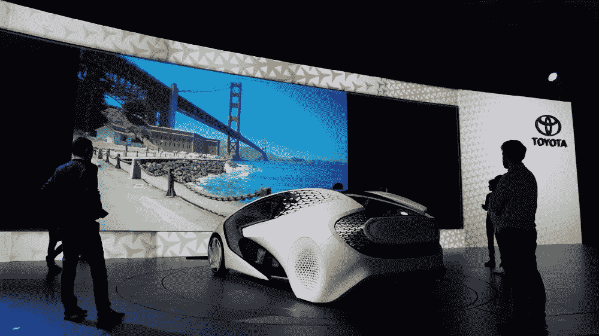
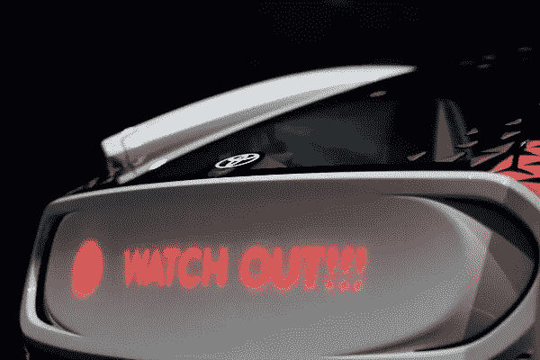
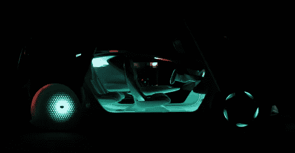
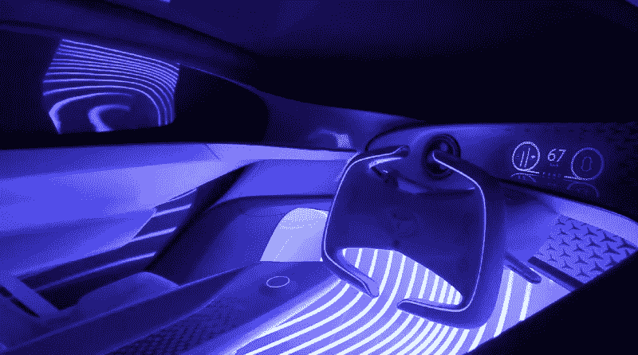
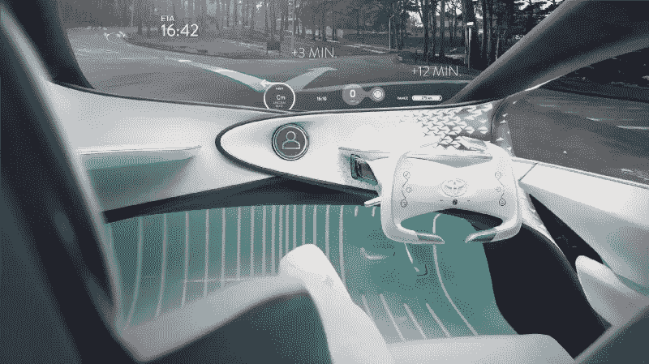
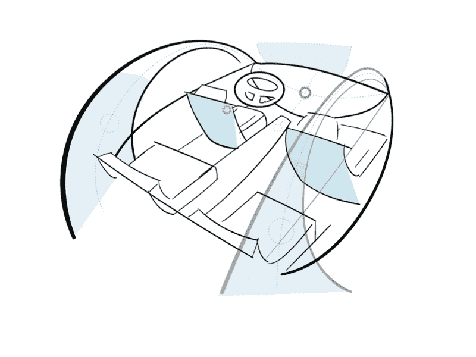
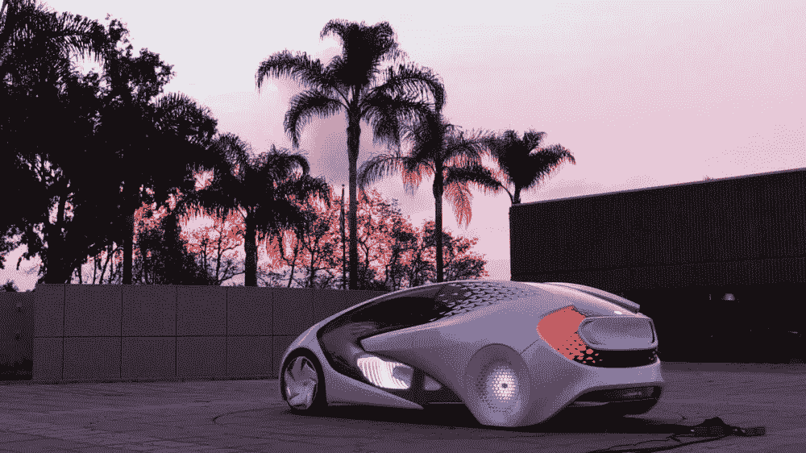

# UX 为未来的自动化汽车注入了活力

> 原文：<https://medium.com/hackernoon/ux-breathes-life-into-an-autonomous-car-of-the-future-3c8d5eb1e3d7>

In January 2017, Toyota unveiled Concept-愛 i at CES in Las Vegas. The vehicle introduced a vision of the future where driving is still fun. Yes, people are still driving in the automated future. In the case of Concept-愛 i, they’re joyfully cruising along, in part because the driving experience is facilitated by an AI personality called Yui, who lives throughout the car.

The Institute for Creative Integration (ICI) had the honor of working alongside the Toyota Innovation Hub, Toyota’s Calty Design Research team, as well as a host of talented designers, technologists, research scientists, and marketers to bring the UX vision of Concept-愛 i to life. ICI’s primary role was the design and development of the UX philosophy and guiding principles, use case scenarios, as well as managing the creative direction during implementation. In many cases, ICI was responsible for identifying and coordinating the efforts of specialized studios and agencies to bring the vision to live — a service we offer called Creative Integration. Here are a few insights we’d like to share about doing UX for an automated car of the future.

Photography: Sho Hiruta

# UX 是一种生命力，而不是一层

One of the defining characteristics of Concept-愛 i is the introduction of an AI assistant. In this case, the assistant’s name is “Yui”. Designing Yui was a challenge because we felt from the beginning that she should be an integral part of the car, and not a separate software system. AI can sometimes be developed as something like an agent — a disembodied 3rd party that guides and assists in actions related to the car. It feels like separate entity. But there is so much opportunity to build a user experience that is truly integrated. Where does this ambiguous, intelligent system that can drive your car live? Does it move? How do you communicate with it? Does it have personality? What does is control? Ultimately the question became — can it just *be* the car?

作为独立层的技术系统在很大程度上是汽车设计过程中学科筒仓的产物。你有外部设计师、内部设计师、人机界面设计师、色彩和装饰设计师等等。当每个人都同意，是的，技术实际上无处不在，体现在汽车的每个部分，筒仓开始打破。专注于完整的体验意味着 UX 成为一种生命力。门把手会做出反应并发光，后保险杠会提醒车后的人，人工智能采取生动活泼的动画角色的形式，在车内跳舞。UX 开创了跨学科创新的新形式。开发 Yui 作为汽车本身是一个战略决策，联合各种设计学科，同意并专注于将汽车设计为一个单一的、集成的用户体验。

Photography: Sho Hiruta

# **作为合作伙伴的车辆**

今天，司机必须告诉汽车做什么。汽车是无声的、不那么智能的大块机器。驾驶是一项认知性很强的活动，因为驾驶员负责所有的思考和指挥。我们的团队明白，为了激发对驾驶的热爱，我们需要重新定义汽车和车手之间的关系。当我们探索想法时，我们得出结论，汽车可以扮演伙伴的角色。如果你想到真正的伴侣，他们会在你需要的时候出现，在你不需要的时候让你独处。

When you combine this with artificial intelligence, it all comes to life. We firmly believe that technology should support your life, but not be center stage. In the case of Concept-愛 i, the car gathers knowledge to anticipate its passengers’ needs. The passengers experience natural interactions with intelligence that has the warmth and liveliness of a human. When you approach the car, it lights up in recognition. You can say, “Yui, take the wheel,” when you don’t feel like driving, and the colors shift from green to purple as automation takes over. Yui speaks to you like a friend would — casual in most cases, and firm in an alert situation. And Yui as embodied by the car comes to know you, your daily patterns, your relationships, your interests. The car is a partner in life.

Photography: Sho Hiruta

Image: Courtesy of Calty Design Research, Inc.

# UX 有能力影响外观设计

传统上，汽车设计流程从外观开始，到内部，整合颜色和材料，最后添加人机界面(仪表盘、屏幕和仪表)。外面一辆*在*接近。这完全有道理，因为在很长一段时间里，汽车是司机的代表——但却是在轮子上。市场差异以原始性能和风格为标志。汽车制造商密切关注消费者对生活方式的渴望。设计师专注于令人回味的形式、形状和线条。

但是我们知道事情正在改变。人们开始重视体验而不是物品。他们获得了自我表达的新形式。Instagram。Snapchat！技术发展的速度已经完全改变了人们对汽车的期望，以及他们希望看到变化的速度。

早期，该团队探索了车辆需要以何种方式与驾驶员交流。如果 Yui 轻轻拍一下司机的肩膀就能引起他的注意会怎么样？如果 Yui 沿着头轨行驶来吸引司机的注意力到障碍物上会怎么样。如果 Yui 通过给出非语言的反馈来表明它听到了你说的话。如果 Yui 不仅能和司机交流，还能和其他车辆交流。外观设计应该如何传达其内部 UX？最终，人类温暖和运动的 UX 原则能够影响室内和室外的设计。

This is huge! In the car world, it represents a significant change in process. Toyota’s Concept-愛 i design team developed the concept from the inside out, rather than the outside in. They started with the user, developed the experience, and then created the form that best inspires a love of driving.

# **最终想法**

Futuristic vehicle concepts are increasingly challenging to work on because the experiences they need to communicate are becoming much more nuanced. Emotional recognition, conversational interfaces, and embedded haptic feedback were part of the Concept-愛 i experience. This all had to be demonstrated through a tactile physical model, complex electronics, embedded lighting systems, immersive visuals, and a fair bit of storytelling. We are thankful to have been able to find a talented, diverse group of specialists willing to collaborate with us to produce something new.

Concept-愛 i is a true example of prototyping to think. In collaboration with our clients and partners, we explored the role of AI, developed unique interactions, re-defined a new relationship between the car and driver, and brought to life a futuristic concept that we believe is ultimately, fun to drive.

Photography: Sho Hiruta

感谢丰田汽车公司、Calty 设计研究院、丰田创新中心、丰田研究所、Tellart、Phiaro、Big Block 和 Frog。

> [黑客中午](http://bit.ly/Hackernoon)是黑客如何开始他们的下午。我们是 [@AMI](http://bit.ly/atAMIatAMI) 家庭的一员。我们现在[接受投稿](http://bit.ly/hackernoonsubmission)并乐意[讨论广告&赞助](mailto:partners@amipublications.com)机会。
> 
> 如果你喜欢这个故事，我们推荐你阅读我们的[最新科技故事](http://bit.ly/hackernoonlatestt)和[趋势科技故事](https://hackernoon.com/trending)。直到下一次，不要把世界的现实想当然！

