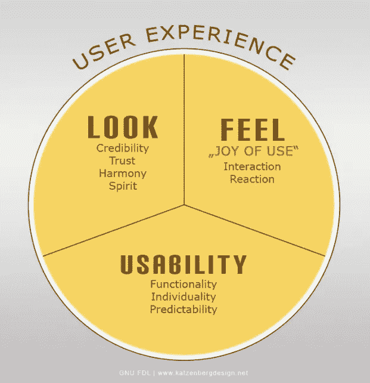

# UX 设计:端点安全的一个被忽视的方面

> 原文：<https://medium.com/hackernoon/ux-design-an-overlooked-aspect-of-endpoint-security-44184495e3b4>

> 本文是我最初为 [Alienvault](https://www.alienvault.com/blogs/security-essentials/ux-design-an-overlooked-aspect-of-endpoint-security) 撰写的一篇文章的转载，发表于 2017 年 1 月。

我目前有很多令人兴奋的信息[安全](https://hackernoon.com/tagged/security)写作和研究，我正在从事。我渴望为我的忠实读者出版我正在进行的工作！同时，如果你真的喜欢我为 Tripwire、Alienvault 和 Medium 写的东西，考虑一下[支持我的 Patreon](https://www.patreon.com/kim_crawley) 。和大多数为网络写稿为生的人一样，我赚的钱很少。帮我买食品杂货和公共交通费用要花很长时间，每一点都很重要。谢谢大家！

信息安全领域的人知道要听从布鲁斯·施奈尔的建议。然而，我们经常忘记的是听从唐·诺曼的建议，他被认为是用户体验设计之父。事实上，当苹果公司在 1993 年聘请诺曼作为苹果研究员和用户体验架构师时，他可能是第一个在工作头衔中有“用户体验”一词的人。

Norman 获得了麻省理工学院的电子工程和计算机科学学士学位，之后获得了宾夕法尼亚大学的数学心理学博士学位。他作为一名工程师和计算机科学家工作了几年，但是技术中人的因素总是令他着迷。1979 年，他在加州大学圣地亚哥分校帮助建立了认知科学研究所。

在创造用户体验这个词时，Norman 说，“我发明这个词是因为我认为人机界面和可用性太狭隘了。我想涵盖人们对系统体验的所有方面，包括工业设计、图形、界面、物理交互和手册。”

如果我们回顾一下 20 世纪 70 年代 PARC 施乐公司正在开发的东西，我们会发现，诺曼并不是唯一一个思考如何让技术更加人性化的人。我们许多人都知道图形用户界面和鼠标是施乐公司开发的。然而，苹果和微软并没有成为施乐的专利和盈利产品线，而是欣然接受了这些想法，并成功地使用和营销了它们。施乐的工作和研究发生在“用户体验”或简称 UX 成为真正的研究领域之前。

诺曼的开创性著作《T2 日常用品的设计》于 1986 年出版，具有开创性。它可以被认为改变了人们对人类与技术之间互动的看法。自那时以来，情况发生了很大变化。如今，全球大多数科技公司都有专注于改善用户体验的员工。

在信息安全方面，我们经常觉得需要在可用性和安全性之间做出妥协——它们可能看起来不一致。然而，有时增加可用性实际上也可能增加安全性！为了详细说明这一点，有效地保护端点需要用户的合作，无论客户端机器或移动设备是由员工还是消费者使用。当意识到这些问题时，人们会担心安全问题，通常会希望以更安全的方式使用他们的计算机技术，只要他们能够理解发生了什么，并且不会给他们带来太多的麻烦或不便。

最近，主要的技术供应商忽略了基本的 UX 和用户界面设计原则，未能帮助用户使他们的设备更加安全，如下例所示:

# 华硕 SoHo 路由器的设计缺陷

去年二月，[安全研究员大卫·朗格内克发现了一个 UI 问题，影响了一系列运行 ASUSWRT 固件](http://news.softpedia.com/news/bad-ui-design-sabotages-security-of-asus-soho-routers-500330.shtml)的华硕路由器型号。

ASUSWRT 的 GUI 在防火墙部分包含两个设置，分别写为“启用来自 WAN 的 Web 访问:否”和“启用防火墙:是”不幸的是，即使“启用防火墙”被设置为“否”，对路由器管理面板的公共互联网访问仍然会被授予，即使“从 WAN 启用 Web 访问”被设置为“否”，即使是我，以我的网络管理经验，也会发现这令人困惑。

ASUSWRT 固件的 UI 设计有一些奇怪之处，这反映在 [iptables](https://en.wikipedia.org/wiki/Iptables) 服务如何根据其配置行与防火墙一起工作。似乎设计 UI 的人考虑的是技术细节，而不是用户如何解释某些东西。这种情况让我想起了微软 Windows 3.1 到 98 的错误信息弹出:“本程序执行了非法操作，将被关闭。”北美的大多数消费者会明白他们没有实施犯罪行为。然而，由于全球有数百万用户，如果成千上万的用户认为他们可能与警察有麻烦，我不会感到惊讶！错误消息的措辞甚至没有让有常识的用户清楚发生了什么。

当你考虑到有多少用户不改变他们路由器的默认用户名和密码时，ASUSWRT 的管理面板 UI 设计中的这个特定漏洞就特别成问题。幸运的是，华硕更新了 ASUSWRT 的 UI，以修补 Longenecker 通知他们的问题。

# Microsoft Office 宏恶意软件死灰复燃

对于我们这些研究恶意软件的人来说，可能还记得最早的微软 Office 宏病毒之一的 [Melissa](https://www.sans.org/security-resources/idfaq/what-was-the-melissa-virus-and-what-can-we-learn-from-it/5/3) 病毒。它最早出现在 1999 年 3 月，当时人们刚刚开始担心 Y2K 问题。

受害者会收到一封主题为“来自 x 的重要信息”的邮件，“这是你要的文件…不要给其他人看；-)”正文中，还附上了恶意的微软 Word 文档。如果用户打开文档，那么他们 Outlook 地址簿中的前五十个联系人将收到相同的电子邮件，在主题行中有最后一个受害者的名字。用户更有可能打开他们信任的人发来的电子邮件附件，而不会想到他们收到的电子邮件是由被感染电脑上的脚本编写的。这种恶意软件在几天内迅速传播，估计给美国企业造成了 8000 万美元的损失。连微软都受影响了！

Microsoft Office 宏恶意软件在 20 世纪 90 年代末和 21 世纪初激增，其中许多以类似于 Melissa 的方式运行。微软的反应之一是当用户试图启动一个带有宏的文档时，添加一个警告弹出窗口:“您正在打开的文档包含宏或自定义。某些宏可能包含病毒，可能会损害您的计算机。该弹出窗口被证明在防止宏恶意软件的传播方面相当有效，到 2000 年代中期，Microsoft Office 宏恶意软件的实例已经变得很少了。

然而，在 Office 2010 中，微软改变了警告用户宏的方式。宏打开后，通知栏中会出现一个通知，而不是预先弹出窗口:“安全警告。宏已被禁用。这个消息对许多用户来说更加令人困惑，并且不再告诉他们与宏相关的危险。当微软 Office 2013 出现时，甚至有一个按钮允许用户“启用内容”。这个“内容”可能包括宏，我们都知道用户喜欢点击按钮！通过这种方式，一个简单的用户界面变化就让微软 Office 宏恶意软件重新抬头。

# 那么我们如何解决端点 UX 问题呢？

研究员汤姆·沃格特指出，UX 的设计者应该温和地引导用户以更安全的方式使用他们的计算设备。

如今，用户通常会因为使用了太多密码而不知所措。加强密码策略的复杂性说明了经典的可用性与安全性问题。Vogt 建议我们应该尽可能地找到密码的替代品来进行安全认证。例如，也许消费类设备应该更多地集成生物认证？

Vogt 说确认对话框，比如 UAC(用户账户控制)的弹出窗口，也是一个糟糕的设计选择。如果他们在用户的日常生活中经常使用技术，他们可能会在正确阅读之前快速点击任何弹出窗口上的“确定”以做出明智的决定。

一言以蔽之，Vogt 建议 ui 要不张扬，开发者在设计界面的时候也要考虑到人性和心理。在我看来，每当我授权“sudo”用 BASH 命令在我的桌面 Linux 环境中进行任何类型的管理活动时，它都不会像 Windows 的 UAC 那样引人注目。

一句话:在计算机技术行业，信息安全专业人士和 UX 设计专业人士被隔离太久了。科技公司必须鼓励信息安全人员和 UX 人在设计用户界面时携手合作！

> [黑客中午](http://bit.ly/Hackernoon)是黑客如何开始他们的下午。我们是 [@AMI](http://bit.ly/atAMIatAMI) 家庭的一员。我们现在[接受投稿](http://bit.ly/hackernoonsubmission)，并乐意[讨论广告&赞助](mailto:partners@amipublications.com)机会。
> 
> 如果你喜欢这个故事，我们推荐你阅读我们的[最新科技故事](http://bit.ly/hackernoonlatestt)和[趋势科技故事](https://hackernoon.com/trending)。直到下一次，不要把世界的现实想当然！

