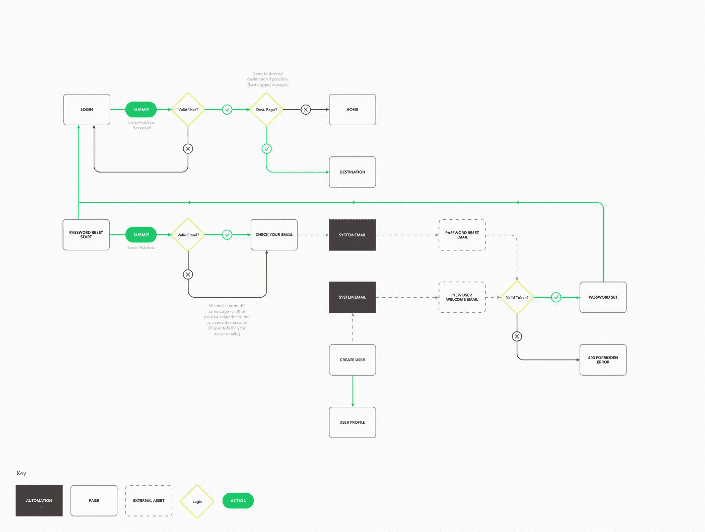
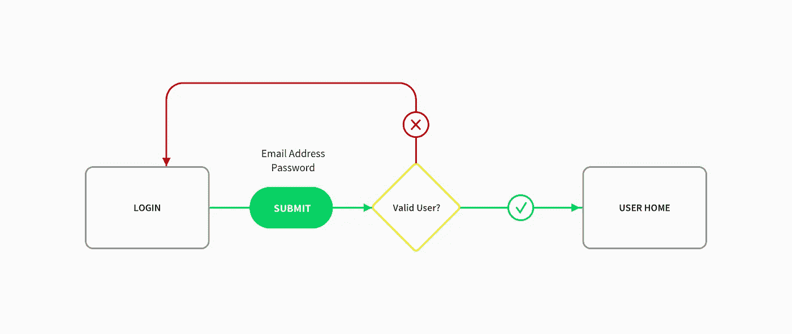
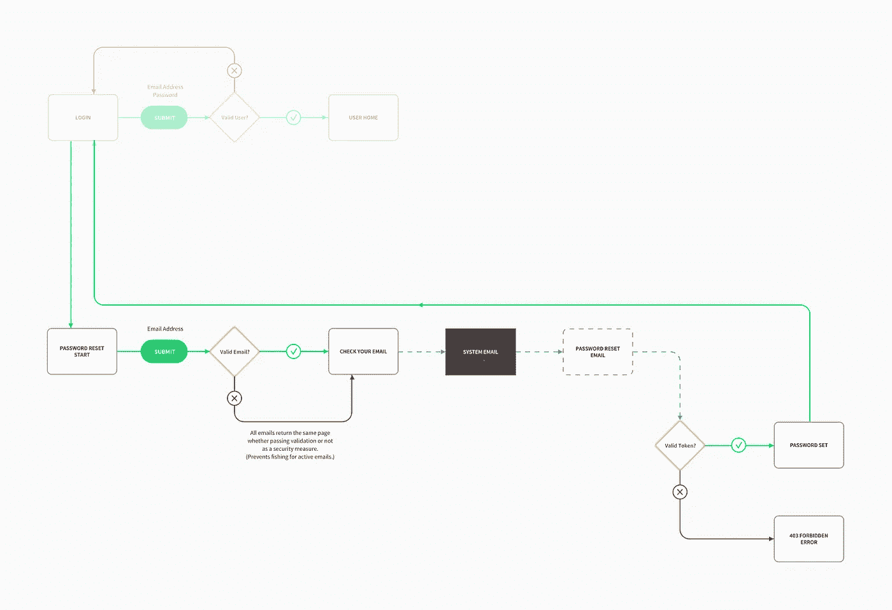
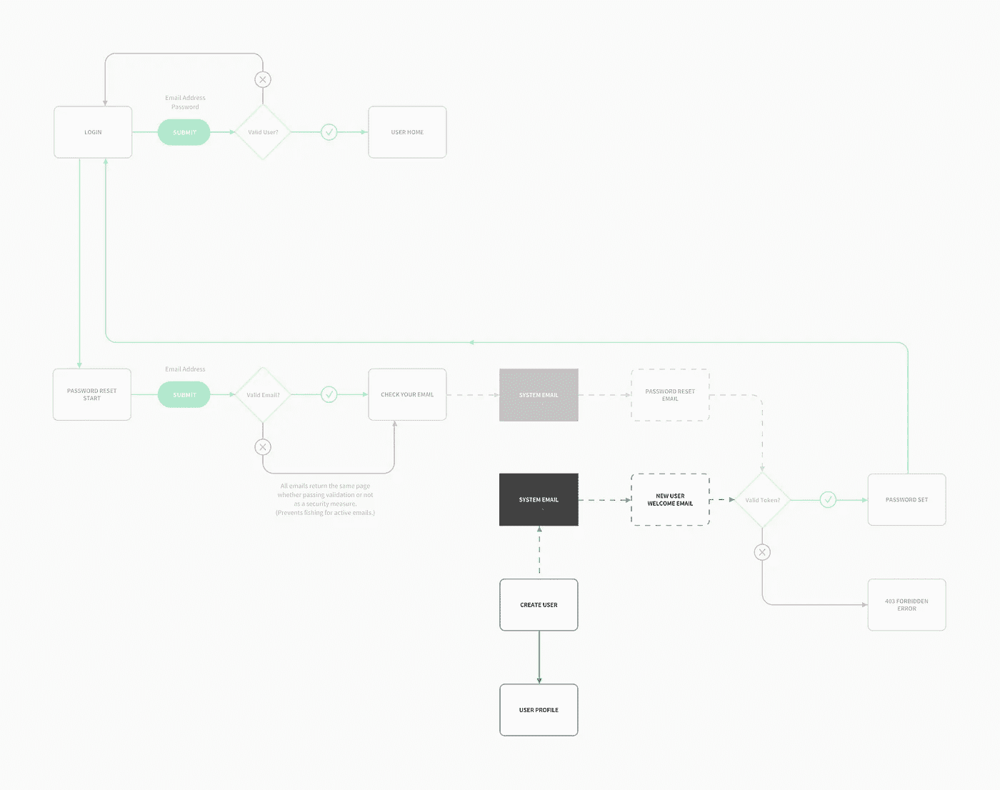
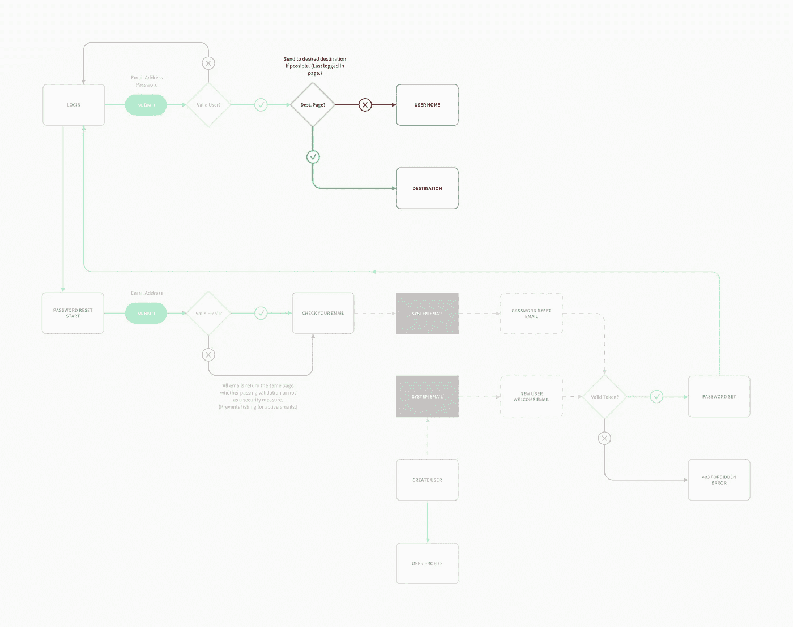

# 敏捷团队的 UX 设计:增量用户流

> 原文：<https://medium.com/hackernoon/ux-design-on-an-agile-team-incremental-user-flows-b9f551a9f096>

关于将传统的 UX 设计融入敏捷的 T2 模式，有很多好文章流传开来。它们往往很好地涵盖了原则，但我发现缺少的是以实用的方式向*展示*如何创建敏捷开发团队中用户体验设计师通常期望的资产和工件的内容。所以让我们这样做吧…

A user flow is a typical asset generated by a User Experience Designer

有许多资产和工件可以满足我们的定义，但是为了使本文的范围易于管理，我将挑选一些非常具体的东西:软件登录特性的用户流。这整个用户流是我们最终想要建立的。但是我们如何到达那里呢？

Scrum 软件开发通过构建一系列生产力冲刺(通常 1-3 周)来工作。在任何一个 sprint 中，你为一个特性设定了一个合理的小期望，你可以在 sprint 结束时发布给用户，然后执行。这通常被称为最小可行产品(MVP)。

这意味着对于每个 sprint，UX 设计师需要定义小的、可发布的、端到端的用户体验。随着团队不断发布软件并接收反馈，这可以依次建立起来。

因此，让我们实际定义我们的登录系统的 MVP。

User Flow — Login System MVP

它必须把一些人挡在外面，让一些人进来。我们能提供的最小 UX 是登录页面上的一个表单，该表单验证用户凭证并将其重定向到某个地方，或者重新加载页面并显示一条错误消息。

缺少一些功能。例如，我们还没有解决创建用户或重置密码的问题。在产品/功能生命周期的早期，我们手动地做了很多重要的事情，或者根本不做，但这是意料之中的。这个小；我们可以快速构建它，并展示给项目中的利益相关者。这会让我们得到第一个重要的反馈。

登录表单上的反馈！？

绝对的。

在这里，你将开始得到关于你的 UI、文案风格、速度和平台方面的响应、团队合作的方式等的反馈...这一切都将是微不足道的，但这才是重点。什么样的团队*不能*处理这么大的土豆？

当我爸爸教我射箭时，他让我站在离靶子三英尺的地方进行第一次射击。一旦我拉开了弓，错过的唯一方法就是它自发着火或者我被闪电击中(即使那样，我仍然可能通过释放准备尖叫着逃跑而击中目标)。

所以我击中了目标。然后我后退了一点，又撞了一下。再一次。再一次…

小东西易于定义、易于设计、易于构建、易于管理和易于运输。而大的东西完全是由小的东西组成的。一旦你让你的团队处于这种心态，你几乎可以构建任何东西。优先化成为困难的部分，而不是实施。

那么，下一步是什么？为我们的用户手动重置(和设置)密码不会有很好的效果。一旦我们的产品取得成功，这将成为一个大问题。对我们的用户来说，该工作流的端到端版本是什么样的？

User Flow — Login System v2

现在我们在谈话。我们在这里添加了一些东西，组成了一个完整的端到端密码重置体验。

1.  我们创建了一个从登录页面到密码重置页面的链接。
2.  重置页面有一个提交电子邮件的网络表单。
3.  电子邮件验证程序在后台运行。作为一项安全措施，如果他们输入的电子邮件与帐户无关，我们不会显示任何错误。我们不希望他们钓鱼直播帐户的电子邮件。
4.  在提交时，他们会被发送到一个确认页面，要求检查他们的电子邮件中的重置链接。
5.  如果提交的电子邮件通过验证，系统电子邮件模块将发送“重置您的密码”电子邮件。
6.  单击电子邮件中的链接会进入登录页面。它包含一个带有验证器的密码设置表单，用于查找与电子邮件地址相关联的安全令牌。
7.  我们还开始用 403 错误页面优雅地处理错误。

现在，这比我们的特色 MVP 多了很多。根据你的团队和你的技术水平，*更多的*可能仍然是小角色。如果不是，你总是可以进一步分解它。例如，您可以构建上面的步骤 1-4，并让电子邮件模块向开发人员发送一些信息，告诉他们手动重置它。

最重要的是，我们的功能有了 v2，这让我们*得到了更多的反馈*，所以在下一次冲刺中我们会更好地构建我们的东西。不要试图完美；不会发生的。努力做到*更好*。与完美相比，小土豆更好。

那现在怎么办？一旦账户被创建，我们就会非常体面地处理它们。让我们自动创建用户帐户，这样我们就可以快速地将新帐户添加到我们的系统中，而不会打扰到开发人员，他们目前正在手动将帐户输入数据库。

User Flow — Login System v3

那么对于用户来说，端到端的体验是怎样的呢？

1.  创建用户。
2.  查看新的用户配置文件。
3.  在后台，我们在去年 sprint 中构建的电子邮件模块向我们的新用户发送了一封欢迎电子邮件，其中包含一个“Set password”链接。(喜欢使用我们已经构建好的东西！)
4.  该链接与我们现有的(耶)“设置密码”页面。
5.  一旦他们设置了密码，使用现有的(yay)重定向逻辑将他们带到登录页面。

现在我们正在谈话！这太棒了。我们的软件开发人员可以停止向数据库中手动输入凭据，而更多地关注功能。很好的特性。例如，如果有人以前进入过系统，并试图返回该页面，但他们被注销了，该怎么办？让我们在登录后将他们重定向到他们想去的地方。

User Flow — Login System v4

发行说明，“登录的用户将被重定向到他们想要的页面。”这不是很好吗？现在我们已经超越了需求，我们正在消除需求。太棒了。去获取你的反馈，然后决定下一步做什么。

现在我们已经有了一些基本的安全措施…

1.  也许我们想添加双因素身份验证来提高安全性。
2.  或社交媒体登录来增加注册转化率。
3.  或验证码，以防止垃圾邮件，等等…

或者这已经足够好了，我们开始寻找其他的特性。这就是敏捷的全部魅力。你可以经常采纳反馈并重新评估你的优先事项，这样你就不会被困在一个大土豆后面。

这是对在敏捷开发团队中创建应用程序用户流的实际观察。最后一点…

仅仅因为你在不同的端到端用户体验块中工作，你就必须*而不是*限制自己只以那种方式思考。例如，在将整个用户流分解成易于理解的小块之前，我已经在文档的顶部规划了它。危险在于，你计划得越远，你冒的风险就越大，反馈会改变你的方向，你将不得不修改你的计划。

在风险积累太多并使你的计划变得低效之前，你可以提前做多少计划完全取决于环境。可能是一次冲刺，也可能是几个月。你对你的团队越放心，对你的产品和市场越了解，你就能在分解用户体验之前更有效地计划用户体验。

最后:工具对过程并不重要。但是我使用了 [Mac OS 草图应用](https://sketchapp.com/)来构建这个特殊的线框。我从这个在 [Dribbble](https://dribbble.com/) 上找到的草图的[免费用户流模板开始。](https://dribbble.com/shots/3019900-User-Flow-Diagram-Template)

Wade Meredith 自 2005 年以来一直从事设计、写作和编程工作。所有表达的观点都是他自己的，并不代表他的雇主、朋友、熟人或其他同事的观点。他的个人网站是[*WadeMeredith.com*](https://wademeredith.com)*。*