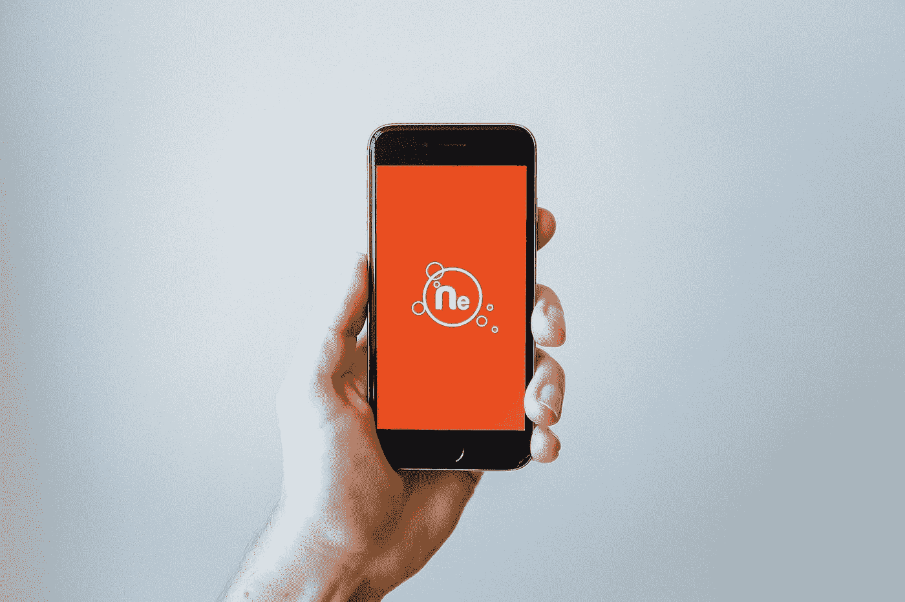

# 移动应用的 8 个基本体验设计考虑

> 原文：<https://medium.com/hackernoon/ux-ui-design-for-mobile-apps-d4e079adce37>

如今，移动设备被用于各种场合，并且日益增多。手机带来的便利不仅仅是打电话和联系人们。它们让你的生活更轻松。它们几乎被用于生活的各个方面，从银行业务到杂货店购物。

移动应用是一种很好的方式，可以让你的产品或服务接触到更多的用户，并通过移动设备增加你网站的流量。随着越来越多的网络流量来自移动设备，让用户通过移动设备访问网络已经势在必行。

当你要创建一个手机应用程序时，在设计中有两个重要的概念是不可避免的。事实上，这就是一切的开始。**用户界面**和**用户体验(UX)** 。理解这些概念以及它们之间的区别是很重要的。

首先，理解 UX/UI 移动应用程序设计的基础。UX 和 UI 是前端设计的两个不同学科。UI 是用户可以与之交互的组件和布局。你在屏幕前看到的是一个非常模糊的术语。

UX 是用户使用网站或应用程序的总体体验。这包括网站的可用性，应用程序的易用性，用户浏览网站的难易程度。

# 那么，移动应用的重要性在哪里呢？

这主要是因为来自移动设备的流量正在增加，并且随着越来越多的交易通过互联网发生，移动应用中有如此多的可能性。大多数公司鼓励用户使用他们的移动应用程序。便捷的移动应用程序为许多在线企业带来了更多的收入。因此，对于一个蓬勃发展的在线业务来说，移动应用程序已经成为强制性的。

因此，当创建一个手机应用程序时，设计师的工作就是创建用户界面，以满足用户的需求，并创造一个轻松愉快的体验。要做到这一点，UX 和用户界面都应该很棒。

一个应用程序必须非常令人愉悦才能吸引用户的注意力。但与此同时，当用户体验很差时，一个看起来很漂亮、有各种花哨功能的应用程序不会有所作为。

举例来说，如果一个应用程序有一个混乱的布局，用户不得不花更多的时间来搜索执行特定任务的功能，或者用户不得不花时间来理解应用程序中什么没有构成良好的用户体验。这将使用户离开网站，然后永远不会再访问。因此，在设计阶段，你必须时刻意识到短暂的注意力持续时间和较低的耐心才能有效地达到目的。

那么，在设计 UX 和 UI 方面的移动应用程序时，我们应该从哪里开始呢？第一步是了解目标用户和市场。对用户的需求做详细的研究。对这些需求的详细研究将有助于改善用户体验。应用程序的 UX 和 UI 的质量可以指示应用程序的可信度。

# 设计 UX 和用户界面之前需要考虑的事情

在开始设计移动应用的 UX 和用户界面之前，这里有一个需要考虑的事情的指南。

# 1 —响应性

响应能力已经成为前端开发不可或缺的一部分。你无法避免做出回应。无论你的应用程序是什么，它都应该适合观看任何尺寸的屏幕。

当你说移动设备时，你不仅仅是指智能手机。从智能手机到平板电脑等其他设备，屏幕尺寸各不相同，人们可以在旅途中使用这些设备访问网络。此外，还有两种不同的屏幕模式可以查看设备——横向和纵向模式。因此，设计应该考虑屏幕尺寸的这些变化。

此外，随着同一设备的新型号进入市场，设备的屏幕尺寸也在不断增加。与此同时，像[新 iPhone X](https://www.forbes.com/sites/ewanspence/2017/10/02/apple-iphonex-notch-design-arrogant-wrong-flawed/#753e0edd730c) 和三星 Galaxy 上的 infinity 显示屏这样的创新屏幕给移动应用程序的 UX 和用户界面带来了新的挑战和可能性。

# 2 —设计迭代

遵循原型制作、测试、分析和精炼设计的循环过程，以达到完美的抛光效果，这将使用户着迷，他们会带着满足感离开，因为他们已经做了他们想要做的事情，并且不会在过程中迷路。

# 3——保持简单

移动设备在不动产方面是短缺的。所以知道什么重要是关键。要显示哪些内容，隐藏哪些内容？这确保了轻松导航和简单易用的用户体验。

简单并不意味着极简设计。设计应该是这样的，用户应该能够在尽可能少的步骤中完成他们的任务。此外，要注意在一个屏幕上只显示一个行动号召。

# 5 —避免过度滚动

过度滚动真的很烦人。设计应该是这样的，用户不必滚动很长时间才能找到他需要的内容。相反，创建导航，可以引导用户到他需要得到的特定点。

# 6 —了解最新趋势

跟上最新的趋势对于创建最有效的 UX 和用户界面是至关重要的。了解什么在用户中越来越受欢迎，有助于学习和汲取灵感，从而创造出更好、更有效的设计。

# 7-手指友好型设计

在移动设备上，我们通过手指的触摸来导航。我们使用不同的手势来完成特定的任务，如滑动以进入下一个 onboarding 屏幕。类似地，我们有触摸、触摸并按住、双击、挤压和缩放等手势，允许我们操作移动设备。用户应该能够在移动应用程序中毫无困难地理解这些手势。

此外，人们拿手机的方式也不一样。他们有时用一只手拿着，有时用两只手，一只手拿着手机。大多数时候，人们用一只手使用手机，比如滚动屏幕或给别人打电话。但是当发短信时，用户需要双手。因此，设计必须能够通过牢记这些来促进用户的体验。

# 8 —给出反馈

应用程序有时可能需要一些时间来加载。但是如果没有反馈，用户可能没有足够的耐心继续等待应用程序加载。用户也可能认为应用程序坏了，并避免使用它。因此，不仅在加载网站时，而且在每次特定任务完成后，给用户反馈总是很重要的。订单成功下达时的行。用户应该得到一条消息，表明他所做的任务已经完成，否则会让他处于困惑的状态。

# 结论

为移动设备设计用户界面/UX 不同于桌面设备。在放置网站元素时，屏幕大小有限制。移动设备中使用的网站是通过触摸来访问的，因此必须考虑到这一点。此外，设计必须考虑到应用程序的响应能力。但是，当应用程序在移动设备上运行良好时，它会增加用户的可访问性，从而增加企业的用户数量。