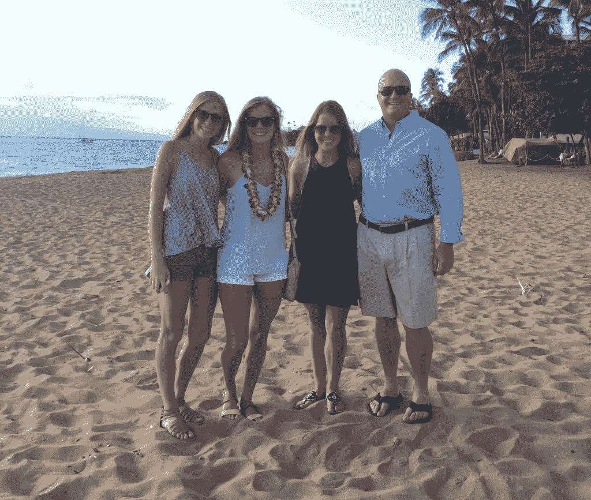

# 4 项科学研究证明所有的领导者都需要休息

> 原文：<https://medium.com/hackernoon/vacation-4-scientific-studies-prove-all-leaders-need-a-break-2ec9bb332dcb>

## 去度假

传统和不可协商的东西对我来说很重要。它们应该对你也很重要。我最大的不可协商性是和家人在一起的时间。从本周开始，我将继续一年一度的传统，和家人一起去 T2 度假。

# 假期创造锚

传统对任何家庭都很重要，因为它们是支柱。这些锚将家庭联系在一起。漂移少了。混乱少了。锚让你呆在你需要呆的地方——不管是字面上还是象征性的。

我倾向于以非常高的转速运行。这是我拒绝、补偿和放松的时候了(就像典型的 A 型人可能做的那样)。

# 为什么你不应该为度假感到难过

我过去常常对度假感到不舒服。但我不再相信了，你也不应该相信。

原因如下:

*   压力小:T4 美国心理协会的一项研究得出结论，假期可以减轻压力。同样，加拿大一项对近 900 名律师的研究发现，休假有助于缓解工作压力。
*   更健康:《美国医学杂志》发现，休假的人比不休假的人死于心脏病的可能性低 32%。
*   更有效率:一项调查发现休假的人更有效率。如果一家会计公司看到了假期的价值，我不知道谁会反对！
*   更高的表现:运动员休息得越多，表现越好(对于篮球运动员来说，休息得越多[甚至会带来更好的投篮命中率](http://www.nytimes.com/2013/02/10/opinion/sunday/relax-youll-be-more-productive.html))。多休息我会表现得更好。

我休假，这样我就可以为你、我的家人和朋友做一个更好的自己。你永远不应该对那些试图减轻压力、变得更健康、更有效率、表现更好的人感到沮丧。

如果你像普通美国人一样，[你每年要牺牲 9.2 天的带薪假期**来承受更大的压力，更不健康，更没效率，表现更差。**](http://articles.latimes.com/2012/nov/25/business/la-fi-1126-travel-briefcase-20121126)

**做更好的自己。休假。如果你需要我，我仍然有一个令人难以置信的团队在这里提供帮助。**

**你好。**

***原载于 2017 年 5 月 22 日*[*【dandoadvisors.com】*](https://dandoadvisors.com/leaders-vacation-time/)*。***

************

> **[黑客中午](http://bit.ly/Hackernoon)是黑客如何开始他们的下午。我们是 [@AMI](http://bit.ly/atAMIatAMI) 家庭的一员。我们现在[接受投稿](http://bit.ly/hackernoonsubmission)并乐意[讨论广告&赞助](mailto:partners@amipublications.com)机会。**
> 
> **如果你喜欢这个故事，我们推荐你阅读我们的[最新科技故事](http://bit.ly/hackernoonlatestt)和[趋势科技故事](https://hackernoon.com/trending)。直到下一次，不要把世界的现实想当然！**

****