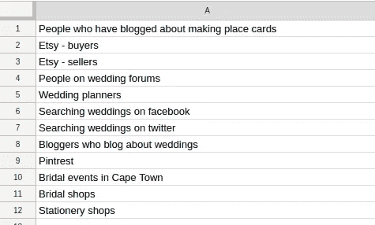
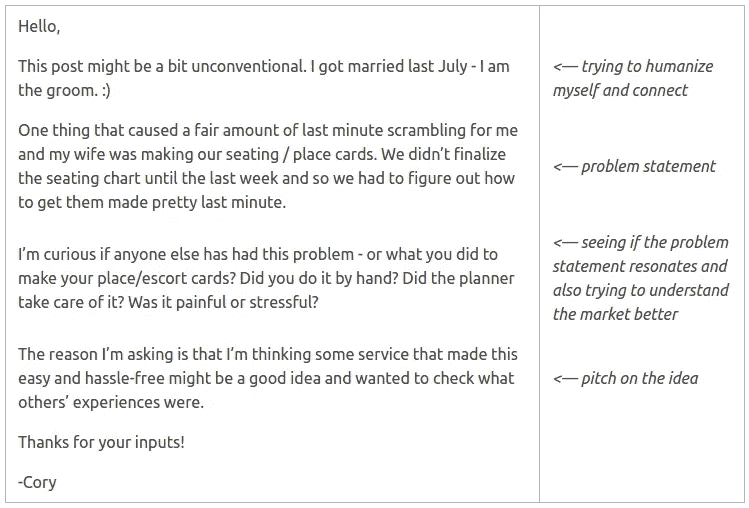
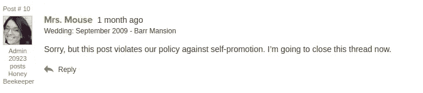
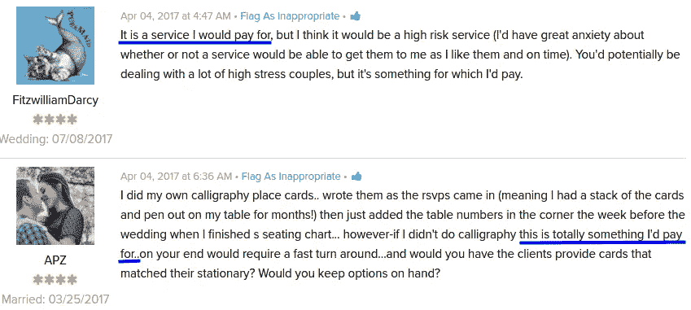
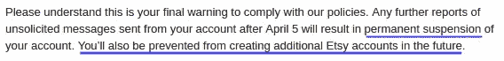
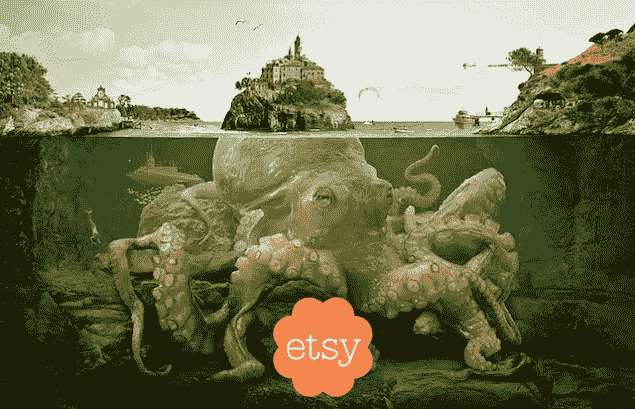
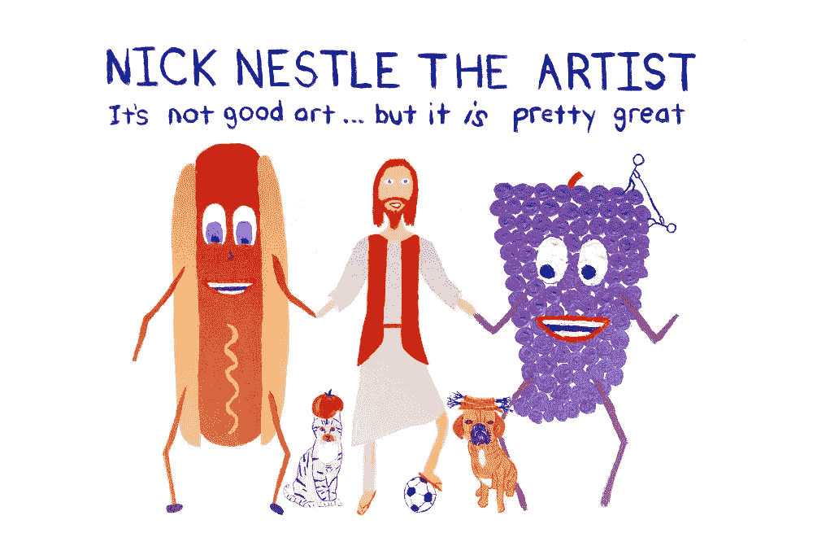

# 验证一个想法很难

> 原文：<https://medium.com/hackernoon/validating-an-idea-is-hard-5ac2579fee9a>

## 当你对营销一无所知时，把你的想法展现在人们面前比你想象的要困难。

如果你最近花时间阅读有关创业的书籍，你会听到的最常见的建议之一是，在投入大量工作之前，确保验证你的想法。

这个想法是，在你[花 8 个月时间建造没人想要的东西](https://www.reddit.com/r/Entrepreneur/comments/69gz4x/learning_when_to_call_it_quits_a_story_about/)之前，你通过做一些可怕的事情*与人交谈*来发现你的产品是否有需求。

在他的《[史诗般的 SaaS 创业指南——靠自己](/@cliffordoravec/the-epic-guide-to-bootstrapping-a-saas-startup-from-scratch-by-yourself-part-1-4d834e1df8c1)》中，[克利福德·奥拉维奇](https://medium.com/u/55e9fd9a459?source=post_page-----5ac2579fee9a--------------------------------)为这一过程提供了剧本。由于没有更好的主意，我想我可以用我的座位卡试试他的方法，看看效果如何。

> “如果你喜欢写代码，你会讨厌经营一家 SaaS 公司。” [*克利福德·奥拉维奇《史诗指南》*](/@cliffordoravec/the-epic-guide-to-bootstrapping-a-saas-startup-from-scratch-by-yourself-part-1-4d834e1df8c1)

现在可能是一个很好的时机来指出，如果你对我的座位卡的想法一无所知，你可能想快速浏览这篇文章的顶部来了解它，但一行总结是*这是一个应用程序，可以让你非常容易地在家里为婚礼制作打印的座位卡*。

# 找人

剧本的第一步是找出你的目标客户常去的地方。就我而言，我知道我想和两类人交谈:从事婚礼行业的人，以及即将结婚的人。

我头脑风暴了一个我可能尝试的地方的快速列表，包括婚礼论坛、婚礼博客、Etsy、Pinterest、当地婚纱店等。

# 论坛

论坛似乎是一个开始的好地方。我挑选了三个看起来拥有最大社区的网站，并着手获取我的第一批真实用户反馈。

## 写我的帖子

我发帖的主要目的是试图了解制作座位卡对人们来说是否是一个真正的问题，所以我写了一篇帖子，试图提出这个问题，并试图梳理出人们在用他们的座位卡做什么。

下面你可以看到我选择的文本和原因。

My very first idea validation posting.

# 把它拿出来

一旦我准备好了我的帖子，是时候把它放在那里，看看人们怎么说了。

我尝试的第一个地点是 hitched.co.uk。在创建了一个账户并提交了我的帖子后，它被放在了审核队列中——大概是因为我是一个新用户。帖子从来没有真正清空队列，所以我从来没有得到任何反馈。

*Drats！1 的 0。*

接下来是[婚礼蜜蜂](http://www.weddingbee.com/)。好消息是，这次[帖子通过了](http://boards.weddingbee.com/topic/how-to-handle-placeescort-cards/)，我得到了一些有用的反馈。坏消息是，在我对这个帖子发表第二条评论后不久，它就被关闭了:

Sorry Mrs. Mouse! I didn’t mean to break the rules.

*呸！2 的 0。大部分是。*

最后一个出场的是[婚纱照](https://www.weddingwire.com/)。这一次，[线程](https://www.weddingwire.com/wedding-forums/how-to-handle-placeescort-cards/946ae9fe134b3fc0.html)根本没有被审核或标记。更令人兴奋的是，至少有三个人在帖子里说他们愿意为此付费！

Validation! …or is it?

当时，主要基于这个反馈，我认为这是一个巨大的成功！论坛为我提供了我正在寻找的验证，我可以愉快地转向下一个观众。

**我应该在这里指出，这种态度——正如我经常做的那样——是完全错误和被误导的。但那是以后的话题。**

# Etsy

Etsy is where millions of people go to buy and sell creative products

论坛之后是 Etsy。Etsy 是我认为最有可能验证我的 place card 市场的另一半的地方:*我希望在我的产品中销售设计的设计师*。

我还希望他们能够告诉我，他们是否从客户那里听说过在模板上填写姓名的问题，因为我认为他们必须支持购买他们模板的人。

我稍微调整了一下我的论坛帖子来迎合观众，但是主旨是一样的。然后我搜索“可打印的座位卡”,并开始给卖模板的人发信息。

事情进行得很顺利，直到我到了第四个设计师那里，我遇到了障碍。

具体来说，当我点击“发送”时，我得到一个弹出消息，说:“您的对话已被暂时禁用。请联系支持人员。

Turns out unsolicited messages violate Etsy’s policies. Who knew? [image source](https://clipartfest.com/)

我的第一个想法实际上是惊讶。Etsy 怎么这么快就让我关机了？

我认为我使用 Etsy 作为销售/验证渠道是如此聪明，但显然 Etsy 已经经常看到这种类型的事情，它建立了一个人工智能，可以在 3 条消息后自动关闭营销人员。

在 Etsy 的支持下，几个来回之后，我才得以恢复帐户，但是他们很清楚要执行一个强有力的零容忍政策。

Etsy? More like Threatsy.

结论？Etsy 作为验证平台已经过时了。

# 插曲:互联网是对营销人员

就在这个时候，我开始意识到两件现在看来显而易见的重要事情:

1.  *互联网上的每一个传播平台都会被用作营销平台。*
2.  *他们都知道这件事。*

进入这个项目，我想我可以在我能找到的每一个互联网论坛上做任意数量的冷接触、表格爆破和自我推销。现在我知道大多数网站积极地建立系统来阻止像我这样的人这样做。

对于任何有实际网络营销经验的人来说，这个启示可能是显而易见的，但对我来说，它真的很有趣！

我认为这些政策总的来说让互联网变得更好，我完全支持它们。

它们只会让企业家的生活更加艰难。

# 可打印的文具店

在选择了 Etsy 之后，我决定尝试通过他们的网站直接联系一些可打印的文具店。

然而，滑稽的是——也是让我沮丧的是——几乎所有的网站都是通过 Etsy 运营的！

我会在一个看起来完全正常的网站上找到一个联系方式，结果却发现这是一个秘密的 Etsy 信息信箱。

我不想再冒被禁的风险，所以基本上远离这些。

The tentacles of Etsy reach far and wide among the makers on the Internet.

# 博客作者

我的下一个途径是婚礼(和婚礼设计)博客。这要容易一点，因为他们大多数人在博客上都有电子邮件地址或联系方式。我再次调整了我的模板，确保我研究了每一个博客，个性化了邮件，然后开始给人们发邮件。

这是我第一次真正有希望的联系！

一位非常受欢迎的婚礼博主不仅回复了我，还通过一系列电子邮件支持我的想法，给了我大量非常有用的信息和建议，甚至提出分享她的一些设计，并帮我推广我的(最终)产品！这让我意识到**一个强有力的联系可以弥补一小时又一小时的失败拓展**。

我从不同的博主那里得到了一些积极的回应，总的来说，我的邮件回复率高得惊人。很多人对在我的网站上列出他们的设计感兴趣，也对可能的联盟营销伙伴关系感兴趣。

# 验证！…或者是吗？

在这一点上，我感觉非常好。我从两个论坛(来自真正结婚的人)和婚礼博主(了解这个行业的人)那里获得了几个数据点来支持我的想法。此外，我已经证实设计师会有兴趣使用我的市场来销售设计。一切似乎都井井有条。

然后，我从那个我一直在遵循其剧本的人那里得到了一些好建议:史诗指南的创作者，克利福德·奥拉维奇本人。听到我的项目后，Clifford 这样说道:

> 专注于婚礼顾客。他们会给你钱。他们会成就或打破你的想法。你需要看看你是否能接触到这些人，他们是否想要你提供的东西。

他当然百分之百正确。

设计师显然会很高兴有一个基本上免费的收入流，但这种收入流只有在另一边有人愿意购买位置卡的情况下才存在。我已经证实了人们“认为”这个想法是好的，但是他们真的想要吗？

*是时候和一些新娘谈谈了。*

# 新娘在哪里？

问题是，我很难找到它们。

Finding people getting married to talk to is harder than you might think.

正如我们已经了解到的，人们不喜欢收到垃圾邮件，所以平台不喜欢让营销人员容易向人们发送垃圾邮件。我想过冷淡地接触那些在脸书谈论婚礼的人，但是我和 Etsy 的经历让我犹豫了。*我想冒险让我的账户被脸书盯上吗？*

我觉得卡住了。每天肯定有成百上千的人结婚，我不知道去哪里找他们。

# 尤里卡时刻

这时候我有了另一个启示，回想起来，对我来说应该是完全显而易见的。

灵光一现实际上来自一个朋友——博客读者兼有抱负的艺术家[尼克·内斯特](http://www.nicknestle.com/)他发邮件告诉我，他的姐姐要结婚了，想知道我是否想和她谈谈这个项目？

This is the actual business card of the person who helped me figure out how to find brides. Also [his art is hilarious](http://www.nicknestle.com/).

那时我才意识到我有一个社交网络。

当然，你的社交网络中的人比世界上一般的陌生人更有可能帮助你 100 倍。我不是认识几个在接下来的几个月要去参加婚礼的人吗？

我打赌你现在正在读这篇文章，并且在想“等等，这怎么是一个灵光乍现的时刻——这难道不是世界上最显而易见的事情吗？”

答案是，是的，这是显而易见的，是的，我花了很长时间才意识到这一点。

所以，我就这样开始寻找我的新娘。到目前为止，我只和两个人谈过，但这是一个开始，我还会有更多的对话。

到目前为止，它真的很有用。

*最初发表于*[*www.coryzue.com*](http://www.coryzue.com/writing/idea-validation)*。*

*我在这篇文章中提到的一件事是，我曲解了很多我从人们那里得到的早期反馈。在我的下一篇文章中，我打算更多地讨论这个问题——以及当你对一个想法感到兴奋时，正确地解读反馈有多难。*

另外，如果你喜欢这篇文章，请点击绿色小心脏，帮助其他人找到它！

> [黑客中午](http://bit.ly/Hackernoon)是黑客如何开始他们的下午。我们是 [@AMI](http://bit.ly/atAMIatAMI) 家庭的一员。我们现在[接受投稿](http://bit.ly/hackernoonsubmission)并乐意[讨论广告&赞助](mailto:partners@amipublications.com)机会。
> 
> 如果你喜欢这个故事，我们推荐你阅读我们的[最新科技故事](http://bit.ly/hackernoonlatestt)和[趋势科技故事](https://hackernoon.com/trending)。直到下一次，不要把世界的现实想当然！

