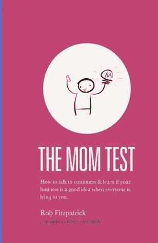
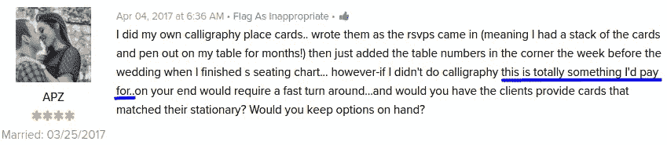
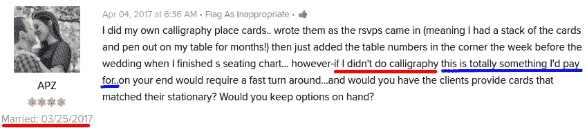
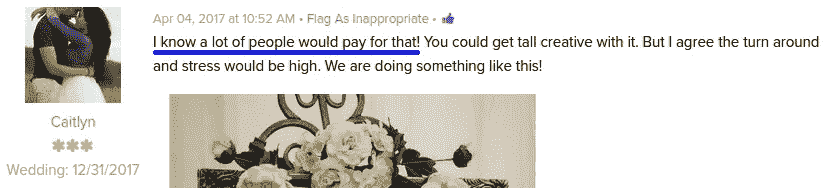
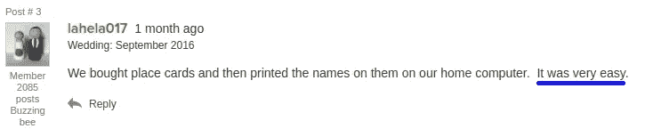

# 验证一个想法是困难的:第 2 部分

> 原文：<https://medium.com/hackernoon/validating-an-idea-is-hard-part-2-3724af8f7351>

## 当你对一个想法感到兴奋时，陌生人的反馈可能会误导你。

几周前，我写了一篇关于我早期在验证我的定位卡想法时失败的文章。当我坐下来写作时，我的计划主要是讲述自己被踢出论坛和被网站威胁进行自我推销的故事，但当我重读这些对话时，有趣的事情发生了:

*我对我得到的反馈做出了完全不同的解释。*

虽然才过了一个月，但我觉得我在阅读时完全变了一个人！这是如何发生的，为什么会发生，以及从中可以学到什么，是这篇文章的主题。

# 问题 1:你不能相信任何人

所以那个月发生的一件大事是，我读了一本有趣又有帮助的小书，叫做《妈妈测试 T4》，作者是 Rob Fitzpatrick。这本书的主题是“当所有人都在对你撒谎时，如何与客户交谈并了解你的业务是否是一个好主意。”

[The Mom Test](http://momtestbook.com/) is a super-helpful guide to getting better at interpreting feedback

关键的部分是**大家都在骗你**。

大多数人不一定*知道*他们在对你撒谎——少数人可能知道——但是人们*确实*撒谎，大多数是无意的。这种情况的常见原因包括:

1.  他们不想伤害你的感情
2.  他们支持你取得成功
3.  他们不擅长预测人类行为

人们撒谎最常见的方式是在钱的问题上。我们来看几个和这个话题相关的常见谬误/谎言。

## “我会为此买单”的谬论

人们喜欢说他们会为东西付钱，尤其是处于构思阶段的东西。

这是为什么呢？

*因为免费！*

说“我会为此付出代价”不会让你付出任何代价。$0.实际上是 0 次。在这个过程中，你会看到有人变得兴奋，鼓励他们去追寻自己的梦想。

> 具有讽刺意味的是，说你会为某样东西付钱是如此容易的原因是你实际上并没有付钱。

所以，你不能把“我愿意为此付钱”理解为愿意付钱。那你怎么测试它呢？

你必须真的试着拿走他们的钱。

以下是我的典型经历:

> ***潜在客户*** *:我完全愿意为此买单。*
> 
> 我, *:太好了——10 美元，我们现在就能搞定一切！*
> 
> 潜在客户:嗯，我不确定我现在是否准备好了。
> 
> ***我*** *:为什么不呢？你刚刚说你会付钱的。*
> 
> ***潜在客户*** *:嗯……我需要知道*【它做了一些它还没有做的事情】*我想看看还有什么其他选择……*

让我们回顾一下那些我认为证实了我的想法的论坛帖子。有了我的新观点，我可以看到他们充斥着“我会为此买单”的谬论。

所以这里我们看到有人说他们会为我的服务付费。太棒了。对吗？

嗯，不，不是真的。

如果我们仔细观察，我们可以发现这个人说谎的多种原因:

原因 1:她写书法，所以永远不会使用这项服务。

理由二:她已经结婚了！近期肯定不会买座位卡。

**结论:不要相信任何人说的“我愿意为此付钱”，只相信给你钱的人。**

## “其他人会为此买单”的谬论

“我愿意为此买单”谬论的近亲是“其他人愿意为此买单”谬论。事实上，在我的案例中，当人们说他们会为我的产品付费时，这几乎总是人们实际上的意思。这是一个在野外的完美例子:

如果你不训练自己认识到这一点，“别人会付钱”甚至比“我会付钱”更糟糕。这听起来很像是一种认可，但事实上，这应该比“我愿意付钱”更缺乏自信。这一点尤其正确，因为它更难反驳——人们只是在陈述一个和你自己一样无知的观点。

当有人说“其他人会为此付出代价”时，他们真正想说的是“我希望你成功，在我思考这个问题的三秒钟内，我不认为这是不可能的。”

这么说的话感觉不太像是认可，对吧？

# 问题 2:你不能相信自己

所以现在你知道你不能相信任何人，但这实际上只是问题的一半。

另一半是*你不能相信自己。*

你问人们这些问题*是因为你想得到某个答案*作为人类，我们非常善于过滤掉与我们自己的信念相冲突的信息，并接受证实它的信息。

你可能会认为这种现象是[确认偏差](https://en.wikipedia.org/wiki/Confirmation_bias)，这种现象非常普遍，以至于有一整个领域都在研究它。

> *确认偏差有助于* ***对个人信念的过度自信*** *并能在面对相反证据时维持或强化信念。*
> 
> *—确认偏差，* [*维基百科*](https://en.wikipedia.org/wiki/Confirmation_bias)

当你试图验证你的想法时，你极易受到确认偏见的危害。

## 看到它的实际应用

回到我自己的想法，当我第一次开始在论坛上发帖并与其他人分享想法时，我只有一个目标:*确认这是一个好主意。*

这让我很容易快速跳过并忽略任何不符合我自己想法的评论，并接受任何证实我正在做某事的评论(通常是上面提到的谬误之一)。

有了一点距离和更多的知识，我可以重温一些早期的论坛帖子，看看我的观点是如何从我早期天真乐观的日子变成我现在稍微不那么天真但可能仍然完全无知的观点的。

这里有一个帖子我第一次完全忽略了，来自[一个婚礼蜜蜂论坛](http://boards.weddingbee.com/topic/how-to-handle-placeescort-cards/)的帖子。

通过说在家里不用我的工具手工打印位置卡是“非常容易的”，这个人基本上是在说我试图解决的问题不存在。

有很多这样的评论散布在整个帖子中。例如，这里有更多来自[的语录《婚礼上的丝线》](https://www.weddingwire.com/wedding-forums/how-to-handle-placeescort-cards/946ae9fe134b3fc0.html):

*   打印它们最多花了一个小时
*   “我们成功了。这并不难。”
*   "如果你从铸币厂购买座位卡，他们会免费印制，运送速度也很快。"

所有这些人基本上都在说“这对我来说不是真正的问题”，他们值得一听。

**结论:花时间阅读和处理每一条反馈，积极的和消极的，并且非常清楚自己的确认偏差。**

# 那么你实际上是如何验证想法的呢？

当我给我妻子看这篇文章的草稿时，她回答如下:

> 写完这篇文章后我最大的疑问是:“好吧，都难了。那么…我该怎么做？那么，与用户对话还有意义吗？”很好奇你的实际外卖是什么。

什么*是*我的实际外卖？

我琢磨了一会儿，觉得“我一无所知”听起来并不像是一个很好的总结，并以下面的句子结束:

**用*信息*验证想法比用*意见*验证想法要好得多。**

我*的确*从论坛帖子中获得了很多有价值的信息，但它是通过*信息*传达的，而不是通过*人的观点*传达的。例如，我从论坛上了解到的一件事是，很多人——大概有三分之一的回复者——正在家里打印座位卡。这意味着提供基于在家打印的服务不会失败，因为没有在家打印的需求。

我也学到了一些关于市场的东西，比如有时候座位卡完全是由婚礼策划人处理的。再说一次，这是有价值的信息，并为我打开了一个新的受众尝试和目标。

在定价方面，你可以用一种非常简单的方式从观点到信息——不要问他们*会不会*付钱，问他们*会不会*付钱。这是知道他们是否真的愿意的唯一方法。

所以，是的，如果你为人们打开一扇门让他们撒谎，他们会对你撒谎，但前提是你要征求他们的意见。

如果你问他们事实——或者找到一种方法将他们的观点转化为行为——你更有可能了解真相。

*原载于*[*www.coryzue.com*](http://www.coryzue.com/writing/idea-validation-2/)*。*

*如果你喜欢这篇文章，我强烈推荐你阅读* [*【妈妈测试】*](http://momtestbook.com/) *，里面有更多的细节。如果你能点击绿色的心来帮助其他人找到它，我将不胜感激。非常感谢。*

> [黑客中午](http://bit.ly/Hackernoon)是黑客如何开始他们的下午。我们是这个家庭的一员。我们现在[接受投稿](http://bit.ly/hackernoonsubmission)并乐意[讨论广告&赞助](mailto:partners@amipublications.com)机会。
> 
> 如果你喜欢这个故事，我们推荐你阅读我们的[最新科技故事](http://bit.ly/hackernoonlatestt)和[趋势科技故事](https://hackernoon.com/trending)。直到下一次，不要把世界的现实想当然！

