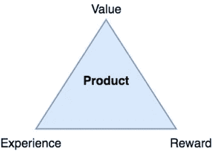

# 价值、体验和回报

> 原文：<https://medium.com/hackernoon/value-experience-reward-23628ef8ce82>

一个[框架](https://hackernoon.com/tagged/framework)用于构建成功的&令人愉悦的产品

每天都有很多产品诞生，作为产品经理，你有责任将你的产品交付给合适的受众。

那么，在开发你的产品时，你应该遵循的指导方针是什么，你应该关心什么，你如何知道你交付了一个好的产品还是一个坏的无用的产品？

我最近能够开发一个思维框架，这将有助于回答这些问题，并让我们走上正确的轨道，确保我们设定正确的目标，并知道我们将走向何方。我把这个框架叫做:**或者 ***值，经验&奖励。*****

**顾名思义，该框架由三个关键组件组成:**

****

# **价值:**

**你必须问自己:我的产品提供的价值是什么，它将如何让用户生活得更好。交付有价值的产品一点也不容易，实际上这是一个艰苦而漫长的多次迭代的过程。这个世界充满了无用的想法，人们已经运出，没有人在使用它，只是因为他们没有问自己这样的问题。**

**当然，思考价值在每个阶段都是有价值的，尽管在开始时，当你想验证你的假设并确保你在正确的轨道上时，它相对更重要。**

# **体验:**

**用户将如何接触和使用你的产品？媒介是什么，是在手机上、桌面上还是通过 API 间接传播？用户将如何与您的系统和其他用户交互，总体体验如何？**

**同样，这个世界充满了大量有价值的应用程序，但它们的创造者没有付出足够的努力来考虑用户体验、用户旅程和活动地图。在这一步，成功的用户旅程的定义至关重要。**

# **奖励:**

**现在你已经开发了一个具有巨大价值和惊人体验的惊人产品，下一个要问自己的重要问题是:用户投入时间和精力使用它将得到什么回报？**

**有时，价值本身就足以作为奖励，但在大多数情况下，用户需要获得奖励，可以是物质的或情感的，也可以是直接或间接的。**

**最后，你必须确保这三个关键部分之间的平衡，并根据产品的阶段设定它们的相对重要性和优先级。这是一个思考的框架，我认为在产品的整个生命周期中都是有用的，而不仅仅是特定阶段的一次性工作。**

**我已经在我现在的公司 [Onfido](http://onfido.com) (我是产品经理)以及我的宝贝[初创公司](https://hackernoon.com/tagged/startup) [知识官](http://knowledgeofficer.com)应用了这个框架。在 **KO** ，我们致力于为公司提供最好的内容，并通过增加团队知识来帮助他们更快、更有效地工作。**

**KO 不是关于新闻的；我们专注于改变生活的、深刻的和永恒的知识，让你走在潮流的前面！我们的**价值观**是区分知识和新闻，以及低质量的知识和来之不易的知识。我们希望你在 KO 上读到的一切能让你更进一步，加深你的知识。**

**我们也相信阅读和分享知识不必被认为是一个无聊的过程！这个过程需要重新设计，让**获得知识的体验**既有益又有趣。**

> **我们相信你今天学到的一些东西可能会帮助你在不久的将来改变你的职业，这些东西会改变人类，这些信息非常宝贵，不能不分享。**

***如果你还没有听说过* [*知识官*](http://knowledgeofficer.com) *，请查看我们的* [*发布帖*](/@Ahmed_Sharkasy/the-knowledge-officer-is-now-live-908422a4175f) *如果你喜欢这款产品请在* [*上献上你的爱品，在*](http://producthunt.com/posts/knowledge-officer/) *上关注我们的更新* [*上 Facebook*](https://www.facebook.com/knowledgeofficer/)*&***

**让我知道你对 VER 框架的想法！**

************

> **[黑客中午](http://bit.ly/Hackernoon)是黑客如何开始他们的下午。我们是 [@AMI](http://bit.ly/atAMIatAMI) 家庭的一员。我们现在[接受投稿](http://bit.ly/hackernoonsubmission)，并乐意[讨论广告&赞助](mailto:partners@amipublications.com)机会。**
> 
> **如果你喜欢这个故事，我们推荐你阅读我们的[最新科技故事](http://bit.ly/hackernoonlatestt)和[趋势科技故事](https://hackernoon.com/trending)。直到下一次，不要把世界的现实想当然！**

****