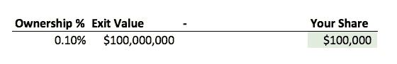
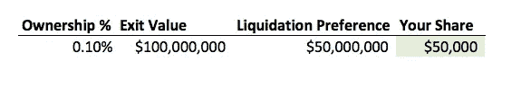
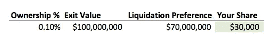
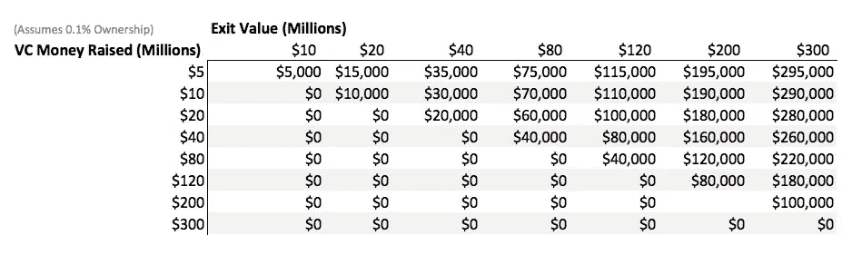

# 评估初创公司员工的股票期权

> 原文：<https://medium.com/hackernoon/valuing-stock-options-for-startup-employees-c1b223a74bb8>

我经常听到人们对自己公司授予的股票期权感到兴奋，但不知道这些期权的实际价值。作为一家初创公司的首席执行官，我想为我们目前和未来的员工写一份关于股票期权如何运作的快速指南，并给出一些关于如何给你的期权授予分配财务价值的经验法则。

*【免责声明:我不是律师，股票期权计划可能会有微小的差异，从而导致价值的巨大变化。我在这里假设了“普通”的股票期权，但是你应该阅读你的期权文件，以了解你的情况可能会有所不同。此外，这还假设了风险投资公司的期权；上市公司的期权是一种完全不同的东西。]*

# 工资+股权

如果你曾经在一家初创公司获得过一份工作，你可能会听到招聘经理说类似这样的话:“我们比不上大公司的薪水，但我们会给你 X 千份股票期权，所以你有巨大的上升空间！”。初创公司的期权在协调投资者、经理和员工激励方面做得很好。当事情进展顺利时，他们还可以返还给员工改变生活的一笔钱。然而，人们经常高估他们的股票期权，导致他们的公司被收购或上市时失望。

# 有什么选择？

股票期权使您能够以预先确定的价格(“执行价格”)购买公司的股票。如果你的期权计划让你以每股 0.10 美元的价格购买股票，而公司以每股 1.00 美元的价格出售，你每股获利 0.90 美元。不错！

# 错误 1:不知道你的所有权比例

一个雇员可能知道他们有以 0.10 美元购买 10，000 股股票的期权。但是私有公司并没有公开的股价，所以知道你的股票值多少钱是很棘手的。**你需要知道你可以购买的股票数量，以及公司已经发行的股票总数。**很多私企不会告诉你已经发行的股票总数。**如果一家公司这样做，假设你的期权毫无价值。没有这些信息，你无法评估股票的价值。在 [MedCrypt](https://www.medcrypt.co) ，我们有大约 530 万股流通股。因此，拥有 10，000 股期权的员工可以拥有公司大约 0.19%的股份。**

要计算你的持股比例，用你的股份数除以发行在外的股份总数。下表显示了在几种不同情况下，拥有 10，000 份期权的员工的相对所有权百分比。

# 错误 2:使用风投对你公司的估值

人们会听说一位风险投资家(VC)将他们的公司估值为$1B，然后简单地将他们的所有权百分比乘以$1B。这可能会导致巨大的失望。

当风险投资者投资公司时，他们几乎总是获得“优先股”，这些优先股带有一些额外的特征。这些特征之一是“清算优先权”。这意味着，如果公司被收购，优先股股东将在任何其他股东获得一美元之前收回他们的初始投资。

让我们看看一个人，他在一家刚刚被 1 亿美元收购的公司里，拥有 1 万股期权。他们可能认为自己的期权价值 10 万美元。

如果该公司已经筹集了 5000 万美元的风险投资资金，那么在清算优先权之后，股东之间实际上只剩下 5000 万美元。因此，这位员工的 10，000 份期权实际上价值 50k 美元。

如果该公司已经筹集了 7000 万美元，情况就更糟了。

# 评估你的股票期权的方程式

*你的钱=(你的股份/总股份)*(退出价值-筹集的钱)*

下面的表格显示了一个拥有公司 0.1%股权的员工的期权价值，以及各种不同的清算偏好和退出价值。

图表的整个左下角显示 0 美元，这不是巧合。如果一家公司的售价不高于其从投资者那里筹集的资金，普通股基本上就一文不值。

# 其他考虑

## 保留退休金的权利

员工期权几乎都有一些“归属期”。这意味着你实际上必须为公司工作一段时间才能获得期权。对于雇员来说，通常的授权期是 3 年。

如果公司在你的期权被授予前出售了怎么办？**除非你的公司提供“加速行权”，否则你就没那么幸运了。**

## 行使你的选择权

为了让你的“期权”变成“股份”，你需要“行使”你的期权。那意味着你需要写一张支票。如果你有 10，000 份期权，执行价格是 0.10 美元，你将向你的公司开一张 1，000 美元的支票来获得这些股票。

如果你决定离开公司，你通常只有 90 天的时间来行使你的期权。这意味着你将辞职，并在离开的时候给你的老板开一张大额支票。许多员工在离开公司时没有行使他们的期权，这意味着这些期权对员工来说基本上价值 0 美元。(这么多是为了弥补更低的工资！)

## 我什么时候可以出售我的股份？

在风投风格的公司里，你只有在 1)公司被收购，或者 2)公司“上市”(即首次公开募股)的情况下，才能真正出售你的股份。这两种情况发生的概率都远低于 100%。同样，如果该公司从未出售或首次公开募股，你的期权可能价值 0 美元。

# 结论

我非常支持员工在自己的公司拥有股权，而股票期权是最常见的方式。但不要以为 1 万份期权就能弥补 1 万美元的减薪。为了评估你的选择，你需要知道很多信息。

如果你想为一家解决大问题的公司工作，这家公司向员工授予股权，并对公司的运营透明，那么 MedCrypt 正在招聘！我们希望收到您的来信。

******

> *[黑客中午](http://bit.ly/Hackernoon)是黑客如何开始他们的下午。我们是 [@AMI](http://bit.ly/atAMIatAMI) 家庭的一员。我们现在[接受投稿](http://bit.ly/hackernoonsubmission)并乐意[讨论广告&赞助](mailto:partners@amipublications.com)机会。*
> 
> *如果你喜欢这个故事，我们推荐你阅读我们的[最新科技故事](http://bit.ly/hackernoonlatestt)和[趋势科技故事](https://hackernoon.com/trending)。直到下一次，不要把世界的现实想当然！*

**