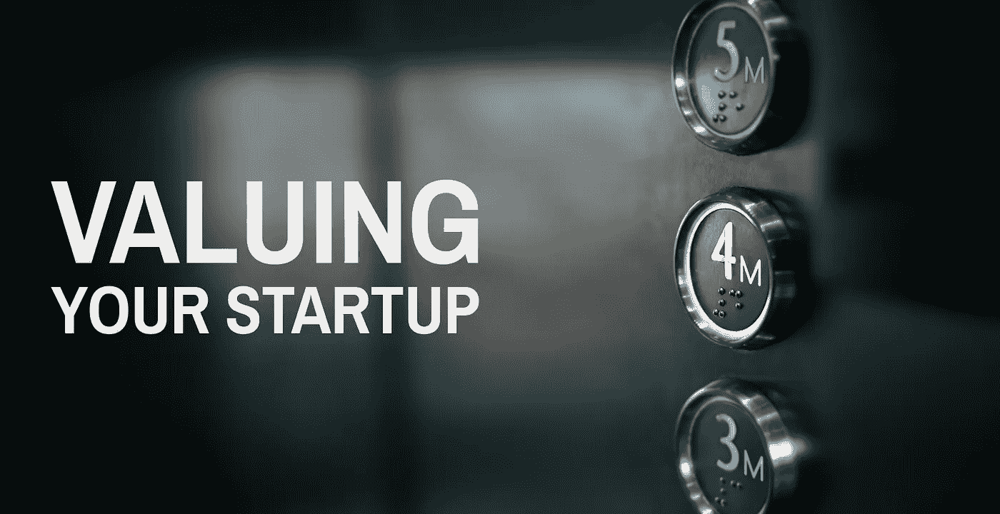

# 评估你的创业

> 原文：<https://medium.com/hackernoon/valuing-your-startup-3e0708b7e298>

看到 200 万美元出现在你公司的银行账户上是一种很神奇的感觉！这是我们用来为 SlideRocket 筹集 A 轮融资的剧本:

1.  建立一个 MVP 并获得牵引力
2.  算出要筹集多少钱
3.  吸引大量投资者(包括战略投资者)
4.  求解所有权百分比，而不是投资前估值

这是我举办的评估创业公司研讨会的视频:

*如果你正在筹集资金，并希望* [*快速创建投资者准备好的财务预测*](https://rebrand.ly/RocketProFormaMD) *(我也在那里发布了大量其他创业资源)*

## 1.建立一个 MVP 并获得牵引力

SlideRocket 是云中的演示，最初面向商业用户。

我和另外两个人一起创办了这家公司，我们三个人都有来自其他业务的收入。我们正在建立我的演示公司的下一代，所以我有客户，我们计划在新系统准备好的时候带他们过来。我的合伙人有几个月的离职金。

因此，我们能够自筹资金的想法和原型阶段。我们讨论过通过可转换债券筹集资金，但决定等到我们有了更多动力，以便进行更大规模的融资，并获得更好的条款。

我们的优势在于从产品市场契合度入手，因为我已经有了付费客户，所以我们专注于打造他们想要的产品。2008 年 3 月，我们在 TechCrunch 上做了一个[预告](https://techcrunch.com/2008/03/19/sliderocket-presentation-web-app-enters-private-beta-get-your-invite-here-2/)，并开始在我们的等待名单上注册。

六个月后的 10 月，我们启动了这个项目，12 月，我们筹集了资金。因此，我们的投资者可以清楚地看到用户采用我们服务的速度有多快，我们也消除了很多猜测和风险。

## 2.算出要筹集多少钱

如果你正处于构思阶段，那么从朋友和家人那里争取 2.5 万到 5 万美元。或者说服你的第一个大客户预付。或者存足够的钱，你可以像我们一样自己投资。

在 SlideRocket，我们有一个数千人的等候名单，包括免费和付费用户(尽管还没有真正的收入)，以及我以前公司准备迁移的客户。

我们制定了五年的财务预测，并决定根据预测的收入和员工人数筹集 200 万美元。

对于处于我们这种地位的公司，Sari Azout——Level Ventures 的合伙人和 Rokk3r Labs 的常驻企业家——建议在 18 个月内每人每月预算 1.5 万美元，以支付工资、办公场所、设备、服务器等一般成本和误差幅度。

因此，按照这个比率，我们的 200 万美元将为我们提供 750 人 18 个月的时间，这或多或少就是我们用这笔钱做的事情。那时我们有两个创始人，我们聘请了一名营销副总裁、一名首席开发人员、一名质量保证主管、一名内部销售代表和一名业务开发主管。

事实上，我们在大约 18 个月内花光了这笔钱。

## 3.吸引大量投资者(包括战略投资者)

筹款很像约会，我们必须亲吻许多青蛙(无意冒犯我们遇到的任何人)。我们采访的人分为两类:风险投资公司(VC)和战略投资者。

战略投资者是投资创业公司的大公司，我们有一个一流的网络服务公司，他通过我们的 TechCrunch 文章找到了我们。这导致了一系列富有成效的对话，他们最终提出投资。

我们同时会见了风投和其他潜在的战略投资者。这些会议大部分都没有进展，有时人们很感兴趣，但我们可以告诉他们不适合。一位风险投资者希望我们改变我们的商业模式和行为——这对一家初创公司来说要求太高了！

我们通过朋友和同事获得了很多投资者的介绍。我们还聘请了 DLA Piper，这是一家在硅谷有很大影响力的律师事务所，他帮助我们准备了推介材料，并通过他们的创业管道项目做了一些介绍。他们与我们达成了一项协议，在我们筹集资金之前，他们不会向我们收费，在我们筹集资金时，我们给了他们一张(大额)支票，外加一些认股权证，几年后我们被收购时，他们靠这些认股权证赚了钱。

有时风投会把我们介绍给其他潜在投资者，要么是因为他们不感兴趣，要么是因为他们不想领投。我们遇到了像蒂姆·德雷珀和弗雷德·威尔逊这样了不起的人，我们在沙丘路度过了一段时间。

## 4.你可以解决 10%的所有权，而不是投资前的估值

当人们谈论“估值”时，他们通常指的是投资前的估值——那么你怎么知道那是什么呢？如果你是一家成熟的公司，你可以使用贴现现金流——但这对未获得收入的初创公司来说很难。

基本的筹款公式是:

*投入的现金+投前估值=投后估值*

所以 200 万美元的现金投入到一家投前估值 400 万美元的公司=投后估值 600 万美元。

我们使用的捷径是，我们的风投希望在交易后拥有我们公司约 1/3 的股份。因此，他们可以通过将投资的现金除以所有权%来计算投资前的估值。

*现金投入***所有权=投钱后估值**

*因此，2M 现金投资÷ 1/3 所有权= 600 万美元的融资后估值。*

*现在，只需从 600 万美元的投资后估值中减去 2M 投入的现金，就能得出 400 万美元的投资前估值。*

*风投给我们的报价是“2 对 4”——意思是在 400 万美元的前期估值基础上进行 200 万美元的现金投资。*

*我们协商了“2 对 5”——意思是在 500 万美元的钱前估值基础上进行 200 万美元的现金投资，这让我们的 VC 拥有 28.57%的所有权(他们的 200 万美元现金投资除以 700 万美元的钱后估值)。所以我们节省了将近 5%的股本。*

*我们可以接受风投持有公司 1/3 的股份，因为这给了我们银行里的现金，以及从大家都认可的公司拿钱的社会证明。他们的一位有运营经验的合作伙伴加入了我们的董事会，随着我们的成长，他变得非常有价值。*

## *获得最佳交易*

*当你同时有多个报价时，你会得到最好的交易。我们手里有两份风险投资条款清单，外加战略投资者 100 万美元的报价。*

*每个人都想要一个董事会席位，所以我们必须在三人董事会(我们中的一人、一名投资者和一名独立人士)和五人董事会(我们中的两人、两名投资者和一名独立人士)之间做出选择。*

*有三种选择使我们在谈判中处于有利地位。经过一番反复之后，我们最终决定选择一家风投公司，因为我们担心战略投资者可能会通过引导我们远离与他们的竞争对手合作来限制我们的自由。*

## *注意你的出场价格*

*也要记得留意你潜在的出场价格。你的首轮投资者希望在 5 到 7 年内获得至少 10 倍的回报。这意味着他们希望你以 7000 万美元的价格出售你目前价值 700 万美元的公司。*

*如果你的公司有 2000 万美元的估值，那么你需要以接近 2 亿美元的价格出售它。*

*Crunchbase 报告称，自 2007 年以来，初创公司的平均收购价格为 1.555 亿美元，因此越是超过这个价格，就越难找到买家。有更多的公司可以用 5000 万美元收购你，而不是 5 亿美元，所以这不一定有助于你筹集更多的资金。*

*请记住，据报道，[迈克尔·阿灵顿以 3000 万美元出售 TechCrunch 比阿里安娜·赫芬顿以 3.15 亿美元出售《赫芬顿邮报》赚得更多——因为他筹集的资金较少，所以他仍然拥有他公司 80%的股份。](http://www.businessinsider.com/why-its-better-to-sell-a-startup-for-20-million-instead-of-200-million-2013-7)*

*[*迈克·林格*](https://www.linkedin.com/in/mikelingle/) *痴迷于帮助创始人发展业务。我是巴布森学院的连续创业者、导师和住校主管。如果你想* [*快速创建你的财务预测*](https://rebrand.ly/RocketProFormaMD) *，请查看我的 Rocket 备考。**

******

> *[黑客中午](http://bit.ly/Hackernoon)是黑客如何开始他们的下午。我们是 [@AMI](http://bit.ly/atAMIatAMI) 家庭的一员。我们现在[接受投稿](http://bit.ly/hackernoonsubmission)，并乐意[讨论广告&赞助](mailto:partners@amipublications.com)机会。*
> 
> *如果你喜欢这个故事，我们推荐你阅读我们的[最新科技故事](http://bit.ly/hackernoonlatestt)和[趋势科技故事](https://hackernoon.com/trending)。直到下一次，不要把世界的现实想当然！*

**