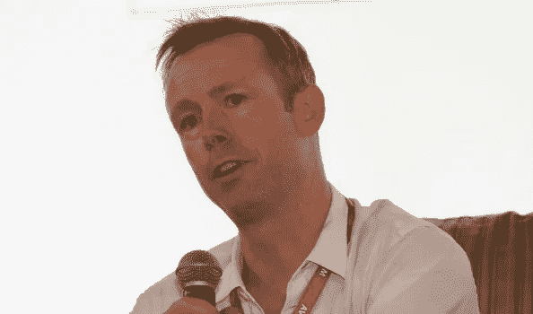
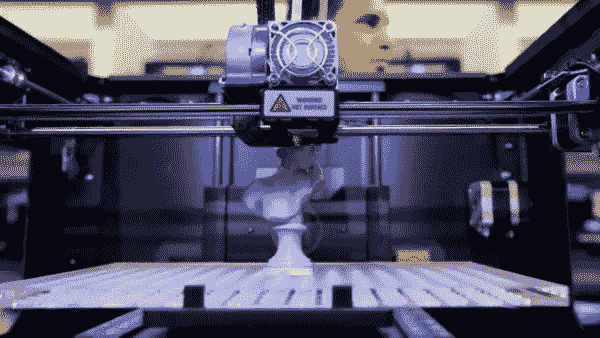
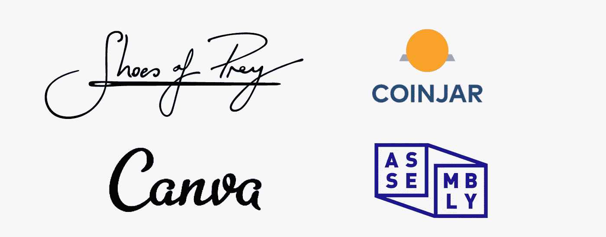
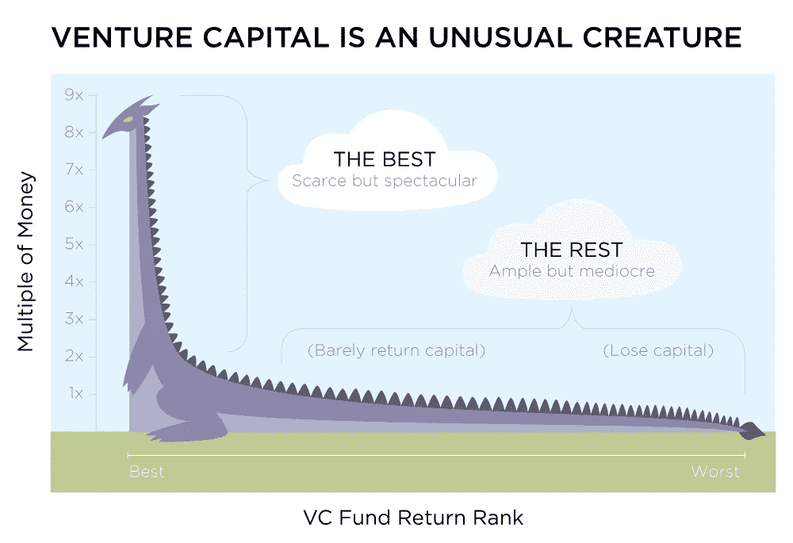

# 澳洲的 VC。为什么“低得可怜”？

> 原文：<https://medium.com/hackernoon/vc-in-australia-why-is-it-woefully-low-9c6b8bb52049>

我已经开始了新的一章，我想分享我的知识、经历、想法，谈论我感兴趣的事情。我想测试我的写作能力，以深入的“保持 100 分”现实生活内容为特色。我每两天写一篇新专栏，持续 30 天。话题涉及科技、健康、旅游、美食、创业、创新、流行文化、体育、自行车、汽车和 [*风险投资*](https://hackernoon.com/tagged/venture-capital) *。请随意插话。这是第二条。拥抱和亲吻。*

我最近读了一篇文章，文章称“与其他发达经济体相比，澳大利亚的风险资本‘少得可怜’”。这是《澳大利亚金融评论》的一篇文章，其中有一些澳大利亚主要风险投资家的评论。[很短但是值得一读](http://www.afr.com/technology/venture-capital-woefully-low-in-australia-compared-to-other-developed-economies-20170301-guonhb)。我想我应该从一个企业家的角度补充一些见解。

Rick Baker from BlackBird Ventures: Source: AFR Article. [http://www.afr.com/technology/venture-capital-woefully-low-in-australia-compared-to-other-developed-economies-20170301-guonhb](http://www.afr.com/technology/venture-capital-woefully-low-in-australia-compared-to-other-developed-economies-20170301-guonhb)

不管是好是坏，我在 Tappr 遇到了很多风险投资家、投资者、私募股权公司、股票经纪人和基金经理。你说得出的，我都见过。他们是一群独特的人，我这么说是出于感情。他们每个人对市场的看法不同，对机会的看法不同，有不同的咒语，不同的技能和不同的风险偏好——这不是一个突破性的发现。然而，这些类型的公司或个人之所以存在，有一个根本原因，那就是赚钱高于一切。我注意到，一些有钱人愿意加入一家有强大电梯间宣传的创新公司，因为这让他们觉得自己在某种程度上被赋予了权力，然而，如果你看看当前许多风险投资人的背景，就会发现他们来自毕马威会计师事务所和全球对冲基金。

在投资界，早期风险投资是风险最大的投资类型，但也是最有希望和回报的。没有什么大的意外。身处创业社区，你会了解到种子前期、种子期、早期和成长期的区别。我将在这里进行概括，并将早期阶段归类为上述所有要点。早期阶段的企业**可能**没有经过测试的产品，**可能**没有经验的团队，**可能**没有明显的市场适应性，**可能**有未知的进入壁垒，**可能**侵犯了他人的知识产权(不知道)，或者**可能**甚至没有解决一个需要解决的问题。对于风投来说，这是一个很难分析的情况，尤其是当他们打算投入大量资金的时候。可能我从 Tappr 那里得到的最大问题是**‘你试图解决什么问题？’**

> [Juicero](https://www.juicero.com/) 在解决什么问题？*受够了现在果汁生产的有钱人？这并没有阻止 1 . 18 亿美元的资金流入。*

不要误解我，我认为 [Juicero](https://medium.com/u/f56d29008506?source=post_page-----9c6b8bb52049--------------------------------) 很酷，但是这个世界有如此多的问题需要解决和挑战需要克服，1 . 18 亿美元的一部分用在其他地方会更好吗？或者花在教育和激励更多的人实现他们的激情上。

我认为，与其他国家相比，澳大利亚的风险投资资金*【少得可怜】*的部分原因是，与新加坡、以色列、斯堪的纳维亚半岛等类似规模的创业社区相比，传统上，风险投资市场没有从澳大利亚的创业社区获得回报。

我在新加坡呆了一段时间，会见了新加坡的中心，他们现在开设了两个网站，大部分是由政府资助的。我第一次去新加坡是在 2012 年，从 [*中心*](http://singapore.impacthub.net/homepage)——乌节路附近的一个联合办公空间开始工作。我偶然参加了一个聚会，主持人声称 2012 年新加坡有 8-9 家风投公司。回到 2016 年末，我与社区经理进行了交谈，现在有 70 多家风投公司活跃在新加坡。对于一个人口略多于 500 万的国家来说，这是巨大的增长。

> 哪家澳大利亚风险投资公司在种子期前或种子期进行了投资，在首轮投资中投资翻倍，并获得了 7 倍到 10 倍的回报？说出两个基金的名字，发微博给我@ mrbretthales

有一种典型的风险投资方法已经被很好地证明了。风险投资公司应该投资于不同行业和不同阶段的一系列公司。5%的人应该支持公司并大获成功，50 %- 60%的人会做得很好，其余的人会一蹶不振。大多数投资组合自上而下都是如此，但没有比 [Y Combinator](https://medium.com/u/cb8adc841a29?source=post_page-----9c6b8bb52049--------------------------------) 的*在 [Dropbox](https://medium.com/u/2d2c8f4cb281?source=post_page-----9c6b8bb52049--------------------------------) 、 [Stripe](https://medium.com/u/3ecae35d6d66?source=post_page-----9c6b8bb52049--------------------------------) 和 [Airbnb](https://medium.com/u/9046b133b73f?source=post_page-----9c6b8bb52049--------------------------------) 上下赌注*更明显的了。然而，这种情况是发生在我们的澳大利亚风投身上，还是有不同的模式在起作用？

大多数人都知道 Atlassian**，这是一家澳大利亚的“独角兽”公司，致力于项目管理和开发服务。在纳斯达克上市，市值 80 亿美元。但是哪家澳大利亚风投公司提前进入了呢？令人惊讶的是，一个也没有。从 [**斯科特·法夸尔**](https://medium.com/u/d4964c27248e?source=post_page-----9c6b8bb52049--------------------------------) 自己在 [Quora](https://www.quora.com/How-much-investment-capital-has-Atlassian-raised) 上说，“Atlassian 从未在机构轮融资上融资——即没有资本投入”。我们有一些公司打出了全垒打，Atlassian 是少数几个以十亿美元规模做到这一点的公司之一，但我所看到的澳大利亚风险投资者没有一个从 Atlassian 的成功中受益。正如斯科特提到的，Atlassian 确实筹集了二次资金，但这并不是因为他们需要，而是战略性的，我的朋友们是澳大利亚风险投资所需要的——战略资本。这是最难的部分。**

## ****虚拟荒原****

****

**在文章中，[瑞克·贝克](https://medium.com/u/90677469cfb1?source=post_page-----9c6b8bb52049--------------------------------)(我非常尊敬的人)指出，澳大利亚风投公司的共同努力在 2016 年筹集了创纪录的金额，达到 5.68 亿澳元或 4.26 亿美元，根据他们在澳大利亚私募股权和风险投资协会的来源。这包括由 2 家养老金公司支持的 [AirTree](http://airtree.vc/) Ventures 的 2 . 5 亿澳元。该基金将被分成两部分，一部分用于“攻击更大市场的杰出澳大利亚创始人”，另一半用于“机遇”。然而，瑞克·贝克是正确的，这还不够，但我希望他不只是在谈论资本。**

**风险投资是高风险、高回报的，在澳大利亚，风险投资的回报并不公平，很少有成功与许多一般的结果对抗。正如这篇文章所暗示的，对科技公司略知一二的比尔·盖茨暗示风险投资市场的回报是“可怜的”。如果比尔盖茨自己都暗示 VC 收益可怜，那么澳洲的 VC 市场还有什么机会？了解我的人会认为我在最好的情况下也是一个乐观主义者，我觉得澳大利亚的风险投资市场需要更多的专业技能和知识，然后资本就会随之而来。**

**“虚拟不毛之地”的标志不仅仅是为投资者或支持者保留的，也是为企业家保留的。商业上没有成功的秘诀，创业是脆弱的，需要像新生儿一样 100%的关心和关注。创业公司的创始人很聪明，否则他们不会成功，但许多人缺乏商业经验，缺乏经营公司的考验和磨难的知识。它们在技术上可能很棒，但在管理人员、创建预算预测或处理冲突方面呢？通常这是公司第一次不得不做这种类型的工作。创建一个企业和创造一个产品有很大的不同。**

****

***如果你有***，帮自己一个忙，看* [***打印图例***](https://www.netflix.com/au/title/80005444) *。我的收获是创始人在宣传年代的牺牲和负担。从风险投资的角度来看，电影中的许多公司都会被贴上“必须投资”的标签，但你会看到这些公司是多么脆弱，以及在一个充满希望的残酷行业取得成功需要什么。****

## *****最近的资金来源于哪里？*****

******

***资本的来源是风险投资和私募股权基金的关键，也是经常被忽视的方面。追溯到 2004 年，在网络泡沫至少两年后，领先的风险投资公司海星风险投资公司宣布了一个超过 1 . 23 亿美元的新技术基金，其中 1 亿美元将用于投资。这笔资金被认为是澳大利亚创业社区从网络泡沫的余波中需要的提升。从报道来看，资金主要来自亚洲或海外资金。所有的资本都花光了吗？最重要的是，从 2004 年开始，在接下来的几年里，它是否持续地被使用？***

***AirTree Venture 的大部分新基金和 [BlackBird Venture 的新基金](https://delimiter.com.au/2015/09/15/blackbird-reveals-whopping-200m-tech-startup-vc-fund/)都来自超级基金。超级基金历来极度厌恶风险，传统上并不以高风险投资著称。我认为有超级基金参与是一件好事，只要他们不碍事，因为创业和公司截然相反。***

***从废墟中传出的细节是 [**古韦拉**](http://www.guveralimited.com/) 表明超过[1 . 85 亿美元](http://www.smh.com.au/business/media-and-marketing/another-guvera-subsidiary-goes-into-administration-with-25-jobs-lost-20170410-gvhq7y.html)(你没看错)从来自 SMSF 的 3000 多名老练的投资者(自我管理的超级基金)处筹集。对于一家在尝试 ASX 上市的同时仍在试图将其服务商业化的公司来说，这是一个惊人的数字。不要误会我的意思，我喜欢 Guvera 的尝试，并能够在学习新技能的同时促进当地社区的就业，但音乐流媒体的商业模式仍在发展，这是一个棘手的领域。**问题是，下一次个人考虑使用他们的 SMSF 时，他们会自由地投资一家早期公司，还是会因为古韦拉的经历而犹豫不决？*****

***每家主要银行都有自己的基金，包括 NAB Ventures 和 Westpac 的 Reinventure Fund。对冲基金和私募股权通常来自股票经纪/ ASX、家族资金或投资公司。现在这些都是粗略的估计，很难获得超级基金投入风险投资市场的实际资金数额，然而，仅在 AirTree、BlackBird、NAB 和 Reinventure 之间，你就有来自银行或超级基金的风险投资资金的最大份额。这两个行业没有打出快速创新、创业导师的旗帜，甚至没有成为创业社区的一部分。它们正在被打乱，发出初创企业或许能够解决它们面临的一些问题的信号，是朝着正确方向迈出的一步。这就是为什么他们在 NAB 的案例中引入像 Todd Forest 这样的人来管理他们的基金。当然，他们有资本，我不会评判任何人拿了他们的钱。银行或超级基金甚至可能不会在投资过程中审查或协助创始人/管理层，或者他们可能不会扣动投资的扳机，但如果我对投资场景有所了解，他们会像绵羊一样成群结队，喜欢赚钱，喜欢讲性感的公关故事。***

***投资一家有着典型创始人故事的创新型公司是一个性感的故事，但要成为一家成功的公司，甚至是一只独角兽，还有更多，这不仅仅是投资。***

## *****钱应该从哪里来？*****

****最好是*澳大利亚的大部分风险资本应该来自个人或紧密团结的团体，他们以前开发过革命性的业务或产品，或在澳大利亚建立过真正鼓舞人心的东西，不管是成功还是失败。问题是，你通常不会在失败中赚很多钱，而且失败比成功要多得多。澳大利亚的顶级初创公司自然会被吸引到其他海外市场，因为澳大利亚是一个小市场，他们的下一笔 3000 万美元以上的融资往往来自海外基金。***

***我们需要澳大利亚的赢家，至少他们的总部在澳大利亚，要么接受澳大利亚风险投资公司的资助，要么让他们建立一个基金，将他们的知识、网络和经验注入他们的投资。我们需要风险投资市场足够成熟，能够引导 500 万至 3000 万美元的融资，并建立一支可信的团队，以填补初创或早期公司的缺口。每个早期阶段的公司都有缺口需要填补，不仅仅是用资本来帮助创业符合投资者的最大利益。***

***同样值得注意的是，许多公司的最初创始人在早期阶段往往很难筹集到大笔资金，有时如果他们错过了投资意向书的里程碑，他们不得不决定进行融资或稀释，直到更大的资本到来。 [**连脸书都错过了他们的第一个里程碑**](http://fortune.com/2011/01/11/timeline-where-facebook-got-its-funding/) **。在第一笔资金投入和下一笔战略资金投入之间，通常会有一段较长的时间间隔。我听说这个术语在投资界被称为“峡谷”，或者种子和首轮融资之间的差距。这就是瑞克·贝克在谈到“没有初创公司充斥着首轮融资”时所指的。当跑道比预期的要短或无法预测时，创始人或联合创始人必须寻求不同的投资条款，这往往有损于他们自己的股份。从这一点来看，一旦实现，他们的总体回报往往没有应有的高。*****

***我最近听说一家著名的澳大利亚科技公司增加了一份投资条款清单，表明如果公司达到某个关键绩效指标，创始人将获得 100 万澳元的资本作为奖金。应该实施更多类似的条款来激励创始人。我这么说并不是因为我是一名创始人，但如果你在过程结束时有一颗那么大的樱桃，那么经历漫长的夜晚、艰难的白天和不睡觉都是值得的。如果创始人足够聪明(他们应该足够聪明)，他们不会把奖金花在法拉利或玩具上，而是用种子投资或资源来发展他们影响社区的公司。***

***通常情况下，当一家初创公司取得巨大成功时，往往会有一位资历深厚、经验丰富的导师或顾问参与其中。在美国，风险投资公司通常称他们提供的是“全面服务”，资本是他们服务中最小的部分。像[安德森·霍洛维茨](https://a16z.com/)、[凯鹏华盈](http://www.kpcb.com/)、 [Accel Partners](https://www.accel.com/) 和 [Khlosa Ventures](http://www.khoslaventures.com/) 这样的风险投资公司雇佣了一大批专家、顾问和导师，通过包括公司、技术、营销、品牌、战略和业务发展在内的一系列服务来帮助他们的投资。如果公司赚了很多钱，这种成功往往会掩盖团队内部的问题或麻烦，或者技术或服务本身的可持续性。***

***当然，我遇到的所有风险投资者对他们的每一笔投资都有最好的意图，因为需要对团队或创始人有信心来完成工作，并展示进展(这意味着风险投资者有更好的回报机会)。然而，如果你投资于革命性的技术业务，那么你在哪里找到人才或专业知识来支持这项业务。如果我想“创造托尼·斯塔克的电脑”,正如 Meta 在他们的 Y-Combinator 推介中大胆建议的那样，我们在澳大利亚有这样的人才吗？或者一家风投公司能帮我找到人才吗？ [Meta 在首轮融资](https://techcrunch.com/2016/06/13/meta-raises-another-50m-as-it-gears-up-for-the-next-version-of-its-ar-headset-and-china/)中筹集了 2300 万美元，以增加为[谷歌眼镜项目](https://en.wikipedia.org/wiki/Google_Glass)工作的高技能增强现实工程师。当 AR 和 VR 仍在被发掘时，拥有顶级人才可以降低投资风险，并激励其他投资者参与一轮投资。***

******

***Source: Meta***

***在 [Tappr](http://www.tappr.io) 的时候，我们需要一个在网络安全、构建 Rails API 架构和连接到 Card Present 支付网关方面有经验的架构师技术负责人。这并不容易找到，没有一家初创公司有 2 万美元可以砸在招聘人员身上，或者不应该这么做——至少在澳大利亚是这样，除非已经过了种子期。我们找遍了整个地球才找到一个来自摩纳哥的好男人。对于澳大利亚的一家医疗科技创业公司来说，全球可能只有 2-3 个人有合适的经验和时间提供帮助。通常情况下，美国的风险投资会通过寻找人才或测试他们的网络来帮助“填补空白”和加强投资。当然，创始人和管理层需要尽自己的职责，但风投通常处于顾问的位置，我们需要我们的顾问增加很多价值。***

***不仅招聘是一个需要克服的关键领域，其他领域也同样重要，包括未来的融资、员工持股计划、产品创新和货币化。然而，无法获得现金流或资本始终是创始人或管理层需要解决的一个致命癌症。*资金是一个需要解决的问题*。通常但并非总是如此，创始人从未见过投资条款清单，也没有与老练的投资者谈判过，也不了解期权悬崖。在这个领域，让中立的创始人来协助创始人是必须的。如果比我年长 5-10 岁的创始人/企业家给我打电话或发电子邮件，我都能得到一美元，那么我会在邦迪买一套一居室的公寓——还能看到风景。***

## *****有哪些初创公司值得投资？*****

***这是另一个问题，投资什么呢？风投公司有什么口头禅，有多少创业公司符合这个口头禅？***

***我经常和我的朋友 Pauly Ting 谈论旧金山发生的事情，他发现许多澳大利亚初创公司不够雄心勃勃，或者专注于打造属于生态系统一部分的产品，而不是生态系统。这并不是说所有的初创公司都应该雄心勃勃，但我们需要像帮助那些保守的初创公司一样帮助那些雄心勃勃的初创公司。***

***看着 [Business Insider 的 2016 年 20 个最热门的创业公司](https://www.businessinsider.com.au/these-are-20-of-australias-hottest-startups-2016-5)，我倾向于同意他的观点。从根本上说，这些业务都没有任何问题，但如果我们要吸引更多来自大学生和投资经理的参与，那么我们需要一些雄心勃勃、改变游戏规则的公司来点燃创业之火。我发现早上起来很难想到一家注册过程更简单的新贷款公司或类似的事情。当然，他们有一个经过验证的市场和已知的风险，但这种类型的公司会对社区的其他人产生影响吗？***

***我经常参加社交活动，在那里，我有时会被兴奋的人展示他们的想法和概念而打断耳朵。他们中的许多人发现很难将他们的概念联系起来，或者声称它的“[优步](https://medium.com/u/b97b1b381b5a?source=post_page-----9c6b8bb52049--------------------------------)为 X”。虽然你不应该忽视任何人的尝试，但通常是天真地尝试。***

***最令人担忧的是，当创始人不理解风险投资者所寻求的一些基础知识时，我会感到害怕。一些基础知识包括了解进入壁垒，谁是你的竞争对手，你的商业模式发展成什么样，或者你的单位收购成本是什么样的。在讨论资本和估值之前，需要回答上面的这些问题。***

***另一方面，有许多成功的故事不为人所知，很少为公众所知。举个例子，一个鲜为人知的公司叫做[碳革命](http://www.carbonrev.com/)，位于维克的沃恩池塘。 [Carbon Revolution 最近筹集了 5000 万美元](http://www.afr.com/news/wheel-maker-carbon-revolution-raises-50m-to-expand-20160920-grk3co)，用于扩大业务，目标是每年生产 10 万个车轮。碳革命正在接近 100 名员工，并拥有众多的国际分销商和合作伙伴。***

******

***Source: Carbon Revolution***

*****什么让我早上起床:**我希望看到一家澳大利亚聊天机器人公司将它带到一个新的水平，创造一个将我和我的家联系起来的物联网概念，或者找出如何在人口稠密的城市种植新鲜农产品。这些都是激动人心的、大胆的、雄心勃勃的概念，时机已经成熟。***

## *****该行业是否出现了增长停滞？*****

***我觉得这可以归结为几件事。我敢肯定，许多远眺的人认为，成为一名企业家是一次性感的冒险，“在我们筹集到 500 万美元，我们的用户喜欢我们之后，我们都会买电动滑板，喝拿铁咖啡，然后在上午 11 点开始工作”。企业家和企业家之间是有区别的。他们甚至可能有一个合理的概念，然而要么不明白需要什么，要么不愿意做出牺牲。***

***我在阳光海岸长大，毕业后，我要么去上大学，要么去找工作。在阳光海岸，如果你不想成为一个好客的人或职业冲浪者，这可能会很难。我受到周围环境的影响，它们影响我成为什么样的人。我两样都没做，而是去了欧洲从事酒店行业(我知道这很讽刺)。在纽约、伦敦、新加坡或韩国长大的人会有不同的成长经历，但一旦他们离开学校或大学，也会有不同的机会。***

***我们不应该让我们的年轻人在麦当劳找到工作，而是应该让他们在[英特尔](https://medium.com/u/fb610dd2569b?source=post_page-----9c6b8bb52049--------------------------------)或[易趣](https://medium.com/u/ec0853652081?source=post_page-----9c6b8bb52049--------------------------------)找到实习工作。此外，它不一定只是一家技术公司。像 [Shoes of Prey](https://medium.com/u/5fbde9707b7?source=post_page-----9c6b8bb52049--------------------------------) (网店) [Canva](https://medium.com/u/46cb8d4ce352?source=post_page-----9c6b8bb52049--------------------------------) (创意) [Assembly Payments](https://medium.com/u/4a64ca26efd5?source=post_page-----9c6b8bb52049--------------------------------) (支付)或者 [CoinJar](https://medium.com/u/aba64911ef35?source=post_page-----9c6b8bb52049--------------------------------) (比特币平台)这样的公司呢？如果雇主正在寻找一名候选人，而不是在麦当劳工作，他们在易贝实习了 6 周，那就不一样了。你会先雇佣谁？开辟途径让我们的年轻人(我们的未来)向与众不同的公司学习会阻碍变革和与众不同的思维。***

******

***我们需要我们的企业家如饥似渴、久经沙场、雄心勃勃、知识渊博。去大学上一门关于企业家的课程感觉不太对劲。***

***我们需要我们的风险投资公司提供更多的资金支持，并通过内部投资和与其他企业家合作来增加他们的资金。BlackBird 有 [Mike Cannon-Brookes](https://medium.com/u/fb6b52deda55?source=post_page-----9c6b8bb52049--------------------------------) 在船上，AirTree 有几个，但我们需要让市场维持 20+ VC，而不只是 2 个。每一个风险投资公司带来的风险合伙人，我们都需要一个*【运营合伙人】*加入公司。我将深入探讨运营合作伙伴的工作。像新加坡和以色列一样，我们也需要让政府在这一领域发挥积极作用，但在州政府和联邦政府提供帮助之前，我们需要先自助。***

## *****风险投资公司的口头禅重要吗？*****

***当然，投资咒语存在于所有的风险投资或私募股权公司。如上所述，澳大利亚的风险投资通常被吸引到特定的领域，并喜欢投资他们了解或知道该做什么的东西。是的，风险投资确实有资本，但因为他们有资本并不意味着他们会像冰淇淋一样分发出去，你需要符合一定的模式。***

****“我们从第一天起就投资全球化的企业”黑鸟风投****

***[阅读 BlackBird Ventures 网站](http://blog.blackbird.vc/)的博客，他们喜欢已经超越澳大利亚的企业，相信 EMT 或创始人是合适的人选，技术上有所准备，初创公司有 2 名创始人，但不是 5 名，并对什么是可以量化的成功指标有敏锐的理解。***

***许多风投都有类似的口头禅。他们不希望你被困在澳大利亚，或者至少对国际市场有真正的雄心和认可。他们想要一个有技术技能的团队，因为通常情况下，当一半的功能没有构建或不起作用时，他们很难深入测试原型或 MVP。***

> ***来自早期公司的 MVP 产品经常被殴打和包扎在一起，就像一个红头发的继子。但这就是创业的意义所在，用很少甚至没有的资源快速做出惊人的事情。***

***对于投资者来说，完全理解一个新的创业公司的技术是非常罕见的，老实说，他们应该让业内人士来验证他们是否认真对待他们对你的创业公司的投资。***

***我们发现，在 Tappr，你会与一位投资者交谈，他会宣布他们知道这个领域“因为它是 fin-tech ”,但不知道我们的任何合作伙伴或竞争对手。Apple Pay 作为竞争对手被提及的次数之多令人歇斯底里。随着时间的推移，我们在迎合这些对话方面做得更好了。***

***他们现在教给计算机科学学生的东西很可能在 4 年后会变得多余，或者会有新的趋势出现。这就是为什么开发人员有辍学的趋势。我认识一些开发人员，他们表示，他们在科技公司一年学到的东西通常比在大学四年学到的还要多。他们没有资格从技术上批评你，也不应该批评你，除非风投是你所在领域的专家，只要你知道自己在说什么，或者有人能为你担保。***

## ***如果 2004 年有机会，澳大利亚的风险投资人会投资脸书吗？***

******

***Source: Facebook IPO Documents***

***我喜欢和澳大利亚风险投资行业的人交谈，因为我可以和从事风险投资或者对风险投资感兴趣的人交谈。我问过社区里一些人的一个激情话题是:“你会投资 [**【脸书】**](http://www.facebook.com)**的种子轮吗？"*****

*****我们大多数人都熟悉脸书的故事。一名来自哈佛的神童和他的伙伴创建了他们自己的社交网络平台来记录他们的大学生活，名为[thefacebook.com](http://thefacebook.com)。他们辍学，搬到加利福尼亚，建立了世界上最大的公司之一。这个故事被很好地记录了下来，我们大多数人都在使用这项服务，除了我的父亲；没有手机的人。*****

*****我通常描绘 2004 年晚些时候投资脸书的情景，这描绘了一幅与 2004 年早些时候不同的画面，当时创始人仍在探索他们创造的东西，直到 2004 年晚些时候才筹集到资金。*****

*****[根据澳大利亚私募股权和风险投资协会](https://www.avcal.com.au/resources/resources)的 2004 年年鉴，2004 财政年度*投资于澳大利亚的风险投资总额*为[206 万澳元。是的，实际上我不得不打电话给 APEVA 办公室，询问这些数字是否属实，事实的确如此。这意味着，2004 财年，每家风险投资/私募股权公司的平均支出为 93，654 美元。我要深入探讨的一点是，在 1994 年至 1999 年的科技热潮和 2000 年至 2002 年互联网泡沫期间及之后的投资后遗症期间，澳大利亚风险投资和私募股权投资的到来晚于大多数人。那是澳大利亚风险投资黑暗的几年，谢天谢地，从那以后我们继续前进。](https://www.avcal.com.au/stats-research/yearbooks)*****

*****截至 2004 年 9 月，脸书的目标是筹集 50 万美元(66.4 万澳元)，这几乎是 2004 财年澳大利亚风险投资市场总额的四分之一。我是从他们的第二次投资者介绍开始的，这次介绍更加全面，脸书更有吸引力，这是任何澳大利亚投资者的一个关键指标。我来描述一下 2014 年 9 月，彼得·泰尔 和其他几个贝宝黑手党成员通过可转换票据投资 50 万美元，获得公司 10.2%的股份。*****

*******我不会参加面向所有投资者的简报会，但脸书当时正在处理一些话题。**到 2004 年 9 月，脸书的联合创始人*发生了口角，并开始寻找将*彼此剔除的选择，【ConnectU 提起了诉讼(如果你不知道这个故事，可以想想文克莱沃斯的竞争对手服务)，魅力四射但又备受争议的企业家 [**肖恩·帕克**](https://medium.com/u/120ddefd135e?source=post_page-----9c6b8bb52049--------------------------------) [加入公司担任总裁](https://en.wikipedia.org/wiki/Sean_Parker)，[最初成立的公司在成立 6 个月后被一家新的特拉华州公司](https://www.theguardian.com/technology/2009/feb/12/facebook-mark-zuckerberg-ex-classmates)收购这不仅会引起澳大利亚投资者的担忧，也会引起全球投资者的担忧。*****

*****然而，有两个衡量标准让彼得·泰尔、雷德·霍夫曼和其他人站出来，并在所有这些活动之外给予关注。首先，[每天的页面浏览量超过了 300 万次](https://en.wikipedia.org/wiki/History_of_Facebook)，并且还在快速增长；其次，95%的月独立用户。这表明*产量*和*可持续性*就在那里，伙计们。*****

*****要考虑的最后一点是货币化。阅读脸书的故事，当时，服务器是设在圣地亚哥。这是由于与湾区服务器的成本比较，脸书需要不断增加其服务器负载和存储容量以满足需求。越来越令人担忧的烧钱速度，再加上收入高达 0.00 美元的事实，会让最乐观的投资者感到担忧；但是指标是不可否认的，我想知道有哪些风险投资人会理解那些在 2004 年末开始形成的担忧。*****

*****我只能代表我自己说，但是我觉得澳大利亚的许多投资者——不仅仅是风投——会错过这个机会，不仅是在 2004 年初创公司几乎没有资本的时候，而且即使在今天，我也认为为一个几乎没有收入的公司筹集 50 万美元并不容易。风险投资合伙人自然会被他们从个人经历和知识中了解到的东西所吸引，许多人之前不会看到一家公司或 facebook 在演示中提出的指标类型，以及脸书当时拥有的风险。此外，由于知识产权和法律纠纷已被风投完全披露，你还没开始就有很多事要做。*****

*****通常情况下，进行早期投资的投资者有优先拒绝权，如果公司“受到限制”，现有投资者不愿意让其他投资者提前进入，除非新投资者是*【重要战略】*。这意味着，如果一位澳大利亚投资者错过了种子期，那么他多半不会有“战略网络”来获得下一轮融资的席位。*****

## *******让我们从创业公司那里获得一些风险投资和私募股权投资的回报*******

**********

*****Source: Quip*****

*****风险投资和私募股权公司很难生存。他们投资的公司虽然有巨大的上升空间，但往往存在缺口，而且在 5 年多的时间里看不到回报。他们审查未完成的或仍在发展的技术或未知领域或先锋行业的业务。他们承受着压力，要向投资者群体展示业绩和回报，并证明自己物有所值。我们需要我们的风险投资人大胆、积极，看到投资有回报，即使这意味着在这个过程中会有一两次失败。我们不仅需要为他们提供资本，还需要为他们提供聪明的人，让他们的投资增值，而不仅仅是资本。*****

*****我读到创业失败的头号原因不是因为糟糕的市场环境，而是无能。有一些其他信息表明，市场适合或商业模式适合是原因，但我发现不完全理解业务、市场、客户、未来挑战或产品是不称职的一部分。然而，不称职可以通过教育来扭转，不像糟糕的市场条件那样，它可能是通常无法管理的事情的组合。在 Tappr，我们学到了很多，也犯了很多成功的错误。我们从尝试的事情中学到了更多，有些成功了，有些失败了，下次我们会知道的。最重要的是，我们可以通过合作将这些信息传递给其他有类似发现的人。*****

*****任何投资一家需要填补 T2 缺口的公司的人都应该寻求用其他服务来补充他们的投资。据说是 A 系列及以下。如果你是一名风险投资人，这意味着你是一名专注于高风险投资领域的专业投资者。*****

*****我看着那些精英风投，看看他们是怎么组成的。快速浏览 **LinkedIn** 和他们自己的网站显示，在 Accel Partners、Khosla Ventures 和 Index Ventures 中，投资经理和行业知识专家的比例大约是 50:50。在大多数情况下，这些人被称为“经营伙伴”。*****

*****最重要的是，我们需要下一批公司能够证明 1000 万美元的估值是合理的，并能够突破 5000 万美元，迈向 10 亿美元的领域。我们需要不止一两个人来让它出公园。我们只有在支持大胆想法的情况下才能做到这一点，并有平易近人的专家为我们指路。*****

*****这要从创始人创办公司的一年前开始，这是澳大利亚风险投资领域最需要帮助的时候，也是投资者与创业者见面之前。再加上我们自己的风险投资公司正在寻找更多的“运营伙伴”,并从构思阶段到推出阶段支持雄心勃勃的概念，这可能会让澳大利亚风险投资界从“悲惨”走向“足够”。*****

*****让我们一起一步一步地解决这个问题，也许几年后我们就能达到我们想要的目标。*****

*****“可悲”或“足够”不应该是目标，我会在心跳中满足于“高于平均水平”。*****

******这是一篇观点文章，只是想在此空间添加一些来自企业家的背景信息。这篇文章比我预期的要长，但它是一个大话题，我不想遗漏一些我以后会后悔的东西。我给一些风投朋友看过这个，他们建议接下来做一个众筹 vs 风投的文章。两篇文章完成了，还有 13 篇。******

******************************

> *****[黑客中午](http://bit.ly/Hackernoon)是黑客如何开始他们的下午。我们是 [@AMI](http://bit.ly/atAMIatAMI) 家庭的一员。我们现在[接受投稿](http://bit.ly/hackernoonsubmission)，并乐意[讨论广告&赞助](mailto:partners@amipublications.com)机会。*****
> 
> *****如果你喜欢这个故事，我们推荐你阅读我们的[最新科技故事](http://bit.ly/hackernoonlatestt)和[趋势科技故事](https://hackernoon.com/trending)。直到下一次，不要把世界的现实想当然！*****

**********