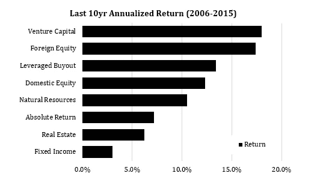
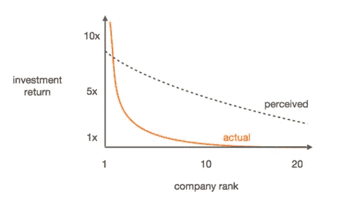
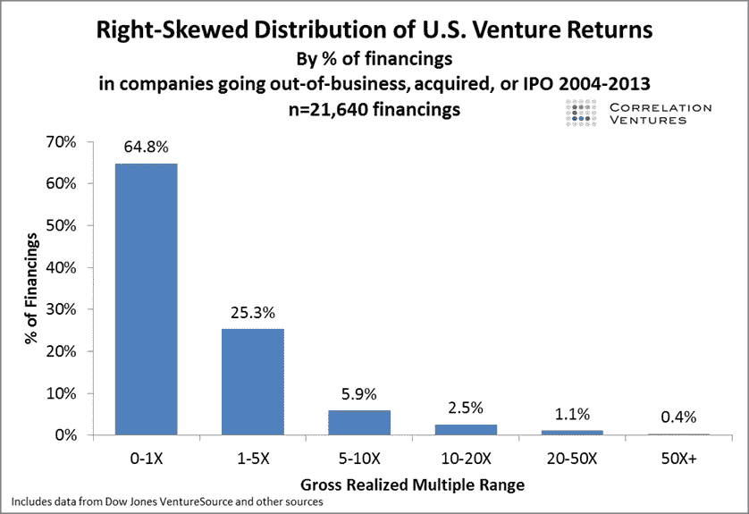

# VC 数学

> 原文：<https://medium.com/hackernoon/vc-math-2848971a34a0>

作为一名前企业家，我经常思考风险投资家的“方式”和“原因”。我也想知道他们的工作是真的那么难，还是他们只是在赚钱。现在我已经走到了“黑暗面”,自己也成为了一名风险投资人——我(希望)能更好地理解这一点。

理解风险投资的 ***数学*** 将有助于解释创业者可能会有的一些问题，包括:

> 工作有那么难吗？他们不就是整天打高尔夫、骑自行车或放风筝冲浪吗？
> 
> 为什么他们如此关心所有权比例和支票金额？他们是不是想把我赶出去？
> 
> 他们为什么对独角兽如此痴迷？难道他们不应该关心我的公司是否把 1000 万美元变成 1 亿美元，那是 10 倍！

我是一名科班出身的科学家/工程师，所以我总是喜欢分析性地看待事物。风险基金的有限合伙人(LP)在基金结束时通常对其风险资产类别投资有以下最低期望(通常为 10 年):

*   种子期/早期阶段— 3 到 4 倍的回报(年化 12 到 15%)
*   早期/中期—3 倍回报(年化 10–12%)
*   后期—2 倍回报(年化 6–8%)

The Yale University endowment annualized returns from 2006–2015\. Yale is known for being the top performing large-scale endowment.

作为一般比较，有限合伙人可以在 10 年后从许多不同类型的资产类别中获得 1.5 倍的回报，包括私募股权、公共股权和房地产。由于风险增加和资产类别的非流动性，有限合伙人指望风险资本提供溢价回报。对于风险更高、期限更长的投资，如种子基金，有限合伙人期望获得更高的溢价。否则，就没有财务上的理由把钱给风险公司。从历史上看，许多风险基金确实达不到这些目标，其中很大一部分也达不到 1.5 倍甚至 1.0 倍的回报。

让我们看看一家名为 Dough Ventures 的假想种子/早期公司是如何运作的。他们刚刚筹集了第三只基金，Dough Ventures III LP，总共有 1 亿美元现金。对于标准 10 年期基金结束时的有限合伙人，Dough Ventures 需要返还 3 亿至 4 亿美元现金。听起来不可怕，是吗？

让我们看看回报是如何产生的。风险投资中有一个概念叫做**幂律**——大多数基金的回报是由非常少(有时是一次)的投资产生的。这一切都是为了投资“全垒打赢家”大赢家很少。

Dough Ventures 的目标通常是获得所投资公司 10%的股权。平均而言，他们为投资前估值在 800 万至 1200 万美元的公司开出 100 万至 150 万美元的支票。让我们假设在整个投资组合中，Dough Ventures 拥有所有公司 10%的股权。快进 5-10 年:投资组合成熟，成功的公司通过 IPO 或并购退出。投资组合的总企业退出价值需要多少才能达到 3-4 亿美元的目标回报指标？**答案是 3-4B 美元**；其中 10%的价值是 3-4 亿美元。

回归幂律，统计上 10%的投资组合会是基金回报的驱动力。对于每只基金 20-30 家公司的典型投资组合，2-3 家公司将推动所有收益。对于面团风险投资公司(Dough Ventures)的投资组合，**这 2-3 家公司的价值必须达到 1-2B，每笔投资能给基金带来 1-2 亿美元的回报。**

Data compiled by Correlation Ventures showing the historical distribution of returns. 10% of financings provide over 5x return while 65% are partial or complete write-offs.

这就是为什么你会听到投资者询问有关市场规模/TAM、[未来](https://hackernoon.com/tagged/future)和潜在收入、可比资产等问题。他们试图了解你的公司是否有潜力成为一家估值在 1B 或更高的公司，即独角兽公司。**风投投资有“回报基金”潜力的公司很重要，因为他们需要每一笔投资都有可能成为大赢家。一只基金需要几个大赢家来达到有限合伙人对风投要求的回报指标。 ***没什么私人恩怨，只是数学。一只 1000 万美元或 1000 万美元的 1B 基金的策略和数学方法都变了，但概念还是一样的。*****

与此相关，你可能也会听到一些风投说 1 亿美元的退出是“失败”。虽然这种措辞很苛刻，而且部分与现实脱节，但这种价值的退出不会对提供基金回报产生太大影响。如果 Dough Ventures 以 1 亿美元退出公司，并持有 10%的股权，他们将获得 1000 万美元的回报。然而，如果目标是回报 3-4 亿美元，1000 万美元只是实现目标的 2-3%。

让我们来看看另一个场景，Dough Ventures 投资了 20 家公司:10 家以 1 亿美元退出，10 家以 5000 万美元退出。这似乎是一个令人振奋的成功，因为所有 20 家公司都以可观的金额退出了。然而，通过计算，假设拥有 10%的股权，Dough Ventures 总共只能净赚 1.5 亿美元，基金回报率低于 1.5 倍。

另一方面，假设这 20 家公司中，19 家破产，但 1 家公司以 50 亿美元退出。假设 10%的所有权，该基金的 5 倍回报是 5 亿美元。把它放在上十分位数。**这就是幂律在风险投资中的重要性。**

在阅读本文时，你可能会推断出一些对风险投资回报数学有影响的关键指标:

*   **基金规模** —由于需要退出估值，较大的基金可能更难提供高倍数回报(一只 1B 基金需要 2 美元——3B 回报，退出价值为 10-30B 美元)
*   **阶段**——早期阶段的公司估值较低，可以获得更高的所有权比例
*   **持股比例** —较低的持股比例会成比例地增加达到回报指标所需的退出估值(2%的持股比例比 10%的持股比例回报率低 5 倍)
*   **支票大小** —小支票导致所有权比例低
*   **后续融资/稀释** —除非*按比例*投资发生，否则基金的所有权百分比将在每一轮中减少并被稀释
*   **市场规模/TAM/收入** —风投希望看到潜在年收入高于 1 亿至 3 亿美元，TAM 至少在 100 亿美元以上，以便有信心让公司在退出时达到 1B+的估值

**说到底，这就是风投们问这些问题的原因——这一切都归结于为数学等式确定这些参数。**

事实上，数字并不总是对风投有利:

*   **挑选赢家**:在一个投资组合中抓住 2-3 只独角兽绝非易事，因为许多基金在一个基金周期结束时甚至连一只都没有。对于 Dough Ventures 来说，10%的命中率将被视为成功。也有其他基金采取“喷雾祈祷”的方式来构建投资组合，但通常这些基金不能提供足够高的所有权比例来利用赢家。
*   **退出企业价值**:对于 Dough Ventures 来说，考虑到风险投资每年平均有大约 500 亿美元的回报，退出时 3-4B 美元的总价值可能不会太糟糕。然而，这些资金的大部分被锁定在少数几个大赢家手中。想想在过去的 10 年里，每年有多少公司以$1B+的价格退出。
*   **所有权**:许多基金一开始可以持有一家公司 10-20%的股份，但如果它筹集了大量资金来扩大业务规模，就需要雄厚的资金来维持这种所有权。除了 NEA 或红杉这样的旗舰基金，由于基金规模的限制，这可能是一项艰巨的任务。
*   净回报与总回报之比:风投和其他投资者一样收取运营费用。这些费用减少了返还的现金。扣除费用后的实际回报必须高于目标指标才能得到补偿。因此，3 倍的回报实际上可能需要 4 倍的投资回报。

这就是为什么对风投来说，挑选有潜力发展成为一家 1B+美元公司的企业家、技术/产品和市场是如此重要。对于创始人来说，了解风险投资者在评估机会时的想法也很重要。这就是数学的结果。

当然，有许多公司会获得巨大的成功，但它们不会提供“风险回报”。创始人不应对此耿耿于怀。我拒绝了一些公司，我知道这些公司对创始人来说会是很好的结果，但这对我们的基金来说根本没用。寻找其他不依赖有限合伙人的投资者(比如天使投资人、家族办公室甚至公司投资者)是建立这些企业的好方法。

这是一个非常简单的数学运算，其中有大量的细微差别、调整和变量。或许改天再写一篇文章。