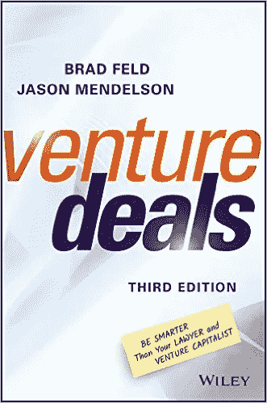

# 风险交易—第三版

> 原文：<https://medium.com/hackernoon/venture-deals-third-edition-95fbc2e82d14>

《风险交易:比你的律师和风险投资家更聪明》第三版*即将出版，亚马逊网站上已经开始预售。对于所有购买、阅读或评论过我们之前版本的人，谢谢你们！虽然很难确切知道卖出了多少本(出版商衡量标准的乐趣)，但迄今为止大约有 10 万本，这让我们大吃一惊，因为我们在 2011 年写这本书时对此没有任何预期。*

*我们在第三版中增加了很多内容。除了修复一些挥之不去的错误、糟糕的语法和糟糕的单词选择，我们还找到了一些插入牛津逗号的地方，这样[艾米](http://www.twitter.com/abatchelor)和[瑞安](https://twitter.com/ryan_mcintyre)就会高兴了。*

*有两篇新的前言——一篇来自 USV 的 Fred Wilson，另一篇来自 Fitbit 的联合创始人兼首席执行官 James Park，分别来自风险投资视角和企业家视角。迪克·科斯特罗以前版本的前言被保留了下来——现在它是一个结尾。*

*我们解决了我们的性别问题。在之前的版本中，我们只使用了男性性别，并在介绍中解释了我们的合理化。这次这种合理化感觉很傻，更像是一个借口，所以我们在整本书中改变了女性和男性代词的使用。*

*我们增加了更多关于可转换债券的信息，包括像外管局这样的新金融工具。*

*有两个全新的章节。第一个，关于众筹，涵盖了产品和股权众筹，并分析了众筹的好、坏和可怕之处。第二个问题是，为什么会有投资意向书，这是因为我们意识到，过去几年我们所做的许多投资都是通过握手和电子邮件形式的条款大纲完成的，而不是投资意向书。*

*我们增加了一个关于公司风险资本的部分，因为在过去几年中，已经有了一个寒武纪式的 CVC 大爆发，尽管 CVC 的概念并不新鲜。*

*我们更新了一些例子。比如现在提到 FarmVille 就是提到 Pokémon GO。毕竟是 2016 年了。*

*我们有新的封底广告，并为我们生活中一些特殊的人献上新的献词。我们喜欢传播爱。*

*最后，老网站 AskTheVC.com 现在是 VentureDeals.com。作为其中的一部分，我们将发布一个教学指南，大量的附件，以及其他有趣的东西来补充这本书。是的——我们有一些工作要做，让网站焕然一新，把所有这些东西都拿出来，但这就是 11 月的意义所在。是的，我们会重新开始写博客。*

*感谢所有人多年来对风险投资交易的帮助、支持和关注。最重要的是，感谢[杰森](https://twitter.com/jasonmendelson)成为一名出色的合作者和伙伴。*

**最初发表于* [*费尔德思*](http://www.feld.com/archives/2016/10/venture-deals-third-edition.html) *。**

******

> *[黑客中午](http://bit.ly/Hackernoon)是黑客如何开始他们的下午。我们是 AMI 家庭的一员。我们现在[接受投稿](http://bit.ly/hackernoonsubmission)并乐意[讨论广告&赞助](mailto:partners@amipublications.com)机会。*
> 
> *如果你喜欢这个故事，我们推荐你阅读我们的[最新科技故事](http://bit.ly/hackernoonlatestt)和[趋势科技故事](https://hackernoon.com/trending)。直到下一次，不要把世界的现实想当然！*

**