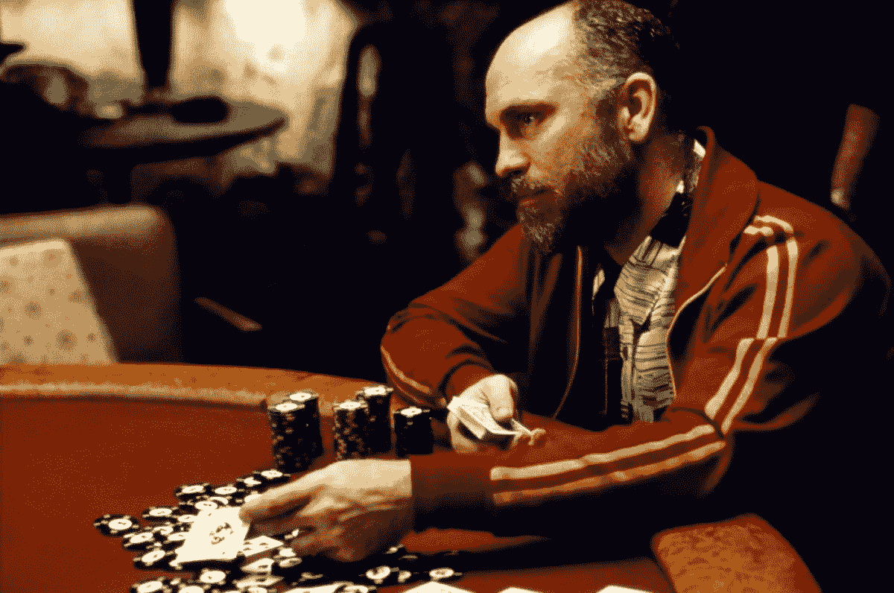

# 风险投资不是赌注

> 原文：<https://medium.com/hackernoon/venture-investments-are-not-bets-83d5ae84fb8e>

在过去的十年里，我无数次听到其他风险投资者将他们的投资称为“赌注”在我创业生涯的早期，我对此感到非常内疚，因为我没有留心，而且可能缺乏一些必要的同理心。当时，我认为我并没有真正理解成为一名积极的投资者并长期支持一家公司的意义和代价。几年前，在与我妻子交谈后，我开始质疑这种说法。

从表面上看，将一项投资视为赌注当然是有道理的。根据[韦氏词典](https://www.merriam-webster.com/dictionary/bet)的说法，赌注是“双方对一场比赛或一个或有问题的结果所下的赌注、赌注或承诺。”我越想给风险投资[投资](https://hackernoon.com/tagged/investments)贴上这样的标签，我就越意识到这有点懒惰，可能不敏感，也不一定符合我的价值观。简单来说，这个标签我觉得不太对。

作为一名风险投资者，我不下注。除非你在玩这手牌，否则下注往往是被动的。当我在一个游戏上下了一个友好的赌注，比如超级碗，我的参与对结果没有任何影响。作为一名风险投资者，我的工作是积极地与创始人合作并为他们服务。这没有什么被动的。专业风险投资不应该与赌博混为一谈，尽管成功需要大量的运气和一点技巧。本质上，赌博意味着赌博，投资意味着承担适当的风险。

在创始人信任我为他或她的公司服务，投资结束后，我不会被动地等待和期待积极的结果。这是真正工作开始的时候。每一家公司，无论处于哪个阶段，都需要在座的每一个人极大的耐心、支持和努力。我觉得把一项投资描绘成一场赌博，在精神上让我这个投资者可以逃避未来的实际工作。

以下是我想从风险投资界了解的:当你称之为打赌时，你的意思是什么？你是否不耐烦地站在场边等着看你是否战胜了困难？或者你只是简单地采用了方言，因为我们的许多同行已经这样做了？这是我职业生涯早期的定位。

我们，包括我自己，永远不应该把我们的工作视为赌博，因为我们在建立公司和与创始人建立长期关系上花费了大量的时间、精力和精力。相反，我们应该将我们的工作描述为投资、合作、支持和服务。创始人不惜一切代价——生命中的岁月、身心健康、财务安全以及家人和朋友——来实现他们的愿景。这些都是巨大而重要的牺牲，这就是为什么我认为把一项投资称为赌注并不能反映我们的所作所为。

(*特别感谢* [*艾丽丝·劳埃德·格奥尔格*](https://twitter.com/AMLG23) *e 和* [*杰里·诺伊曼*](https://twitter.com/ganeumann) *为阅读早期草稿*)