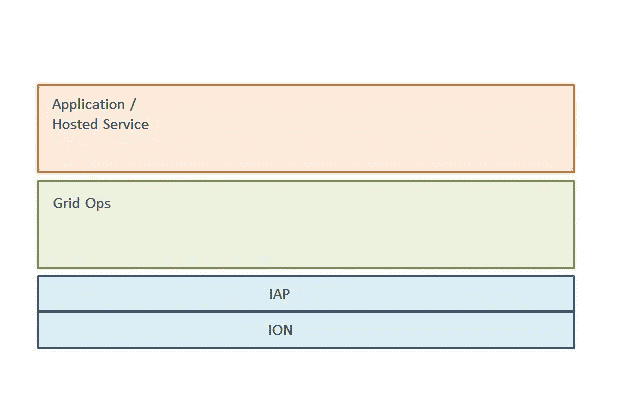

# 利用网格运营构建多功能智能分布式系统—第 1 部分

> 原文：<https://medium.com/hackernoon/versatile-and-intelligent-distributed-systems-with-grid-ops-part-1-8228bdfcb044>

这是帖子[[**1**](https://hackernoon.com/our-ambitious-quest-to-democratize-distributed-systems-act-1-protocols-b6bec5297213#.8n2x5mqx9)][[**2**](https://hackernoon.com/our-ambitious-quest-to-democratise-distributed-systems-act-2-ion-vs-json-ce69f4e5c4a9#.pindeejc9)][[**3**](https://hackernoon.com/the-advantages-of-the-iap-protocol-54ba85bc62d3#.jtrpe450g)]的后续帖子，旨在分享我们在[Nanosai.com](http://www.nanosai.com)就分布式系统所做工作的一些想法。

[Nanosai.com](http://www.nanosai.com)背后的核心愿景一直是帮助开发人员创建更快、更通用、更智能的分布式系统，通过更智能的互联网协议进行通信。这包括公共互联网上的分布式系统、私有网络中的分布式系统以及两者的混合。实现我们的愿景的一个基本部分是一个称为网格操作的开源 Java 工具包。

**什么是网格操作？**

Grid Ops 是一个用于创建高级分布式系统的开源工具包。它将附带几个已经预先实现的分布式用例，所以开发人员不必自己去做。这样，Grids Ops 最终将成为分布式系统的瑞士军刀，负责分布式基础设施，因此开发人员可以专注于应用程序方面。

Grid Ops 实现了我们的[网络协议 IAP](http://tutorials.jenkov.com/iap/index.html) 。通过控制网络协议和平台，我们可以确保对常见分布式用例的支持得到更优雅和自然的支持。我们计划支持基本的消息交换模式，如客户机-服务器、反向服务器和反向客户机。

我们还计划至少支持最基本的分布式用例，比如**服务发现**、 **RPC** 和**文件交换**，但我们也在考虑 **P2P** 和 **DHT** 类型的用例。接下来，我们将向您展示一个惊喜！

尽管我们是从 Java 实现开始的，但在未来，我们希望能够用 C#和 D 等其他语言来实现。从长远来看，我们希望看到 Grid Ops 作为 Java EE 平台的替代方案，用于许多不太适合 Java EE 的分布式用例。

**电网运营堆栈概述**

这是现在，我们将继续与更多的技术细节在后续职位。如果你想玩 Grid Ops，请访问我们的 [**GitHub 页面**](https://github.com/nanosai/grid-ops-java) ，代码示例请查看 [**这里**](https://github.com/nanosai/grid-ops-java-examples) 。我们正在准备公开发布我们的一些托管基础设施服务，如果您想提前收到访问邀请，请`[**Subscribe here.**](https://goo.gl/forms/zXQe9k2es9iombdD2)`

> [黑客中午](http://bit.ly/Hackernoon)是黑客如何开始他们的下午。我们是阿妹家庭的一员。我们现在[接受投稿](http://bit.ly/hackernoonsubmission)并乐意[讨论广告&赞助](mailto:partners@amipublications.com)机会。
> 
> 如果你喜欢这个故事，我们推荐你阅读我们的[最新科技故事](http://bit.ly/hackernoonlatestt)和[趋势科技故事](https://hackernoon.com/trending)。直到下一次，不要把世界的现实想当然！

