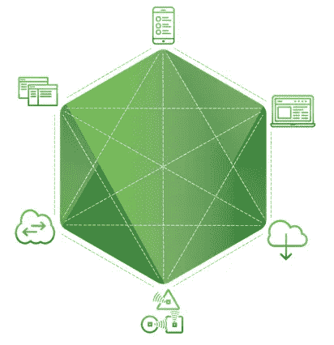

# Node.js 演示的企业案例版本 1

> 原文：<https://medium.com/hackernoon/version-1-of-the-enterprise-case-for-node-js-presentation-424553a383dd>

在过去的几个月里，Node.js 基金会一直在努力创建一个演示文稿，旨在将所有关于 Node.js 为什么是构建企业参与系统的最佳选择的最佳想法集中在一个地方。

本演示的目的是帮助 JavaScript 和 Node.js 开发人员向您的团队和管理层证明 Node.js 的合理性。

我们非常兴奋地宣布本演示文稿的[版本 1 已经推出。您还可以在](http://www.slideshare.net/NodejsFoundation/the-enterprise-case-for-nodejs-65523959?ref=https://nodejs.org/en/foundation/case-studies/) [Node.js 基金会资源页面](https://nodejs.org/en/foundation/case-studies/#presentation-the-enterprise-case-for-node-js)上找到，旁边还有不断增长的 Node.js 案例研究和企业对话视频目录。

与 Node.js 基金会的所有成就一样，这在很大程度上是社区的努力，我们要感谢所有贡献内容、专业知识和评论的基金会和社区成员。

我们现在正在开发一个新版本，除了数据和用例更新之外，它还将包括一个关于 Node.js 和开发者体验的部分。

如果你对第二版有想法，请加入 GitHub 上 [Node.js 福音工作组](https://github.com/nodejs/evangelism/issues/239)的讨论。

> [黑客中午](http://bit.ly/Hackernoon)是黑客如何开始他们的下午。我们是 [@AMI](http://bit.ly/atAMIatAMI) 家庭的一员。我们现在[接受投稿](http://bit.ly/hackernoonsubmission)并乐意[讨论广告&赞助](mailto:partners@amipublications.com)机会。
> 
> 如果你喜欢这个故事，我们推荐你阅读我们的[最新科技故事](http://bit.ly/hackernoonlatestt)和[趋势科技故事](https://hackernoon.com/trending)。直到下一次，不要把世界的现实想当然！

