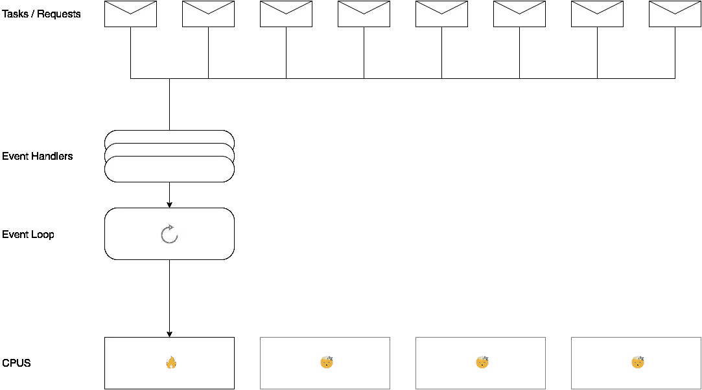
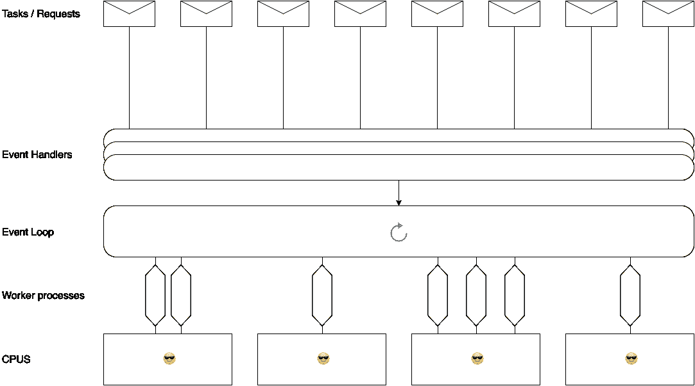

# Node.js 中非常简单的多线程实现

> 原文：<https://medium.com/hackernoon/very-simple-implementation-multi-thread-in-node-js-6b02e60fa8b1>

让我们开始用单线程杀死一个[处理器](https://hackernoon.com/tagged/processor)

```
//sync process
function slowSquare(n){
 var i = 0;  
 while (++i < n * n) {}
}slowSquare(100000)
slowSquare(100000)
```

`$time node app.js
**28.04 secs**`

```
//async process
function slowSquareAsync(){
 setTimeout(function(args) {
  let i = 0;  
  let n = 100000
  while (++i < n * n) {} 
 }, 1) 
}slowSquareAsync()
slowSquareAsync()
```

`$time node app.js
Waiting too long then I aborted (ctrl+c) after wait about 4mins`

为什么我的[笔记本电脑](https://hackernoon.com/tagged/laptop)会发热？:D



读了几篇文章后，我发现了这一点



然后我试着创建一个非常小的模块，我称之为 Iyem.js，Iyem 在巴哈萨语中的意思是女仆

我将尝试相同的代码，但使用 Iyem.js

```
let iyem = require('iyem')let slowSquareThread = iyem.create(function(){  
 var i = 0; 
 var n = 100000;
    while (++i < n * n) {}
    $.finish(i);  
})
slowSquareThread.start()
slowSquareThread.onFinish(function(result,err){
 console.log(result,err) 
})function slowSquare(n){
 var i = 0;  
 while (++i < n * n) {}
}slowSquare(100000)
```

`$time node app.js
**13.2 secs**`

哇，酷吧？，让我们尝试更复杂的多线程与线程间的通信(Pub Sub)

```
let iyem = require('iyem')let importDataReportWorker = iyem.create(function(){  
  const parse = require('parse-csv')
  const fs = require('fs')
  const reconcile = require('./Reconcile')
  parse(fs.readFileSync("./200MB.csv", "utf-8"),function(err,report)
  {
    $.sub("GET_TRX_SETTELMENT_COLLECTION_DONE",function(dataTrx){
      var result = reconcile(report,dataTrx)
      $.finish(result)
   })
  })
})let getTrxCollection = iyem.create(function(){
 const db = require('./db')
 db.find({transaction_date:"2017-10-10"},function(err,collection){
  if(err) $.error(err)
  $.pub("GET_TRX_SETTELMENT_COLLECTION_DONE",collection)
  $.finish()
 })
})getTrxCollection.start()
importDataReportWorker.start().onFinish(function(err,result){
 console.log("DONE")
 console.log(result)
})
```

这只是实验性的，请给我你的反馈，不要忘记鼓掌或分享

[](https://www.npmjs.com/package/iyem) [## iyem

### 管理多线程 Js 的简单方法

www.npmjs.com](https://www.npmjs.com/package/iyem) [](https://github.com/lukluk/iyem) [## 卢克卢克/艾耶姆

### 多线程 iyem - Nodejs

github.com](https://github.com/lukluk/iyem) 

## 如果你学到了什么，点击💚来帮助别人找到这篇文章。