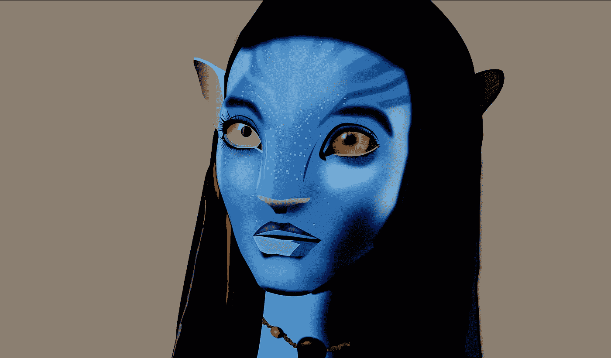
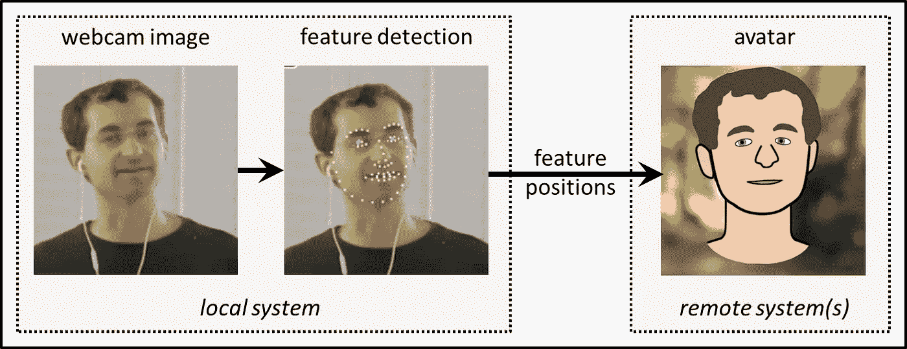
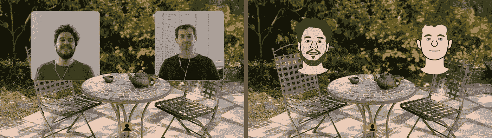
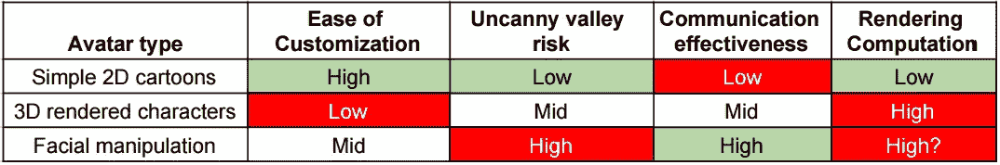

# 没有视频的视频会议？

> 原文：<https://medium.com/hackernoon/video-conferencing-without-the-video-6330ee1b1e3e>

> 在这篇文章中，我们展示了一个“穿上你的睡衣”视频会议的想法。

我们都知道非语言暗示对于有效沟通有多么重要。但是，纯音频电话仍然主导着电话会议。以今天的[科技](https://hackernoon.com/tagged/tech)、**为什么视频不是默认？**

我怀疑答案是技术缺陷、文化规范和个人偏好的结合。我讨论了我在上一篇文章中发现缺乏的一些技术方面，“[都 2016 年了，为什么视频会议仍然很糟糕](/@chris_82106/https-medium-com-chris-82106-its-2016-why-is-video-conferencing-still-terrible-1b8802032aae#.g3vnt1ezx)”今天，我想重点谈谈视频会议的两个缺点:

*   视频需要强大的互联网连接——即使我们自己的连接已经足够，我们也可能会担心人们是否会有良好的体验。
*   视频不那么私密——我们不总是想展示我们的穿着状态，我们凌乱的空间，我们的多任务处理。

这些问题会让我们感到不确定和不舒服。而不是我们积极寻求的情感。

如果我们能够保持视频会议的肢体语言优势，但显著减少这些负面影响，会怎么样？没有视频的视频会议！

*什么？*

其实就是用 ***头像*** 的视频会议。会议系统可以传送我们自己的图像，而不是传送我们自己的视频。使用网络摄像头视频作为输入，可以实时跟踪面部特征运动。这些面部特征位置将被传送给其他用户，他们将看到重建的动画化身。您的网络摄像头视频永远不需要离开您自己的电脑！

Proposed methodology

有人说过，“如果一张图片胜过千言万语，那么一段视频就能抵得上一百万。”我当然不想写一百万字。我们通过将现有的[会议系统 Locus](https://inthelocus.com) (公测版)中的演示视频转换成简单的头像，创造了一个这种想法的例子。这是第一次黑客演示，而不是一件精美的艺术品。

Locus with videos (left) vs. avatars (right)

Locus demo using avatars. *Best experienced with headphones* For reference, original demo with videos [here](http://inthelocus.com/i/demo).

很有趣，对吧？但是我们为什么想要这样一个系统呢？

1.  **带宽减少**。视频会议所需的数据速率大约是纯音频通话的 100 倍。视频不可靠一点也不奇怪！如果我们只传输面部特征位置信息，我们可以将“视频”数据速率降低到低于音频流！如果连接对于音频通话来说足够好，那么对于音频+虚拟形象来说一般就足够了。
2.  **隐私增加**。只传输你的肢体语言，不传输你的网络摄像头。
3.  **出现在一起更自然**。通过 Locus，我们致力于将面对面在一个房间里的体验转化为一个会议系统。使用视频，我们目前打破了每个参与者出现在一个盒子里的隐喻，盒子里有他们自己的背景，来自他们自己的物理空间。有了头像，与会者可以一起出现在一个空间。
4.  **好玩的**。谁不想在下一次见面时看起来像超人呢？
5.  **缩减 CPU** 。这将取决于化身系统和传统视频会议系统的实现细节，但是消除(有时多个)视频代码转换可以导致较低的计算量，并因此增加电池寿命。也可以为每个用户进行重建，允许用户选择 CPU 和化身质量的折衷。

听起来很棒。为什么**我们不想要这个系统？可能有一些缺点:**

1.  交流减少。与隐私的好处相反，我们周围的环境、眼袋等信息有时可以提供有用的背景信息，但这些信息可能会丢失。
2.  跟踪误差。从网络摄像头视频中跟踪面部特征并不总是 100%准确，可能取决于照明质量和其他因素。虽然视频分享依赖于类似的因素，但虚拟化身系统的降级可能不会那么优雅。
3.  恐怖谷。完善头像以避免令人毛骨悚然的因素可能是一大堆工作，可能永远不会达到 100%。
4.  多个用户的一个网络摄像头流可能会成为一个更难解决的挑战。

这种系统中的化身可以用许多不同的方式来设计。一些想法:

*   简单的 2D 卡通与定制。类似于演示中的 Chris & JD。
*   3D 渲染的角色。类似于演示中的露易丝。
*   从图像进行面部操作。使用对象的静态照片，并操纵它来匹配对象的实时面部表情。参见提斯等人的作品，这是一个有点令人毛骨悚然，但却令人惊叹的例子。

Trade offs on avatar types

我们在下面创建了这些选项的示例。目前形式的简单卡通确实丢失了一些表达信息，但是可以改进。我们确实喜欢这个选项的简单性——这样的卡通可以从网络摄像头的图像中自动生成。

Avatar option examples.

实现这一提议所需的技术似乎是可行的。你怎么想呢?阿凡达电话会议会是未来吗？

**与我们分享您的观点，并选择使用下表订阅更新，或** [**此处**](https://docs.google.com/forms/d/e/1FAIpQLScc9OTjdRC6WCTh5Ehuwrrw8e5g1WnQUweBoGCoiqbJsyNwsA/viewform) **。**

如果你喜欢你所读的，一定要💗下面。

> [黑客中午](http://bit.ly/Hackernoon)是黑客如何开始他们的下午。我们是 [@AMI](http://bit.ly/atAMIatAMI) 家庭的一员。我们现在[接受投稿](http://bit.ly/hackernoonsubmission)并乐意[讨论广告&赞助](mailto:partners@amipublications.com)机会。
> 
> 如果你喜欢这个故事，我们推荐你阅读我们的[最新科技故事](http://bit.ly/hackernoonlatestt)和[趋势科技故事](https://hackernoon.com/trending)。直到下一次，不要把世界的现实想当然！

