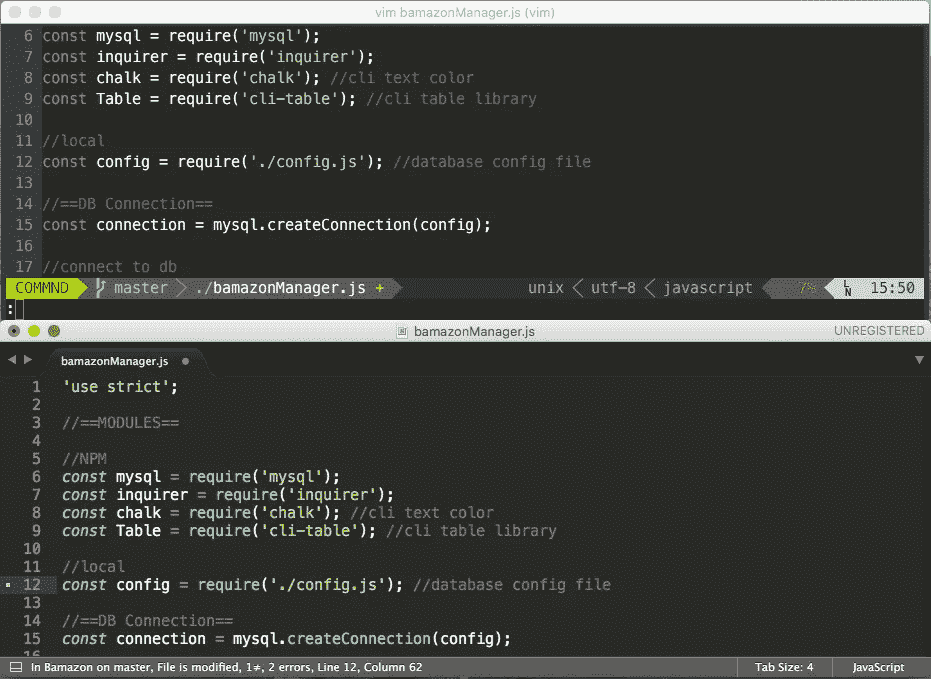
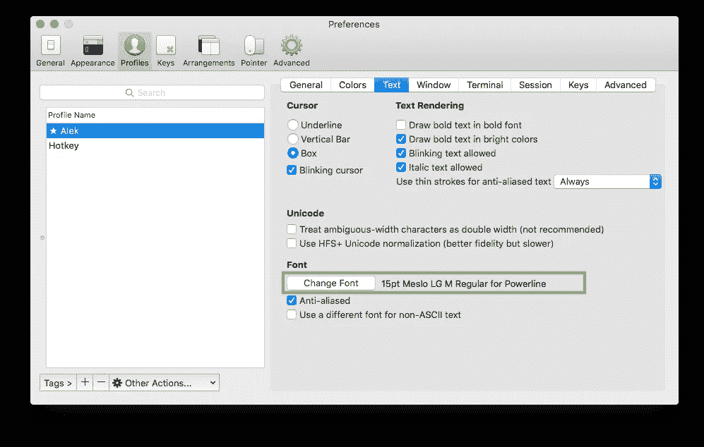

# 操作方法:外观精美的 Vim 功能

> 原文：<https://medium.com/hackernoon/vim-functionality-with-sublime-looks-a1bbaf5512d3>

Vim after customizations running in [iTerm2](https://www.iterm2.com/) (top), [Sublime Text 3](https://www.sublimetext.com/) (bottom)

仅仅因为你使用命令行编辑器并不意味着你必须做一个[时间扭曲](https://www.youtube.com/watch?v=tkplPbd2f60)回到绿屏[CRT](https://github.com/Swordfish90/cool-retro-term)的时代。本指南将介绍设置 Vim 的过程，以获得更崇高的体验。其目标受众是非 Vim 用户，他们发现自己不得不不时地进入 CLI 编辑器，并且正在寻找一些在美学上更熟悉的东西。

"这会让我在 Vim 上更快吗？"你可能会问。嗯，很可能不是。

然而，通过给自己一个一致的体验，在编辑器之间切换将不会那么混乱，允许你在同一个文件中快速找到你的位置。因此，从本地 GUI 编辑器进入 Vim，通过 SSH 进行一些快速的服务器端编辑应该会更加无缝。至于整个 H，J，K，L 主页导航的事情，你仍然是你自己的。

让我们看看我们将与什么一起工作。

*   [***Vim-monokai***](https://github.com/sickill/vim-monokai)**-*Vim 配色方案由[马辛库利克](https://github.com/sickill)*
*   ****。vimrc*** -Vim 配置文件*
*   ****pip*** -Python 包安装程序*
*   *[***电力线***](https://github.com/powerline/powerline)-状态栏插件由[金·西尔克肯](https://github.com/Lokaltog)*

> *这是我的 rc 文件。有许多像它一样的，但是这一个是我的。没有我，我的 rc 文件就没用了。没有我的 rc 文件，我就没用了。*

## *添加 Monokai 颜色主题*

*Sublime 使用的默认语法主题是 Monokai。Vim 中不包含该主题。幸运的是，我们可以使用 vim-monokai 非常接近。*

1.  *从 GitHub 获取 vim-monokai 主题，此处提供[。](https://github.com/sickill/vim-monokai)*
2.  *在回购的`/colors`文件夹中，您应该会看到`monokai.vim`*
3.  *将`monokai.vim`复制到`~/.vim/colors/`*

*我们将在 ***中把 monokai 添加到我们的 vim 配置中。vimrc* 的**部分。*

## *用 pip 安装电力线*

*[pip](https://pip.pypa.io/en/stable/) 是一个命令行包管理器，用于安装 Python 包。这类似于 Node 世界里的 [npm](https://www.npmjs.com/) ，或者 Ruby 里的 [gem](https://rubygems.org/) 。*

*我们将使用 pip 来安装电力线状态栏。这将显示我们所处的模式(正常、插入、可视等)。)，我们正在研究的 Git 分支，编码，语言和其他有用的东西。*

*要安装它，请打开您选择的终端，并输入以下命令。*

*`pip install --user powerline-status`*

## *用`.vimrc`把它们放在一起*

*以 rc 结尾的点文件表示配置文件。rc 文件的其他例子有 Bash 的`.bashrc`、Zsh 的`.zshrc`、Postgre 的`.psqlrc`等等。*

*您的`.vimrc`应该位于您的主目录中。*

*由于点文件是隐藏的，您将无法使用 Finder 浏览到它。相反，您需要通过终端键入`vim ~/.vimrc`或`nano ~/.vimrc`来打开文件。如果你设置了`subl`别名，你可以使用`subl ~/.vimrc`打开它。*

*更新你的`.vimrc`,看起来像下面的，第 5 行和第 6 行是可选的。*

*我们正在做的事情的概述:*

*   *`syntax on`-根据文件格式启用语法高亮显示*
*   *使用我们之前复制的 Monokai 主题*
*   *`set number`-在左侧显示行号装订线*
*   *`set incsearch` - *【可选】*搜索时显示匹配项*
*   *`set hlsearch` - *【可选】*搜索高亮显示*
*   *第 8 到 10 行让我们开始使用 Vim 中的电力线*
*   *`set laststatus=2`-保持我们的状态栏可见且位置正确*

## *关于字体的最后一点说明*

*如果你发现电力线状态栏排列不正确，你可能需要安装一种电力线专用的修补字体，可从[这里](https://github.com/powerline/fonts)获得。我自己也喜欢。*

**

***Change Font** found under **Profiles -> [ default profile] ->Text** for iTerm2*

*安装字体后，您需要在首选项菜单下更新终端的默认字体。*

****提问/评论/其他？*** *通过*[*LinkedIn*](http://linkedin.com/in/alekshnayder)*或* [*GitHub*](https://github.com/Alek-S)*

******

> *[黑客中午](http://bit.ly/Hackernoon)是黑客如何开始他们的下午。我们是 [@AMI](http://bit.ly/atAMIatAMI) 家庭的一员。我们现在[接受投稿](http://bit.ly/hackernoonsubmission)并乐意[讨论广告&赞助](mailto:partners@amipublications.com)机会。*
> 
> *如果你喜欢这个故事，我们推荐你阅读我们的[最新科技故事](http://bit.ly/hackernoonlatestt)和[趋势科技故事](https://hackernoon.com/trending)。直到下一次，不要把世界的现实想当然！*

**