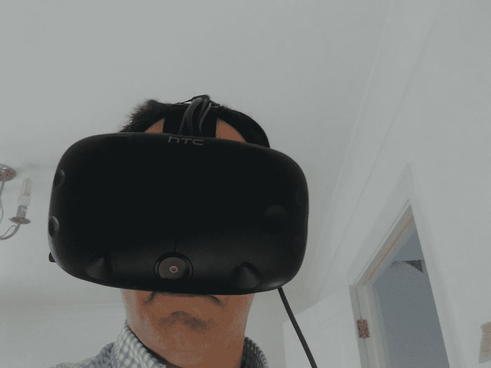
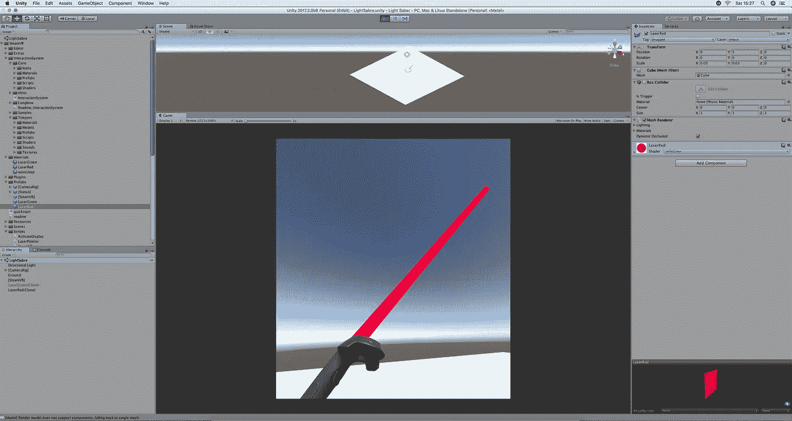

# macOS 中的虚拟现实(一)

> 原文：<https://medium.com/hackernoon/virtual-reality-in-macos-i-2ee427b06055>

## 为什么 macOS 中有 HTC Vive？

我有一部使用了两年的中级 Android 手机(Moto G 2015)，不能使用 [Google Cardboard](https://vr.google.com/cardboard/) 。我的平板电脑是一台装有 iOS9 的 iPad Mini“1”，因为不能再升级了。我的(旧)电脑是由零件组装而成的，已经用了 4 年了。

我热爱科技。我的薪水还算合理。但是我有一个家庭，我很注意花钱。

然而，我最近的收购表明我已经疯了。因为我决定买一台[顶级 iMac](https://www.apple.com/uk/shop/buy-mac/imac/27-inch) 和一台 [HTC Vive](https://www.vive.com/uk/product/) 从 VR 开始。在 macOS 上。

Hey. That’s me!!

不仅如此。PS4 plus [PSVR](https://www.playstation.com/en-gb/explore/playstation-vr/) 的价格或多或少相当于我仅在 HTC Vive 设备上的花费。或者说在主机世界世界之外，VR 的游戏和体验是给 Windows 的。如果我自己造了一台结实的 Windows 机器(包括一台[华丽的 1080 TI、](https://www.nvidia.com/en-us/geforce/products/10series/geforce-gtx-1080-ti/)和一个像样的处理器)并买了一台 [Oculus Rift](https://www.oculus.com/) ，我就能存下 40%的钱。

我既不喜欢 Playstation 也不喜欢 Windows。我选择了更复杂的路线:MacOS。macOS 的 VR 兼容性[才刚刚公布](https://www.apple.com/uk/newsroom/2017/06/macos-high-sierra-delivers-advanced-technologies-for-storage-video-and-graphics/)。老实说，我甚至不确定我是否能够将耳机连接到电脑上并让它工作。我找不到任何详细描述这些步骤的页面([如果你有同样的情况，请参见第 2 部分](/@gonfva/virtual-reality-in-macos-ii-39f54e0a9542))

那么，为什么要走 Mac 路线呢？其实为什么是 VR？

# 为什么是虚拟现实？

如果你一直在关注市场，你可能知道苹果宣布了一个名为 ARKit 的新框架。

ARKit 和新的苹果设备(包括已经推出的刷新率更高的 iPad pro 和几乎肯定即将推出的 iPhone 8)是体验方面的下一件大事。你可能还记得几个月前的[神奇宝贝 Go](http://www.pokemongo.com/en-uk/) 。想想类固醇上的口袋妖怪。

Mario Bros in a park

但不仅仅是在游戏方面。

考虑一下你是否可以[在增强现实中](https://www.macrumors.com/2017/06/19/ikea-plans-furniture-app-arkit/)看到你自己家里的家具。

IKEA is working on it but there are others ready too!

或者下一个迭代导航地图

Super cool demo of navigation on top of your camera. Watch it.

或者更简单的事情…

Do you need tape measures?

我的预测是，AR 将在很短的时间内(6/12 个月)进入“大众”，第二阶段基于两年后的“眼镜”。

# 如果 AR 是现在，为什么要赌 VR？

AR 现在。虚拟现实可能还有 3 年的时间。但是我认为这是学习和运用我自己的预测的最好时机。

谷歌在 AR 方面的成果是不存在的。我还没有见过任何东西比我在这篇文章中展示的基于苹果框架测试版的东西更酷。

但是[谷歌](https://hackernoon.com/tagged/google)在虚拟现实方面做了相当有趣的事情。他们为谷歌地球做的[工作超级酷](https://www.youtube.com/watch?v=MjnR_VipKNQ)(特别是“让我们放一个视觉环来提供一些背景信息，避免生病”)，并且 [TiltBrush](https://www.tiltbrush.com/) 看起来也很棒(顺便说一下，谷歌地球和 Tilt 目前都不能在 Mac 上工作)

谷歌加入了。苹果公司也在。脸书对它投入如此之多，以至于他们买下了 Oculus。微软似乎对 AR 更感兴趣，但最有可能的是，真正的 AR 不会是笨重的设备

无论如何，很明显大玩家已经加入了。

# 好的。也许 VR 是一个很好的赌注。但是为什么要用 Mac 的 HTC Vive 呢？

首先，从我收集到的信息来看，Oculus 和 HTC Vive 在显示屏方面相对相似，但 HTC Vive 在位置跟踪方面似乎明显更胜一筹。他们用激光把你定位在你的房间里，精确度在毫米以下。不仅刷新快，分辨率高就够了。能够追踪到你是至关重要的。

品牌方面，苹果从 HTC Vive 开始。从我在谷歌上看到的演示来看，它们似乎也和 HTC Vive 一起消失了(显然脸书没有)

然后还有一个额外的赌注。我认为苹果是这个领域真正的创新者。所以在 Mac 上开发似乎是个不错的选择。以玩 AR 的短期来看。

# 还有一件事…

但是还有一个额外的原因。更私人一点，但对我来说很重要。

我有两个女儿(双胞胎，14 岁)。他们喜欢计算机(包括学校里的 CS)但是他们不在家编程。

有什么比开发游戏更好的方法让他们进入编程领域呢？

对于星战迷来说，还有什么比光剑演示更好的方式来开发游戏呢？

Lightsaber in VR. Not very pretty but functional. And simple. Dark side!!

我不知道它是否能吸引他们。但我知道，如果他们有足够的游戏可以玩，就不会这样了。

要是我能有两个 HMD 就好了…

[该系列的第二部分已经推出](/@gonfva/virtual-reality-in-macos-ii-39f54e0a9542)(已经有点过时了)