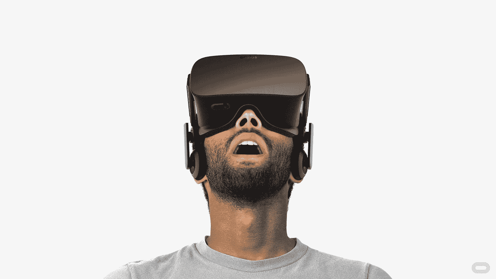

# 虚拟现实在 CES 2016 上大热

> 原文：<https://medium.com/hackernoon/virtual-reality-is-hot-at-ces-2016-94dbe43b7481>

在 [CES](https://www.cesweb.org/) 上等待观看新款 [Oculus](https://hackernoon.com/tagged/oculus) 的两个小时就说明了一切。 [VR](https://hackernoon.com/tagged/vr) 在展会上随处可见。Maven 到目前为止已经在 VR 上做了[一笔投资](http://altvr.com/)，我们正在寻找更多，因为 2016 年将是 VR 之年。一个很大的原因是脸书的 Oculus 在展会上宣布了预购，并在一天内售罄。索尼展示了将于今年晚些时候推出的令人惊叹的 VR 游戏平台，HTC、三星和谷歌也在竞相向市场推出新产品。我们不投资硬件，但喜欢预测依赖新硬件平台的消费软件趋势——VR 顶级软件产品的质量已经改变了游戏规则。

以下是我们在 2016 年押注 VR 的原因:

**硬件平台上的新软件**
在很多方面，这让我想起了 2007 年的 iPhone 发布会。当我第一次看到 iPhone 时，我知道它将改变消费者的生活，我们成功投资了许多新的消费者手机应用程序，如 Tango(领先的[即时通讯](https://en.wikipedia.org/wiki/Over-the-top_content)应用程序，最近估值为 1B 美元)、Check(2014 年以 3.6 亿美元出售给 Intuit 的个人金融应用程序)和 [Banjo](http://www.inc.com/magazine/201504/will-bourne/banjo-the-gods-eye-view.html) (最近获得软银 1 亿美元投资)。新的硬件平台使新的消费软件产品成为可能。

**看过体验**
我第一次认真考虑 VR 是在两年多前。即使在早期，一些消费软件也是我从未尝试过的。比如在 Altspace，[真的就像身临其境](http://www.npr.org/sections/alltechconsidered/2015/06/01/411233592/getting-physical-and-emotional-in-virtual-reality)。现在，软件和体验更加成熟和更好，事情将开始迅速加速。因此，我们正在寻找更多改变游戏规则的虚拟现实消费者体验来投资。

**市场验证**
我们看好虚拟现实市场的渗透率。一些分析师预测，2016 年将有大约[1200 万头耳机被购买——一些报告有更乐观的数字，包括在未来两年半](http://fortune.com/2015/05/07/vr-headset-launches/)将售出近 [1 亿头。](http://www.kzero.co.uk/blog/vr-headset-sales-forecasts-and-market-penetration-2014-2018/)

我们不能肯定地预测未来，但我们可以开发深思熟虑的假设，做我们的研究，并与专家和创始人交谈，以更好地了解市场何时会起飞——这就是为什么我们现在正在寻找新的面向消费者的虚拟现实软件创业投资。

> [黑客中午](http://bit.ly/Hackernoon)是黑客们下午的开始。我们是这个家庭的一员。我们现在[接受投稿](http://bit.ly/hackernoonsubmission)并乐意[讨论广告&赞助](mailto:partners@amipublications.com)机会。
> 
> 如果你喜欢这个故事，我们推荐你阅读我们的[最新科技故事](http://bit.ly/hackernoonlatestt)和[趋势科技故事](https://hackernoon.com/trending)。直到下一次，不要把世界的现实想当然！

