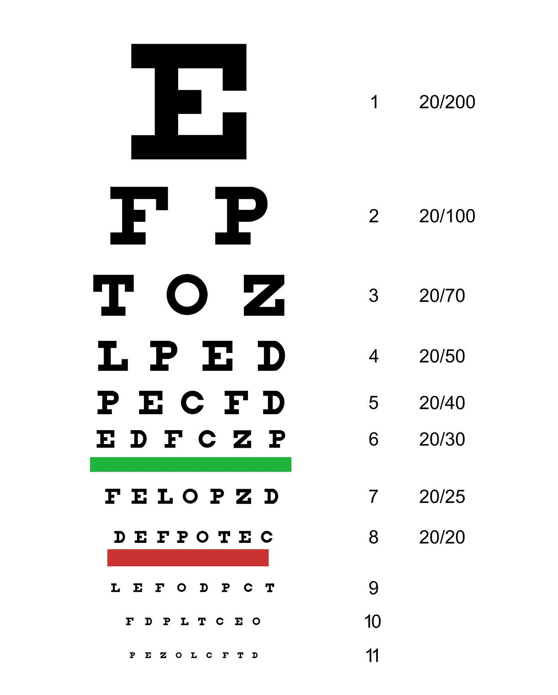
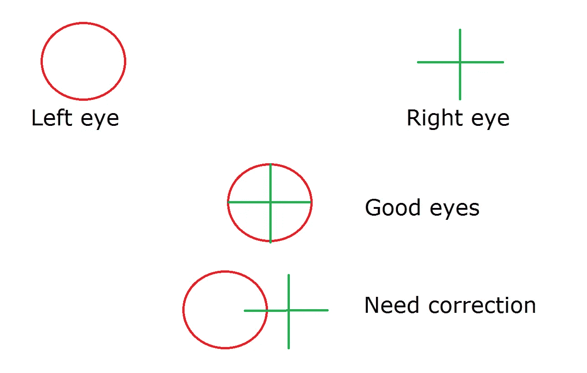
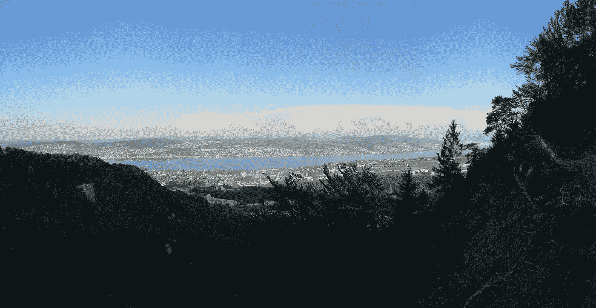

# 虚拟现实让我在基础现实中的深度感知更加丰富。

> 原文：<https://medium.com/hackernoon/virtual-reality-made-my-depth-perception-in-base-reality-richer-2cd858ec478d>

## 现在，我对虚拟现实头戴设备的使用发现了我眼睛的一种医疗状况，并导致我不再以真实的深度来看待这个世界。

我从十几岁就开始戴眼镜了。多年来，我一直戴着同样的远视和近视矫正眼镜。当我开始进入人生的黄金时期时，我不得不开始使用两种不同刻度的双光眼镜。当我开始头痛时，我知道我眼镜里的配方不再是最佳的。

我今年开始研究虚拟和增强现实耳机。我发现它们让我的眼睛有点难受，但我并不觉得有什么了不起。

在我尝试虚拟现实的几个星期后，我开始头疼，同时我注意到不戴眼镜我可以读得更好。所以我什么也没想，决定去检查一下我的眼睛。与验光师的对话很奇怪:

*   你的远视处方和以前一样。有一个小的修正，但不是很大。
*   那我的头痛怎么办？
*   我无法解释。你知道有什么健康问题吗？
*   据我所知没有。
*   我不明白为什么头痛来得如此突然。工作条件有什么变化吗？
*   不完全是，嗯，有一些…我最近一直在研究虚拟现实眼镜。

验光师让我下次带眼镜，我带了。当他试戴全息透镜时，在对增强现实的敬畏之后，他决定测试我的深度校正，他们称之为[棱镜校正](https://en.wikipedia.org/wiki/Prism_correction)。

Visual test for correct depth perception

这个测试简单得令人难以置信。应该匹配的左右眼的两个不同图像。对于能正确看到深度的人来说，十字和圆圈会居中。对我来说，他们甚至没有接触。它们到处都是。与其他眼睛状况一样，矫正是以屈光度来衡量的。医生告诉我我有 7 屈光度。

几天后，我摘了新眼镜。店员看了看我的号码，她明确地说:

*   接下来的两周你可能会头疼
*   事情看起来会被扭曲。你不会开车回家吧？

第二个问题引起了我的兴趣，当我站起来准备离开时，我明白了她的意思。感觉地板离我更近了，但当我看向我的脚时，它会翘起来。就好像我走在空间连续体的一个局部极小点上。

我走到外面，大自然征服了我。植物伸出来了，红色的花闪闪发光，如此接近。当我回到家，我告诉我的妻子:

> 哇，新发型！

她看着我，好像我在抽什么东西，然后平淡地告诉我，她的头发和以前一样。但它并没有像电视广告让你相信的那样，看起来更蓬松，音量更大。

周末，当我坐在花园里时，我看到了像电影《亲爱的，我把孩子们缩小了》中那样大的草。大自然在对我吼叫。有趣的是，所有人造建筑的变化并没有那么极端。它们一直在的墙。走下坡路似乎更容易，因为我当地的最低点使攀登看起来不那么陡峭。往上走则相反。

然后我意识到我恐高可能与我之前的深度失明有关。我总是看到事情越来越陡峭。当我们周末去爬山时，很明显那些悬崖并不深。

我已经使用这些新眼镜几个星期了，我已经习惯了。头疼没了，我当地最低也退了。但是当我看着大自然时，我仍然敬畏最简单的杂草。虚拟现实让我的基础现实更加丰富。

> [黑客中午](http://bit.ly/Hackernoon)是黑客如何开始他们的下午。我们是 [@AMI](http://bit.ly/atAMIatAMI) 家庭的一员。我们现在[接受投稿](http://bit.ly/hackernoonsubmission)，并乐意[讨论广告&赞助](mailto:partners@amipublications.com)机会。
> 
> 如果你喜欢这个故事，我们推荐你阅读我们的[最新科技故事](http://bit.ly/hackernoonlatestt)和[趋势科技故事](https://hackernoon.com/trending)。直到下一次，不要把世界的现实想当然！

