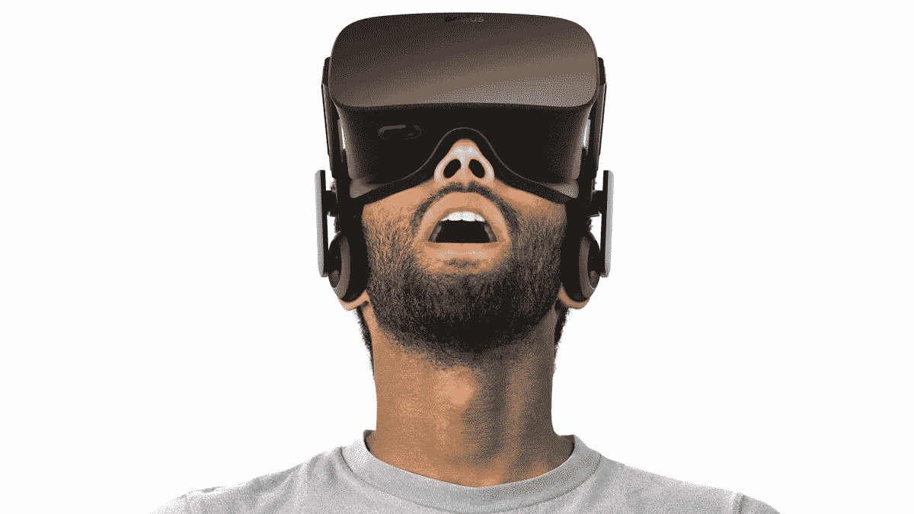

# 虚拟现实——技术界的累赘

> 原文：<https://medium.com/hackernoon/virtual-reality-techs-white-elephant-7fb03b33443b>

## 为什么虚拟现实没有接管世界

# **当行业的光芒不相信炒作时，你必须开始提问**

*   Oculus 做出了一个举动，向世界发出了虚拟现实领域一切都不顺利的信号
*   他们采取了前所未有的措施，提供慷慨的退货政策，作为鼓励人们购买硬件的一种手段
*   **如果你不喜欢这个产品，你可以在 14 天内无条件退货**
*   这表明 VR 提供的用户体验还远远没有做好主流大众消费的准备
*   这种退货政策在科技行业几乎是闻所未闻的，也是迄今为止消费者对该产品反应极为负面的最大迹象
*   为了阻止心怀不满的用户将耳机扔进抽屉并忘记它们，它不得不提供这一政策，以鼓励消费者冒险尝试
*   很明显，虚拟现实长期存在的问题还没有得到解决
*   **问题是:**
*   **成本** —一个独立的耳机本身的成本就非常昂贵，但是当你需要一个控制台或一台 PC 来运行它时，你就有负担能力的问题了
*   设计——手机很大，不舒服，而且很重，人们穿起来感觉很笨。这是一个从未被解决的设计问题——也许这就是为什么苹果没有在这个领域发布任何东西
*   安全——当你使用它的时候，它们会让你感觉不舒服，你会失去一些感觉功能
*   **系绳**——你被一根缆绳拴在某物上，这根缆绳要么阻止你移动到你想去的地方，要么绊倒你
*   **内容**——因为产品没有被大众市场使用，可供消费的产品最多也是有限的。在 VR 拥有完整的产品线或开始开发独立内容之前，它将一直处于边缘地位。就目前而言，开发商没有足够的资金来专注于为早期用户创造低质量的内容
*   由于产品的宣传，它正遭受过度出版。他们不是承诺不足、兑现过多，而是承诺过多，现在正试图迎头赶上。- VR 有一个公关问题，随着 AR 的快速发展，它将被进一步甩在后面。因为虚拟现实还没有为更广泛的公众消费做好准备，它永远不会成为病毒式增长的受益者，因为福音派对他们享受产品的乐趣越来越感兴趣。如果虚拟现实设备的销售停滞不前或下降，我不会感到惊讶，直到他们解决了很多问题
*   这不太可能在今年发生——这意味着在可预见的未来，虚拟现实的前景看起来很严峻
*   要改变这种情况，必须有一种产品或服务能够改变这种模式——独家内容可以实现这一点，无论是沉浸式游戏还是体验式编程——必须出现一些革命性的东西来改变虚拟现实的未来
*   这就是科技巨头转向增强现实和语音识别的原因。他们知道他们的虚拟现实产品还没有开发到适合大众消费的程度，所以他们正在利用主流技术——智能手机上的摄像头和语音处理
*   从长远来看，AR 可能比 VR 有更多的问题——由于屏幕尺寸造成的产品限制，缺乏对屏幕背后发生的活动的沉浸感等。—但是企业的短期案例非常强大
*   PokemonGo 就是一个明显的例子
*   AR 逃避了 VR 所做的许多批评，因为它几乎没有上面列出的问题——你不需要购买昂贵的组件来参与是主要原因
*   长期来看，虚拟现实将会征服它的恶魔，短期来看，它将会输给增强现实
*   虚拟现实可能会输掉这场战斗，但最终会赢得这场战争