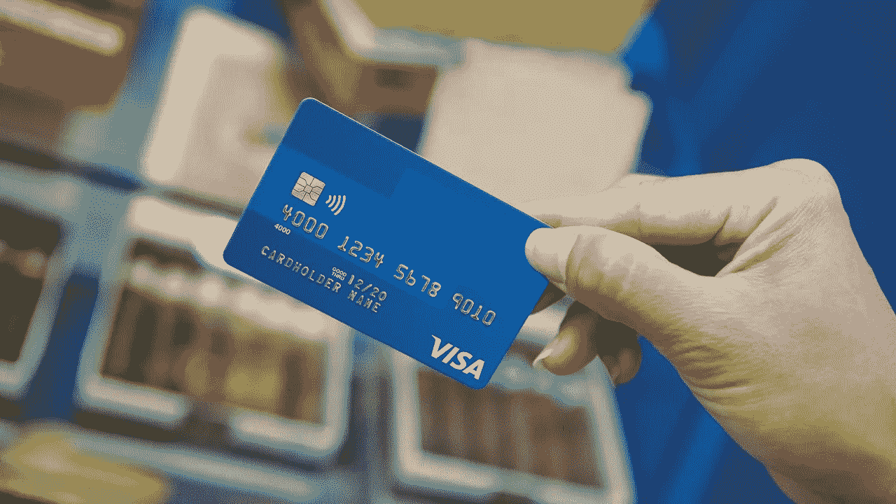

# Visa 启动区块链 B2B 支付平台的第一阶段

> 原文：<https://medium.com/hackernoon/visa-initiates-first-stage-of-blockchain-b2b-payments-af08b44d3e6>

上周在加密领域发生了很多事情。

随着时间的推移，随着机构和公司大规模使用这项技术，区块链似乎正在慢慢地渗透到完全的日光中。

就在最近，CME 集团宣布，比特币期货交易最早将于 12 月开始。尽管存在争议，但将比特币加入衍生品市场可能是实现投资者真正接受比特币的重要一步。

此外，美国最大的加密货币市场比特币基地宣布了比特币基地托管:一项旨在帮助拥有超过 1000 万美元的机构投资者购买和存储数字资产的新服务(所有加密投资者都知道，这可能是一个充满悬念和令人恐惧的过程)。

除此之外，Square 的移动支付平台 Square Cash 宣布，他们将在其应用程序中添加比特币买卖功能，这将真正为比特币向散户投资者开放。

如果这还不够，Ripple 刚刚宣布了 RippleNet 用户联盟的新成员，美国运通。简而言之，美国运通将利用 RippleNet 及其本地数字资产 XRP，为美国和英国的客户进行几乎即时的跨境汇款

现在，世界上最大的全球支付处理商之一的 Visa 正处于推出其首个总部设在区块链的支付系统 B2B Connect 的初级阶段。

Visa 去年首次宣布，计划利用该平台通过促进机构之间的直接支付来简化跨境支付，从而摆脱该行业目前依赖的中间商。该平台由区块链初创企业 chain 开发，旨在确保企业之间安全透明的支付。

总部位于美国的商业银行、韩国的新韩银行、菲律宾联合银行和总部位于新加坡的大华银行已经在与 Visa 合作这个项目。

在一次采访中，Visa 的全球解决方案负责人 Kevin Phalen 表示，银行已经在该平台上进行现场试用交易。

在该项目的第一阶段之后，第二阶段将进入商业发射阶段，计划于 2018 年发射。

费伦解释道:

> “本周的公告只是我们朝着 Visa B2B Connect 商业发布迈出的第一步。我们开始处理与特定客户的银行间测试交易。包括企业在内的其他银行将很快跟进。”

此外，根据一份新闻稿，Visa 的现有合作伙伴以及未来的合作伙伴可以利用该公司的应用编程接口(API)来创建自己的平台。

**结论**

感谢你花时间阅读这篇文章，我希望你真的喜欢它。如果您发现这很有价值，请不要忘记点击👏按钮！也可以随时分享我的内容！

在所有社交媒体平台上关注@ TheCoinEconomy，了解加密货币市场和区块链科技发展的最新动态。( [TradingView](https://www.tradingview.com/u/thecoineconomy/) ， [Twitter](https://twitter.com/thecoineconomy) ， [Instagram](https://www.instagram.com/thecoineconomy/) ，[脸书](https://www.facebook.com/Thecoineconomy-353316841786257/)，[stock wit](https://stocktwits.com/TheCoinEconomy)s)