# 维萨卡诺夫-RNN——机器生成的丈夫聊天记录

> 原文：<https://medium.com/hackernoon/visakanv-rnn-machine-generated-husband-chatter-c2b431bf0ac2>

## 机器学习可以重现 ted 演讲、奥巴马演讲和死亡金属乐队的标志。它也能复制我丈夫的漫谈吗？

大约一个月前，我从 General Assembly (SG)为期 [12 周的编码训练营](https://generalassemb.ly/education/web-development-immersive)毕业。这是一个非常紧张激烈的过程，我现在感觉有点像《黑客帝国》中的尼奥。看着事物的源头，并能够理解正在发生的事情，这真的很酷。

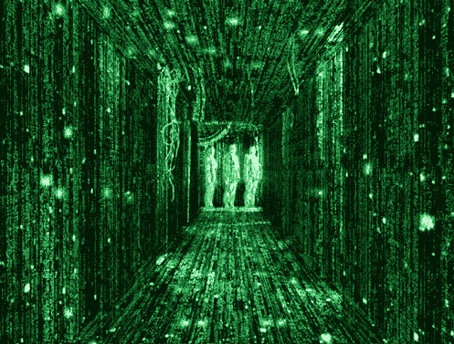

从那以后，在编码卡塔和工作面试之间，我在做[的小副业](http://sharanvkaur.github.io/#works)中获得了很多乐趣。这里有一个关于我最喜欢的一个故事。

这一切都是从我参加一个[创意编码聚会](https://www.meetup.com/Singapore-Creative-Coding-Meetup/events/238608373/)开始的。我刚刚花了 12 周时间学习了一些相当实用的技能，我急切地想看看它们是如何被用于恶作剧的。主题是机器学习。

有两位演讲者，他们的演讲很吸引人。其中一位名叫[的 Rob Peart](https://twitter.com/lgndryhappiness) 写道[他是如何使用神经网络生成死亡金属乐队标识](/@lgndryhappiness/neural-nets-graphic-design-and-death-metal-40d058eb65d1):

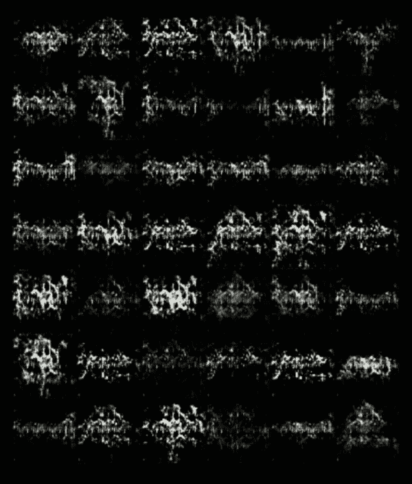

Delightfully ominous. (Image: [Rob Peart](https://medium.com/u/c08368f2ae94?source=post_page-----c2b431bf0ac2--------------------------------))

听起来很有趣——我想玩！

## **入门(预演)**

我按照[杰夫·汤普森的教程](http://www.jeffreythompson.org/blog/2016/03/25/torch-rnn-mac-install/)上的安装说明，遇到麻烦时参考[阿萨德·乌丁的安装指南](http://www.asaduddin.com/2017/03/torch-rnn-macos-installation-guide-2017-average-joe-edition/)。就像 Rob 说的，关于莎士比亚的培训很快就会变得无聊。我也不是很想用图像，就开始到处找。

## **寻找其他可以学习的例子**

我发现了两个我非常喜欢的项目——萨米姆的泰德-RNN 的 T21(接受了超过 400 万字的训练！)和[奥巴马-RNN](/@samim/obama-rnn-machine-generated-political-speeches-c8abd18a2ea0) ( > 70 万字)。

现在，碰巧我在这个世界上最喜欢的人有 66.2%是通过[一个写一百万字的项目](http://www.visakanv.com/1000/)。这至少有 662 千字——对于我想做的事情来说已经足够了。

## **开始…这次是真的了**

首先，我从 Wordpress 导出博客，得到一个超过 60，000 行的 XML 文件。接下来，我花了大约 2 个小时清理它。移除元数据很容易，但移除帖子中的格式就比较困难了。我有很多正则表达式练习！一旦完成，就是训练时间了。训练莎士比亚数据集花了大约一个小时，所以我没想到这要花很长时间…男孩，我错了。整整花了 5 个小时！

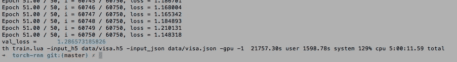

At long last…

创建我的第一个样本非常快…然后我得到了一堆令人失望的垃圾。

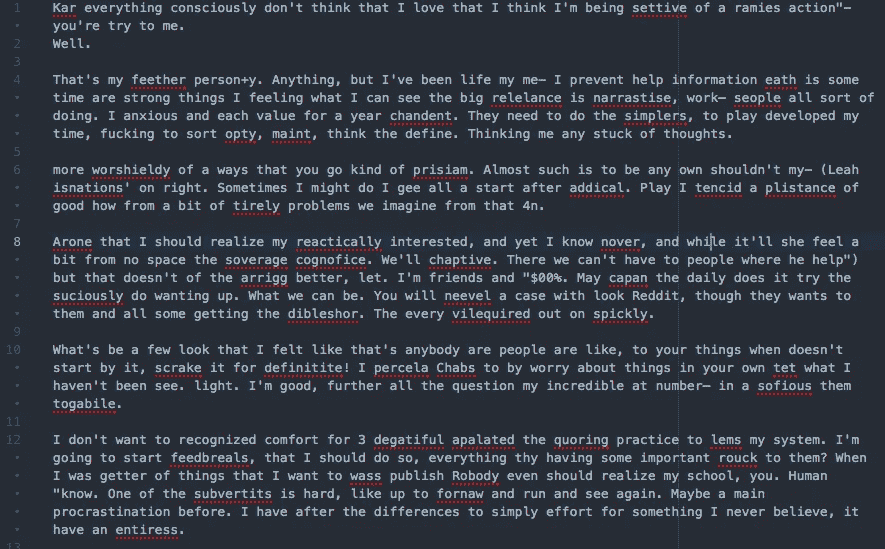

“Play I tencid a plistance of good how from a bit of tirely problems we imagine from that 4n.”

这看起来一点也不像奥巴马-RNN 法案的结果…是时候真正阅读文档了。

## 挖掘细节

在卡帕西关于 [RNN 效应](https://karpathy.github.io/2015/05/21/rnn-effectiveness/)的文章中，他解释说设定温度会改变样品的制作方式。

> 较低的温度会导致模型做出更有可能，但也更无聊和保守的预测。更高的温度导致模型冒更多的险，增加结果的多样性，但代价是更多的错误。

这很有道理。下面的例子是 6000 字符长的文本，以“让我们谈谈拖延症”开始，在每个温度设置下。

## 以有意义的方式展示信息

我想要一种方法来可视化正在发生的事情，所以…文字云！(这里不需要重新发明轮子，[wordclouds.com](http://www.wordclouds.com)是免费的，它完全按照标签上说的做。)

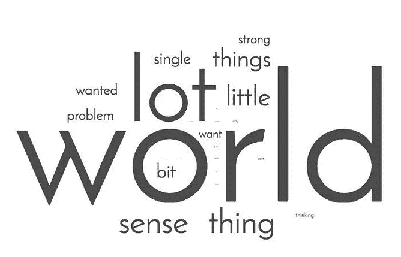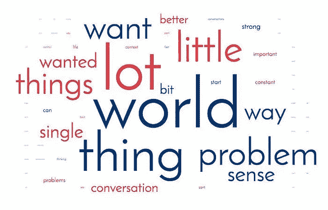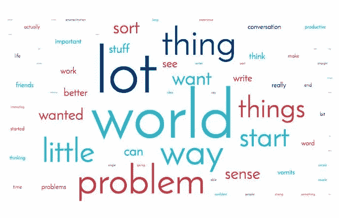

temperature 0.1 to temperature 0.3

保守的样品(1 和 2)是重复的和令人厌烦的。结果是大段大段的文本，没有标点符号、句子或段落。在第一个示例中，单词“world”出现了 120 多次！

样本 3 是第一个返回造词的例子(“confriend”和“boathe”)。

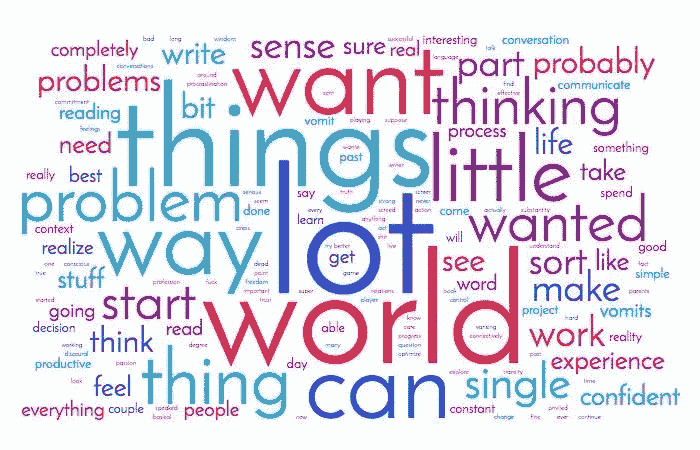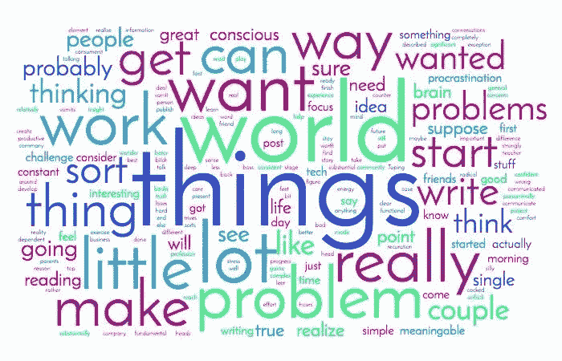

temperature 0.4 & 0.5

样本 4 是第一个有段落的！只有两个，而且都是长得离谱的 3000 字的句子。

还有大约 10 个半胡言乱语的单词，但它们看起来仍然很熟悉(windom =智慧，priviled =特权，speaked =说话)。随着我们变得越来越不保守，发电机尝试更“冒险”的事情。

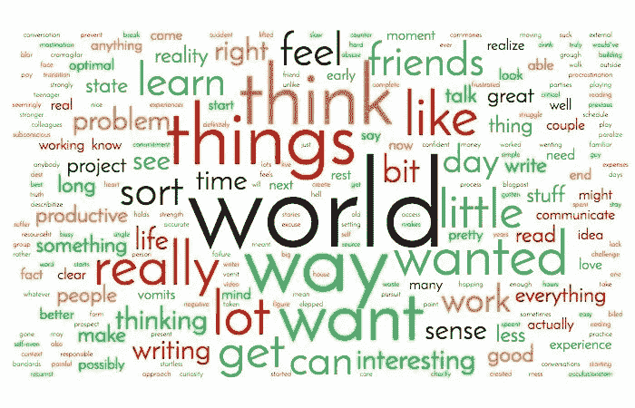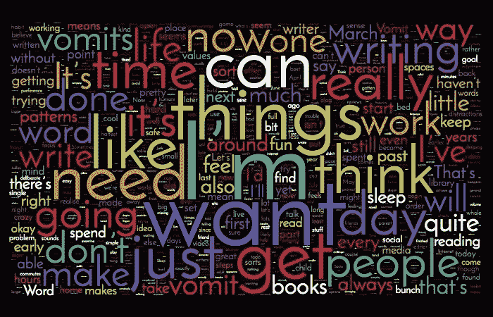

best results at temperature 0.6 & word cloud of the original text (>600k words)

在我看来，样品 6 是我得到的最好的结果。它有一些听起来像是签证的 Lorem Ipsum 版本。我最喜欢的一些台词:

> 想想看，我是一个青少年，事实上，这是做事情和喝酒的家伙了谈话和关闭同样的事情
> 
> 于是我吮吸着我想读出来的东西倒***地真实地写出了许多我玩的现实的东西*** 在伟大的我到那我想得到的最佳开始是怎样成为一个只有那我应该成为一个交谈的人的日子的外在
> 
> ***更好地在思维和建筑的意义上*** 外求最多是与貌似 ***的决裂所以我觉得我应该把我所爱的一切*** 越写越少到真正的结尾。
> 
> 让我对任何人负责实际上会让我感兴趣
> 
> 我觉得我已经为它呈现了——然后我想做同样的事情，而不是早期交流和学习，以及意识到你知道思考的问题。我想这不是真的感觉很好吧。
> 
> 一些有趣的是我们对这个世界的好奇心，我想弄清楚并思考这个问题，这让我很可能喜欢他们的想法

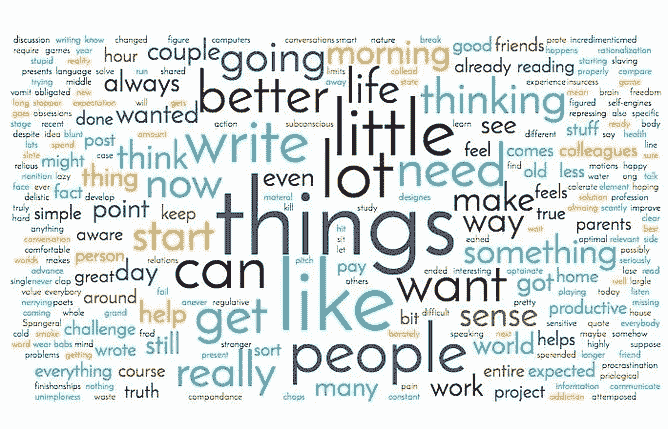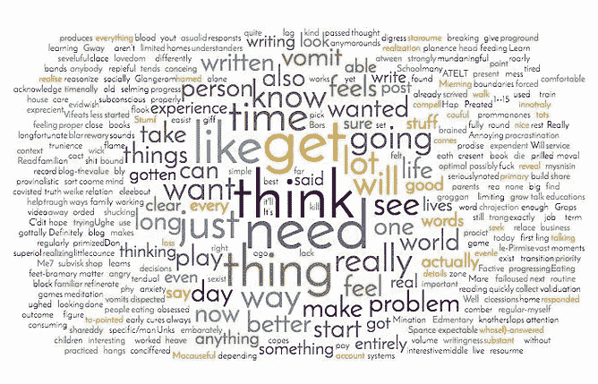

temperatures 0.7–0.9

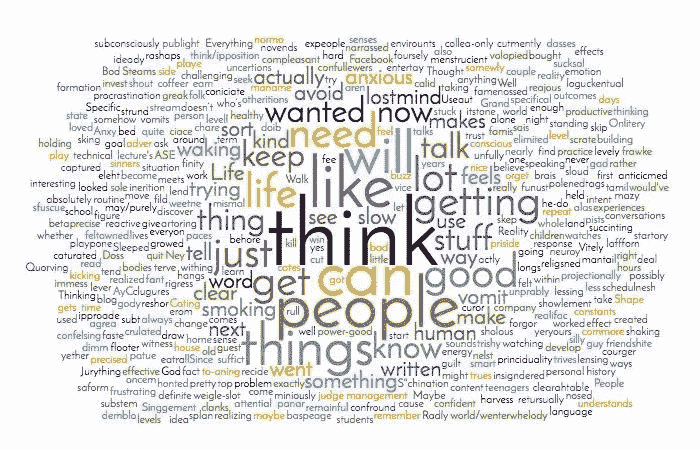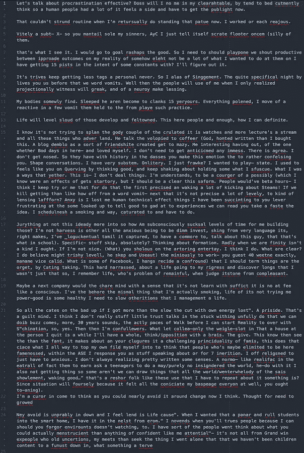

temperature 1.0 & the resulting output

*   样本 7-10 越来越垃圾，很难阅读
*   到了 9 和 10，句子变得更短、不连贯和突兀
*   标点符号似乎有点乱，出现了问号和破折号
*   有越来越多的胡言乱语——单词云确实有助于形象化这一点！

# 我学到了什么，我喜欢什么，我会做得更好

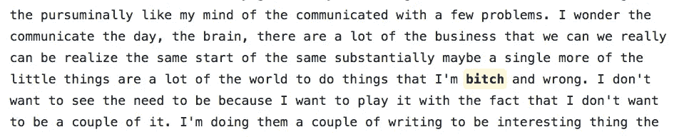

“Gasp. Language!”

*   我爱，爱，爱那个脏话出现了。我不确定这对我意味着什么。(“操”出现在温度 0.3，“婊子”出现在温度 0.5。)
*   我认为这里的结果没有泰德-RNN 和奥巴马-RNN 那么好，因为那些例子是从一个更一致的格式中学习的。另一方面，维萨坎利用这个博客写任何他想写的东西。回想起来，如果我选择了某些类别的帖子而不是所有的，可能会做得更好。

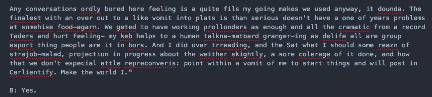

I laughed way too hard at this.

老实说，我仍然不能完全解释什么是神经[网络](https://hackernoon.com/tagged/network)，或者机器[学习](https://hackernoon.com/tagged/learning)到底是如何工作的。但我觉得我现在在球场的某个地方，而不是一个完全的局外人，不知道每个人都在谈论什么。

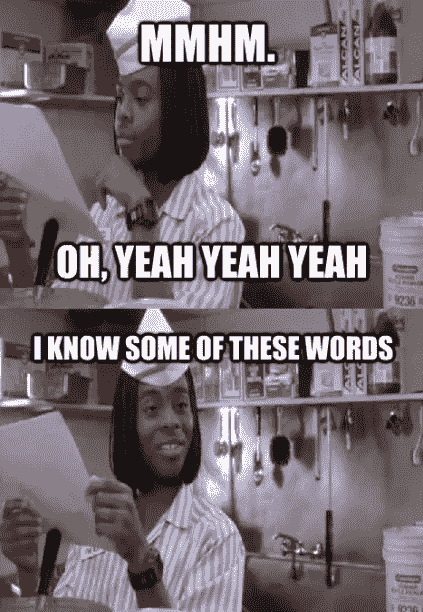

Multi-layer Recurrent Neural Networks! Sequential processing! Optimization algorithms! Corpus!

我的小玩具可能不会很快为 [Visakan](https://medium.com/u/e6e576d9a4e7?source=post_page-----c2b431bf0ac2--------------------------------) 写博客，但它的制作和修补肯定很有趣！

*你可以在这里***和我的作品集* [*这里*](http://sharanvkaur.com/) *。**

******

> *[黑客中午](http://bit.ly/Hackernoon)是黑客如何开始他们的下午。我们是阿妹家庭的一员。我们现在[接受投稿](http://bit.ly/hackernoonsubmission)并乐意[讨论广告&赞助](mailto:partners@amipublications.com)的机会。*
> 
> *如果你喜欢这个故事，我们推荐你阅读我们的[最新科技故事](http://bit.ly/hackernoonlatestt)和[趋势科技故事](https://hackernoon.com/trending)。直到下一次，不要把世界的现实想当然！*

**