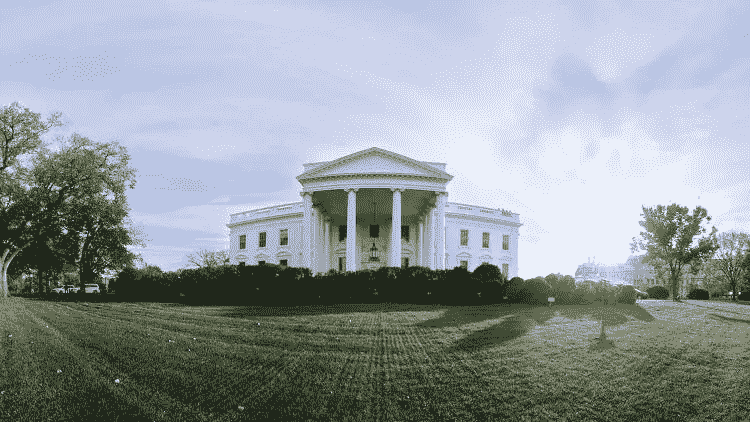

# 在 360 度虚拟现实中参观白宫

> 原文：<https://medium.com/hackernoon/visit-the-the-white-house-in-360-virtual-reality-b821a1a5b353>

## 虚拟现实之旅由总统巴拉克·奥巴马和第一夫人 T2 讲述。

(Credits: The White House via [Facebook](https://www.facebook.com/WhiteHouse/videos/10155140995934238/))

[总统特别助理兼白宫副首席数字官科里·舒尔曼](https://medium.com/u/ab98eb86af2d?source=post_page-----b821a1a5b353--------------------------------)在她的博客上写道:“它坐落在一个革命者选择的土地上。它是由一个爱尔兰移民设计的，是由奴隶建造的，自从约翰和阿比盖尔·亚当斯第一次走进它的大门以来，它一直是每一位总统的家。这是白宫，人民的房子，它属于所有把这个国家称为家的人。”

360 度虚拟之旅是与脸书的 Oculus 和 Felix & Paul 工作室合作完成的。

虚拟现实正在成为政府的一个非常有用的工具，特别是在数字外交方面。

去年一月，[联合国](https://medium.com/u/3e33f42d2bd?source=post_page-----b821a1a5b353--------------------------------)推出了[*Sidra*](http://with.in/watch/clouds-over-sidra/)上空的云，这是第一部关于影响叙利亚的难民危机的虚拟现实电影。这部电影于 2015 年达沃斯世界经济论坛上首次推出，由联合国顾问 Gabo Arora 和电影制作人 Chris Milk 创作。它记录了 12 岁女孩 Sidra 在约旦 Zaatari 难民营的生活，那里有大约 13 万叙利亚难民。

这里更多 2016 年推出的 VR 项目:

 [## 2016 年回顾:数字外交的虚拟现实

### 从叙利亚到伊拉克，从文化和遗产到灾难应对，VR 在外交政策中的使用越来越多。

medium.com](/digital-diplomacy/2016-in-review-virtual-reality-for-digital-diplomacy-b461ac2ff16)  [## 虚拟现实中的战争和 ISIS

### 虚拟现实如何提供新的理解水平

medium.com](/digital-diplomacy/war-and-isis-in-virtual-reality-bae250efc212) 

> [黑客中午](http://bit.ly/Hackernoon)是黑客如何开始他们的下午。我们是 [@AMI](http://bit.ly/atAMIatAMI) 家庭的一员。我们现在[接受投稿](http://bit.ly/hackernoonsubmission)，并乐意[讨论广告&赞助](mailto:partners@amipublications.com)机会。
> 
> 如果你喜欢这个故事，我们推荐你阅读我们的[最新科技故事](http://bit.ly/hackernoonlatestt)和[趋势科技故事](https://hackernoon.com/trending)。直到下一次，不要把世界的现实想当然！

