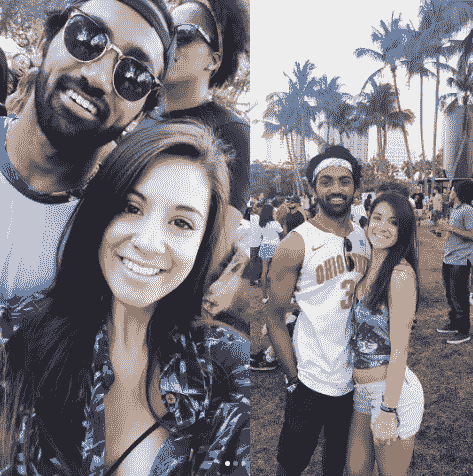
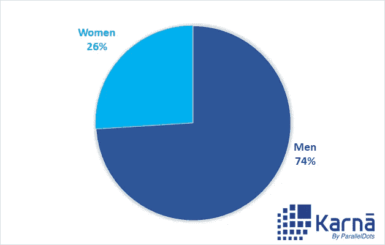
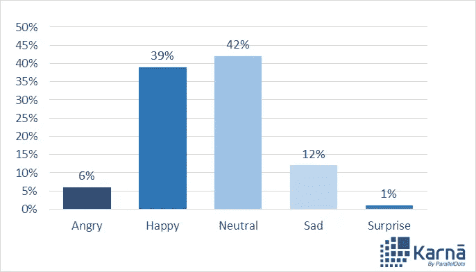
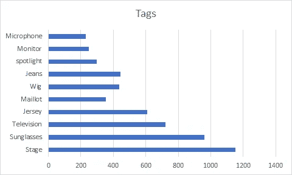
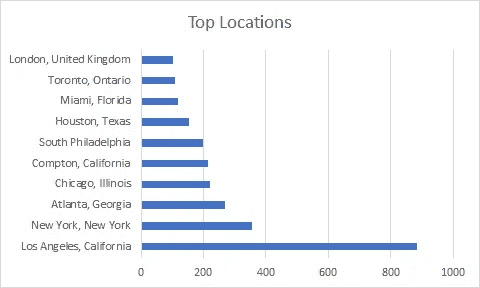

# 视觉分析:探索 Instagram 上的#KendrickLamar 标签

> 原文：<https://medium.com/hackernoon/visual-analytics-exploring-hashtag-kendricklamar-on-instagram-fecdba551239>

Credits: Mic

在我们之前的视觉分析博客[帖子](http://blog.paralleldots.com/product/visual-analytics-instagrams-gopro-hashtag-ai/)中，我们讨论了 Instagram 的#gopro 标签使用人工智能。在这篇博文中，我们将探索 Instagram 上的#Kendrick Lamar。肯德里克·拉马尔的《该死的》于今年四月发行，好评如潮。滚石乐队*的克里斯多佛·r·温加滕*作家形容它是[“老学校和下一层次”的结合这标志着他的第三张#1 专辑登上了 *Billboard* 200 排行榜，单曲《卑微》成为他作为首席艺人登上 *Billboard* Hot 100 排行榜的第一张#1。我们研究了 Instagram 上提到#KendrickLamar 标签的帖子，通过视觉分析深入了解世界对 KendrickLamar 的看法。](http://www.rollingstone.com/music/albumreviews/review-kendrick-lamar-damn-album-w477376)

我们的人工智能视觉分析能力可以提取视觉信息，如性别、情感、图片中的关键标签。看看 Instagram 上一位用户在 2017 年 Rolling Loud Festival 上上传的这张照片的分析，标题是 Kendrick Lamar:

**用户名:**茴香鹤
**标题:**不可思议的周末，不可思议的公司# rolling loud 2017 # kendricklamar # asaprocky
**喜欢:** 246
**评论:** 4
**地点:**海滨公园
**性别和情感:**【男人，快乐】，【女人，快乐】*

**我们对 13992 张提到#KendrickLamar 标签的图片进行了分析。让我们深入了解从他们那里获得的集体见解。**

## **人口统计数据**

**标签#KendrickLamar 由男性粉丝组成，因为在场总人数的近四分之三是男性。**

****

**Gender Breakdown**

**情感检测**

**我们的人工智能算法可以检测照片中人表达的情绪。这是在抓取的图像中检测到的情绪分类。**

****

**Emotion Analysis**

**极少数人表达了悲伤和愤怒等负面情绪。超过三分之一的情感表达是快乐。**

## **标签**

**下面是照片中最常被检测到的 10 个标签的分布。您可以看到相关标签，如麦克风、监视器、聚光灯和舞台，以及一些普通标签，如牛仔裤、运动衫和太阳镜。**

****

****热门地点****

**排名最高的地方都是美国的城市，洛杉矶出现的次数最多，有 883 次。**

****

**这种分析可以帮助品牌、营销人员和研究人员了解他们在视觉社交媒体上分享的标签是什么，而不必经历分析每张图片的痛苦。**

**视觉分析开辟了大量的分析机会，从产品发布的市场研究阶段到分析促销活动的表现。你可以在这里查看演示[。](https://www.paralleldots.com/visual-analytics)**

**在 [Karna](http://www.karna.ai/) ，我们为多个品牌进行定制的深度文本和视觉分析研究。您可以点击此处联系我们[，了解您品牌的任何类似分析。](http://www.karna.ai/)**

**上述研究由 ParallelDots Inc .的市场研究部门 [Karna AI](http://karna.ai/) 进行。**

**[parallel dots AI API](https://www.paralleldots.com/)，是由 ParallelDots Inc .提供的深度学习支持的 web 服务，可以理解大量的非结构化文本和视觉内容，为您的产品提供支持。您可以查看我们的一些[文本分析 API](https://www.paralleldots.com/text-analysis-apis)并通过填写此处的表格[联系我们，或者在 apis@paralleldots.com 给我们写信](https://www.paralleldots.com/contact-us)**