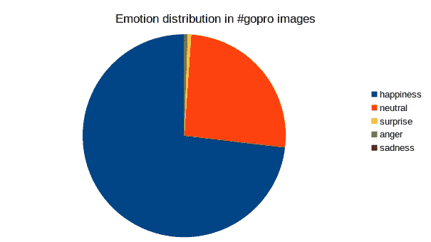
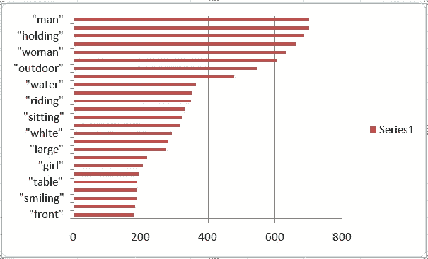
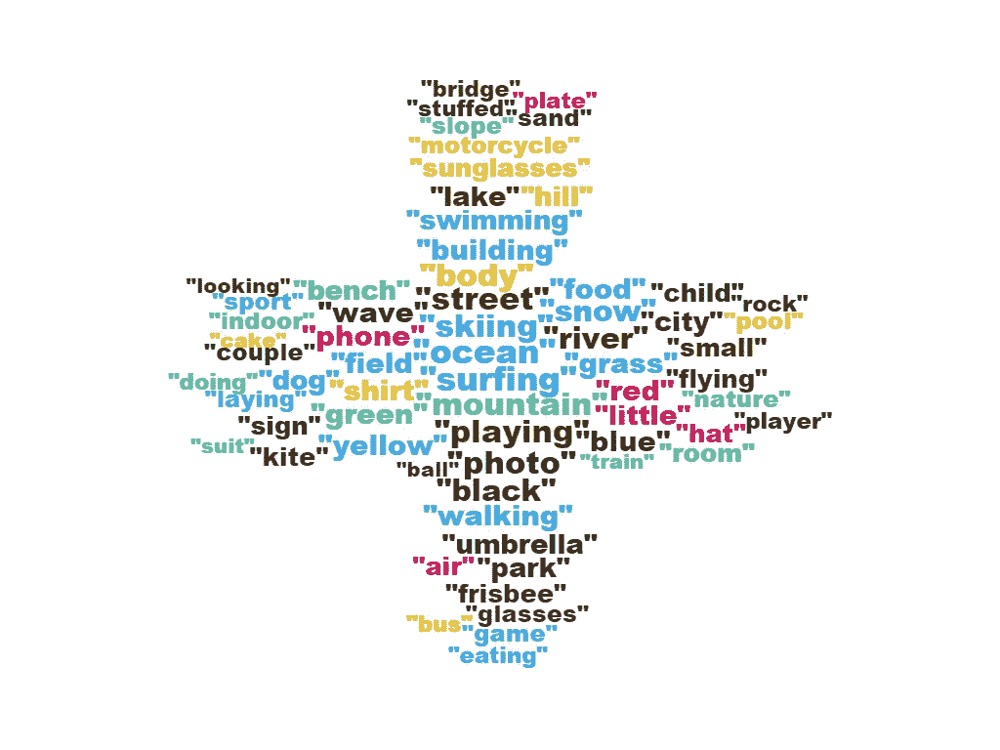

# 用人工智能对 Instagram 的#gopro 标签进行可视化分析

> 原文：<https://medium.com/hackernoon/visual-analytics-of-instagrams-gopro-hashtag-with-ai-526618f36fea>

随着社交网络的出现，图像已经成为互联网上人类表达的一种非常常见的媒介。脸书是有史以来最大的数字图像库。鉴于 Instagram 和 Snapchat 等图像优先平台的出现，这一趋势只会加剧，也称为“视觉社交媒体”。营销人员和分析师通常发现很难从这些视觉社交媒体中收集见解，因为很难量化分享的图像。答案在于自动图像分析，即可以处理视觉信息并得出结论的视觉分析。直到最近，甚至不可能进行这样的自动化分析，但时代已经变了。现在[视觉分析](https://www.paralleldots.com/visual-analytics)工具被用来分析图像。

随着最近称为卷积神经网络的深度学习模型在自动感知任务中的成功，人工智能已经足够成熟，可以作为人类观察者的代理，记录正在共享的内容。这些人工智能算法实际上可以理解图像的内容(例如，它可以看到图像包含狗或猫或苹果)，甚至可以为我们评估各种数量(微软最近发布了一个演示，其中他们可以估计图像中人的年龄)。从图像中提取这样的信息使可视数据的分类和处理自动化。

当你输入一幅图像时，人工智能算法会返回与该图像相关的视觉信息。例如，输出可以告诉图像中存在的所有对象，图像中有多少人以及他们的年龄和情绪，图像是在室外还是室内拍摄的，甚至图像中对象之间的关系(例如，它可以识别图像中的人和飞盘，还可以识别人在扔飞盘，而不是相反)。我们决定运行这些人工智能算法，看看我们能推断出什么。虽然我们继续致力于这些算法的我们自己的版本，但这里我们在社交媒体图像上使用了我们自己的[视觉分析 API](https://www.paralleldots.com/visual-analytics)，它可以返回输入图像的图像描述、标签和情感。请看下图。

对于这张图片，[视觉分析](https://www.paralleldots.com/visual-analytics)返回这些结果。

*情感:幸福*

*标签:["室内"、"餐桌"、"蛋糕"、"坐着"、"顶上"、"装饰过的"、"生日"、"粉红"、"女孩"、"食物"、"盘子"、"土包"、"小"、"前面"、"小"、"女人"、"床"、"书桌"、"抱着的"、"白的"、"年轻的"、"大的"、"站立的"、"熊"、"房间"、"电话"]*

谈到图片，Instagram 可能是最大的社交媒体平台，专门展示带有这样或那样标签的图片。 [#gopro](https://www.instagram.com/explore/tags/gopro/?hl=en) 几乎一直是 Instagram 上的常青树标签。Go pro 以其动作相机和移动应用程序而闻名。我们用过去七天上传的标签抓取了所有的公开图片。在使用上述技术对总共 727 幅图像进行图像分析并汇总结果后，我们得出了以下见解。(请注意，将有超过 727 个私人图像，我们没有工作)

最常见的情绪是快乐，这在 531 张图片中表现出来。其次是没有情绪(187)，惊讶(4)，愤怒(3)和悲伤(1)。

为了下一个洞察，我们使用[视觉分析](https://www.paralleldots.com/visual-analytics)编辑了一个图表，显示了照片中发现的前 10 个标签及其频率。

正如你可能能够破译，它们是更通用的图像标签，显示人口统计和室内/室外图像分布。白色也是最受欢迎的颜色。

剩余的标签被排列在下面的单词云中(单词的大小与标签在图像中的频率相一致)。

从我们收集的标签来看，很明显，大多数照片都是在户外拍摄的，或者是在海洋、草地、河流、山脉等自然景观附近，或者是在进行户外运动。嗯，我们不怪他们，因为最好的照片是在你看到自然光的时候拍摄的。

总的来说，这样的分析可以帮助品牌、营销人员和研究人员了解他们在视觉社交媒体上分享的标签是什么，而不必经历分析每张图片的痛苦。

如有任何疑问或反馈，请给我们 apis@paralleldots.com 公司写信。

[parallel dots AI API](https://www.paralleldots.com/)，是由 [ParallelDots Inc](https://paralleldots.xyz/) 提供的深度学习支持的 web 服务，可以理解大量的非结构化文本和视觉内容，为您的产品提供支持。您可以查看我们的一些[可视化分析 API](https://www.paralleldots.com/visual-analytics)，并通过填写此处的表格[联系我们，或者在 apis@paralleldots.com 给我们写信。](https://www.paralleldots.com/contact-us)